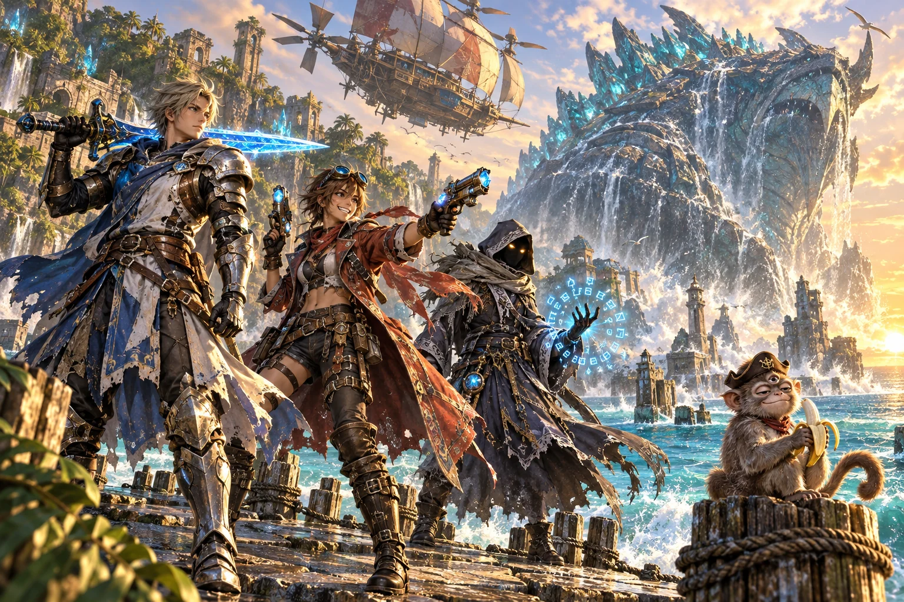
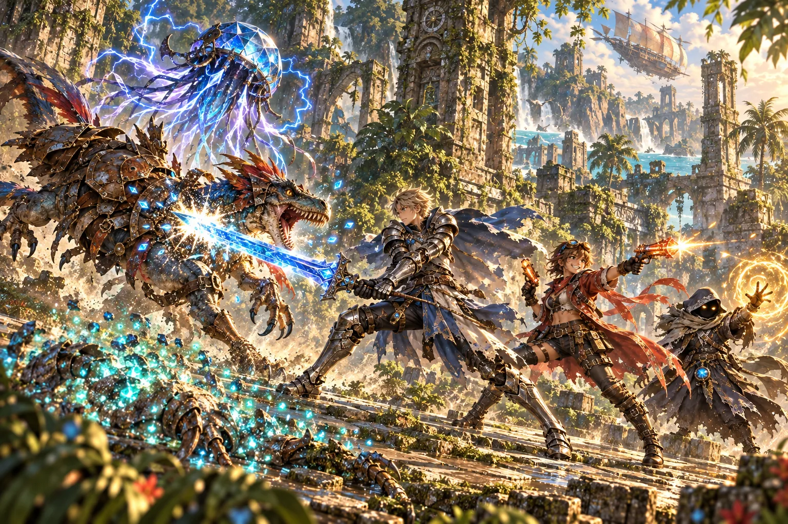
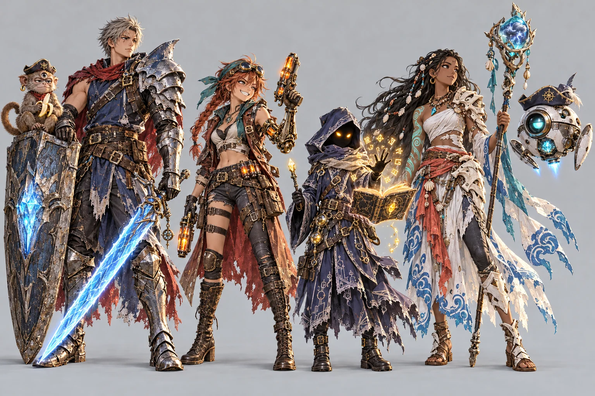

# Wave 00 art review

Generated with built-in image_gen on 2026-10-08. All assets remain draft. User authorized generation across both wave gates. Custom hero skipped because Hero Forge is blank.

## key_art / base — draft



1536×1024; 500 KB. Candidate 1 selected.


<details><summary>Generation prompt</summary>

```text
ART STYLE: Lush, luminous digital painting in the spirit of a premium early-2000s Japanese RPG remastered in HD. Semi-realistic, anime-influenced characters with expressive faces and stylish asymmetrical adventure outfits: layered belts, buckles, straps, zippers, one-sleeved jackets, flowing scarves. Sun-drenched tropical environments painted in rich detail: saturated turquoise seas, white sand, emerald jungle, and ancient sandstone ruins carved with softly glowing glyphs. Golden-hour sunlight, with bioluminescent blue-green motes of light drifting through the air. Cinematic, epic and adventurous, with a mischievous sense of humor: witty, characterful expressions and small comedic details hidden in the scene. Mature and cool, never babyish or chibi.

Create a wide 3:2 key art image for an original fantasy role-playing game.

SCENE: On a crumbling stone pier at golden hour, three young heroes stand ready for battle:
- a stoic crystal knight in sea-weathered armor, a glowing blue greatsword resting on one shoulder;
- a grinning sky-pirate gunner with flight goggles, a patched long coat and two crystal-powered blaster pistols;
- a mysterious hooded spellcaster whose face is hidden in shadow except for two glowing eyes, with glowing rune-letters circling one hand.
Behind them, a colossal sea titan rises out of the turquoise ocean, taller than a lighthouse, its back crusted with glowing crystal reefs and seawater pouring off its armored hide. A battered sky-pirate airship with patched sails and spinning propellers banks overhead.
Comedic touch: on a pier post in the foreground, a smug three-eyed monkey in a tiny captain's hat eats a banana, completely unbothered by the giant monster.

Rules: completely original designs; never imitate an existing franchise, character, creature, logo or emblem. No text, letters, numbers, logos, watermarks, signatures, borders or user interface, unless the prompt asks for glowing magic runes. Fierce and intense is great; no blood, gore or wounds.
```

</details>

## battle_mock / base — draft



1536×1024; 478 KB. Candidate 1 selected.


<details><summary>Generation prompt</summary>

```text
ART STYLE: Lush, luminous digital painting in the spirit of a premium early-2000s Japanese RPG remastered in HD. Semi-realistic, anime-influenced characters with expressive faces and stylish asymmetrical adventure outfits: layered belts, buckles, straps, zippers, one-sleeved jackets, flowing scarves. Sun-drenched tropical environments painted in rich detail: saturated turquoise seas, white sand, emerald jungle, and ancient sandstone ruins carved with softly glowing glyphs. Golden-hour sunlight, with bioluminescent blue-green motes of light drifting through the air. Cinematic, epic and adventurous, with a mischievous sense of humor: witty, characterful expressions and small comedic details hidden in the scene. Mature and cool, never babyish or chibi.

An in-game battle from this game, with no user interface. Side view on a jungle-ruin path: three heroes on the right facing left (a crystal knight with a glowing blue greatsword, a sky-pirate gunner with twin orange crystal blasters, a small hooded spellcaster with glowing golden eyes); on the left, a raptor-like beast armored in rusted scrap metal and a floating crystal jellyfish crackling with lightning. The knight's sword strike lands on the raptor in a burst of light, while a third creature that was just defeated dissolves into a swirl of glowing blue-green motes (no blood). Wide 3:2.

Rules: completely original designs; never imitate an existing franchise, character, creature, logo or emblem. No text, letters, numbers, logos, watermarks, signatures, borders or user interface, unless the prompt asks for glowing magic runes. Fierce and intense is great; no blood, gore or wounds.
```

</details>

## cast_lineup / base — draft



1536×1024; 392 KB. Candidate 1 selected.


<details><summary>Generation prompt</summary>

```text
ART STYLE: Lush, luminous digital painting in the spirit of a premium early-2000s Japanese RPG remastered in HD. Semi-realistic, anime-influenced characters with expressive faces and stylish asymmetrical adventure outfits: layered belts, buckles, straps, zippers, one-sleeved jackets, flowing scarves. Sun-drenched tropical environments painted in rich detail: saturated turquoise seas, white sand, emerald jungle, and ancient sandstone ruins carved with softly glowing glyphs. Golden-hour sunlight, with bioluminescent blue-green motes of light drifting through the air. Cinematic, epic and adventurous, with a mischievous sense of humor: witty, characterful expressions and small comedic details hidden in the scene. Mature and cool, never babyish or chibi.

A character lineup model sheet for the main cast of this game: all characters standing side by side in a row, full body, at true relative height, on a plain light-gray studio background, evenly lit, each one clearly separated. Left to right:
1. THE CRYSTAL KNIGHT: a tall, stoic young man about 17 with short storm-gray hair and a scar through one eyebrow; sea-weathered steel armor over a sleeveless navy tunic; one oversized pauldron shaped like a shark's dorsal fin on his left shoulder, a bare right arm with a leather bracer; layered leather belts with brass buckles; a tattered crimson scarf; a tower shield with a glowing ice-blue crystal core and a greatsword with an ice-blue plasma edge.
2. THE SKY-PIRATE GUNNER: a cocky young woman about 16 with a messy copper-red braid, a teal bandana and flight goggles pushed up on her forehead; a long patched brown coat with the left sleeve torn off, revealing a brass mechanical arm with visible gears; a cropped vest, crossed belts and holsters, a bandolier of glowing orange ammunition cells; twin crystal blaster pistols glowing orange.
3. THE SPELLWRIGHT: a small, mysterious spellcaster about the height of a 10-year-old, in a deep-indigo hooded robe embroidered with silver circuit-like patterns and fastened with many buckled straps; the face completely hidden in shadow except for two glowing golden eyes; a spellbook floating open beside them and glowing golden rune-letters orbiting one raised hand; a crystal-tipped wand.
4. THE TITAN CALLER: a fearless young woman about 15 with dark brown skin and long black hair braided with small seashells; a white wrap top with long detached sleeves patterned with blue wave motifs, a coral sash, a split skirt over leggings, bone-white armor plates on her left shoulder and hip; a tall staff topped with a crystal holding a tiny trapped lightning storm; a glowing teal tattoo of a coiled titan running up her right arm.
5. THE TUTOR DROID, floating at shoulder height: a cat-sized sphere of white ceramic and brushed steel with one large round teal lens-eye and an eyelid shutter, two small jointed fins, a little window showing a glowing crystal core, faint blue thrusters underneath, wearing a tiny battered navy pirate captain's hat, slightly crooked.
6. THE THREE-EYED MONKEY, sitting on the knight's shield: small, golden-brown fur, three eyes (the third in the middle of its forehead), a tiny navy captain's hat and a gold earring, holding a half-eaten banana, looking deeply unimpressed.

Rules: completely original designs; never imitate an existing franchise, character, creature, logo or emblem. No text, letters, numbers, logos, watermarks, signatures, borders or user interface, unless the prompt asks for glowing magic runes. Fierce and intense is great; no blood, gore or wounds.
```

</details>

