# Wave 01 art review

Generated with built-in image_gen on 2026-10-08. All assets remain draft. User authorized generation across both wave gates. Custom hero skipped because Hero Forge is blank.

## ally_knight / base — draft

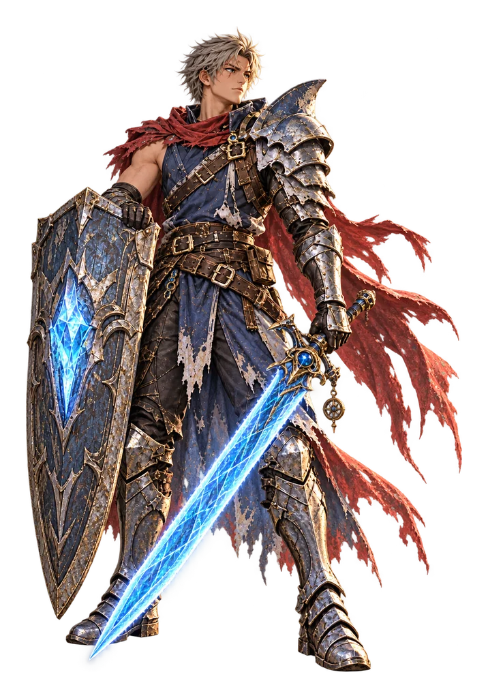

716×1024; 249 KB. Candidate 2 selected.


<details><summary>Generation prompt</summary>

```text
ART STYLE: Lush, luminous digital painting in the spirit of a premium early-2000s Japanese RPG remastered in HD. Semi-realistic, anime-influenced characters with expressive faces and stylish asymmetrical adventure outfits: layered belts, buckles, straps, zippers, one-sleeved jackets, flowing scarves. Sun-drenched tropical environments painted in rich detail: saturated turquoise seas, white sand, emerald jungle, and ancient sandstone ruins carved with softly glowing glyphs. Golden-hour sunlight, with bioluminescent blue-green motes of light drifting through the air. Cinematic, epic and adventurous, with a mischievous sense of humor: witty, characterful expressions and small comedic details hidden in the scene. Mature and cool, never babyish or chibi.

This is an isolated game sprite: render ONLY the subject on a fully transparent background (PNG with alpha). No scenery, no ground, no cast shadow, no frame. Lit from the upper left with a soft rim light, crisp readable silhouette, full body with nothing cropped and clear empty space around it.

Character design of a hero, standing in a guarding battle stance, three-quarter view: THE CRYSTAL KNIGHT, a tall, stoic young man about 17 with short storm-gray hair and a scar through one eyebrow; sea-weathered steel armor over a sleeveless navy tunic; one oversized pauldron shaped like a shark's dorsal fin on his left shoulder, a bare right arm with a leather bracer; layered leather belts with brass buckles; a tattered crimson scarf. He carries a tower shield with a glowing ice-blue crystal core and a greatsword whose edge glows ice-blue like plasma. Calm and protective, with a dry glint of humor in his eyes.

Output dimensions: 1024x1536. Highest quality. Reference images are identity/style guides, not edit targets. Match character details exactly; the written description controls colors and asymmetry. Keep a generous clear margin around each subject.

Rules: completely original designs; never imitate an existing franchise, character, creature, logo or emblem. No text, letters, numbers, logos, watermarks, signatures, borders or user interface, unless the prompt asks for glowing magic runes. Fierce and intense is great; no blood, gore or wounds.
```

</details>

## ally_gunner / base — draft

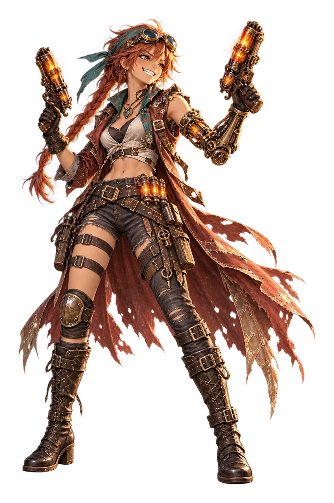

681×1024; 216 KB. Candidate 2 selected.


<details><summary>Generation prompt</summary>

```text
ART STYLE: Lush, luminous digital painting in the spirit of a premium early-2000s Japanese RPG remastered in HD. Semi-realistic, anime-influenced characters with expressive faces and stylish asymmetrical adventure outfits: layered belts, buckles, straps, zippers, one-sleeved jackets, flowing scarves. Sun-drenched tropical environments painted in rich detail: saturated turquoise seas, white sand, emerald jungle, and ancient sandstone ruins carved with softly glowing glyphs. Golden-hour sunlight, with bioluminescent blue-green motes of light drifting through the air. Cinematic, epic and adventurous, with a mischievous sense of humor: witty, characterful expressions and small comedic details hidden in the scene. Mature and cool, never babyish or chibi.

This is an isolated game sprite: render ONLY the subject on a fully transparent background (PNG with alpha). No scenery, no ground, no cast shadow, no frame. Lit from the upper left with a soft rim light, crisp readable silhouette, full body with nothing cropped and clear empty space around it.

Character design of a hero, mid-swagger with both blasters raised, three-quarter view: THE SKY-PIRATE GUNNER, a cocky young woman about 16 with a messy copper-red braid, a teal bandana and flight goggles pushed up on her forehead; a long patched brown coat with the left sleeve torn off, revealing a brass mechanical arm with visible gears; a cropped vest, crossed belts and holsters, a bandolier of glowing orange ammunition cells, buckled knee-high boots. Twin crystal blaster pistols glowing orange. A wide, trouble-making grin.

Output dimensions: 1024x1536. Highest quality. Reference images are identity/style guides, not edit targets. Match character details exactly; the written description controls colors and asymmetry. Keep a generous clear margin around each subject.

Rules: completely original designs; never imitate an existing franchise, character, creature, logo or emblem. No text, letters, numbers, logos, watermarks, signatures, borders or user interface, unless the prompt asks for glowing magic runes. Fierce and intense is great; no blood, gore or wounds.
```

</details>

## ally_spellwright / base — draft

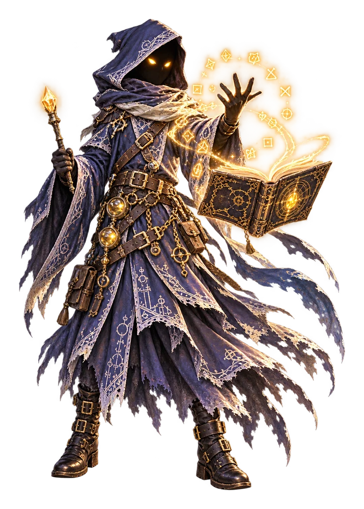

733×1024; 287 KB. Candidate 1 selected.


<details><summary>Generation prompt</summary>

```text
ART STYLE: Lush, luminous digital painting in the spirit of a premium early-2000s Japanese RPG remastered in HD. Semi-realistic, anime-influenced characters with expressive faces and stylish asymmetrical adventure outfits: layered belts, buckles, straps, zippers, one-sleeved jackets, flowing scarves. Sun-drenched tropical environments painted in rich detail: saturated turquoise seas, white sand, emerald jungle, and ancient sandstone ruins carved with softly glowing glyphs. Golden-hour sunlight, with bioluminescent blue-green motes of light drifting through the air. Cinematic, epic and adventurous, with a mischievous sense of humor: witty, characterful expressions and small comedic details hidden in the scene. Mature and cool, never babyish or chibi.

This is an isolated game sprite: render ONLY the subject on a fully transparent background (PNG with alpha). No scenery, no ground, no cast shadow, no frame. Lit from the upper left with a soft rim light, crisp readable silhouette, full body with nothing cropped and clear empty space around it.

Character design of a hero, mid-incantation, three-quarter view: THE SPELLWRIGHT, a small, mysterious spellcaster about the height of a 10-year-old, in a deep-indigo hooded robe embroidered with silver circuit-like patterns and fastened with many buckled straps, with oversized sleeves and pointed boots. The face is completely hidden in shadow except for two glowing golden eyes. A spellbook floats open beside them, and glowing golden rune-letters orbit one raised hand (the runes may be abstract glyphs); the other hand holds a crystal-tipped wand. Robes stirring in a magical wind.

Output dimensions: 1024x1536. Highest quality. Reference images are identity/style guides, not edit targets. Match character details exactly; the written description controls colors and asymmetry. Keep a generous clear margin around each subject.

Rules: completely original designs; never imitate an existing franchise, character, creature, logo or emblem. No text, letters, numbers, logos, watermarks, signatures, borders or user interface, unless the prompt asks for glowing magic runes. Fierce and intense is great; no blood, gore or wounds.
```

</details>

## ally_titancaller / base — draft

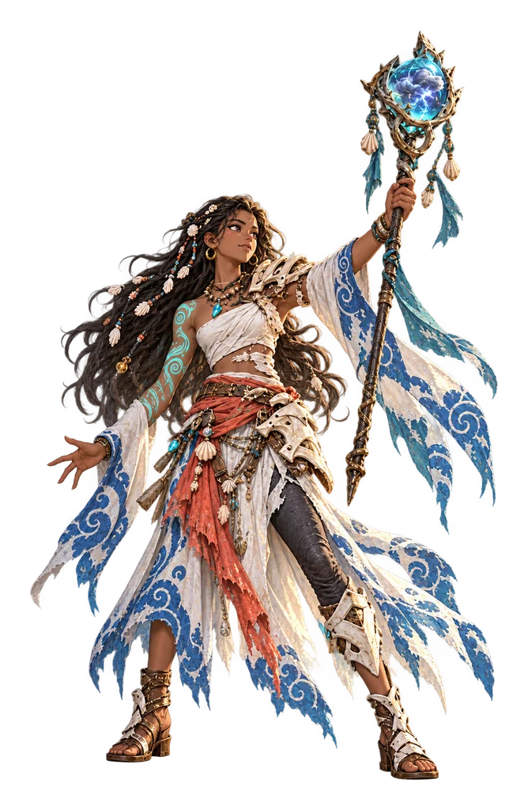

668×1024; 232 KB. Candidate 1 selected.


<details><summary>Generation prompt</summary>

```text
ART STYLE: Lush, luminous digital painting in the spirit of a premium early-2000s Japanese RPG remastered in HD. Semi-realistic, anime-influenced characters with expressive faces and stylish asymmetrical adventure outfits: layered belts, buckles, straps, zippers, one-sleeved jackets, flowing scarves. Sun-drenched tropical environments painted in rich detail: saturated turquoise seas, white sand, emerald jungle, and ancient sandstone ruins carved with softly glowing glyphs. Golden-hour sunlight, with bioluminescent blue-green motes of light drifting through the air. Cinematic, epic and adventurous, with a mischievous sense of humor: witty, characterful expressions and small comedic details hidden in the scene. Mature and cool, never babyish or chibi.

This is an isolated game sprite: render ONLY the subject on a fully transparent background (PNG with alpha). No scenery, no ground, no cast shadow, no frame. Lit from the upper left with a soft rim light, crisp readable silhouette, full body with nothing cropped and clear empty space around it.

Character design of a hero, staff raised as if calling something enormous, three-quarter view: THE TITAN CALLER, a fearless young woman about 15 with dark brown skin and long black hair braided with small seashells; a white wrap top with long detached sleeves patterned with blue wave motifs, a coral sash, a split skirt over leggings, bone-white armor plates on her left shoulder and hip. A tall staff topped with a crystal holding a tiny trapped lightning storm. A glowing teal tattoo of a coiled titan runs up her right arm.

Output dimensions: 1024x1536. Highest quality. Reference images are identity/style guides, not edit targets. Match character details exactly; the written description controls colors and asymmetry. Keep a generous clear margin around each subject.

Rules: completely original designs; never imitate an existing franchise, character, creature, logo or emblem. No text, letters, numbers, logos, watermarks, signatures, borders or user interface, unless the prompt asks for glowing magic runes. Fierce and intense is great; no blood, gore or wounds.
```

</details>

## mascot_monkey / base — draft

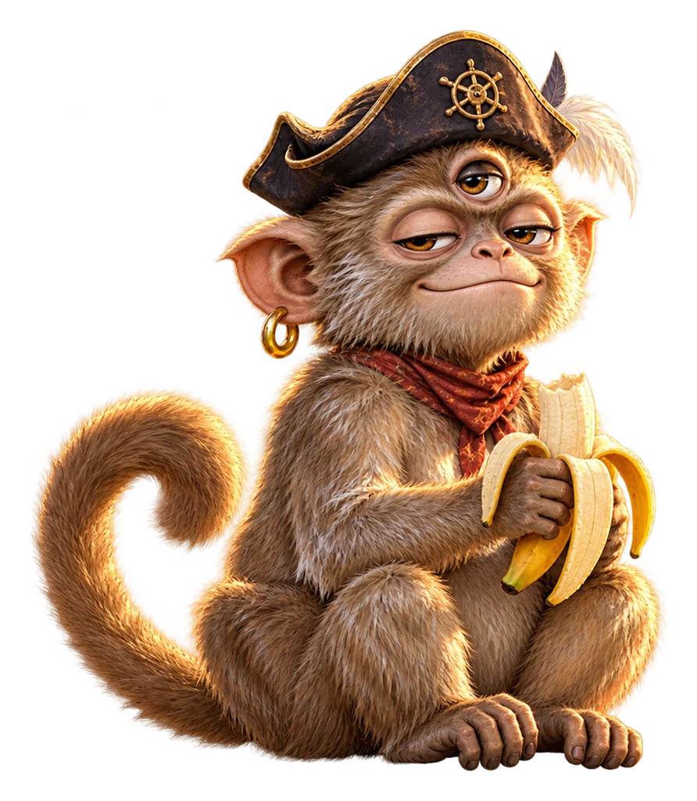

892×1024; 278 KB. Candidate 1 selected.


<details><summary>Generation prompt</summary>

```text
ART STYLE: Lush, luminous digital painting in the spirit of a premium early-2000s Japanese RPG remastered in HD. Semi-realistic, anime-influenced characters with expressive faces and stylish asymmetrical adventure outfits: layered belts, buckles, straps, zippers, one-sleeved jackets, flowing scarves. Sun-drenched tropical environments painted in rich detail: saturated turquoise seas, white sand, emerald jungle, and ancient sandstone ruins carved with softly glowing glyphs. Golden-hour sunlight, with bioluminescent blue-green motes of light drifting through the air. Cinematic, epic and adventurous, with a mischievous sense of humor: witty, characterful expressions and small comedic details hidden in the scene. Mature and cool, never babyish or chibi.

This is an isolated game sprite: render ONLY the subject on a fully transparent background (PNG with alpha). No scenery, no ground, no cast shadow, no frame. Lit from the upper left with a soft rim light, crisp readable silhouette, full body with nothing cropped and clear empty space around it.

A small monkey sitting and looking deeply unimpressed: golden-brown fur, three eyes (two normal eyes plus a third in the middle of its forehead), a tiny navy captain's hat and a single gold earring, holding a half-eaten banana. Smug, funny, a little mysterious. Small enough to hide in any scene.

Output dimensions: 1024x1024. Highest quality. Reference images are identity/style guides, not edit targets. Match character details exactly; the written description controls colors and asymmetry. Keep a generous clear margin around each subject.

Rules: completely original designs; never imitate an existing franchise, character, creature, logo or emblem. No text, letters, numbers, logos, watermarks, signatures, borders or user interface, unless the prompt asks for glowing magic runes. Fierce and intense is great; no blood, gore or wounds.
```

</details>

## tutor_droid / base — draft

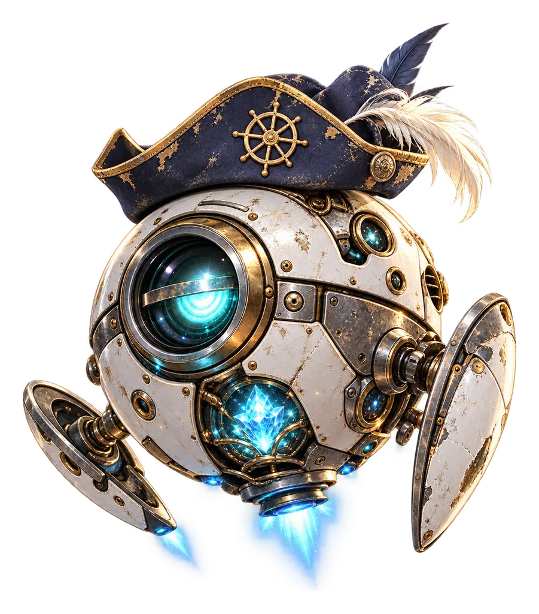

901×1024; 277 KB. Candidate 3 selected.


<details><summary>Generation prompt</summary>

```text
ART STYLE: Lush, luminous digital painting in the spirit of a premium early-2000s Japanese RPG remastered in HD. Semi-realistic, anime-influenced characters with expressive faces and stylish asymmetrical adventure outfits: layered belts, buckles, straps, zippers, one-sleeved jackets, flowing scarves. Sun-drenched tropical environments painted in rich detail: saturated turquoise seas, white sand, emerald jungle, and ancient sandstone ruins carved with softly glowing glyphs. Golden-hour sunlight, with bioluminescent blue-green motes of light drifting through the air. Cinematic, epic and adventurous, with a mischievous sense of humor: witty, characterful expressions and small comedic details hidden in the scene. Mature and cool, never babyish or chibi.

This is an isolated game sprite: render ONLY the subject on a fully transparent background (PNG with alpha). No scenery, no ground, no cast shadow, no frame. Lit from the upper left with a soft rim light, crisp readable silhouette, full body with nothing cropped and clear empty space around it.

A small floating companion droid, about the size of a cat, three-quarter view: a smooth sphere of white ceramic and brushed steel with one large round lens-eye glowing soft teal and a mechanical eyelid shutter, two small jointed fins for steering, a little round window showing a glowing crystal core, and faint blue thruster glow underneath. It wears a tiny battered navy pirate captain's hat, slightly crooked, which it clearly believes makes it look intimidating. Deadpan, clever and loyal. Sleek and cool, not cute or babyish.

Output dimensions: 1024x1024. Highest quality. Reference images are identity/style guides, not edit targets. Match character details exactly; the written description controls colors and asymmetry. Keep a generous clear margin around each subject.

Rules: completely original designs; never imitate an existing franchise, character, creature, logo or emblem. No text, letters, numbers, logos, watermarks, signatures, borders or user interface, unless the prompt asks for glowing magic runes. Fierce and intense is great; no blood, gore or wounds.
```

</details>

## ally_knight / battle — draft

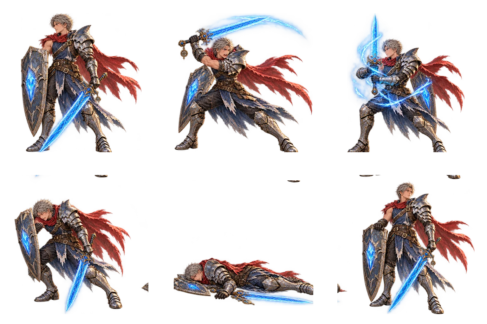

1536×1024; 443 KB. Candidate 3 selected.

- FLAG: Visual review: some poses face forward or right; required uniform left-facing orientation is not fully met.
- FLAG: frame 0: source content touches cell edge
- FLAG: frame 1: source content touches cell edge
- FLAG: frame 2: source content touches cell edge
- FLAG: frame 3: source content touches cell edge
- FLAG: frame 4: source content touches cell edge
- FLAG: frame 5: source content touches cell edge


<details><summary>Generation prompt</summary>

```text
FINAL corrective generation: create a miniature contact sheet on 1536x1024 transparent canvas. Exactly six independent small cutouts arranged 3x2. Each cutout including every weapon, scarf, hair, shoulder and glow fits within a 320x320 bounding box centered on its 512x512 cell. Keep 96 pixels empty transparency on EVERY side of EVERY cell. Render smaller than the previous sheet. Entire portrait bust silhouette has blank margin below shoulders and beside shoulder armor. Battle heads and torso face LEFT in ALL SIX poses, including idle, cast and victory; profile nose points left. No front-facing or right-facing battle poses. Match reference identity, but do not copy its composition.

ART STYLE: Lush, luminous digital painting in the spirit of a premium early-2000s Japanese RPG remastered in HD. Semi-realistic, anime-influenced characters with expressive faces and stylish asymmetrical adventure outfits: layered belts, buckles, straps, zippers, one-sleeved jackets, flowing scarves. Sun-drenched tropical environments painted in rich detail: saturated turquoise seas, white sand, emerald jungle, and ancient sandstone ruins carved with softly glowing glyphs. Golden-hour sunlight, with bioluminescent blue-green motes of light drifting through the air. Cinematic, epic and adventurous, with a mischievous sense of humor: witty, characterful expressions and small comedic details hidden in the scene. Mature and cool, never babyish or chibi.

This is an isolated game sprite: render ONLY the subject on a fully transparent background (PNG with alpha). No scenery, no ground, no cast shadow, no frame. Lit from the upper left with a soft rim light, crisp readable silhouette, full body with nothing cropped and clear empty space around it.

Character design of a hero, standing in a guarding battle stance, three-quarter view: THE CRYSTAL KNIGHT, a tall, stoic young man about 17 with short storm-gray hair and a scar through one eyebrow; sea-weathered steel armor over a sleeveless navy tunic; one oversized pauldron shaped like a shark's dorsal fin on his left shoulder, a bare right arm with a leather bracer; layered leather belts with brass buckles; a tattered crimson scarf. He carries a tower shield with a glowing ice-blue crystal core and a greatsword whose edge glows ice-blue like plasma. Calm and protective, with a dry glint of humor in his eyes.

A sprite sheet for a 2D turn-based battle game: the SAME character shown 6 times in a grid of 3 columns and 2 rows of equal square cells, on a fully transparent background, with no grid lines, borders, labels or text. Every pose shows the full body at the same size and scale, feet on the same invisible baseline near the bottom of each cell, the character facing LEFT, with clear empty space between poses. Top row, left to right: (1) idle battle stance, (2) attacking at the peak of the strike, (3) casting a special move with energy gathering in the hands or weapon. Bottom row, left to right: (4) hurt, recoiling from a hit, (5) knocked out, collapsed on the ground, (6) victory pose. Match the attached character reference exactly.

Output dimensions: 1536x1024. Highest quality. Reference images are identity/style guides, not edit targets. Match character details exactly; the written description controls colors and asymmetry. Keep a generous clear margin around each subject.

Rules: completely original designs; never imitate an existing franchise, character, creature, logo or emblem. No text, letters, numbers, logos, watermarks, signatures, borders or user interface, unless the prompt asks for glowing magic runes. Fierce and intense is great; no blood, gore or wounds.
```

</details>

## ally_knight / portraits — draft

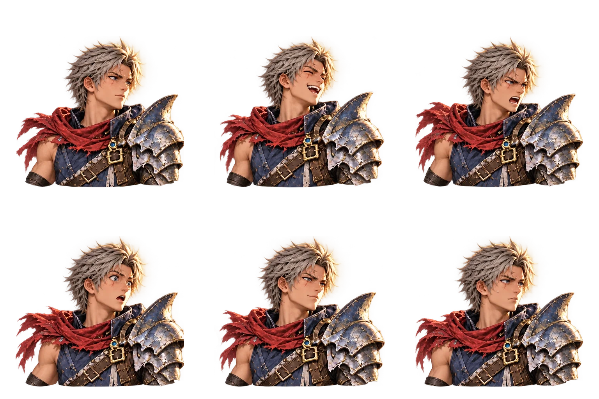

1536×1024; 397 KB. Candidate 3 selected.

- FLAG: frame 0: source content touches cell edge
- FLAG: frame 1: source content touches cell edge
- FLAG: frame 3: source content touches cell edge
- FLAG: frame 4: source content touches cell edge


<details><summary>Generation prompt</summary>

```text
FINAL corrective generation: create a miniature contact sheet on 1536x1024 transparent canvas. Exactly six independent small cutouts arranged 3x2. Each cutout including every weapon, scarf, hair, shoulder and glow fits within a 320x320 bounding box centered on its 512x512 cell. Keep 96 pixels empty transparency on EVERY side of EVERY cell. Render smaller than the previous sheet. Entire portrait bust silhouette has blank margin below shoulders and beside shoulder armor. Battle heads and torso face LEFT in ALL SIX poses, including idle, cast and victory; profile nose points left. No front-facing or right-facing battle poses. Match reference identity, but do not copy its composition.

ART STYLE: Lush, luminous digital painting in the spirit of a premium early-2000s Japanese RPG remastered in HD. Semi-realistic, anime-influenced characters with expressive faces and stylish asymmetrical adventure outfits: layered belts, buckles, straps, zippers, one-sleeved jackets, flowing scarves. Sun-drenched tropical environments painted in rich detail: saturated turquoise seas, white sand, emerald jungle, and ancient sandstone ruins carved with softly glowing glyphs. Golden-hour sunlight, with bioluminescent blue-green motes of light drifting through the air. Cinematic, epic and adventurous, with a mischievous sense of humor: witty, characterful expressions and small comedic details hidden in the scene. Mature and cool, never babyish or chibi.

This is an isolated game sprite: render ONLY the subject on a fully transparent background (PNG with alpha). No scenery, no ground, no cast shadow, no frame. Lit from the upper left with a soft rim light, crisp readable silhouette, full body with nothing cropped and clear empty space around it.

Character design of a hero, standing in a guarding battle stance, three-quarter view: THE CRYSTAL KNIGHT, a tall, stoic young man about 17 with short storm-gray hair and a scar through one eyebrow; sea-weathered steel armor over a sleeveless navy tunic; one oversized pauldron shaped like a shark's dorsal fin on his left shoulder, a bare right arm with a leather bracer; layered leather belts with brass buckles; a tattered crimson scarf. He carries a tower shield with a glowing ice-blue crystal core and a greatsword whose edge glows ice-blue like plasma. Calm and protective, with a dry glint of humor in his eyes.

An expression sheet for dialogue portraits: the SAME character's head and shoulders shown 6 times in a grid of 3 columns and 2 rows of equal square cells, on a fully transparent background, with no grid lines, labels or text. Identical framing and scale in every cell, facing three-quarters toward the right. Top row: (1) neutral, (2) laughing, (3) angry. Bottom row: (4) shocked, (5) smug, (6) worried. Big, readable, slightly comedic acting. Match the attached character reference exactly.

Output dimensions: 1536x1024. Highest quality. Reference images are identity/style guides, not edit targets. Match character details exactly; the written description controls colors and asymmetry. Keep a generous clear margin around each subject.

Rules: completely original designs; never imitate an existing franchise, character, creature, logo or emblem. No text, letters, numbers, logos, watermarks, signatures, borders or user interface, unless the prompt asks for glowing magic runes. Fierce and intense is great; no blood, gore or wounds.
```

</details>

## ally_gunner / battle — draft

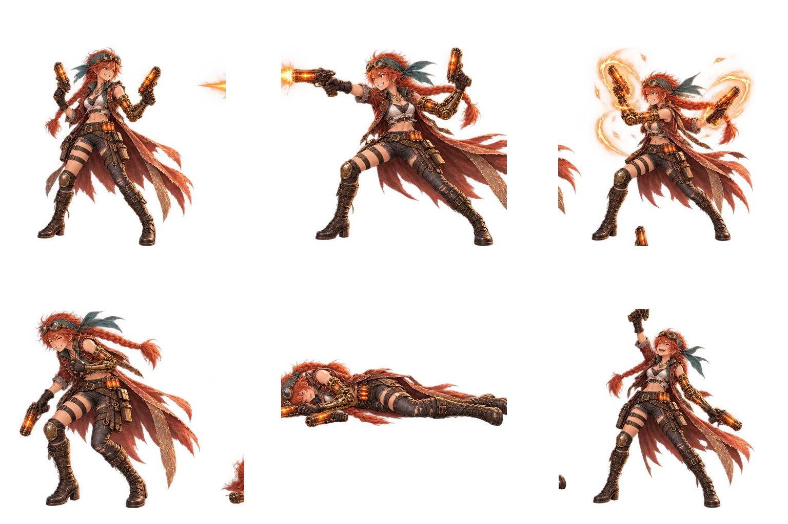

1536×1024; 366 KB. Candidate 3 selected.

- FLAG: Visual review: some poses face forward or right; required uniform left-facing orientation is not fully met.
- FLAG: frame 0: source content touches cell edge
- FLAG: frame 1: source content touches cell edge
- FLAG: frame 2: source content touches cell edge
- FLAG: frame 3: source content touches cell edge
- FLAG: frame 4: source content touches cell edge
- FLAG: frame 5: source content touches cell edge


<details><summary>Generation prompt</summary>

```text
FINAL corrective generation: create a miniature contact sheet on 1536x1024 transparent canvas. Exactly six independent small cutouts arranged 3x2. Each cutout including every weapon, scarf, hair, shoulder and glow fits within a 320x320 bounding box centered on its 512x512 cell. Keep 96 pixels empty transparency on EVERY side of EVERY cell. Render smaller than the previous sheet. Entire portrait bust silhouette has blank margin below shoulders and beside shoulder armor. Battle heads and torso face LEFT in ALL SIX poses, including idle, cast and victory; profile nose points left. No front-facing or right-facing battle poses. Match reference identity, but do not copy its composition.

ART STYLE: Lush, luminous digital painting in the spirit of a premium early-2000s Japanese RPG remastered in HD. Semi-realistic, anime-influenced characters with expressive faces and stylish asymmetrical adventure outfits: layered belts, buckles, straps, zippers, one-sleeved jackets, flowing scarves. Sun-drenched tropical environments painted in rich detail: saturated turquoise seas, white sand, emerald jungle, and ancient sandstone ruins carved with softly glowing glyphs. Golden-hour sunlight, with bioluminescent blue-green motes of light drifting through the air. Cinematic, epic and adventurous, with a mischievous sense of humor: witty, characterful expressions and small comedic details hidden in the scene. Mature and cool, never babyish or chibi.

This is an isolated game sprite: render ONLY the subject on a fully transparent background (PNG with alpha). No scenery, no ground, no cast shadow, no frame. Lit from the upper left with a soft rim light, crisp readable silhouette, full body with nothing cropped and clear empty space around it.

Character design of a hero, mid-swagger with both blasters raised, three-quarter view: THE SKY-PIRATE GUNNER, a cocky young woman about 16 with a messy copper-red braid, a teal bandana and flight goggles pushed up on her forehead; a long patched brown coat with the left sleeve torn off, revealing a brass mechanical arm with visible gears; a cropped vest, crossed belts and holsters, a bandolier of glowing orange ammunition cells, buckled knee-high boots. Twin crystal blaster pistols glowing orange. A wide, trouble-making grin.

A sprite sheet for a 2D turn-based battle game: the SAME character shown 6 times in a grid of 3 columns and 2 rows of equal square cells, on a fully transparent background, with no grid lines, borders, labels or text. Every pose shows the full body at the same size and scale, feet on the same invisible baseline near the bottom of each cell, the character facing LEFT, with clear empty space between poses. Top row, left to right: (1) idle battle stance, (2) attacking at the peak of the strike, (3) casting a special move with energy gathering in the hands or weapon. Bottom row, left to right: (4) hurt, recoiling from a hit, (5) knocked out, collapsed on the ground, (6) victory pose. Match the attached character reference exactly.

Output dimensions: 1536x1024. Highest quality. Reference images are identity/style guides, not edit targets. Match character details exactly; the written description controls colors and asymmetry. Keep a generous clear margin around each subject.

Rules: completely original designs; never imitate an existing franchise, character, creature, logo or emblem. No text, letters, numbers, logos, watermarks, signatures, borders or user interface, unless the prompt asks for glowing magic runes. Fierce and intense is great; no blood, gore or wounds.
```

</details>

## ally_gunner / portraits — draft

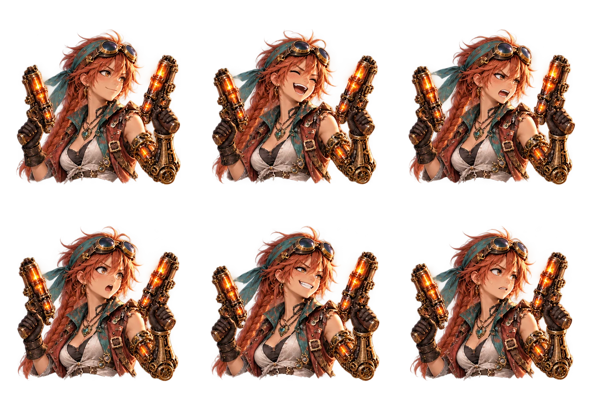

1536×1024; 510 KB. Candidate 3 selected.


<details><summary>Generation prompt</summary>

```text
FINAL corrective generation: create a miniature contact sheet on 1536x1024 transparent canvas. Exactly six independent small cutouts arranged 3x2. Each cutout including every weapon, scarf, hair, shoulder and glow fits within a 320x320 bounding box centered on its 512x512 cell. Keep 96 pixels empty transparency on EVERY side of EVERY cell. Render smaller than the previous sheet. Entire portrait bust silhouette has blank margin below shoulders and beside shoulder armor. Battle heads and torso face LEFT in ALL SIX poses, including idle, cast and victory; profile nose points left. No front-facing or right-facing battle poses. Match reference identity, but do not copy its composition.

ART STYLE: Lush, luminous digital painting in the spirit of a premium early-2000s Japanese RPG remastered in HD. Semi-realistic, anime-influenced characters with expressive faces and stylish asymmetrical adventure outfits: layered belts, buckles, straps, zippers, one-sleeved jackets, flowing scarves. Sun-drenched tropical environments painted in rich detail: saturated turquoise seas, white sand, emerald jungle, and ancient sandstone ruins carved with softly glowing glyphs. Golden-hour sunlight, with bioluminescent blue-green motes of light drifting through the air. Cinematic, epic and adventurous, with a mischievous sense of humor: witty, characterful expressions and small comedic details hidden in the scene. Mature and cool, never babyish or chibi.

This is an isolated game sprite: render ONLY the subject on a fully transparent background (PNG with alpha). No scenery, no ground, no cast shadow, no frame. Lit from the upper left with a soft rim light, crisp readable silhouette, full body with nothing cropped and clear empty space around it.

Character design of a hero, mid-swagger with both blasters raised, three-quarter view: THE SKY-PIRATE GUNNER, a cocky young woman about 16 with a messy copper-red braid, a teal bandana and flight goggles pushed up on her forehead; a long patched brown coat with the left sleeve torn off, revealing a brass mechanical arm with visible gears; a cropped vest, crossed belts and holsters, a bandolier of glowing orange ammunition cells, buckled knee-high boots. Twin crystal blaster pistols glowing orange. A wide, trouble-making grin.

An expression sheet for dialogue portraits: the SAME character's head and shoulders shown 6 times in a grid of 3 columns and 2 rows of equal square cells, on a fully transparent background, with no grid lines, labels or text. Identical framing and scale in every cell, facing three-quarters toward the right. Top row: (1) neutral, (2) laughing, (3) angry. Bottom row: (4) shocked, (5) smug, (6) worried. Big, readable, slightly comedic acting. Match the attached character reference exactly.

Output dimensions: 1536x1024. Highest quality. Reference images are identity/style guides, not edit targets. Match character details exactly; the written description controls colors and asymmetry. Keep a generous clear margin around each subject.

Rules: completely original designs; never imitate an existing franchise, character, creature, logo or emblem. No text, letters, numbers, logos, watermarks, signatures, borders or user interface, unless the prompt asks for glowing magic runes. Fierce and intense is great; no blood, gore or wounds.
```

</details>

## ally_spellwright / battle — draft

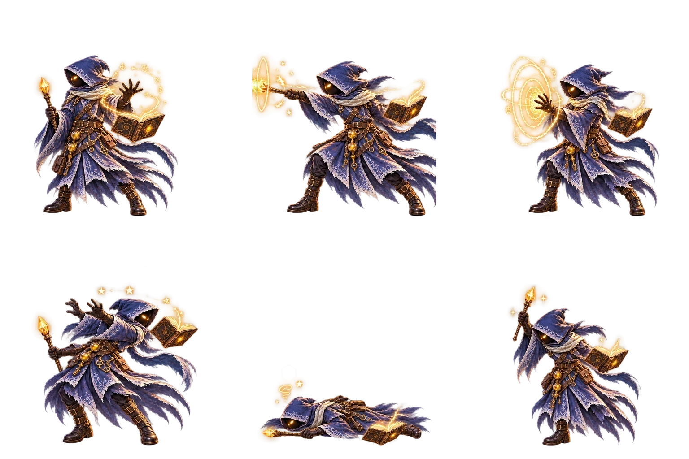

1536×1024; 388 KB. Candidate 3 selected.

- FLAG: Visual review: some poses face forward or right; required uniform left-facing orientation is not fully met.
- FLAG: frame 0: source content touches cell edge
- FLAG: frame 1: source content touches cell edge
- FLAG: frame 2: source content touches cell edge
- FLAG: frame 3: source content touches cell edge
- FLAG: frame 4: source content touches cell edge
- FLAG: frame 5: source content touches cell edge


<details><summary>Generation prompt</summary>

```text
FINAL SHEET CORRECTION: Every subject must occupy only central 60% of its own cell with very large empty margins. No subject, weapon, hair, glow, or particles can touch any cell boundary. Exact grid, no labels or lines. Battle characters face LEFT in every pose. Preserve reference design. NEW sprite sheet, exactly 3 columns by 2 rows of 512px cells. Each figure must fit within central 70% of its cell with 70 pixels empty alpha margin. Keep all fabric, weapons, effects and hair away from cell boundaries. Portraits are complete isolated bust cutouts with transparent margin including below shoulders. Battle characters face LEFT in EVERY pose, all heads turned LEFT and weapon actions to LEFT. No group lineup.

ART STYLE: Lush, luminous digital painting in the spirit of a premium early-2000s Japanese RPG remastered in HD. Semi-realistic, anime-influenced characters with expressive faces and stylish asymmetrical adventure outfits: layered belts, buckles, straps, zippers, one-sleeved jackets, flowing scarves. Sun-drenched tropical environments painted in rich detail: saturated turquoise seas, white sand, emerald jungle, and ancient sandstone ruins carved with softly glowing glyphs. Golden-hour sunlight, with bioluminescent blue-green motes of light drifting through the air. Cinematic, epic and adventurous, with a mischievous sense of humor: witty, characterful expressions and small comedic details hidden in the scene. Mature and cool, never babyish or chibi.

This is an isolated game sprite: render ONLY the subject on a fully transparent background (PNG with alpha). No scenery, no ground, no cast shadow, no frame. Lit from the upper left with a soft rim light, crisp readable silhouette, full body with nothing cropped and clear empty space around it.

Character design of a hero, mid-incantation, three-quarter view: THE SPELLWRIGHT, a small, mysterious spellcaster about the height of a 10-year-old, in a deep-indigo hooded robe embroidered with silver circuit-like patterns and fastened with many buckled straps, with oversized sleeves and pointed boots. The face is completely hidden in shadow except for two glowing golden eyes. A spellbook floats open beside them, and glowing golden rune-letters orbit one raised hand (the runes may be abstract glyphs); the other hand holds a crystal-tipped wand. Robes stirring in a magical wind.

A sprite sheet for a 2D turn-based battle game: the SAME character shown 6 times in a grid of 3 columns and 2 rows of equal square cells, on a fully transparent background, with no grid lines, borders, labels or text. Every pose shows the full body at the same size and scale, feet on the same invisible baseline near the bottom of each cell, the character facing LEFT, with clear empty space between poses. Top row, left to right: (1) idle battle stance, (2) attacking at the peak of the strike, (3) casting a special move with energy gathering in the hands or weapon. Bottom row, left to right: (4) hurt, recoiling from a hit, (5) knocked out, collapsed on the ground, (6) victory pose. Match the attached character reference exactly.

Output dimensions: 1536x1024. Highest quality. Reference images are identity/style guides, not edit targets. Match character details exactly; the written description controls colors and asymmetry. Keep a generous clear margin around each subject.

Rules: completely original designs; never imitate an existing franchise, character, creature, logo or emblem. No text, letters, numbers, logos, watermarks, signatures, borders or user interface, unless the prompt asks for glowing magic runes. Fierce and intense is great; no blood, gore or wounds.
```

</details>

## ally_spellwright / portraits — draft

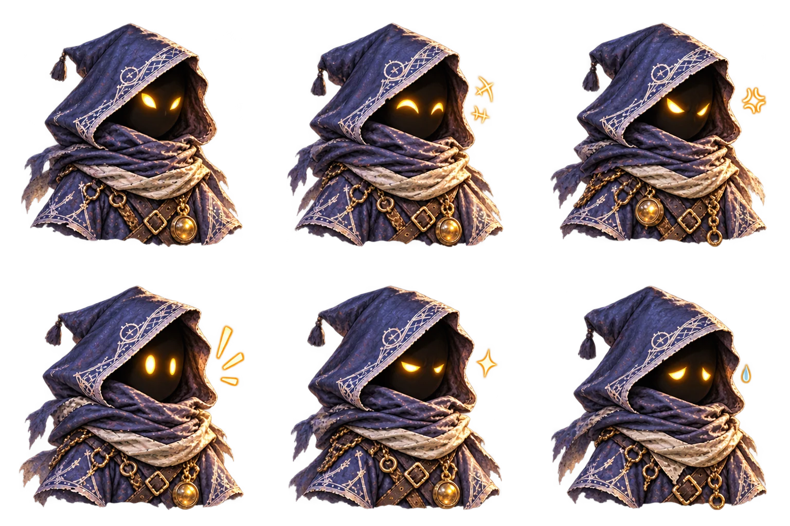

1536×1024; 436 KB. Candidate 3 selected.


<details><summary>Generation prompt</summary>

```text
FINAL SHEET CORRECTION: Every subject must occupy only central 60% of its own cell with very large empty margins. No subject, weapon, hair, glow, or particles can touch any cell boundary. Exact grid, no labels or lines. Battle characters face LEFT in every pose. Preserve reference design. NEW sprite sheet, exactly 3 columns by 2 rows of 512px cells. Each figure must fit within central 70% of its cell with 70 pixels empty alpha margin. Keep all fabric, weapons, effects and hair away from cell boundaries. Portraits are complete isolated bust cutouts with transparent margin including below shoulders. Battle characters face LEFT in EVERY pose, all heads turned LEFT and weapon actions to LEFT. No group lineup.

ART STYLE: Lush, luminous digital painting in the spirit of a premium early-2000s Japanese RPG remastered in HD. Semi-realistic, anime-influenced characters with expressive faces and stylish asymmetrical adventure outfits: layered belts, buckles, straps, zippers, one-sleeved jackets, flowing scarves. Sun-drenched tropical environments painted in rich detail: saturated turquoise seas, white sand, emerald jungle, and ancient sandstone ruins carved with softly glowing glyphs. Golden-hour sunlight, with bioluminescent blue-green motes of light drifting through the air. Cinematic, epic and adventurous, with a mischievous sense of humor: witty, characterful expressions and small comedic details hidden in the scene. Mature and cool, never babyish or chibi.

This is an isolated game sprite: render ONLY the subject on a fully transparent background (PNG with alpha). No scenery, no ground, no cast shadow, no frame. Lit from the upper left with a soft rim light, crisp readable silhouette, full body with nothing cropped and clear empty space around it.

Character design of a hero, mid-incantation, three-quarter view: THE SPELLWRIGHT, a small, mysterious spellcaster about the height of a 10-year-old, in a deep-indigo hooded robe embroidered with silver circuit-like patterns and fastened with many buckled straps, with oversized sleeves and pointed boots. The face is completely hidden in shadow except for two glowing golden eyes. A spellbook floats open beside them, and glowing golden rune-letters orbit one raised hand (the runes may be abstract glyphs); the other hand holds a crystal-tipped wand. Robes stirring in a magical wind.

An expression sheet for dialogue portraits: the SAME character's head and shoulders shown 6 times in a grid of 3 columns and 2 rows of equal square cells, on a fully transparent background, with no grid lines, labels or text. Identical framing and scale in every cell, facing three-quarters toward the right. Top row: (1) neutral, (2) laughing, (3) angry. Bottom row: (4) shocked, (5) smug, (6) worried. Big, readable, slightly comedic acting. Match the attached character reference exactly.

Output dimensions: 1536x1024. Highest quality. Reference images are identity/style guides, not edit targets. Match character details exactly; the written description controls colors and asymmetry. Keep a generous clear margin around each subject.

Rules: completely original designs; never imitate an existing franchise, character, creature, logo or emblem. No text, letters, numbers, logos, watermarks, signatures, borders or user interface, unless the prompt asks for glowing magic runes. Fierce and intense is great; no blood, gore or wounds.
```

</details>

## ally_titancaller / battle — draft

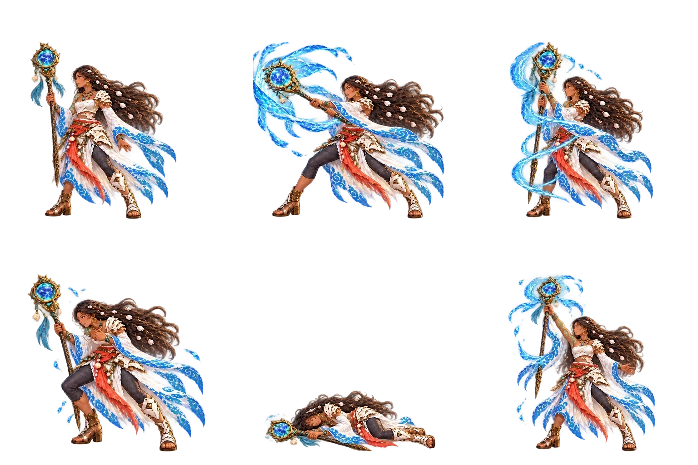

1536×1024; 416 KB. Candidate 3 selected.

- FLAG: Visual review: some poses face forward or right; required uniform left-facing orientation is not fully met.
- FLAG: frame 0: source content touches cell edge
- FLAG: frame 1: source content touches cell edge
- FLAG: frame 2: source content touches cell edge
- FLAG: frame 3: source content touches cell edge
- FLAG: frame 4: source content touches cell edge
- FLAG: frame 5: source content touches cell edge


<details><summary>Generation prompt</summary>

```text
FINAL SHEET CORRECTION: Every subject must occupy only central 60% of its own cell with very large empty margins. No subject, weapon, hair, glow, or particles can touch any cell boundary. Exact grid, no labels or lines. Battle characters face LEFT in every pose. Preserve reference design. NEW sprite sheet, exactly 3 columns by 2 rows of 512px cells. Each figure must fit within central 70% of its cell with 70 pixels empty alpha margin. Keep all fabric, weapons, effects and hair away from cell boundaries. Portraits are complete isolated bust cutouts with transparent margin including below shoulders. Battle characters face LEFT in EVERY pose, all heads turned LEFT and weapon actions to LEFT. No group lineup.

ART STYLE: Lush, luminous digital painting in the spirit of a premium early-2000s Japanese RPG remastered in HD. Semi-realistic, anime-influenced characters with expressive faces and stylish asymmetrical adventure outfits: layered belts, buckles, straps, zippers, one-sleeved jackets, flowing scarves. Sun-drenched tropical environments painted in rich detail: saturated turquoise seas, white sand, emerald jungle, and ancient sandstone ruins carved with softly glowing glyphs. Golden-hour sunlight, with bioluminescent blue-green motes of light drifting through the air. Cinematic, epic and adventurous, with a mischievous sense of humor: witty, characterful expressions and small comedic details hidden in the scene. Mature and cool, never babyish or chibi.

This is an isolated game sprite: render ONLY the subject on a fully transparent background (PNG with alpha). No scenery, no ground, no cast shadow, no frame. Lit from the upper left with a soft rim light, crisp readable silhouette, full body with nothing cropped and clear empty space around it.

Character design of a hero, staff raised as if calling something enormous, three-quarter view: THE TITAN CALLER, a fearless young woman about 15 with dark brown skin and long black hair braided with small seashells; a white wrap top with long detached sleeves patterned with blue wave motifs, a coral sash, a split skirt over leggings, bone-white armor plates on her left shoulder and hip. A tall staff topped with a crystal holding a tiny trapped lightning storm. A glowing teal tattoo of a coiled titan runs up her right arm.

A sprite sheet for a 2D turn-based battle game: the SAME character shown 6 times in a grid of 3 columns and 2 rows of equal square cells, on a fully transparent background, with no grid lines, borders, labels or text. Every pose shows the full body at the same size and scale, feet on the same invisible baseline near the bottom of each cell, the character facing LEFT, with clear empty space between poses. Top row, left to right: (1) idle battle stance, (2) attacking at the peak of the strike, (3) casting a special move with energy gathering in the hands or weapon. Bottom row, left to right: (4) hurt, recoiling from a hit, (5) knocked out, collapsed on the ground, (6) victory pose. Match the attached character reference exactly.

Output dimensions: 1536x1024. Highest quality. Reference images are identity/style guides, not edit targets. Match character details exactly; the written description controls colors and asymmetry. Keep a generous clear margin around each subject.

Rules: completely original designs; never imitate an existing franchise, character, creature, logo or emblem. No text, letters, numbers, logos, watermarks, signatures, borders or user interface, unless the prompt asks for glowing magic runes. Fierce and intense is great; no blood, gore or wounds.
```

</details>

## ally_titancaller / portraits — draft

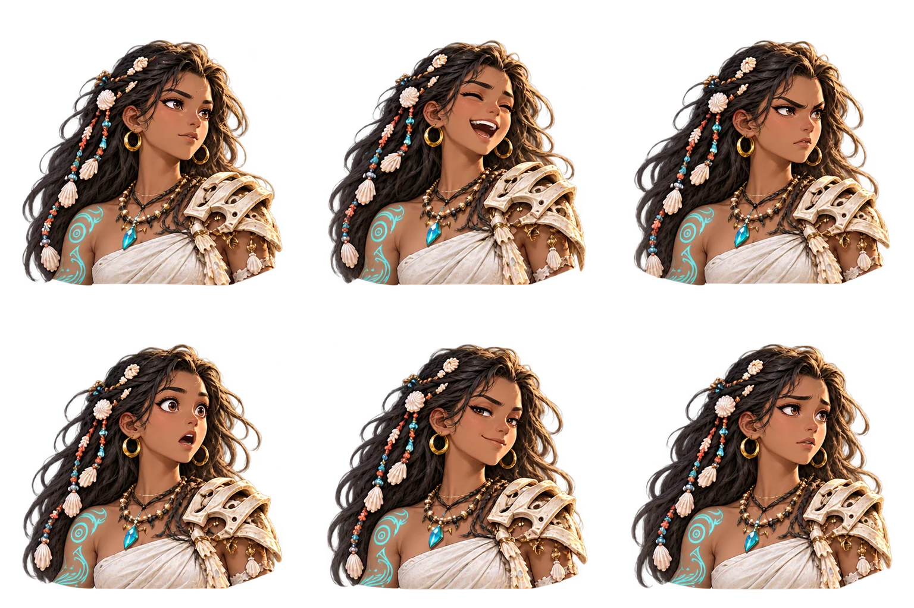

1536×1024; 452 KB. Candidate 1 selected.


<details><summary>Generation prompt</summary>

```text
ART STYLE: Lush, luminous digital painting in the spirit of a premium early-2000s Japanese RPG remastered in HD. Semi-realistic, anime-influenced characters with expressive faces and stylish asymmetrical adventure outfits: layered belts, buckles, straps, zippers, one-sleeved jackets, flowing scarves. Sun-drenched tropical environments painted in rich detail: saturated turquoise seas, white sand, emerald jungle, and ancient sandstone ruins carved with softly glowing glyphs. Golden-hour sunlight, with bioluminescent blue-green motes of light drifting through the air. Cinematic, epic and adventurous, with a mischievous sense of humor: witty, characterful expressions and small comedic details hidden in the scene. Mature and cool, never babyish or chibi.

This is an isolated game sprite: render ONLY the subject on a fully transparent background (PNG with alpha). No scenery, no ground, no cast shadow, no frame. Lit from the upper left with a soft rim light, crisp readable silhouette, full body with nothing cropped and clear empty space around it.

Character design of a hero, staff raised as if calling something enormous, three-quarter view: THE TITAN CALLER, a fearless young woman about 15 with dark brown skin and long black hair braided with small seashells; a white wrap top with long detached sleeves patterned with blue wave motifs, a coral sash, a split skirt over leggings, bone-white armor plates on her left shoulder and hip. A tall staff topped with a crystal holding a tiny trapped lightning storm. A glowing teal tattoo of a coiled titan runs up her right arm.

An expression sheet for dialogue portraits: the SAME character's head and shoulders shown 6 times in a grid of 3 columns and 2 rows of equal square cells, on a fully transparent background, with no grid lines, labels or text. Identical framing and scale in every cell, facing three-quarters toward the right. Top row: (1) neutral, (2) laughing, (3) angry. Bottom row: (4) shocked, (5) smug, (6) worried. Big, readable, slightly comedic acting. Match the attached character reference exactly.

Output dimensions: 1536x1024. Highest quality. Reference images are identity/style guides, not edit targets. Match character details exactly; the written description controls colors and asymmetry. Keep a generous clear margin around each subject.

Rules: completely original designs; never imitate an existing franchise, character, creature, logo or emblem. No text, letters, numbers, logos, watermarks, signatures, borders or user interface, unless the prompt asks for glowing magic runes. Fierce and intense is great; no blood, gore or wounds.
```

</details>

## tutor_droid / portraits — draft

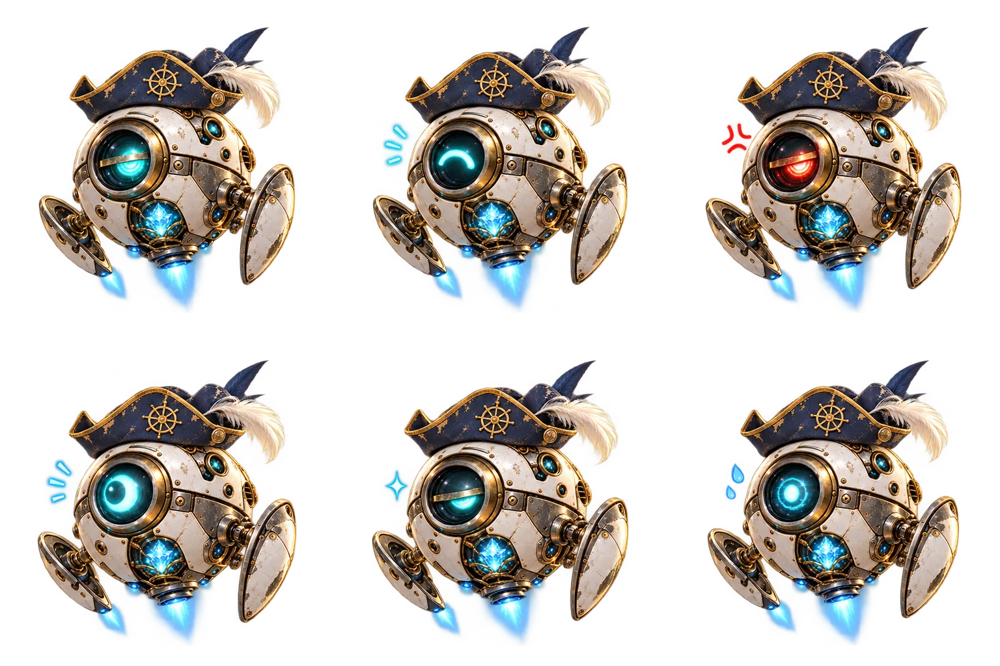

1536×1024; 418 KB. Candidate 3 selected.


<details><summary>Generation prompt</summary>

```text
FINAL SHEET CORRECTION: Every subject must occupy only central 60% of its own cell with very large empty margins. No subject, weapon, hair, glow, or particles can touch any cell boundary. Exact grid, no labels or lines. Battle characters face LEFT in every pose. Preserve reference design. NEW sprite sheet, exactly 3 columns by 2 rows of 512px cells. Each figure must fit within central 70% of its cell with 70 pixels empty alpha margin. Keep all fabric, weapons, effects and hair away from cell boundaries. Portraits are complete isolated bust cutouts with transparent margin including below shoulders. Battle characters face LEFT in EVERY pose, all heads turned LEFT and weapon actions to LEFT. No group lineup.

ART STYLE: Lush, luminous digital painting in the spirit of a premium early-2000s Japanese RPG remastered in HD. Semi-realistic, anime-influenced characters with expressive faces and stylish asymmetrical adventure outfits: layered belts, buckles, straps, zippers, one-sleeved jackets, flowing scarves. Sun-drenched tropical environments painted in rich detail: saturated turquoise seas, white sand, emerald jungle, and ancient sandstone ruins carved with softly glowing glyphs. Golden-hour sunlight, with bioluminescent blue-green motes of light drifting through the air. Cinematic, epic and adventurous, with a mischievous sense of humor: witty, characterful expressions and small comedic details hidden in the scene. Mature and cool, never babyish or chibi.

This is an isolated game sprite: render ONLY the subject on a fully transparent background (PNG with alpha). No scenery, no ground, no cast shadow, no frame. Lit from the upper left with a soft rim light, crisp readable silhouette, full body with nothing cropped and clear empty space around it.

A small floating companion droid, about the size of a cat, three-quarter view: a smooth sphere of white ceramic and brushed steel with one large round lens-eye glowing soft teal and a mechanical eyelid shutter, two small jointed fins for steering, a little round window showing a glowing crystal core, and faint blue thruster glow underneath. It wears a tiny battered navy pirate captain's hat, slightly crooked, which it clearly believes makes it look intimidating. Deadpan, clever and loyal. Sleek and cool, not cute or babyish.

An expression sheet for dialogue portraits: the SAME character's head and shoulders shown 6 times in a grid of 3 columns and 2 rows of equal square cells, on a fully transparent background, with no grid lines, labels or text. Identical framing and scale in every cell, facing three-quarters toward the right. Top row: (1) neutral, (2) laughing, (3) angry. Bottom row: (4) shocked, (5) smug, (6) worried. Big, readable, slightly comedic acting. Match the attached character reference exactly.
 Show the whole droid in each cell. Lens expressions: neutral; happy crescent; angry red; shocked wide; smug half-lidded; worried flickering.

Output dimensions: 1536x1024. Highest quality. Reference images are identity/style guides, not edit targets. Match character details exactly; the written description controls colors and asymmetry. Keep a generous clear margin around each subject.

Rules: completely original designs; never imitate an existing franchise, character, creature, logo or emblem. No text, letters, numbers, logos, watermarks, signatures, borders or user interface, unless the prompt asks for glowing magic runes. Fierce and intense is great; no blood, gore or wounds.
```

</details>

## fiend_scrap_raptor / base — draft

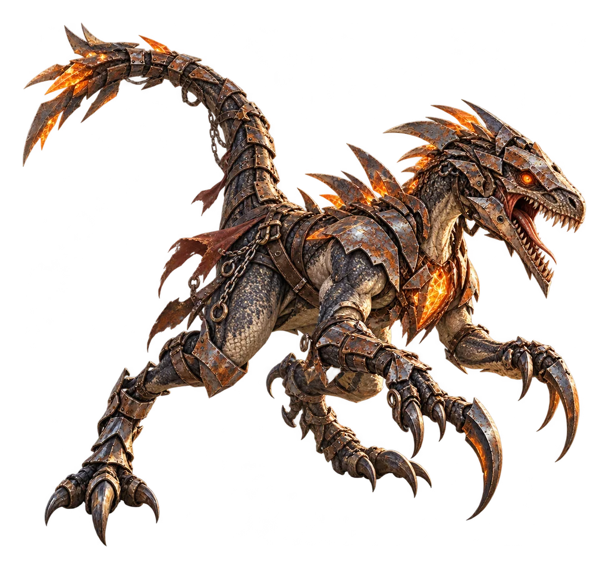

1024×957; 275 KB. Candidate 1 selected.


<details><summary>Generation prompt</summary>

```text
ART STYLE: Lush, luminous digital painting in the spirit of a premium early-2000s Japanese RPG remastered in HD. Semi-realistic, anime-influenced characters with expressive faces and stylish asymmetrical adventure outfits: layered belts, buckles, straps, zippers, one-sleeved jackets, flowing scarves. Sun-drenched tropical environments painted in rich detail: saturated turquoise seas, white sand, emerald jungle, and ancient sandstone ruins carved with softly glowing glyphs. Golden-hour sunlight, with bioluminescent blue-green motes of light drifting through the air. Cinematic, epic and adventurous, with a mischievous sense of humor: witty, characterful expressions and small comedic details hidden in the scene. Mature and cool, never babyish or chibi.

This is an isolated game sprite: render ONLY the subject on a fully transparent background (PNG with alpha). No scenery, no ground, no cast shadow, no frame. Lit from the upper left with a soft rim light, crisp readable silhouette, full body with nothing cropped and clear empty space around it.

An enemy creature, facing right: a lean predator the size of a horse, shaped like a raptor dinosaur, with rusted scrap-metal plates bolted onto its scaly hide, a glowing orange crystal embedded in its chest, long sickle claws and a jagged-toothed jaw. Crouched low, about to pounce.

Output dimensions: 1024x1024. Highest quality. Reference images are identity/style guides, not edit targets. Match character details exactly; the written description controls colors and asymmetry. Keep a generous clear margin around each subject.

Rules: completely original designs; never imitate an existing franchise, character, creature, logo or emblem. No text, letters, numbers, logos, watermarks, signatures, borders or user interface, unless the prompt asks for glowing magic runes. Fierce and intense is great; no blood, gore or wounds.
```

</details>

## fiend_scrap_raptor / battle — draft

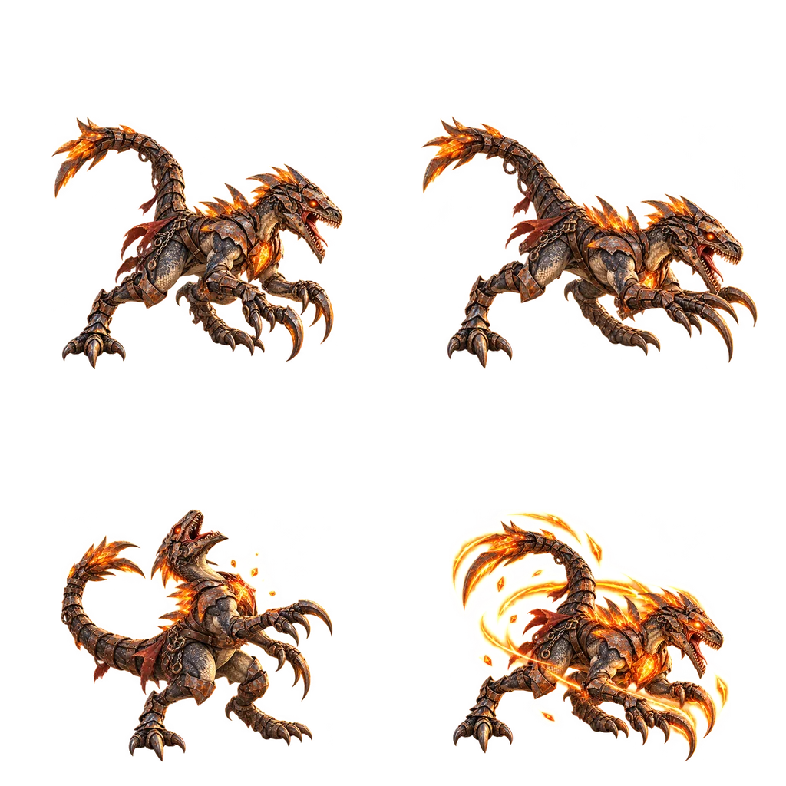

1024×1024; 272 KB. Candidate 2 selected.


<details><summary>Generation prompt</summary>

```text
NEW enemy sprite sheet: 2 columns by 2 rows, each square cell isolated. Subjects must be SMALL and centered, occupying at most 65% of each cell width and height INCLUDING ALL tails, scrap, smoke and glows. At least 80 pixels clear alpha margin. All four poses face RIGHT. Do not enlarge subjects to fill cells.

ART STYLE: Lush, luminous digital painting in the spirit of a premium early-2000s Japanese RPG remastered in HD. Semi-realistic, anime-influenced characters with expressive faces and stylish asymmetrical adventure outfits: layered belts, buckles, straps, zippers, one-sleeved jackets, flowing scarves. Sun-drenched tropical environments painted in rich detail: saturated turquoise seas, white sand, emerald jungle, and ancient sandstone ruins carved with softly glowing glyphs. Golden-hour sunlight, with bioluminescent blue-green motes of light drifting through the air. Cinematic, epic and adventurous, with a mischievous sense of humor: witty, characterful expressions and small comedic details hidden in the scene. Mature and cool, never babyish or chibi.

This is an isolated game sprite: render ONLY the subject on a fully transparent background (PNG with alpha). No scenery, no ground, no cast shadow, no frame. Lit from the upper left with a soft rim light, crisp readable silhouette, full body with nothing cropped and clear empty space around it.

An enemy creature, facing right: a lean predator the size of a horse, shaped like a raptor dinosaur, with rusted scrap-metal plates bolted onto its scaly hide, a glowing orange crystal embedded in its chest, long sickle claws and a jagged-toothed jaw. Crouched low, about to pounce.

A sprite sheet for a 2D turn-based battle game: the SAME creature shown 4 times in a grid of 2 columns and 2 rows of equal square cells, on a fully transparent background, with no grid lines, labels or text. Full body at the same size and scale in every cell, standing on the same invisible baseline, facing RIGHT. Top row: (1) idle, menacing, (2) attacking. Bottom row: (3) hurt, recoiling, (4) special attack, glowing with power. Match the attached creature reference exactly.

Output dimensions: 1024x1024. Highest quality. Reference images are identity/style guides, not edit targets. Match character details exactly; the written description controls colors and asymmetry. Keep a generous clear margin around each subject.

Rules: completely original designs; never imitate an existing franchise, character, creature, logo or emblem. No text, letters, numbers, logos, watermarks, signatures, borders or user interface, unless the prompt asks for glowing magic runes. Fierce and intense is great; no blood, gore or wounds.
```

</details>

## fiend_volt_jelly / base — draft

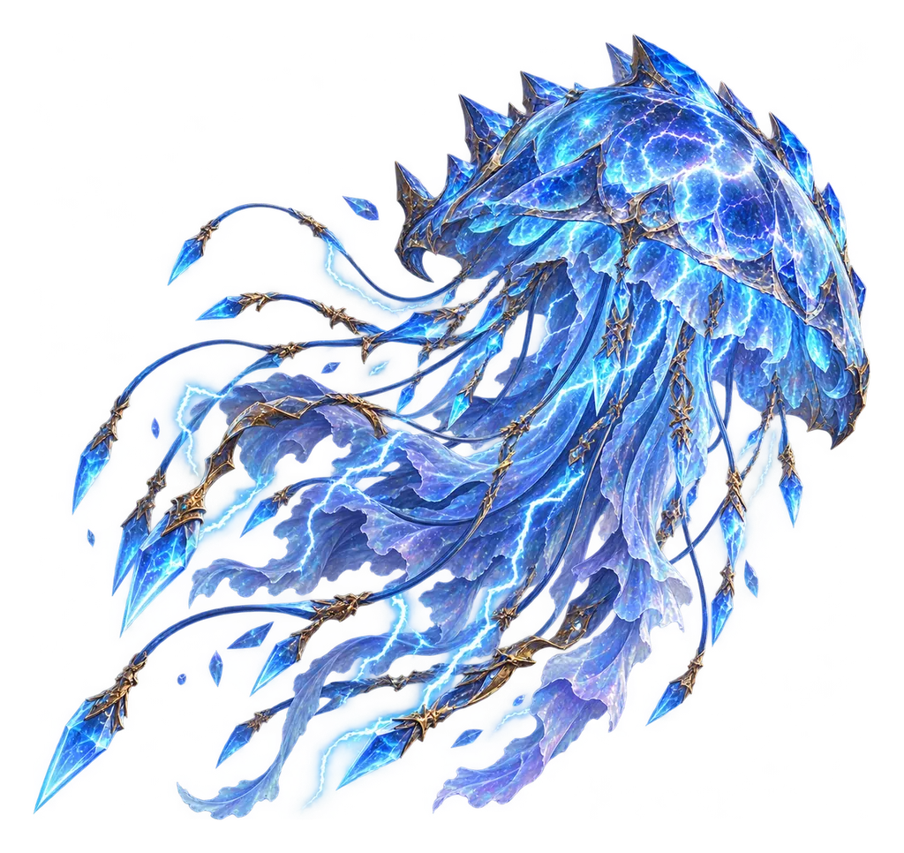

1024×966; 393 KB. Candidate 1 selected.


<details><summary>Generation prompt</summary>

```text
ART STYLE: Lush, luminous digital painting in the spirit of a premium early-2000s Japanese RPG remastered in HD. Semi-realistic, anime-influenced characters with expressive faces and stylish asymmetrical adventure outfits: layered belts, buckles, straps, zippers, one-sleeved jackets, flowing scarves. Sun-drenched tropical environments painted in rich detail: saturated turquoise seas, white sand, emerald jungle, and ancient sandstone ruins carved with softly glowing glyphs. Golden-hour sunlight, with bioluminescent blue-green motes of light drifting through the air. Cinematic, epic and adventurous, with a mischievous sense of humor: witty, characterful expressions and small comedic details hidden in the scene. Mature and cool, never babyish or chibi.

This is an isolated game sprite: render ONLY the subject on a fully transparent background (PNG with alpha). No scenery, no ground, no cast shadow, no frame. Lit from the upper left with a soft rim light, crisp readable silhouette, full body with nothing cropped and clear empty space around it.

An enemy creature, facing right: a floating crystal jellyfish as big as a car, its bell made of translucent blue crystal with lightning crackling inside, dozens of long glowing tendrils hanging below it and sparking with electricity. Hovering, menacing.

Output dimensions: 1024x1024. Highest quality. Reference images are identity/style guides, not edit targets. Match character details exactly; the written description controls colors and asymmetry. Keep a generous clear margin around each subject.

Rules: completely original designs; never imitate an existing franchise, character, creature, logo or emblem. No text, letters, numbers, logos, watermarks, signatures, borders or user interface, unless the prompt asks for glowing magic runes. Fierce and intense is great; no blood, gore or wounds.
```

</details>

## fiend_volt_jelly / battle — draft

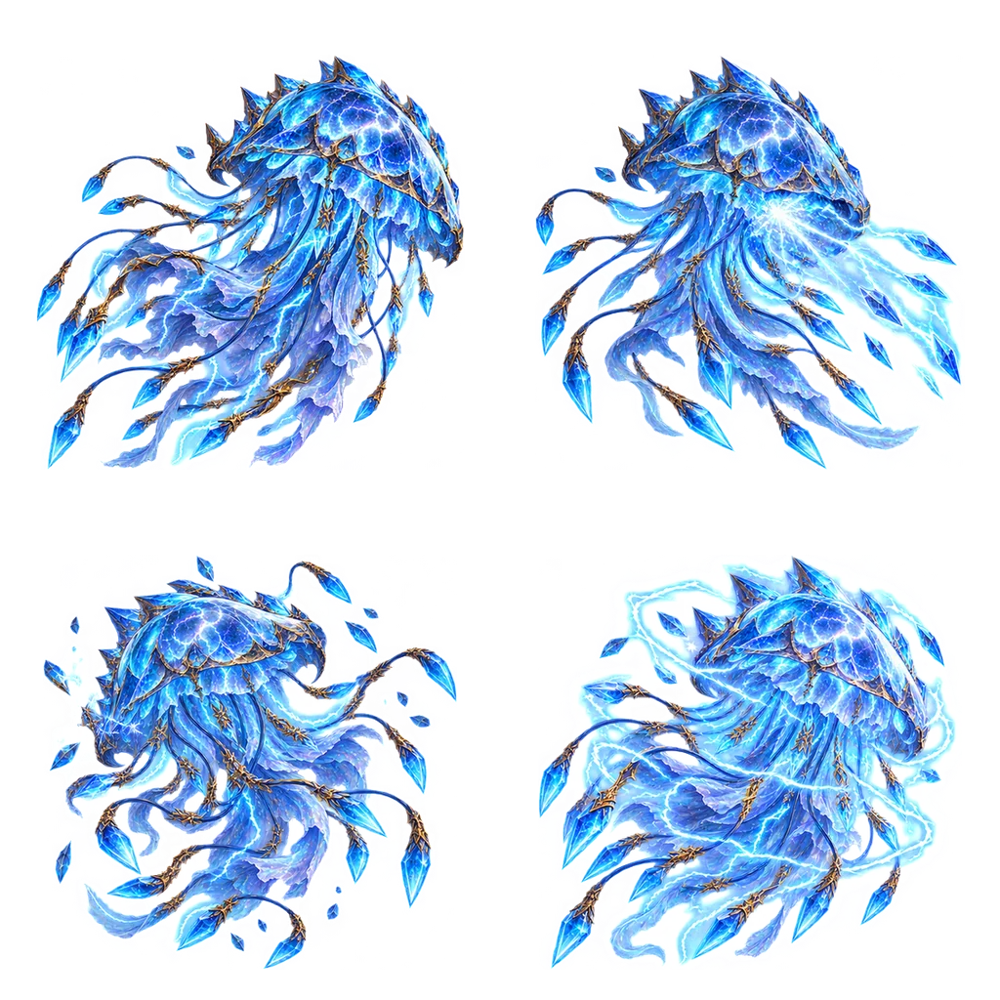

1024×1024; 488 KB. Candidate 1 selected.


<details><summary>Generation prompt</summary>

```text
ART STYLE: Lush, luminous digital painting in the spirit of a premium early-2000s Japanese RPG remastered in HD. Semi-realistic, anime-influenced characters with expressive faces and stylish asymmetrical adventure outfits: layered belts, buckles, straps, zippers, one-sleeved jackets, flowing scarves. Sun-drenched tropical environments painted in rich detail: saturated turquoise seas, white sand, emerald jungle, and ancient sandstone ruins carved with softly glowing glyphs. Golden-hour sunlight, with bioluminescent blue-green motes of light drifting through the air. Cinematic, epic and adventurous, with a mischievous sense of humor: witty, characterful expressions and small comedic details hidden in the scene. Mature and cool, never babyish or chibi.

This is an isolated game sprite: render ONLY the subject on a fully transparent background (PNG with alpha). No scenery, no ground, no cast shadow, no frame. Lit from the upper left with a soft rim light, crisp readable silhouette, full body with nothing cropped and clear empty space around it.

An enemy creature, facing right: a floating crystal jellyfish as big as a car, its bell made of translucent blue crystal with lightning crackling inside, dozens of long glowing tendrils hanging below it and sparking with electricity. Hovering, menacing.

A sprite sheet for a 2D turn-based battle game: the SAME creature shown 4 times in a grid of 2 columns and 2 rows of equal square cells, on a fully transparent background, with no grid lines, labels or text. Full body at the same size and scale in every cell, standing on the same invisible baseline, facing RIGHT. Top row: (1) idle, menacing, (2) attacking. Bottom row: (3) hurt, recoiling, (4) special attack, glowing with power. Match the attached creature reference exactly.

Output dimensions: 1024x1024. Highest quality. Reference images are identity/style guides, not edit targets. Match character details exactly; the written description controls colors and asymmetry. Keep a generous clear margin around each subject.

Rules: completely original designs; never imitate an existing franchise, character, creature, logo or emblem. No text, letters, numbers, logos, watermarks, signatures, borders or user interface, unless the prompt asks for glowing magic runes. Fierce and intense is great; no blood, gore or wounds.
```

</details>

## fiend_magnet_beetle / base — draft

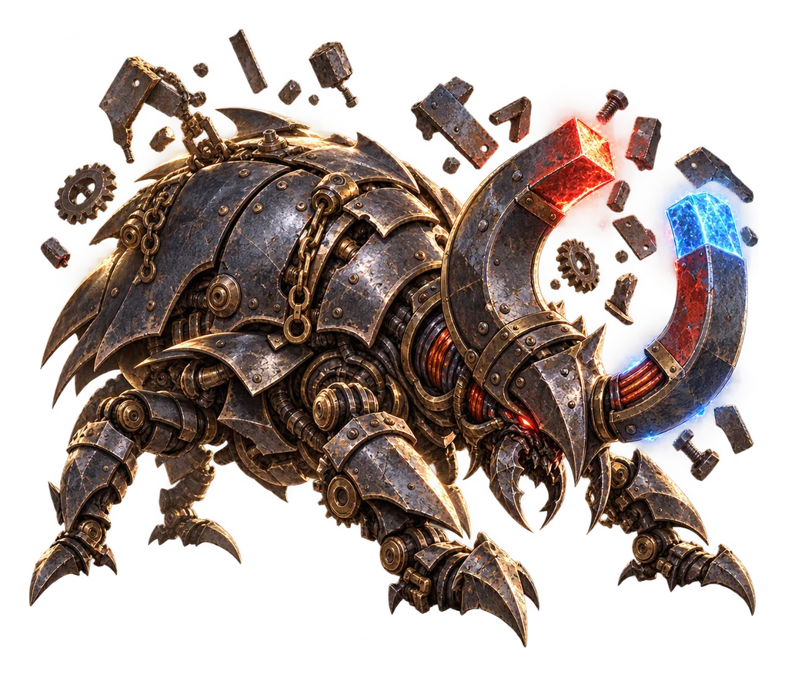

1024×881; 354 KB. Candidate 1 selected.


<details><summary>Generation prompt</summary>

```text
ART STYLE: Lush, luminous digital painting in the spirit of a premium early-2000s Japanese RPG remastered in HD. Semi-realistic, anime-influenced characters with expressive faces and stylish asymmetrical adventure outfits: layered belts, buckles, straps, zippers, one-sleeved jackets, flowing scarves. Sun-drenched tropical environments painted in rich detail: saturated turquoise seas, white sand, emerald jungle, and ancient sandstone ruins carved with softly glowing glyphs. Golden-hour sunlight, with bioluminescent blue-green motes of light drifting through the air. Cinematic, epic and adventurous, with a mischievous sense of humor: witty, characterful expressions and small comedic details hidden in the scene. Mature and cool, never babyish or chibi.

This is an isolated game sprite: render ONLY the subject on a fully transparent background (PNG with alpha). No scenery, no ground, no cast shadow, no frame. Lit from the upper left with a soft rim light, crisp readable silhouette, full body with nothing cropped and clear empty space around it.

An enemy creature, facing right: a heavy armored beetle the size of a small truck, with a shell of dark riveted iron plates and two huge horseshoe-magnet-shaped horns whose tips glow red and blue. Small chunks of scrap metal float in the air around it, pulled by its magnetism. Head lowered, ready to charge.

Output dimensions: 1024x1024. Highest quality. Reference images are identity/style guides, not edit targets. Match character details exactly; the written description controls colors and asymmetry. Keep a generous clear margin around each subject.

Rules: completely original designs; never imitate an existing franchise, character, creature, logo or emblem. No text, letters, numbers, logos, watermarks, signatures, borders or user interface, unless the prompt asks for glowing magic runes. Fierce and intense is great; no blood, gore or wounds.
```

</details>

## fiend_magnet_beetle / battle — draft

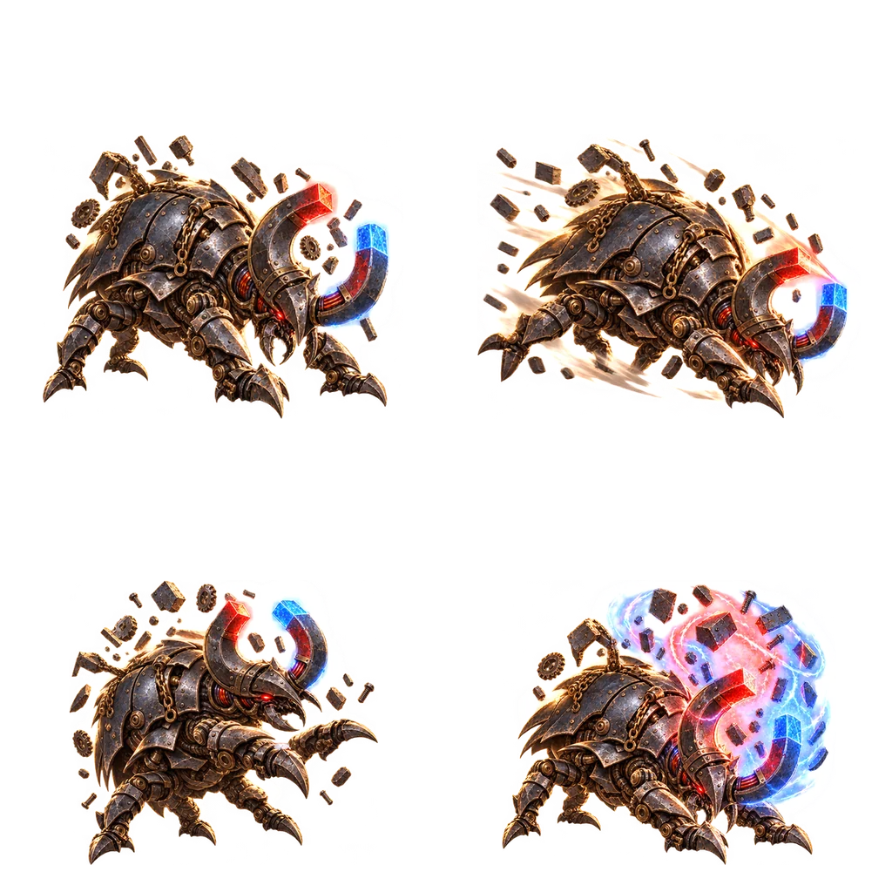

1024×1024; 312 KB. Candidate 2 selected.


<details><summary>Generation prompt</summary>

```text
NEW enemy sprite sheet: 2 columns by 2 rows, each square cell isolated. Subjects must be SMALL and centered, occupying at most 65% of each cell width and height INCLUDING ALL tails, scrap, smoke and glows. At least 80 pixels clear alpha margin. All four poses face RIGHT. Do not enlarge subjects to fill cells.

ART STYLE: Lush, luminous digital painting in the spirit of a premium early-2000s Japanese RPG remastered in HD. Semi-realistic, anime-influenced characters with expressive faces and stylish asymmetrical adventure outfits: layered belts, buckles, straps, zippers, one-sleeved jackets, flowing scarves. Sun-drenched tropical environments painted in rich detail: saturated turquoise seas, white sand, emerald jungle, and ancient sandstone ruins carved with softly glowing glyphs. Golden-hour sunlight, with bioluminescent blue-green motes of light drifting through the air. Cinematic, epic and adventurous, with a mischievous sense of humor: witty, characterful expressions and small comedic details hidden in the scene. Mature and cool, never babyish or chibi.

This is an isolated game sprite: render ONLY the subject on a fully transparent background (PNG with alpha). No scenery, no ground, no cast shadow, no frame. Lit from the upper left with a soft rim light, crisp readable silhouette, full body with nothing cropped and clear empty space around it.

An enemy creature, facing right: a heavy armored beetle the size of a small truck, with a shell of dark riveted iron plates and two huge horseshoe-magnet-shaped horns whose tips glow red and blue. Small chunks of scrap metal float in the air around it, pulled by its magnetism. Head lowered, ready to charge.

A sprite sheet for a 2D turn-based battle game: the SAME creature shown 4 times in a grid of 2 columns and 2 rows of equal square cells, on a fully transparent background, with no grid lines, labels or text. Full body at the same size and scale in every cell, standing on the same invisible baseline, facing RIGHT. Top row: (1) idle, menacing, (2) attacking. Bottom row: (3) hurt, recoiling, (4) special attack, glowing with power. Match the attached creature reference exactly.

Output dimensions: 1024x1024. Highest quality. Reference images are identity/style guides, not edit targets. Match character details exactly; the written description controls colors and asymmetry. Keep a generous clear margin around each subject.

Rules: completely original designs; never imitate an existing franchise, character, creature, logo or emblem. No text, letters, numbers, logos, watermarks, signatures, borders or user interface, unless the prompt asks for glowing magic runes. Fierce and intense is great; no blood, gore or wounds.
```

</details>

## fiend_ink_slime / base — draft

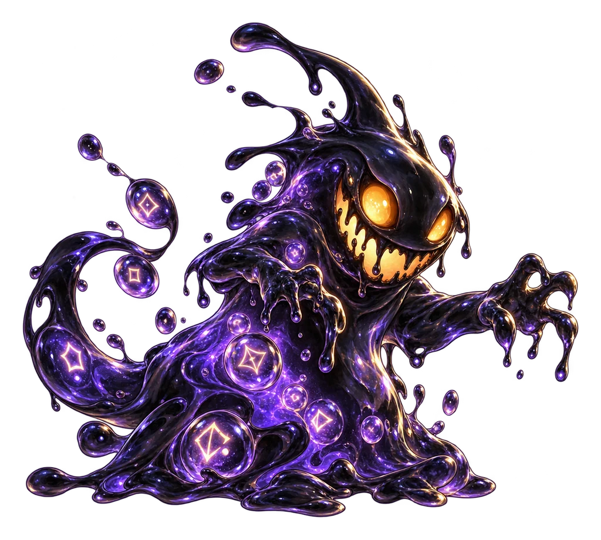

1024×921; 264 KB. Candidate 1 selected.


<details><summary>Generation prompt</summary>

```text
ART STYLE: Lush, luminous digital painting in the spirit of a premium early-2000s Japanese RPG remastered in HD. Semi-realistic, anime-influenced characters with expressive faces and stylish asymmetrical adventure outfits: layered belts, buckles, straps, zippers, one-sleeved jackets, flowing scarves. Sun-drenched tropical environments painted in rich detail: saturated turquoise seas, white sand, emerald jungle, and ancient sandstone ruins carved with softly glowing glyphs. Golden-hour sunlight, with bioluminescent blue-green motes of light drifting through the air. Cinematic, epic and adventurous, with a mischievous sense of humor: witty, characterful expressions and small comedic details hidden in the scene. Mature and cool, never babyish or chibi.

This is an isolated game sprite: render ONLY the subject on a fully transparent background (PNG with alpha). No scenery, no ground, no cast shadow, no frame. Lit from the upper left with a soft rim light, crisp readable silhouette, full body with nothing cropped and clear empty space around it.

An enemy creature, facing right: a waist-high blob of glowing liquid ink, glossy violet-black, with shimmering glyph-shaped bubbles rising inside it, two big glowing amber eyes and a wide mischievous grin full of ink-drip teeth. Drips crawl back up into its body. Spilled magic ink that came alive: gross, funny and still dangerous.

Output dimensions: 1024x1024. Highest quality. Reference images are identity/style guides, not edit targets. Match character details exactly; the written description controls colors and asymmetry. Keep a generous clear margin around each subject.

Rules: completely original designs; never imitate an existing franchise, character, creature, logo or emblem. No text, letters, numbers, logos, watermarks, signatures, borders or user interface, unless the prompt asks for glowing magic runes. Fierce and intense is great; no blood, gore or wounds.
```

</details>

## fiend_ink_slime / battle — draft

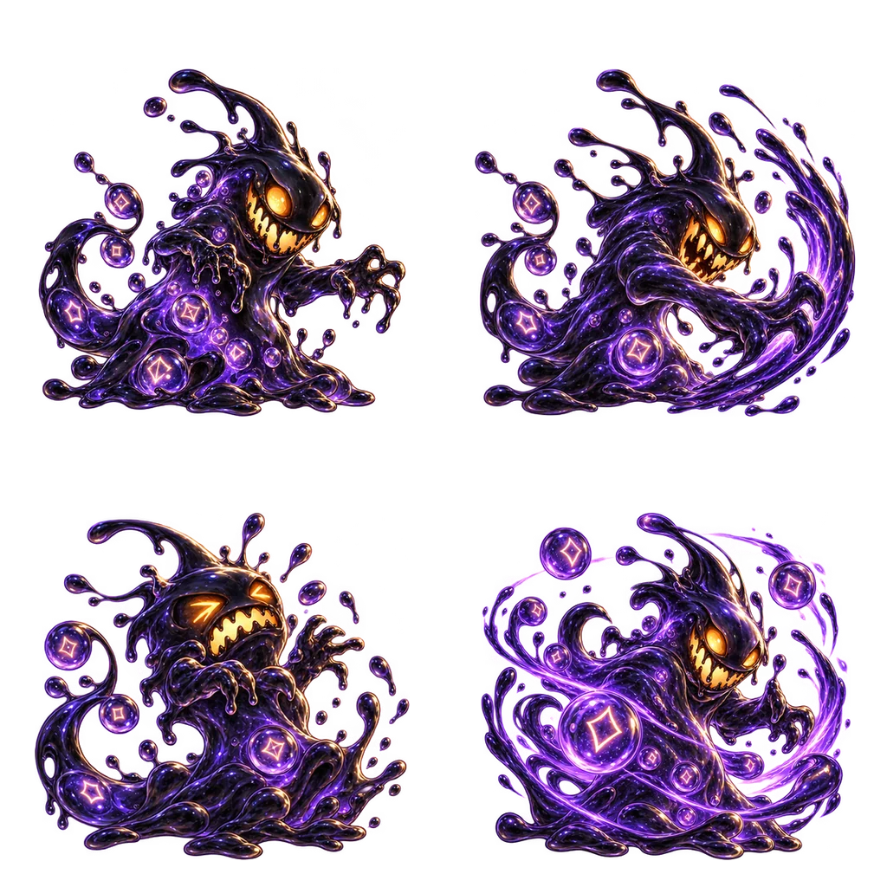

1024×1024; 429 KB. Candidate 1 selected.


<details><summary>Generation prompt</summary>

```text
ART STYLE: Lush, luminous digital painting in the spirit of a premium early-2000s Japanese RPG remastered in HD. Semi-realistic, anime-influenced characters with expressive faces and stylish asymmetrical adventure outfits: layered belts, buckles, straps, zippers, one-sleeved jackets, flowing scarves. Sun-drenched tropical environments painted in rich detail: saturated turquoise seas, white sand, emerald jungle, and ancient sandstone ruins carved with softly glowing glyphs. Golden-hour sunlight, with bioluminescent blue-green motes of light drifting through the air. Cinematic, epic and adventurous, with a mischievous sense of humor: witty, characterful expressions and small comedic details hidden in the scene. Mature and cool, never babyish or chibi.

This is an isolated game sprite: render ONLY the subject on a fully transparent background (PNG with alpha). No scenery, no ground, no cast shadow, no frame. Lit from the upper left with a soft rim light, crisp readable silhouette, full body with nothing cropped and clear empty space around it.

An enemy creature, facing right: a waist-high blob of glowing liquid ink, glossy violet-black, with shimmering glyph-shaped bubbles rising inside it, two big glowing amber eyes and a wide mischievous grin full of ink-drip teeth. Drips crawl back up into its body. Spilled magic ink that came alive: gross, funny and still dangerous.

A sprite sheet for a 2D turn-based battle game: the SAME creature shown 4 times in a grid of 2 columns and 2 rows of equal square cells, on a fully transparent background, with no grid lines, labels or text. Full body at the same size and scale in every cell, standing on the same invisible baseline, facing RIGHT. Top row: (1) idle, menacing, (2) attacking. Bottom row: (3) hurt, recoiling, (4) special attack, glowing with power. Match the attached creature reference exactly.

Output dimensions: 1024x1024. Highest quality. Reference images are identity/style guides, not edit targets. Match character details exactly; the written description controls colors and asymmetry. Keep a generous clear margin around each subject.

Rules: completely original designs; never imitate an existing franchise, character, creature, logo or emblem. No text, letters, numbers, logos, watermarks, signatures, borders or user interface, unless the prompt asks for glowing magic runes. Fierce and intense is great; no blood, gore or wounds.
```

</details>

## fiend_dominion_drone / base — draft

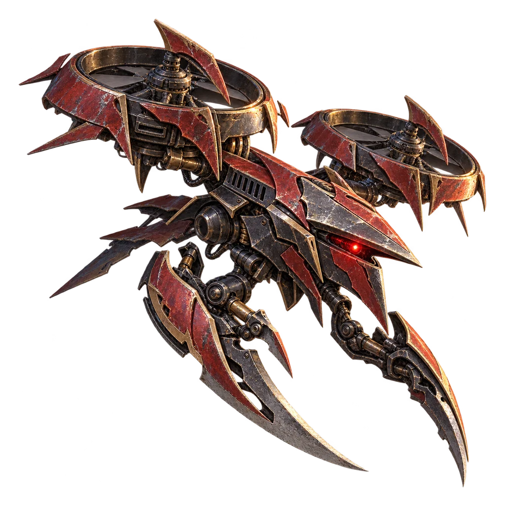

1022×1024; 249 KB. Candidate 1 selected.


<details><summary>Generation prompt</summary>

```text
ART STYLE: Lush, luminous digital painting in the spirit of a premium early-2000s Japanese RPG remastered in HD. Semi-realistic, anime-influenced characters with expressive faces and stylish asymmetrical adventure outfits: layered belts, buckles, straps, zippers, one-sleeved jackets, flowing scarves. Sun-drenched tropical environments painted in rich detail: saturated turquoise seas, white sand, emerald jungle, and ancient sandstone ruins carved with softly glowing glyphs. Golden-hour sunlight, with bioluminescent blue-green motes of light drifting through the air. Cinematic, epic and adventurous, with a mischievous sense of humor: witty, characterful expressions and small comedic details hidden in the scene. Mature and cool, never babyish or chibi.

This is an isolated game sprite: render ONLY the subject on a fully transparent background (PNG with alpha). No scenery, no ground, no cast shadow, no frame. Lit from the upper left with a soft rim light, crisp readable silhouette, full body with nothing cropped and clear empty space around it.

An enemy war machine of an evil empire, facing right: a wedge-shaped drone of dark gunmetal and crimson armor plates, held aloft by two shielded rotor fans, with one red scanning eye glowing in a narrow slit visor and two folding blade-arms underneath. Cold, sinister and military.

Output dimensions: 1024x1024. Highest quality. Reference images are identity/style guides, not edit targets. Match character details exactly; the written description controls colors and asymmetry. Keep a generous clear margin around each subject.

Rules: completely original designs; never imitate an existing franchise, character, creature, logo or emblem. No text, letters, numbers, logos, watermarks, signatures, borders or user interface, unless the prompt asks for glowing magic runes. Fierce and intense is great; no blood, gore or wounds.
```

</details>

## fiend_dominion_drone / battle — draft

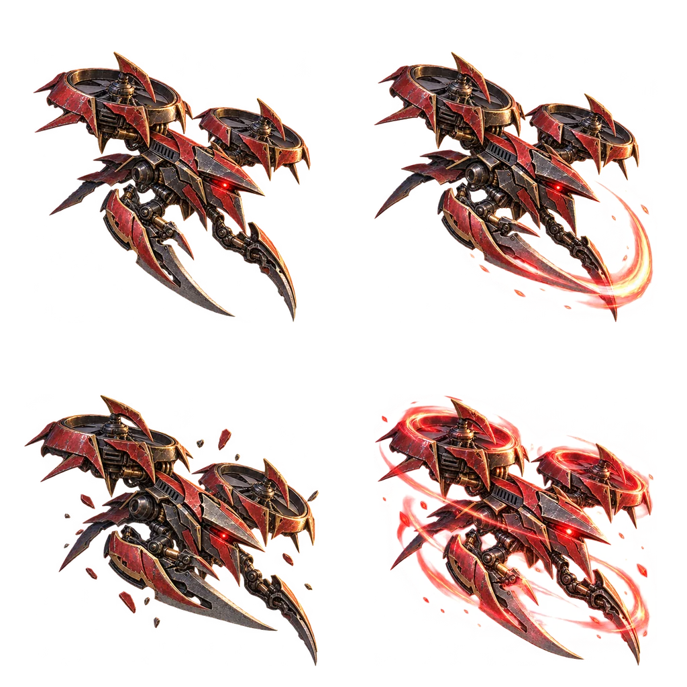

1024×1024; 329 KB. Candidate 2 selected.


<details><summary>Generation prompt</summary>

```text
NEW enemy sprite sheet: 2 columns by 2 rows, each square cell isolated. Subjects must be SMALL and centered, occupying at most 65% of each cell width and height INCLUDING ALL tails, scrap, smoke and glows. At least 80 pixels clear alpha margin. All four poses face RIGHT. Do not enlarge subjects to fill cells.

ART STYLE: Lush, luminous digital painting in the spirit of a premium early-2000s Japanese RPG remastered in HD. Semi-realistic, anime-influenced characters with expressive faces and stylish asymmetrical adventure outfits: layered belts, buckles, straps, zippers, one-sleeved jackets, flowing scarves. Sun-drenched tropical environments painted in rich detail: saturated turquoise seas, white sand, emerald jungle, and ancient sandstone ruins carved with softly glowing glyphs. Golden-hour sunlight, with bioluminescent blue-green motes of light drifting through the air. Cinematic, epic and adventurous, with a mischievous sense of humor: witty, characterful expressions and small comedic details hidden in the scene. Mature and cool, never babyish or chibi.

This is an isolated game sprite: render ONLY the subject on a fully transparent background (PNG with alpha). No scenery, no ground, no cast shadow, no frame. Lit from the upper left with a soft rim light, crisp readable silhouette, full body with nothing cropped and clear empty space around it.

An enemy war machine of an evil empire, facing right: a wedge-shaped drone of dark gunmetal and crimson armor plates, held aloft by two shielded rotor fans, with one red scanning eye glowing in a narrow slit visor and two folding blade-arms underneath. Cold, sinister and military.

A sprite sheet for a 2D turn-based battle game: the SAME creature shown 4 times in a grid of 2 columns and 2 rows of equal square cells, on a fully transparent background, with no grid lines, labels or text. Full body at the same size and scale in every cell, standing on the same invisible baseline, facing RIGHT. Top row: (1) idle, menacing, (2) attacking. Bottom row: (3) hurt, recoiling, (4) special attack, glowing with power. Match the attached creature reference exactly.

Output dimensions: 1024x1024. Highest quality. Reference images are identity/style guides, not edit targets. Match character details exactly; the written description controls colors and asymmetry. Keep a generous clear margin around each subject.

Rules: completely original designs; never imitate an existing franchise, character, creature, logo or emblem. No text, letters, numbers, logos, watermarks, signatures, borders or user interface, unless the prompt asks for glowing magic runes. Fierce and intense is great; no blood, gore or wounds.
```

</details>

## boss_geode_titan / base — draft

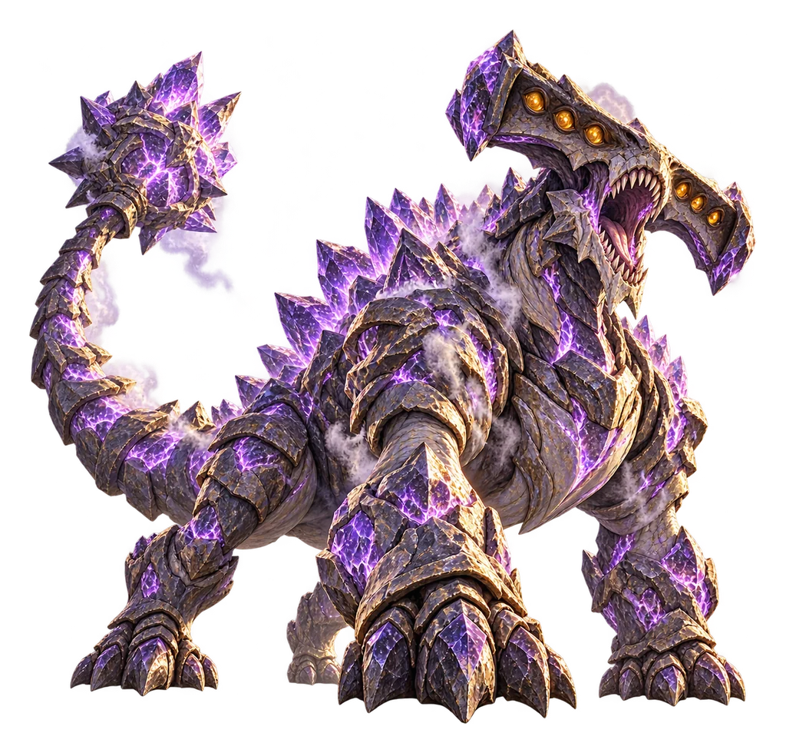

1024×980; 368 KB. Candidate 1 selected.

- FLAG: Visual review: confirm four legs, hammerhead skull, and six amber eyes; generated anatomy is not clearly faithful to all three requirements.


<details><summary>Generation prompt</summary>

```text
ART STYLE: Lush, luminous digital painting in the spirit of a premium early-2000s Japanese RPG remastered in HD. Semi-realistic, anime-influenced characters with expressive faces and stylish asymmetrical adventure outfits: layered belts, buckles, straps, zippers, one-sleeved jackets, flowing scarves. Sun-drenched tropical environments painted in rich detail: saturated turquoise seas, white sand, emerald jungle, and ancient sandstone ruins carved with softly glowing glyphs. Golden-hour sunlight, with bioluminescent blue-green motes of light drifting through the air. Cinematic, epic and adventurous, with a mischievous sense of humor: witty, characterful expressions and small comedic details hidden in the scene. Mature and cool, never babyish or chibi.

This is an isolated game sprite: render ONLY the subject on a fully transparent background (PNG with alpha). No scenery, no ground, no cast shadow, no frame. Lit from the upper left with a soft rim light, crisp readable silhouette, full body with nothing cropped and clear empty space around it.

A colossal titan beast, a boss monster, facing right: four massive legs, a hammerhead-shaped skull with six glowing amber eyes, and armor plates of cracked geode crystal glowing violet from within, with steam venting from the cracks. Its tail ends in a huge crystal club. Seen from a low angle so it feels enormous.

POSE: standing, roaring

Output dimensions: 1024x1024. Highest quality. Reference images are identity/style guides, not edit targets. Match character details exactly; the written description controls colors and asymmetry. Keep a generous clear margin around each subject.

Rules: completely original designs; never imitate an existing franchise, character, creature, logo or emblem. No text, letters, numbers, logos, watermarks, signatures, borders or user interface, unless the prompt asks for glowing magic runes. Fierce and intense is great; no blood, gore or wounds.
```

</details>

## boss_geode_titan / attack — draft

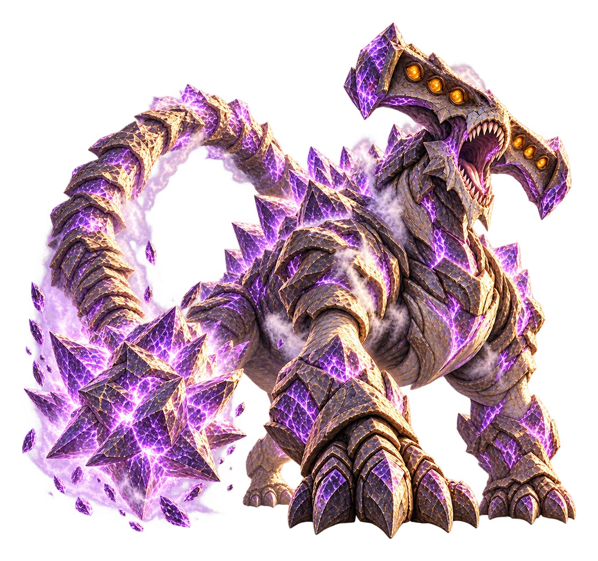

1024×960; 395 KB. Candidate 1 selected.

- FLAG: Visual review: confirm four legs, hammerhead skull, and six amber eyes; generated anatomy is not clearly faithful to all three requirements.


<details><summary>Generation prompt</summary>

```text
ART STYLE: Lush, luminous digital painting in the spirit of a premium early-2000s Japanese RPG remastered in HD. Semi-realistic, anime-influenced characters with expressive faces and stylish asymmetrical adventure outfits: layered belts, buckles, straps, zippers, one-sleeved jackets, flowing scarves. Sun-drenched tropical environments painted in rich detail: saturated turquoise seas, white sand, emerald jungle, and ancient sandstone ruins carved with softly glowing glyphs. Golden-hour sunlight, with bioluminescent blue-green motes of light drifting through the air. Cinematic, epic and adventurous, with a mischievous sense of humor: witty, characterful expressions and small comedic details hidden in the scene. Mature and cool, never babyish or chibi.

This is an isolated game sprite: render ONLY the subject on a fully transparent background (PNG with alpha). No scenery, no ground, no cast shadow, no frame. Lit from the upper left with a soft rim light, crisp readable silhouette, full body with nothing cropped and clear empty space around it.

A colossal titan beast, a boss monster, facing right: four massive legs, a hammerhead-shaped skull with six glowing amber eyes, and armor plates of cracked geode crystal glowing violet from within, with steam venting from the cracks. Its tail ends in a huge crystal club. Seen from a low angle so it feels enormous.

POSE: tail club swinging down mid-strike

Output dimensions: 1024x1024. Highest quality. Reference images are identity/style guides, not edit targets. Match character details exactly; the written description controls colors and asymmetry. Keep a generous clear margin around each subject.

Rules: completely original designs; never imitate an existing franchise, character, creature, logo or emblem. No text, letters, numbers, logos, watermarks, signatures, borders or user interface, unless the prompt asks for glowing magic runes. Fierce and intense is great; no blood, gore or wounds.
```

</details>

## boss_geode_titan / hurt — draft

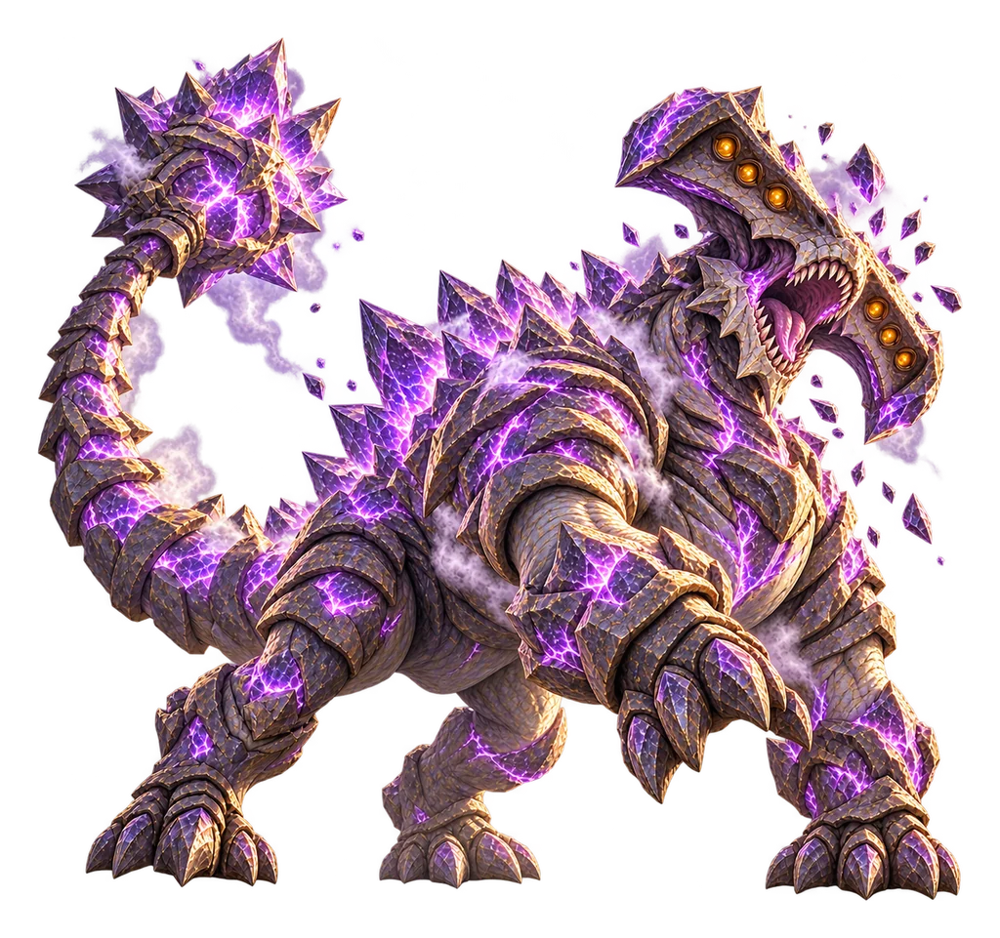

1024×961; 360 KB. Candidate 2 selected.

- FLAG: Visual review: confirm four legs, hammerhead skull, and six amber eyes; generated anatomy is not clearly faithful to all three requirements.


<details><summary>Generation prompt</summary>

```text
NEW boss hurt pose, clearly recoil BACKWARD: bend the neck and front legs, withdraw the head from an unseen impact from right, cracks flaring. Keep full four legs and club tail visible, 15% transparent margin.

ART STYLE: Lush, luminous digital painting in the spirit of a premium early-2000s Japanese RPG remastered in HD. Semi-realistic, anime-influenced characters with expressive faces and stylish asymmetrical adventure outfits: layered belts, buckles, straps, zippers, one-sleeved jackets, flowing scarves. Sun-drenched tropical environments painted in rich detail: saturated turquoise seas, white sand, emerald jungle, and ancient sandstone ruins carved with softly glowing glyphs. Golden-hour sunlight, with bioluminescent blue-green motes of light drifting through the air. Cinematic, epic and adventurous, with a mischievous sense of humor: witty, characterful expressions and small comedic details hidden in the scene. Mature and cool, never babyish or chibi.

This is an isolated game sprite: render ONLY the subject on a fully transparent background (PNG with alpha). No scenery, no ground, no cast shadow, no frame. Lit from the upper left with a soft rim light, crisp readable silhouette, full body with nothing cropped and clear empty space around it.

A colossal titan beast, a boss monster, facing right: four massive legs, a hammerhead-shaped skull with six glowing amber eyes, and armor plates of cracked geode crystal glowing violet from within, with steam venting from the cracks. Its tail ends in a huge crystal club. Seen from a low angle so it feels enormous.

POSE: recoiling, cracks flaring bright

Output dimensions: 1024x1024. Highest quality. Reference images are identity/style guides, not edit targets. Match character details exactly; the written description controls colors and asymmetry. Keep a generous clear margin around each subject.

Rules: completely original designs; never imitate an existing franchise, character, creature, logo or emblem. No text, letters, numbers, logos, watermarks, signatures, borders or user interface, unless the prompt asks for glowing magic runes. Fierce and intense is great; no blood, gore or wounds.
```

</details>

## boss_geode_titan / enraged — draft

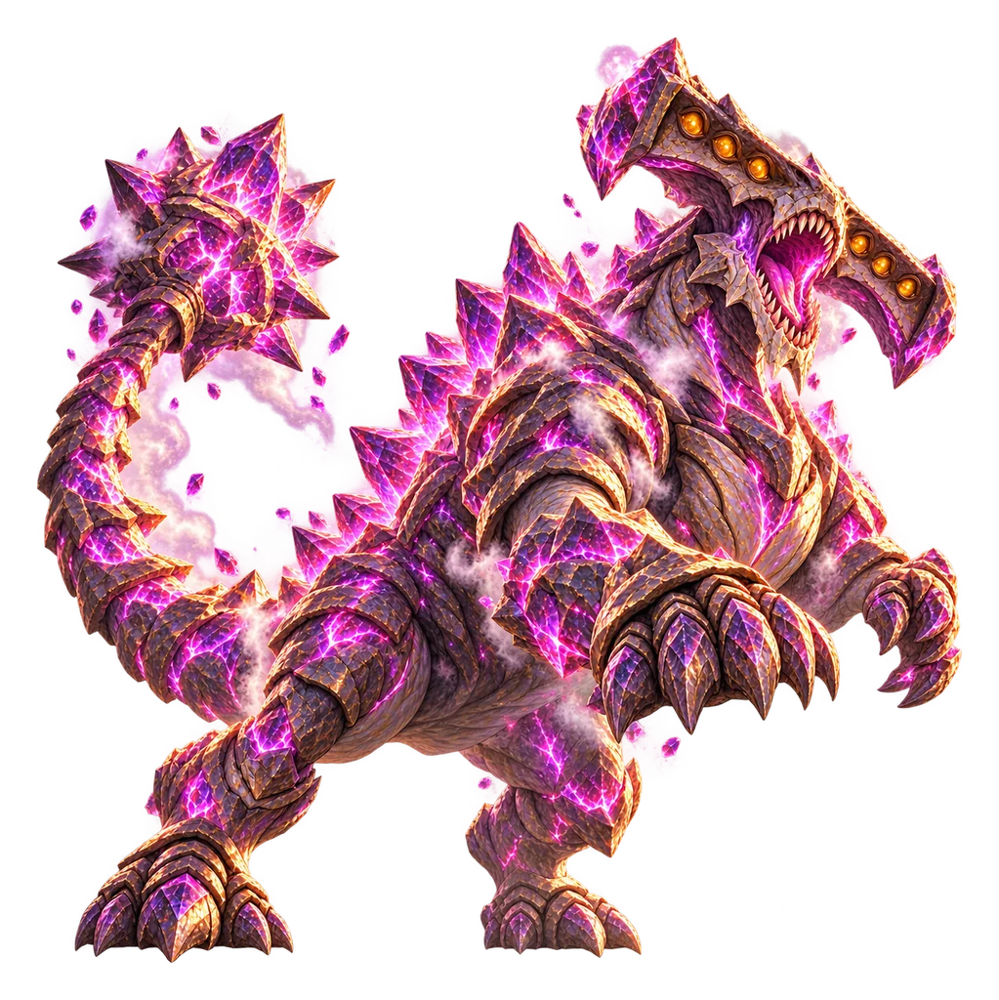

1023×1024; 366 KB. Candidate 1 selected.

- FLAG: Visual review: confirm four legs, hammerhead skull, and six amber eyes; generated anatomy is not clearly faithful to all three requirements.


<details><summary>Generation prompt</summary>

```text
ART STYLE: Lush, luminous digital painting in the spirit of a premium early-2000s Japanese RPG remastered in HD. Semi-realistic, anime-influenced characters with expressive faces and stylish asymmetrical adventure outfits: layered belts, buckles, straps, zippers, one-sleeved jackets, flowing scarves. Sun-drenched tropical environments painted in rich detail: saturated turquoise seas, white sand, emerald jungle, and ancient sandstone ruins carved with softly glowing glyphs. Golden-hour sunlight, with bioluminescent blue-green motes of light drifting through the air. Cinematic, epic and adventurous, with a mischievous sense of humor: witty, characterful expressions and small comedic details hidden in the scene. Mature and cool, never babyish or chibi.

This is an isolated game sprite: render ONLY the subject on a fully transparent background (PNG with alpha). No scenery, no ground, no cast shadow, no frame. Lit from the upper left with a soft rim light, crisp readable silhouette, full body with nothing cropped and clear empty space around it.

A colossal titan beast, a boss monster, facing right: four massive legs, a hammerhead-shaped skull with six glowing amber eyes, and armor plates of cracked geode crystal glowing violet from within, with steam venting from the cracks. Its tail ends in a huge crystal club. Seen from a low angle so it feels enormous.

POSE: rearing up, every crystal blazing red-violet

Output dimensions: 1024x1024. Highest quality. Reference images are identity/style guides, not edit targets. Match character details exactly; the written description controls colors and asymmetry. Keep a generous clear margin around each subject.

Rules: completely original designs; never imitate an existing franchise, character, creature, logo or emblem. No text, letters, numbers, logos, watermarks, signatures, borders or user interface, unless the prompt asks for glowing magic runes. Fierce and intense is great; no blood, gore or wounds.
```

</details>

## boss_geode_titan / splash — draft

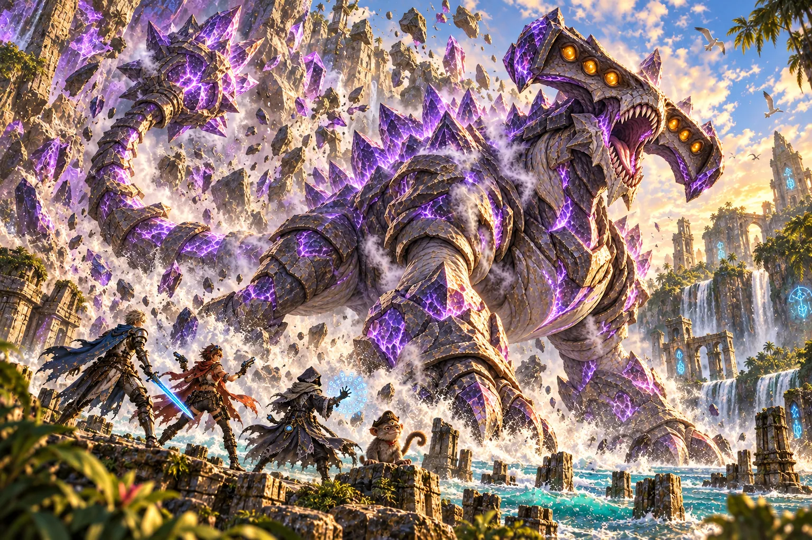

1536×1024; 480 KB. Candidate 1 selected.

- FLAG: Visual review: scenery reads as coastal jungle rather than crystal canyon; check before approval.
- FLAG: Visual review: confirm four legs, hammerhead skull, and six amber eyes; generated anatomy is not clearly faithful to all three requirements.


<details><summary>Generation prompt</summary>

```text
ART STYLE: Lush, luminous digital painting in the spirit of a premium early-2000s Japanese RPG remastered in HD. Semi-realistic, anime-influenced characters with expressive faces and stylish asymmetrical adventure outfits: layered belts, buckles, straps, zippers, one-sleeved jackets, flowing scarves. Sun-drenched tropical environments painted in rich detail: saturated turquoise seas, white sand, emerald jungle, and ancient sandstone ruins carved with softly glowing glyphs. Golden-hour sunlight, with bioluminescent blue-green motes of light drifting through the air. Cinematic, epic and adventurous, with a mischievous sense of humor: witty, characterful expressions and small comedic details hidden in the scene. Mature and cool, never babyish or chibi.

This is a background painting for a 2D game: no characters or creatures unless the prompt asks for them, no user interface. Rich depth, clear foreground, midground and background.

A colossal titan beast, a boss monster, facing right: four massive legs, a hammerhead-shaped skull with six glowing amber eyes, and armor plates of cracked geode crystal glowing violet from within, with steam venting from the cracks. Its tail ends in a huge crystal club. Seen from a low angle so it feels enormous.

The titan bursting out of a crystal canyon wall in a shower of shards, three tiny heroes in foreground for scale. Hide a small three-eyed captain-hat monkey in the scene.

Output dimensions: 1536x1024. Highest quality. Reference images are identity/style guides, not edit targets. Match character details exactly; the written description controls colors and asymmetry. Keep a generous clear margin around each subject.

Rules: completely original designs; never imitate an existing franchise, character, creature, logo or emblem. No text, letters, numbers, logos, watermarks, signatures, borders or user interface, unless the prompt asks for glowing magic runes. Fierce and intense is great; no blood, gore or wounds.
```

</details>

## titan_starter / base — draft

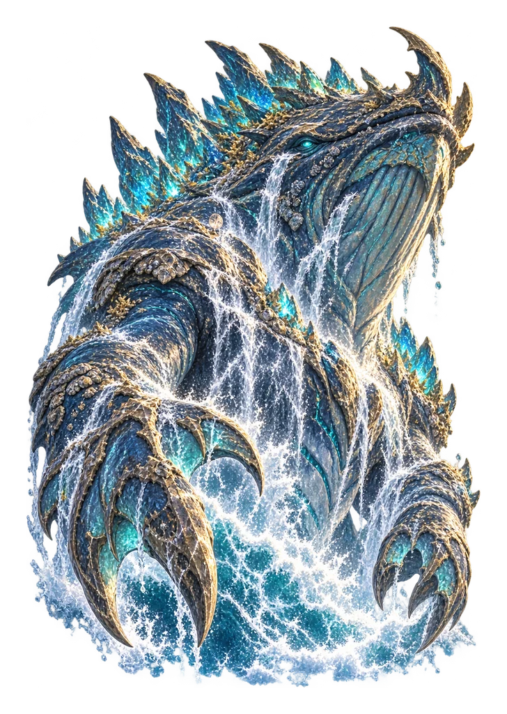

728×1024; 352 KB. Candidate 2 selected.

- FLAG: Visual review: head reads more as a long-snouted creature than a whale; confirm summon design before approval.


<details><summary>Generation prompt</summary>

```text
ART STYLE: Lush, luminous digital painting in the spirit of a premium early-2000s Japanese RPG remastered in HD. Semi-realistic, anime-influenced characters with expressive faces and stylish asymmetrical adventure outfits: layered belts, buckles, straps, zippers, one-sleeved jackets, flowing scarves. Sun-drenched tropical environments painted in rich detail: saturated turquoise seas, white sand, emerald jungle, and ancient sandstone ruins carved with softly glowing glyphs. Golden-hour sunlight, with bioluminescent blue-green motes of light drifting through the air. Cinematic, epic and adventurous, with a mischievous sense of humor: witty, characterful expressions and small comedic details hidden in the scene. Mature and cool, never babyish or chibi.

This is an isolated game sprite: render ONLY the subject on a fully transparent background (PNG with alpha). No scenery, no ground, no cast shadow, no frame. Lit from the upper left with a soft rim light, crisp readable silhouette, full body with nothing cropped and clear empty space around it.

A colossal ancient sea titan, an ally summon, facing the viewer in three-quarter view and shown from the chest up as it rises out of churning white-capped waves: a vast whale-like head and shoulders armored in barnacled stone-blue hide, ridges of glowing teal and gold crystal reef growing along its back and shoulders, two huge webbed and clawed forelimbs streaming seawater, and calm, wise, glowing sea-green eyes. Majestic and protective rather than scary. The waves at the bottom fade out softly so it can rise from the bottom edge of the screen.

Output dimensions: 1024x1536. Highest quality. Reference images are identity/style guides, not edit targets. Match character details exactly; the written description controls colors and asymmetry. Keep a generous clear margin around each subject.

Rules: completely original designs; never imitate an existing franchise, character, creature, logo or emblem. No text, letters, numbers, logos, watermarks, signatures, borders or user interface, unless the prompt asks for glowing magic runes. Fierce and intense is great; no blood, gore or wounds.
```

</details>

## bg_jungle_ruins / base — draft

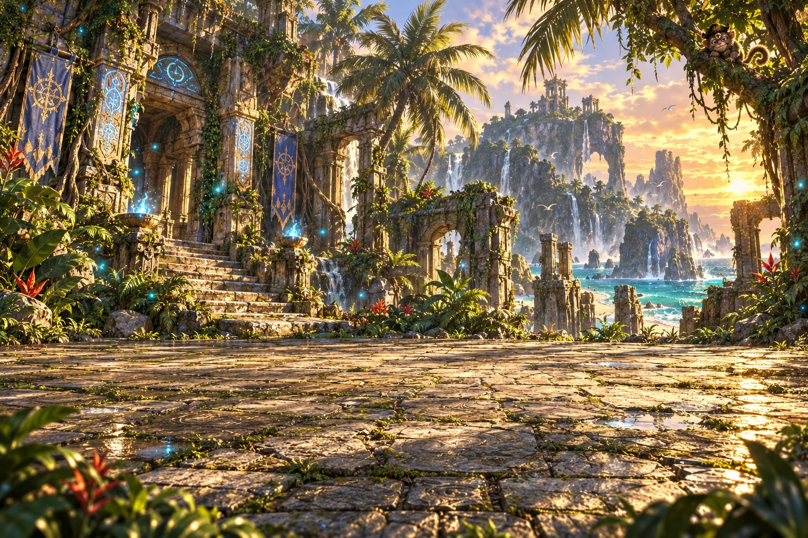

1536×1024; 482 KB. Candidate 1 selected.

- FLAG: Visual review: the hidden three-eyed monkey is not clearly identifiable in the scene.


<details><summary>Generation prompt</summary>

```text
ART STYLE: Lush, luminous digital painting in the spirit of a premium early-2000s Japanese RPG remastered in HD. Semi-realistic, anime-influenced characters with expressive faces and stylish asymmetrical adventure outfits: layered belts, buckles, straps, zippers, one-sleeved jackets, flowing scarves. Sun-drenched tropical environments painted in rich detail: saturated turquoise seas, white sand, emerald jungle, and ancient sandstone ruins carved with softly glowing glyphs. Golden-hour sunlight, with bioluminescent blue-green motes of light drifting through the air. Cinematic, epic and adventurous, with a mischievous sense of humor: witty, characterful expressions and small comedic details hidden in the scene. Mature and cool, never babyish or chibi.

This is a background painting for a 2D game: no characters or creatures unless the prompt asks for them, no user interface. Rich depth, clear foreground, midground and background.

A battle background: a jungle clearing in front of an overgrown sandstone temple carved with softly glowing glyphs, giant ferns and palms, shafts of golden afternoon light, glowing blue-green motes drifting in the air, and a glimpse of turquoise sea through the trees. Hidden somewhere small in the scene: a three-eyed monkey in a tiny captain's hat. Keep the lower third open, stone-paved ground where the fighters will stand.

Output dimensions: 1536x1024. Highest quality. Reference images are identity/style guides, not edit targets. Match character details exactly; the written description controls colors and asymmetry. Keep a generous clear margin around each subject.

Rules: completely original designs; never imitate an existing franchise, character, creature, logo or emblem. No text, letters, numbers, logos, watermarks, signatures, borders or user interface, unless the prompt asks for glowing magic runes. Fierce and intense is great; no blood, gore or wounds.
```

</details>

## bg_crystal_canyon / base — draft

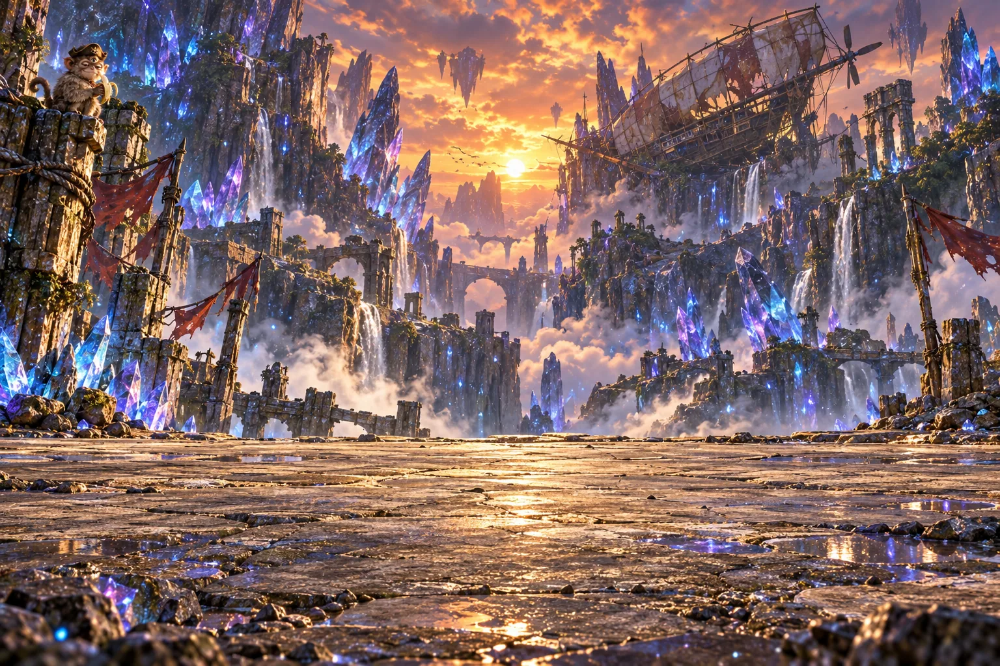

1536×1024; 416 KB. Candidate 1 selected.

- FLAG: Visual review: the hidden three-eyed monkey is not clearly identifiable in the scene.


<details><summary>Generation prompt</summary>

```text
ART STYLE: Lush, luminous digital painting in the spirit of a premium early-2000s Japanese RPG remastered in HD. Semi-realistic, anime-influenced characters with expressive faces and stylish asymmetrical adventure outfits: layered belts, buckles, straps, zippers, one-sleeved jackets, flowing scarves. Sun-drenched tropical environments painted in rich detail: saturated turquoise seas, white sand, emerald jungle, and ancient sandstone ruins carved with softly glowing glyphs. Golden-hour sunlight, with bioluminescent blue-green motes of light drifting through the air. Cinematic, epic and adventurous, with a mischievous sense of humor: witty, characterful expressions and small comedic details hidden in the scene. Mature and cool, never babyish or chibi.

This is a background painting for a 2D game: no characters or creatures unless the prompt asks for them, no user interface. Rich depth, clear foreground, midground and background.

A battle background: a deep canyon of giant glowing violet and blue crystal formations at dusk, with a wrecked sky-pirate airship half-buried in the far cliffs, drifting dust and sparks, and a dramatic orange sky. Hidden somewhere small in the scene: a three-eyed monkey in a tiny captain's hat. Keep the lower third flat, open ground where the fighters will stand.

Output dimensions: 1536x1024. Highest quality. Reference images are identity/style guides, not edit targets. Match character details exactly; the written description controls colors and asymmetry. Keep a generous clear margin around each subject.

Rules: completely original designs; never imitate an existing franchise, character, creature, logo or emblem. No text, letters, numbers, logos, watermarks, signatures, borders or user interface, unless the prompt asks for glowing magic runes. Fierce and intense is great; no blood, gore or wounds.
```

</details>

## fx_slash / sheet — draft

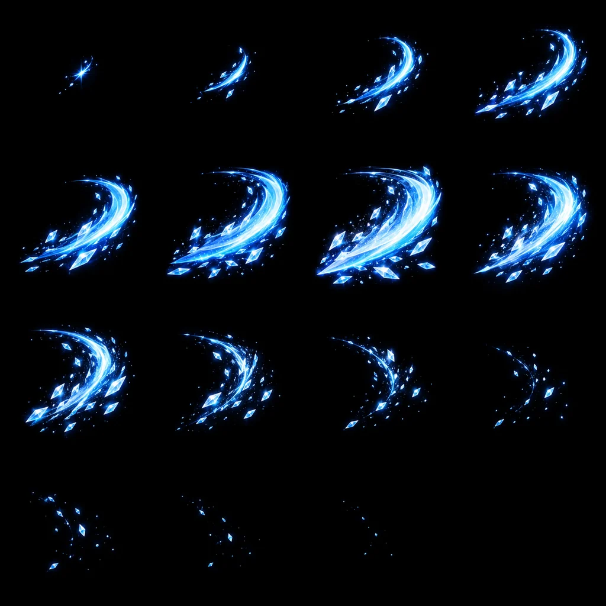

1024×1024; 80 KB. Candidate 1 selected.


<details><summary>Generation prompt</summary>

```text
ART STYLE: Lush, luminous digital painting in the spirit of a premium early-2000s Japanese RPG remastered in HD. Semi-realistic, anime-influenced characters with expressive faces and stylish asymmetrical adventure outfits: layered belts, buckles, straps, zippers, one-sleeved jackets, flowing scarves. Sun-drenched tropical environments painted in rich detail: saturated turquoise seas, white sand, emerald jungle, and ancient sandstone ruins carved with softly glowing glyphs. Golden-hour sunlight, with bioluminescent blue-green motes of light drifting through the air. Cinematic, epic and adventurous, with a mischievous sense of humor: witty, characterful expressions and small comedic details hidden in the scene. Mature and cool, never babyish or chibi.

This is a visual-effects sprite sheet: only the glowing effect itself, on a pure black (#000000) background, so it can be blended additively. No characters, no scenery.

A sword slash: a crescent arc of ice-blue light trailing sparkling crystal shards
A 16-frame animation sprite sheet of the effect described above, in a grid of 4 columns and 4 rows of equal square cells on a pure black (#000000) background, with no grid lines, labels or text. Frames read left to right, top row to bottom row. The effect starts small in frame 1, peaks around frames 6 to 9, and fades completely to black by frame 16. Each frame is centered in its cell with a margin and never crosses into a neighboring cell.

Output dimensions: 1024x1024. Highest quality. Reference images are identity/style guides, not edit targets. Match character details exactly; the written description controls colors and asymmetry. Keep a generous clear margin around each subject.

Rules: completely original designs; never imitate an existing franchise, character, creature, logo or emblem. No text, letters, numbers, logos, watermarks, signatures, borders or user interface, unless the prompt asks for glowing magic runes. Fierce and intense is great; no blood, gore or wounds.
```

</details>

## fx_volley / sheet — draft

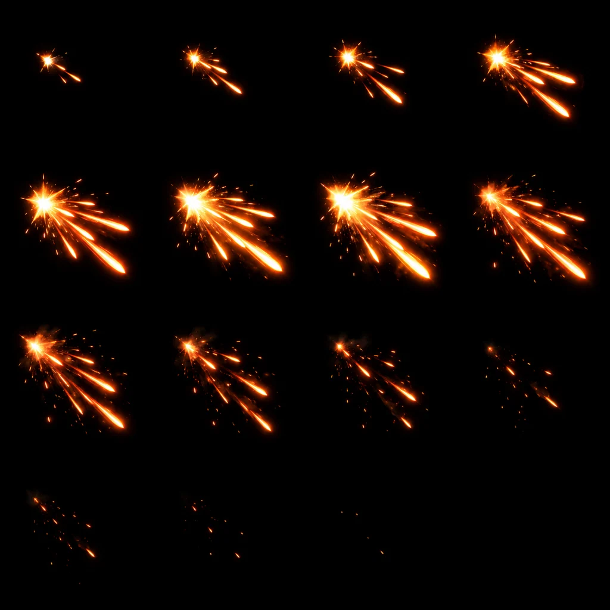

1024×1024; 56 KB. Candidate 1 selected.


<details><summary>Generation prompt</summary>

```text
ART STYLE: Lush, luminous digital painting in the spirit of a premium early-2000s Japanese RPG remastered in HD. Semi-realistic, anime-influenced characters with expressive faces and stylish asymmetrical adventure outfits: layered belts, buckles, straps, zippers, one-sleeved jackets, flowing scarves. Sun-drenched tropical environments painted in rich detail: saturated turquoise seas, white sand, emerald jungle, and ancient sandstone ruins carved with softly glowing glyphs. Golden-hour sunlight, with bioluminescent blue-green motes of light drifting through the air. Cinematic, epic and adventurous, with a mischievous sense of humor: witty, characterful expressions and small comedic details hidden in the scene. Mature and cool, never babyish or chibi.

This is a visual-effects sprite sheet: only the glowing effect itself, on a pure black (#000000) background, so it can be blended additively. No characters, no scenery.

A burst of blaster fire: several orange energy bolts streaking diagonally with small muzzle flashes
A 16-frame animation sprite sheet of the effect described above, in a grid of 4 columns and 4 rows of equal square cells on a pure black (#000000) background, with no grid lines, labels or text. Frames read left to right, top row to bottom row. The effect starts small in frame 1, peaks around frames 6 to 9, and fades completely to black by frame 16. Each frame is centered in its cell with a margin and never crosses into a neighboring cell.

Output dimensions: 1024x1024. Highest quality. Reference images are identity/style guides, not edit targets. Match character details exactly; the written description controls colors and asymmetry. Keep a generous clear margin around each subject.

Rules: completely original designs; never imitate an existing franchise, character, creature, logo or emblem. No text, letters, numbers, logos, watermarks, signatures, borders or user interface, unless the prompt asks for glowing magic runes. Fierce and intense is great; no blood, gore or wounds.
```

</details>

## fx_fire / sheet — draft

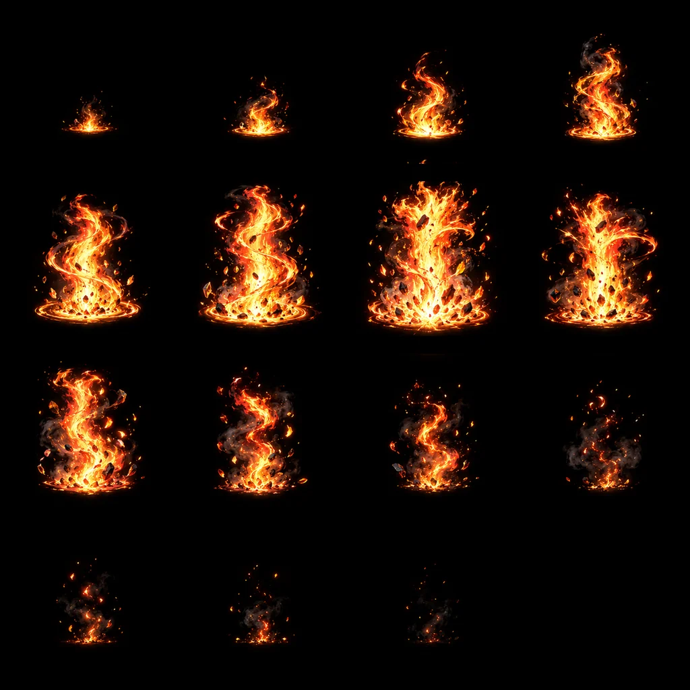

1024×1024; 104 KB. Candidate 3 selected.

- FLAG: frame 2: source content touches cell edge
- FLAG: frame 6: source content touches cell edge
- FLAG: frame 10: source content touches cell edge
- Final effect frame set to pure black for complete fade-out.

<details><summary>Generation prompt</summary>

```text
FINAL SHEET CORRECTION: Every subject must occupy only central 60% of its own cell with very large empty margins. No subject, weapon, hair, glow, or particles can touch any cell boundary. Exact grid, no labels or lines. Battle characters face LEFT in every pose. Preserve reference design. NEW effect sheet: exactly FOUR columns and FOUR rows. SIXTEEN EQUAL cells. Render effects MUCH SMALLER inside each cell: central 60% only, 50 pixels pure black margin on every side. Even the top of lightning bolts must be visible with black above it. No glow, spark or flame touches any cell border. NO lines or borders. Frame 16 totally BLACK.

ART STYLE: Lush, luminous digital painting in the spirit of a premium early-2000s Japanese RPG remastered in HD. Semi-realistic, anime-influenced characters with expressive faces and stylish asymmetrical adventure outfits: layered belts, buckles, straps, zippers, one-sleeved jackets, flowing scarves. Sun-drenched tropical environments painted in rich detail: saturated turquoise seas, white sand, emerald jungle, and ancient sandstone ruins carved with softly glowing glyphs. Golden-hour sunlight, with bioluminescent blue-green motes of light drifting through the air. Cinematic, epic and adventurous, with a mischievous sense of humor: witty, characterful expressions and small comedic details hidden in the scene. Mature and cool, never babyish or chibi.

This is a visual-effects sprite sheet: only the glowing effect itself, on a pure black (#000000) background, so it can be blended additively. No characters, no scenery.

A fire spell: a swirling column of flame erupting upward and bursting
A 16-frame animation sprite sheet of the effect described above, in a grid of 4 columns and 4 rows of equal square cells on a pure black (#000000) background, with no grid lines, labels or text. Frames read left to right, top row to bottom row. The effect starts small in frame 1, peaks around frames 6 to 9, and fades completely to black by frame 16. Each frame is centered in its cell with a margin and never crosses into a neighboring cell.

Output dimensions: 1024x1024. Highest quality. Reference images are identity/style guides, not edit targets. Match character details exactly; the written description controls colors and asymmetry. Keep a generous clear margin around each subject.

Rules: completely original designs; never imitate an existing franchise, character, creature, logo or emblem. No text, letters, numbers, logos, watermarks, signatures, borders or user interface, unless the prompt asks for glowing magic runes. Fierce and intense is great; no blood, gore or wounds.
```

</details>

## fx_ice / sheet — draft

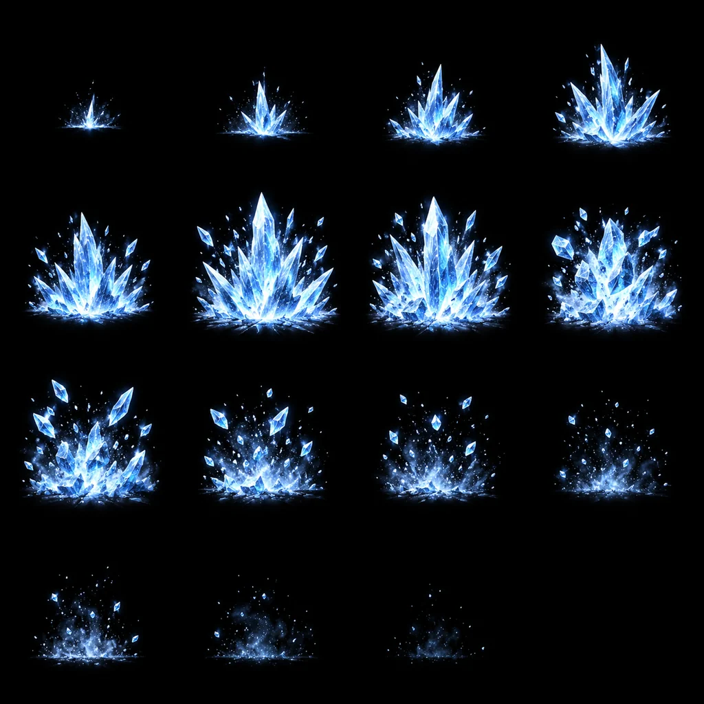

1024×1024; 114 KB. Candidate 2 selected.


<details><summary>Generation prompt</summary>

```text
NEW effect sheet: exactly FOUR columns and FOUR rows. SIXTEEN EQUAL cells. Render effects MUCH SMALLER inside each cell: central 60% only, 50 pixels pure black margin on every side. Even the top of lightning bolts must be visible with black above it. No glow, spark or flame touches any cell border. NO lines or borders. Frame 16 totally BLACK.

ART STYLE: Lush, luminous digital painting in the spirit of a premium early-2000s Japanese RPG remastered in HD. Semi-realistic, anime-influenced characters with expressive faces and stylish asymmetrical adventure outfits: layered belts, buckles, straps, zippers, one-sleeved jackets, flowing scarves. Sun-drenched tropical environments painted in rich detail: saturated turquoise seas, white sand, emerald jungle, and ancient sandstone ruins carved with softly glowing glyphs. Golden-hour sunlight, with bioluminescent blue-green motes of light drifting through the air. Cinematic, epic and adventurous, with a mischievous sense of humor: witty, characterful expressions and small comedic details hidden in the scene. Mature and cool, never babyish or chibi.

This is a visual-effects sprite sheet: only the glowing effect itself, on a pure black (#000000) background, so it can be blended additively. No characters, no scenery.

An ice spell: jagged ice crystals bursting up from the ground, then shattering
A 16-frame animation sprite sheet of the effect described above, in a grid of 4 columns and 4 rows of equal square cells on a pure black (#000000) background, with no grid lines, labels or text. Frames read left to right, top row to bottom row. The effect starts small in frame 1, peaks around frames 6 to 9, and fades completely to black by frame 16. Each frame is centered in its cell with a margin and never crosses into a neighboring cell.

Output dimensions: 1024x1024. Highest quality. Reference images are identity/style guides, not edit targets. Match character details exactly; the written description controls colors and asymmetry. Keep a generous clear margin around each subject.

Rules: completely original designs; never imitate an existing franchise, character, creature, logo or emblem. No text, letters, numbers, logos, watermarks, signatures, borders or user interface, unless the prompt asks for glowing magic runes. Fierce and intense is great; no blood, gore or wounds.
```

</details>

## fx_lightning / sheet — draft

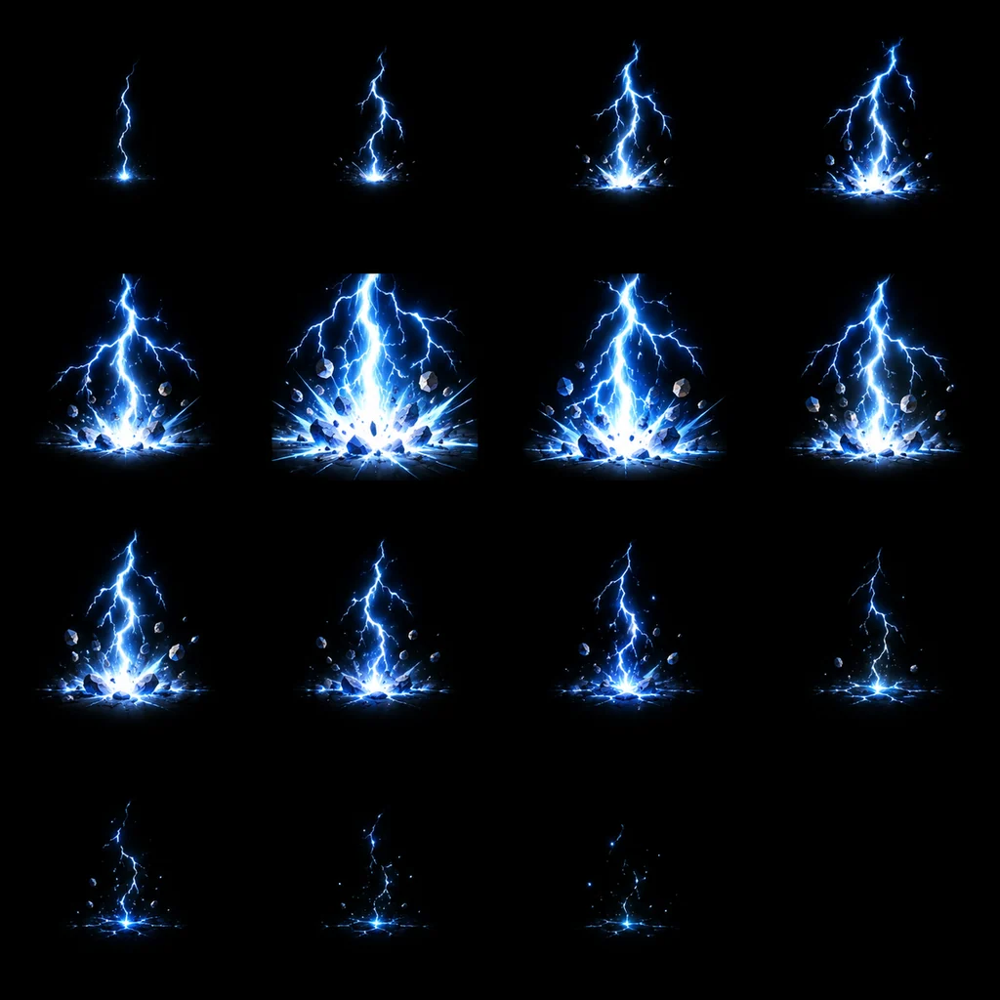

1024×1024; 73 KB. Candidate 2 selected.


- Final effect frame set to pure black for complete fade-out.

<details><summary>Generation prompt</summary>

```text
NEW effect sheet: exactly FOUR columns and FOUR rows. SIXTEEN EQUAL cells. Render effects MUCH SMALLER inside each cell: central 60% only, 50 pixels pure black margin on every side. Even the top of lightning bolts must be visible with black above it. No glow, spark or flame touches any cell border. NO lines or borders. Frame 16 totally BLACK.

ART STYLE: Lush, luminous digital painting in the spirit of a premium early-2000s Japanese RPG remastered in HD. Semi-realistic, anime-influenced characters with expressive faces and stylish asymmetrical adventure outfits: layered belts, buckles, straps, zippers, one-sleeved jackets, flowing scarves. Sun-drenched tropical environments painted in rich detail: saturated turquoise seas, white sand, emerald jungle, and ancient sandstone ruins carved with softly glowing glyphs. Golden-hour sunlight, with bioluminescent blue-green motes of light drifting through the air. Cinematic, epic and adventurous, with a mischievous sense of humor: witty, characterful expressions and small comedic details hidden in the scene. Mature and cool, never babyish or chibi.

This is a visual-effects sprite sheet: only the glowing effect itself, on a pure black (#000000) background, so it can be blended additively. No characters, no scenery.

A lightning spell: a forked bolt striking down with a bright impact flash
A 16-frame animation sprite sheet of the effect described above, in a grid of 4 columns and 4 rows of equal square cells on a pure black (#000000) background, with no grid lines, labels or text. Frames read left to right, top row to bottom row. The effect starts small in frame 1, peaks around frames 6 to 9, and fades completely to black by frame 16. Each frame is centered in its cell with a margin and never crosses into a neighboring cell.

Output dimensions: 1024x1024. Highest quality. Reference images are identity/style guides, not edit targets. Match character details exactly; the written description controls colors and asymmetry. Keep a generous clear margin around each subject.

Rules: completely original designs; never imitate an existing franchise, character, creature, logo or emblem. No text, letters, numbers, logos, watermarks, signatures, borders or user interface, unless the prompt asks for glowing magic runes. Fierce and intense is great; no blood, gore or wounds.
```

</details>

## fx_heal / sheet — draft

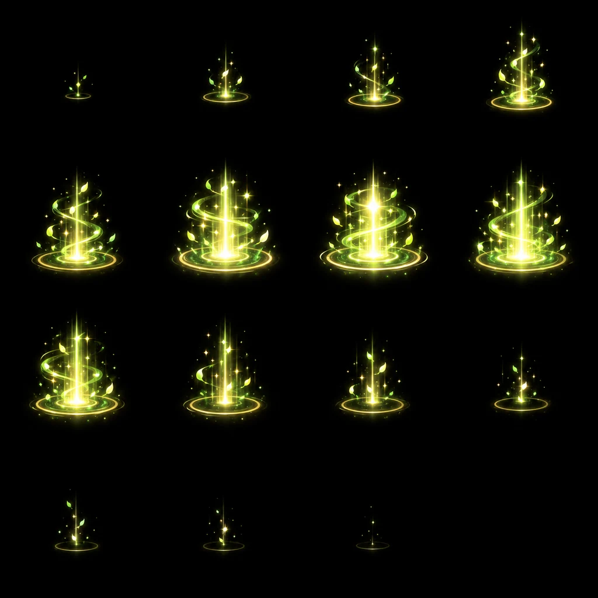

1024×1024; 54 KB. Candidate 2 selected.


<details><summary>Generation prompt</summary>

```text
NEW effect sheet: exactly FOUR columns and FOUR rows. SIXTEEN EQUAL cells. Render effects MUCH SMALLER inside each cell: central 60% only, 50 pixels pure black margin on every side. Even the top of lightning bolts must be visible with black above it. No glow, spark or flame touches any cell border. NO lines or borders. Frame 16 totally BLACK.

ART STYLE: Lush, luminous digital painting in the spirit of a premium early-2000s Japanese RPG remastered in HD. Semi-realistic, anime-influenced characters with expressive faces and stylish asymmetrical adventure outfits: layered belts, buckles, straps, zippers, one-sleeved jackets, flowing scarves. Sun-drenched tropical environments painted in rich detail: saturated turquoise seas, white sand, emerald jungle, and ancient sandstone ruins carved with softly glowing glyphs. Golden-hour sunlight, with bioluminescent blue-green motes of light drifting through the air. Cinematic, epic and adventurous, with a mischievous sense of humor: witty, characterful expressions and small comedic details hidden in the scene. Mature and cool, never babyish or chibi.

This is a visual-effects sprite sheet: only the glowing effect itself, on a pure black (#000000) background, so it can be blended additively. No characters, no scenery.

A healing spell: rising green-gold sparkles and soft expanding light rings
A 16-frame animation sprite sheet of the effect described above, in a grid of 4 columns and 4 rows of equal square cells on a pure black (#000000) background, with no grid lines, labels or text. Frames read left to right, top row to bottom row. The effect starts small in frame 1, peaks around frames 6 to 9, and fades completely to black by frame 16. Each frame is centered in its cell with a margin and never crosses into a neighboring cell.

Output dimensions: 1024x1024. Highest quality. Reference images are identity/style guides, not edit targets. Match character details exactly; the written description controls colors and asymmetry. Keep a generous clear margin around each subject.

Rules: completely original designs; never imitate an existing franchise, character, creature, logo or emblem. No text, letters, numbers, logos, watermarks, signatures, borders or user interface, unless the prompt asks for glowing magic runes. Fierce and intense is great; no blood, gore or wounds.
```

</details>

## fx_defeat_motes / sheet — draft

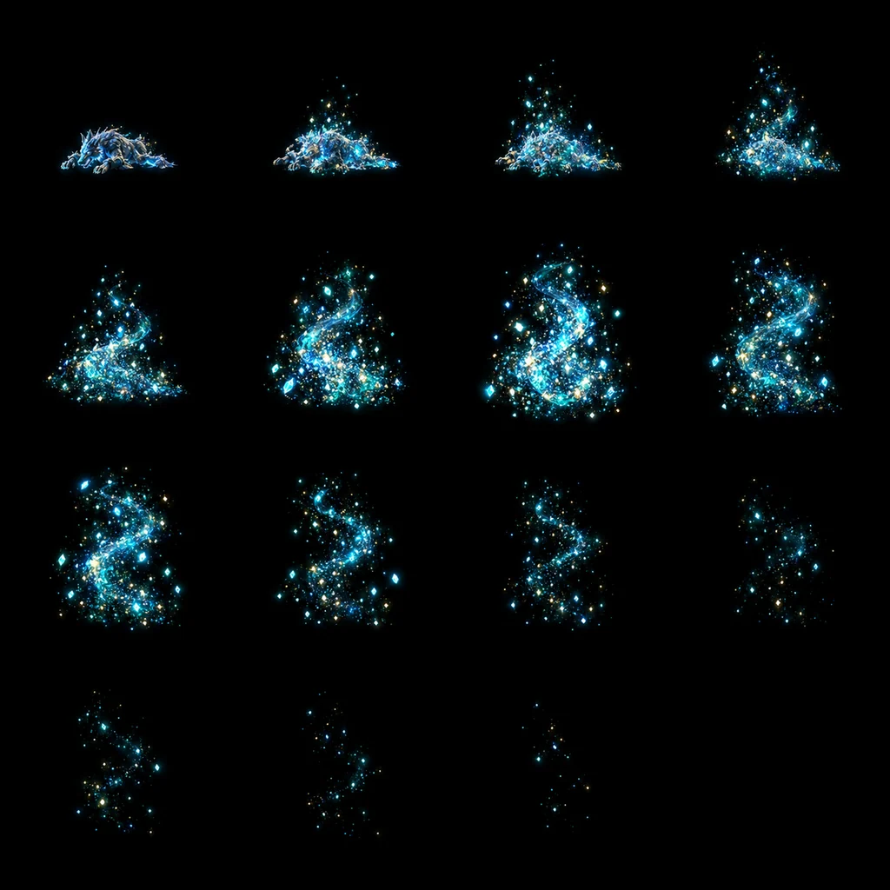

1024×1024; 87 KB. Candidate 3 selected.


- Final effect frame set to pure black for complete fade-out.

<details><summary>Generation prompt</summary>

```text
FINAL SHEET CORRECTION: Every subject must occupy only central 60% of its own cell with very large empty margins. No subject, weapon, hair, glow, or particles can touch any cell boundary. Exact grid, no labels or lines. Battle characters face LEFT in every pose. Preserve reference design. NEW effect sheet: EXACT 4x4 grid, sixteen equal cells, effects SMALL within central 60% of each cell with 50 pixels black margin. Frame 16 totally BLACK.

ART STYLE: Lush, luminous digital painting in the spirit of a premium early-2000s Japanese RPG remastered in HD. Semi-realistic, anime-influenced characters with expressive faces and stylish asymmetrical adventure outfits: layered belts, buckles, straps, zippers, one-sleeved jackets, flowing scarves. Sun-drenched tropical environments painted in rich detail: saturated turquoise seas, white sand, emerald jungle, and ancient sandstone ruins carved with softly glowing glyphs. Golden-hour sunlight, with bioluminescent blue-green motes of light drifting through the air. Cinematic, epic and adventurous, with a mischievous sense of humor: witty, characterful expressions and small comedic details hidden in the scene. Mature and cool, never babyish or chibi.

This is a visual-effects sprite sheet: only the glowing effect itself, on a pure black (#000000) background, so it can be blended additively. No characters, no scenery.

A defeated creature dissolving: a body-shaped cloud of glowing blue-green motes swirling upward and fading
A 16-frame animation sprite sheet of the effect described above, in a grid of 4 columns and 4 rows of equal square cells on a pure black (#000000) background, with no grid lines, labels or text. Frames read left to right, top row to bottom row. The effect starts small in frame 1, peaks around frames 6 to 9, and fades completely to black by frame 16. Each frame is centered in its cell with a margin and never crosses into a neighboring cell.

Output dimensions: 1024x1024. Highest quality. Reference images are identity/style guides, not edit targets. Match character details exactly; the written description controls colors and asymmetry. Keep a generous clear margin around each subject.

Rules: completely original designs; never imitate an existing franchise, character, creature, logo or emblem. No text, letters, numbers, logos, watermarks, signatures, borders or user interface, unless the prompt asks for glowing magic runes. Fierce and intense is great; no blood, gore or wounds.
```

</details>

## fx_capture / sheet — draft

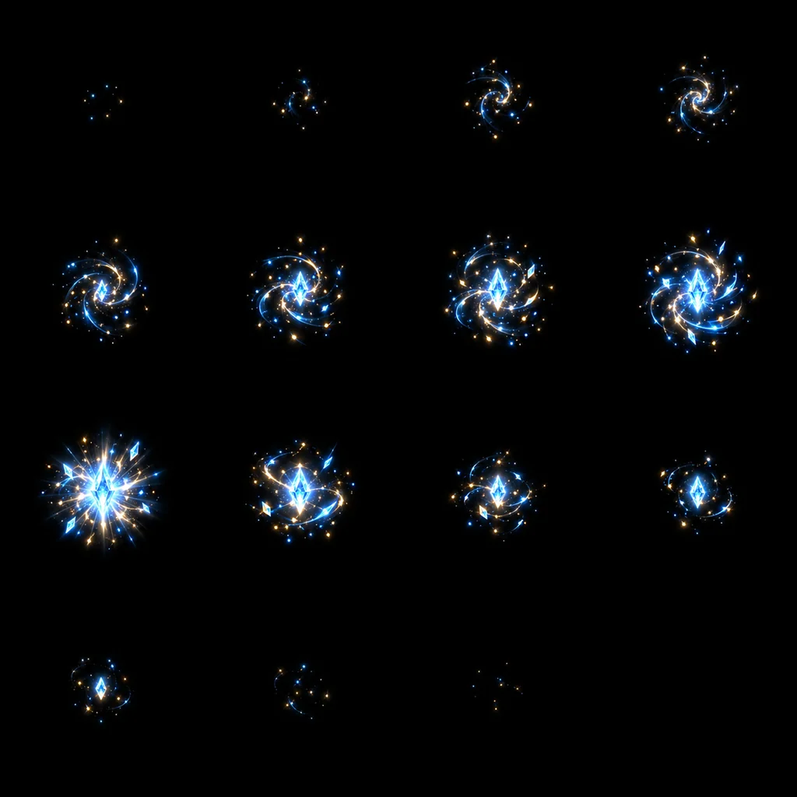

1024×1024; 47 KB. Candidate 3 selected.


- Final effect frame set to pure black for complete fade-out.

<details><summary>Generation prompt</summary>

```text
FINAL SHEET CORRECTION: Every subject must occupy only central 60% of its own cell with very large empty margins. No subject, weapon, hair, glow, or particles can touch any cell boundary. Exact grid, no labels or lines. Battle characters face LEFT in every pose. Preserve reference design. NEW effect sheet: EXACT 4x4 grid, sixteen equal cells, effects SMALL within central 60% of each cell with 50 pixels black margin. Frame 16 totally BLACK.

ART STYLE: Lush, luminous digital painting in the spirit of a premium early-2000s Japanese RPG remastered in HD. Semi-realistic, anime-influenced characters with expressive faces and stylish asymmetrical adventure outfits: layered belts, buckles, straps, zippers, one-sleeved jackets, flowing scarves. Sun-drenched tropical environments painted in rich detail: saturated turquoise seas, white sand, emerald jungle, and ancient sandstone ruins carved with softly glowing glyphs. Golden-hour sunlight, with bioluminescent blue-green motes of light drifting through the air. Cinematic, epic and adventurous, with a mischievous sense of humor: witty, characterful expressions and small comedic details hidden in the scene. Mature and cool, never babyish or chibi.

This is a visual-effects sprite sheet: only the glowing effect itself, on a pure black (#000000) background, so it can be blended additively. No characters, no scenery.

A capture: glowing motes spiraling inward and condensing into a small bright crystal that flashes
A 16-frame animation sprite sheet of the effect described above, in a grid of 4 columns and 4 rows of equal square cells on a pure black (#000000) background, with no grid lines, labels or text. Frames read left to right, top row to bottom row. The effect starts small in frame 1, peaks around frames 6 to 9, and fades completely to black by frame 16. Each frame is centered in its cell with a margin and never crosses into a neighboring cell.

Output dimensions: 1024x1024. Highest quality. Reference images are identity/style guides, not edit targets. Match character details exactly; the written description controls colors and asymmetry. Keep a generous clear margin around each subject.

Rules: completely original designs; never imitate an existing franchise, character, creature, logo or emblem. No text, letters, numbers, logos, watermarks, signatures, borders or user interface, unless the prompt asks for glowing magic runes. Fierce and intense is great; no blood, gore or wounds.
```

</details>

## icons_elements_status / sheet — draft

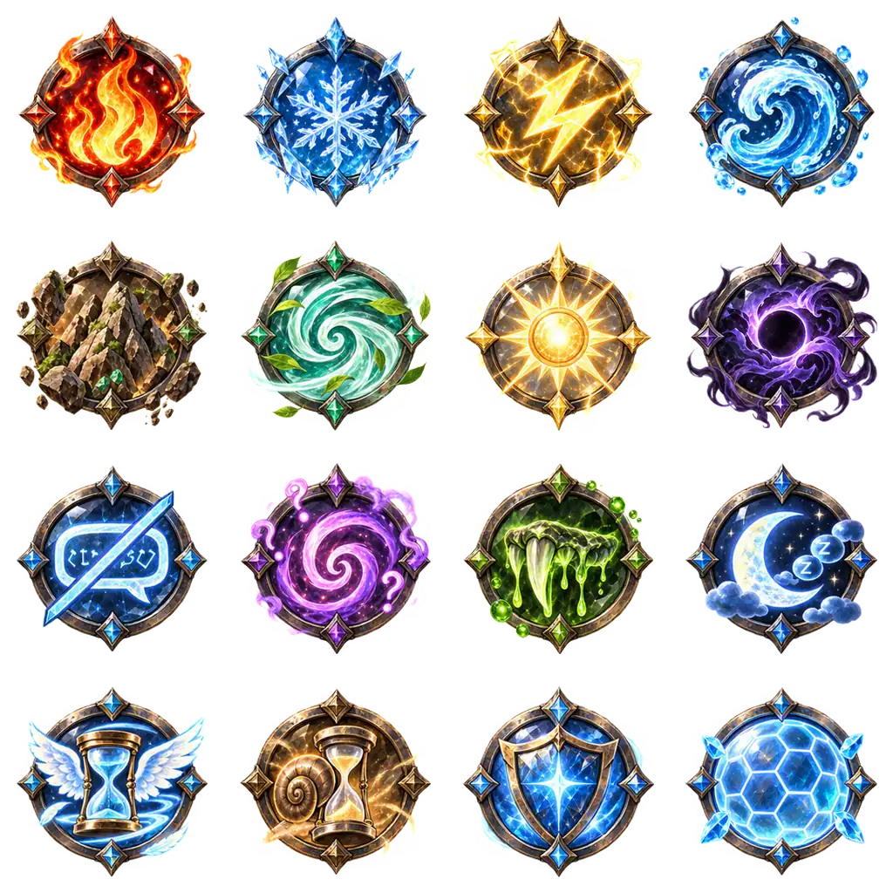

1024×1024; 297 KB. Candidate 3 selected.


<details><summary>Generation prompt</summary>

```text
FINAL SHEET CORRECTION: Every subject must occupy only central 60% of its own cell with very large empty margins. No subject, weapon, hair, glow, or particles can touch any cell boundary. Exact grid, no labels or lines. Battle characters face LEFT in every pose. Preserve reference design. NEW icon sheet: EXACT 4x4 grid, sixteen equal cells, icons must be SMALL circular emblems occupying only the middle 60% of each cell, 50 pixels transparent margin. No ornament, glow or crystal may touch cell boundaries.

ART STYLE: Lush, luminous digital painting in the spirit of a premium early-2000s Japanese RPG remastered in HD. Semi-realistic, anime-influenced characters with expressive faces and stylish asymmetrical adventure outfits: layered belts, buckles, straps, zippers, one-sleeved jackets, flowing scarves. Sun-drenched tropical environments painted in rich detail: saturated turquoise seas, white sand, emerald jungle, and ancient sandstone ruins carved with softly glowing glyphs. Golden-hour sunlight, with bioluminescent blue-green motes of light drifting through the air. Cinematic, epic and adventurous, with a mischievous sense of humor: witty, characterful expressions and small comedic details hidden in the scene. Mature and cool, never babyish or chibi.

This is an isolated game sprite: render ONLY the subject on a fully transparent background (PNG with alpha). No scenery, no ground, no cast shadow, no frame. Lit from the upper left with a soft rim light, crisp readable silhouette, full body with nothing cropped and clear empty space around it.

A sheet of 16 game icons in a grid of 4 columns and 4 rows of equal square cells, on a fully transparent background, with no grid lines, labels or text. Every icon is a glowing crystal emblem set in a dark metal rim, in the same size, style and lighting, with a bold silhouette that reads at small size. Icons in reading order, left to right, top to bottom: fire, ice, lightning, water, earth, wind, light, shadow, silence (a crossed-out speech bubble made of runes), confusion (a spiral), poison (a dripping fang), sleep (a crescent moon), haste (a winged hourglass), slow (a snail-shell hourglass), protect (a shield), barrier (a hexagon dome).

Output dimensions: 1024x1024. Highest quality. Reference images are identity/style guides, not edit targets. Match character details exactly; the written description controls colors and asymmetry. Keep a generous clear margin around each subject.

Rules: completely original designs; never imitate an existing franchise, character, creature, logo or emblem. No text, letters, numbers, logos, watermarks, signatures, borders or user interface, unless the prompt asks for glowing magic runes. Fierce and intense is great; no blood, gore or wounds.
```

</details>

