# Wave 02 art review

All 20 planned assets generated with built-in imagegen. Everything stays **draft** for parent-and-child review. No game code changed. Guide references were passed in the order recorded below; no copied guide labels, grids, color blocks, or construction outlines were visible in the selected art. Each failed image received at most three attempts.

## Review notes

- **ui_icons_commands / sheet**: frame 0: source touches cell edge; frame 4: source touches cell edge
- **fiend_dominion_drone / portrait**: After three attempts, more machinery remains visible than the requested close front portrait; review crop.
- **bg_jungle_ruins / fg**: After three attempts, source extends outside guide regions. Export uses a feathered guide mask; review prop silhouettes and fading in the composite.
- **bg_crystal_canyon / fg**: After three attempts, source extends outside guide regions. Export uses a feathered guide mask; review prop silhouettes and fading in the composite.
- **bg_shipwreck_cove / base**: After three attempts, the painted floor boundary is approximately y=580 rather than guide y=614. Attempt 2 is the closest. Check the arena composition before approval.
- **bg_shipwreck_cove / fg**: After three attempts, source extends outside guide regions. Export uses a feathered guide mask; review prop silhouettes and fading in the composite.
- **fx_splash / sheet**: frame 2: source touches cell edge; frame 6: source touches cell edge
- **fx_roar / sheet**: frame 3: source touches cell edge; frame 6: source touches cell edge; frame 7: source touches cell edge; frame 9: source touches cell edge

Foregrounds are shown alone on a checkerboard and composited over their own backgrounds. Portrait previews use the guide circle at (512,400), radius 250. Original selected WebPs are linked below each preview. Checkboxes in the wave mean generated, not approved.

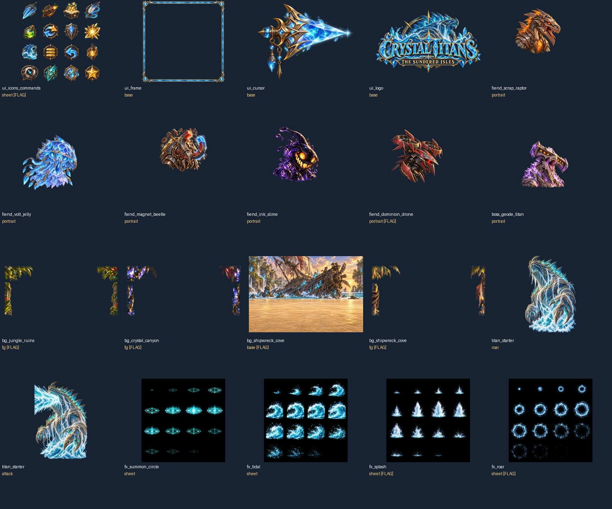

## ui_icons_commands / sheet — draft

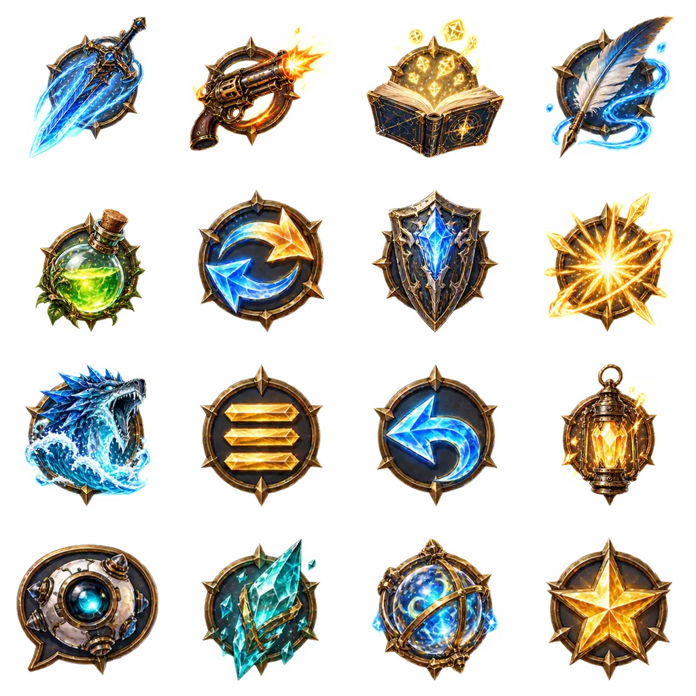

1024×1024; 295 KB. Selected attempt 2.

Guide QA: no visible construction lines, labels, dashed outlines or colored guide blocks.

- FLAG: frame 0: source touches cell edge
- FLAG: frame 4: source touches cell edge
- Attempt 2 selected after three attempts: fewer source-edge issues than attempt 3.

<details><summary>References and generation prompt</summary>

References, in order:

1. `public/assets/anchors/key_art.webp`
2. `public/assets/anchors/cast_lineup.webp`
3. `art/guides/icon_sheet.png`

```text
ART STYLE: Lush, luminous digital painting in the spirit of a premium early-2000s Japanese RPG remastered in HD. Semi-realistic, anime-influenced characters with expressive faces and stylish asymmetrical adventure outfits: layered belts, buckles, straps, zippers, one-sleeved jackets, flowing scarves. Sun-drenched tropical environments painted in rich detail: saturated turquoise seas, white sand, emerald jungle, and ancient sandstone ruins carved with softly glowing glyphs. Golden-hour sunlight, with bioluminescent blue-green motes of light drifting through the air. Cinematic, epic and adventurous, with a mischievous sense of humor: witty, characterful expressions and small comedic details hidden in the scene. Mature and cool, never babyish or chibi.

This is an isolated game sprite: render ONLY the subject on a fully transparent background (PNG with alpha). No scenery, no ground, no cast shadow, no frame. Lit from the upper left with a soft rim light, crisp readable silhouette, full body with nothing cropped and clear empty space around it.

A sheet of 16 game icons in a grid of 4 columns and 4 rows of equal square cells, on a fully transparent background, with no grid lines, labels or text. Every icon is a glowing crystal emblem set in a dark metal rim, in the same size, style and lighting, with a bold silhouette that reads at small size. Icons in reading order, left to right, top to bottom: **strike**: a crystal greatsword with an ice-blue glowing edge · **fire**: a brass steampunk blaster with an orange muzzle flash · **cast**: an open spellbook with golden rune-letters rising from it · **lash**: a glowing quill whose ink trail curls like a whip · **potion**: a round glass flask of glowing green-gold liquid with a cork · **swap**: two curved arrows chasing each other in a circle · **guard**: a tower shield with a glowing crystal core · **overdrive**: a burst of golden energy with sharp rays · **summon**: a sea titan's crested head rising out of a curling wave · **menu**: three short horizontal gold bars · **back**: a curved arrow pointing left · **hint**: a lit crystal lantern · **talk**: a round droid lens-eye inside a speech-bubble shape · **shard**: a small faceted teal lore-shard crystal · **capture**: a capture crystal with swirling light trapped inside · **star**: a five-pointed gold star
.

The attached guide image is a construction drawing: use it only for layout (where the floor, horizon, characters or cells are). Do not reproduce any of its lines, colors, shapes, labels or text.

Each of the sixteen icons must be a SMALL emblem centered in its cell, no more than 180 pixels wide or tall on the 1024px sheet. Leave at least 38px completely empty transparent padding on all four sides of every 256px cell. Never touch a cell boundary. NO guide circles, guide crosses, gridlines, names, or labels.

OUTPUT: 1024x1024. Genuine transparent alpha background.

Rules: completely original designs; never imitate an existing franchise, character, creature, logo or emblem. No text, letters, numbers, logos, watermarks, signatures, borders or user interface, unless the prompt asks for glowing magic runes. Fierce and intense is great; no blood, gore or wounds.
```

</details>

## ui_frame / base — draft

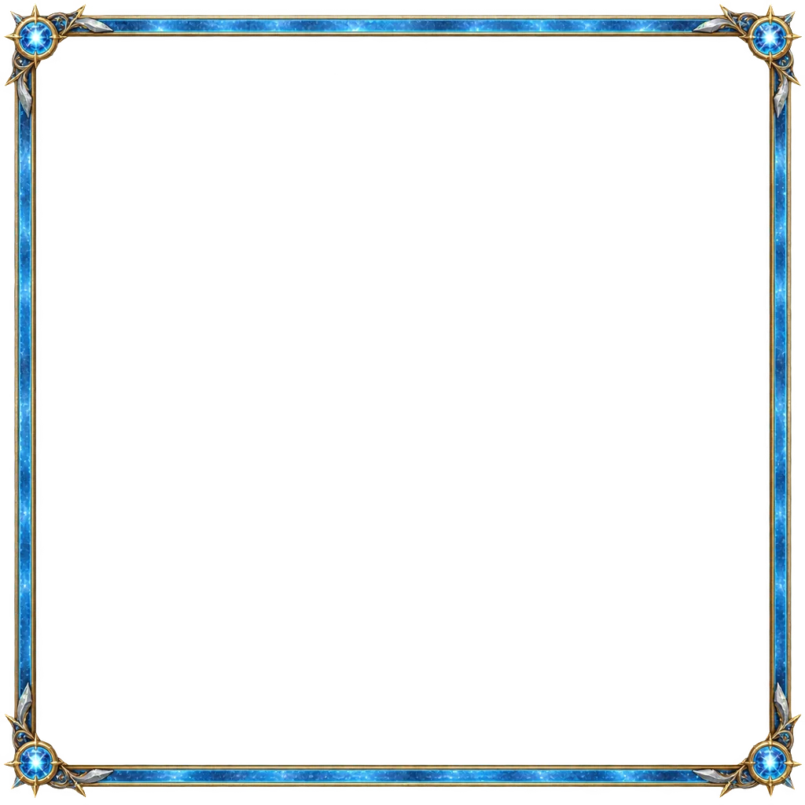

1024×1024; 101 KB. Selected attempt 3.

Guide QA: no visible construction lines, labels, dashed outlines or colored guide blocks.

- Center masked to exact alpha zero at x/y 96..927; full 1024px canvas retained for 9-slicing.

<details><summary>References and generation prompt</summary>

References, in order:

1. `public/assets/anchors/key_art.webp`
2. `public/assets/anchors/cast_lineup.webp`
3. `art/guides/frame_9slice.png`

```text
ART STYLE: Lush, luminous digital painting in the spirit of a premium early-2000s Japanese RPG remastered in HD. Semi-realistic, anime-influenced characters with expressive faces and stylish asymmetrical adventure outfits: layered belts, buckles, straps, zippers, one-sleeved jackets, flowing scarves. Sun-drenched tropical environments painted in rich detail: saturated turquoise seas, white sand, emerald jungle, and ancient sandstone ruins carved with softly glowing glyphs. Golden-hour sunlight, with bioluminescent blue-green motes of light drifting through the air. Cinematic, epic and adventurous, with a mischievous sense of humor: witty, characterful expressions and small comedic details hidden in the scene. Mature and cool, never babyish or chibi.

This is an isolated game sprite: render ONLY the subject on a fully transparent background (PNG with alpha). No scenery, no ground, no cast shadow, no frame. Lit from the upper left with a soft rim light, crisp readable silhouette, full body with nothing cropped and clear empty space around it.

A decorative rectangular window frame for a fantasy RPG menu, seen perfectly straight on: a narrow band of polished silver-and-gold metal trim with a thin inner line of glowing ice-blue crystal, over a dark navy glass border. Small crystal-and-filigree ornaments sit in the four corners only. The straight edges between the corners are a plain, even band that can be stretched without looking wrong. The frame reaches the image edges, stays inside the outer 96 pixels, and the whole center is completely empty and transparent.

The attached guide image is a construction drawing: use it only for layout (where the floor, horizon, characters or cells are). Do not reproduce any of its lines, colors, shapes, labels or text.

FINAL FRAME GEOMETRY: The four tiny corner jewels are only 24px in diameter, centered at (48,48), (976,48), (48,976), (976,976). Every flourish must fit inside its own 96x96 corner. The joining edges are a thin straight 24px-wide band at x=0 or1023 / y=0 or1023. Leave the entire inner 832x832 square fully transparent. No large starburst corners, inward ornaments or spikes. No guide diagrams or labels.

OUTPUT: 1024x1024. Genuine transparent alpha background.

Rules: completely original designs; never imitate an existing franchise, character, creature, logo or emblem. No text, letters, numbers, logos, watermarks, signatures, borders or user interface, unless the prompt asks for glowing magic runes. Fierce and intense is great; no blood, gore or wounds.
```

</details>

## ui_cursor / base — draft

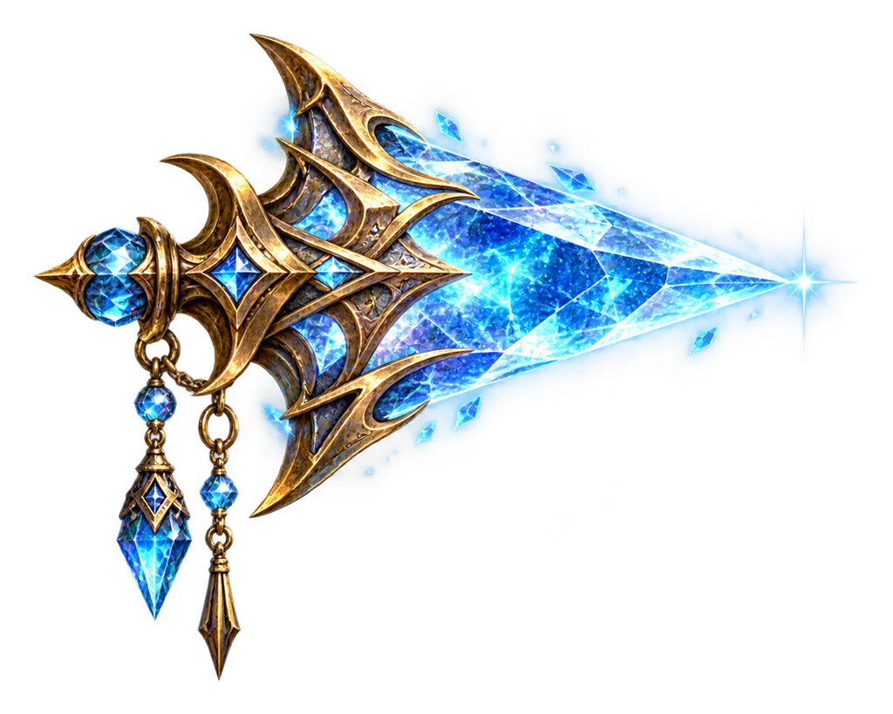

1024×820; 211 KB. Selected attempt 1.

- Hotspot measured at the rightmost solid pointer tip.

<details><summary>References and generation prompt</summary>

References, in order:

1. `public/assets/anchors/key_art.webp`
2. `public/assets/anchors/cast_lineup.webp`

```text
ART STYLE: Lush, luminous digital painting in the spirit of a premium early-2000s Japanese RPG remastered in HD. Semi-realistic, anime-influenced characters with expressive faces and stylish asymmetrical adventure outfits: layered belts, buckles, straps, zippers, one-sleeved jackets, flowing scarves. Sun-drenched tropical environments painted in rich detail: saturated turquoise seas, white sand, emerald jungle, and ancient sandstone ruins carved with softly glowing glyphs. Golden-hour sunlight, with bioluminescent blue-green motes of light drifting through the air. Cinematic, epic and adventurous, with a mischievous sense of humor: witty, characterful expressions and small comedic details hidden in the scene. Mature and cool, never babyish or chibi.

This is an isolated game sprite: render ONLY the subject on a fully transparent background (PNG with alpha). No scenery, no ground, no cast shadow, no frame. Lit from the upper left with a soft rim light, crisp readable silhouette, full body with nothing cropped and clear empty space around it.

A menu cursor for a classic RPG: a sleek, sharp crystal shard set in an ornate gold cap, pointing to the RIGHT, glowing ice-blue from inside, with a tiny sparkle at its tip. One object, no hand.

OUTPUT: 1024x1024. Genuine transparent alpha background.

Rules: completely original designs; never imitate an existing franchise, character, creature, logo or emblem. No text, letters, numbers, logos, watermarks, signatures, borders or user interface, unless the prompt asks for glowing magic runes. Fierce and intense is great; no blood, gore or wounds.
```

</details>

## ui_logo / base — draft

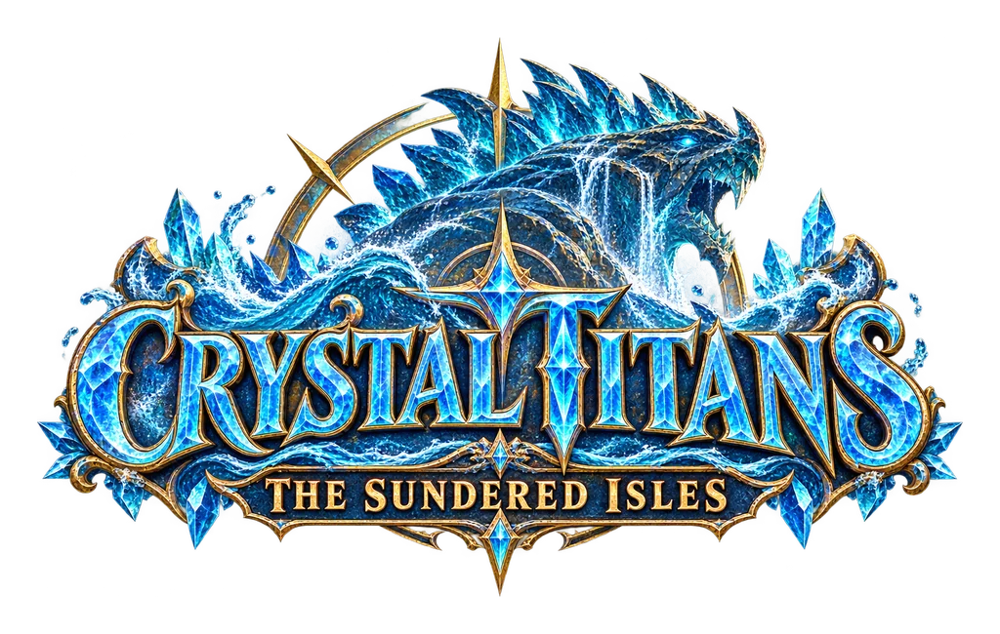

1024×650; 248 KB. Selected attempt 3.


<details><summary>References and generation prompt</summary>

References, in order:

1. `public/assets/anchors/key_art.webp`
2. `public/assets/anchors/cast_lineup.webp`

```text
ART STYLE: Lush, luminous digital painting in the spirit of a premium early-2000s Japanese RPG remastered in HD. Semi-realistic, anime-influenced characters with expressive faces and stylish asymmetrical adventure outfits: layered belts, buckles, straps, zippers, one-sleeved jackets, flowing scarves. Sun-drenched tropical environments painted in rich detail: saturated turquoise seas, white sand, emerald jungle, and ancient sandstone ruins carved with softly glowing glyphs. Golden-hour sunlight, with bioluminescent blue-green motes of light drifting through the air. Cinematic, epic and adventurous, with a mischievous sense of humor: witty, characterful expressions and small comedic details hidden in the scene. Mature and cool, never babyish or chibi.

This is an isolated game sprite: render ONLY the subject on a fully transparent background (PNG with alpha). No scenery, no ground, no cast shadow, no frame. Lit from the upper left with a soft rim light, crisp readable silhouette, full body with nothing cropped and clear empty space around it.

A video game title logo: the words CRYSTAL TITANS in huge, bold, chiseled letters of faceted ice-blue crystal with gold edges and a bright inner glow, with the silhouette of a colossal sea titan's crested head rising behind the letters, and THE SUNDERED ISLES in smaller, elegant gold capitals underneath. Centered, with clear empty space around it, on a fully transparent background.

FINAL LOGO COMPOSITION: Draw the COMPLETE title emblem as a compact centered object occupying only the central 70% of the 1536x1024 canvas. Leave at least 160px empty alpha space on the left and right, and 100px above and below. BOTH text lines, every letter and ornament must fit inside those margins. ONLY CRYSTAL TITANS and THE SUNDERED ISLES, no humans, monkey, droid or scenery. Exact uppercase spelling. Transparent.

OUTPUT: 1536x1024. Genuine transparent alpha background.

Rules: completely original designs; never imitate an existing franchise, character, creature, logo or emblem. The only text is CRYSTAL TITANS and THE SUNDERED ISLES, spelled exactly like that. Fierce and intense is great; no blood, gore or wounds.
```

</details>

## fiend_scrap_raptor / portrait — draft

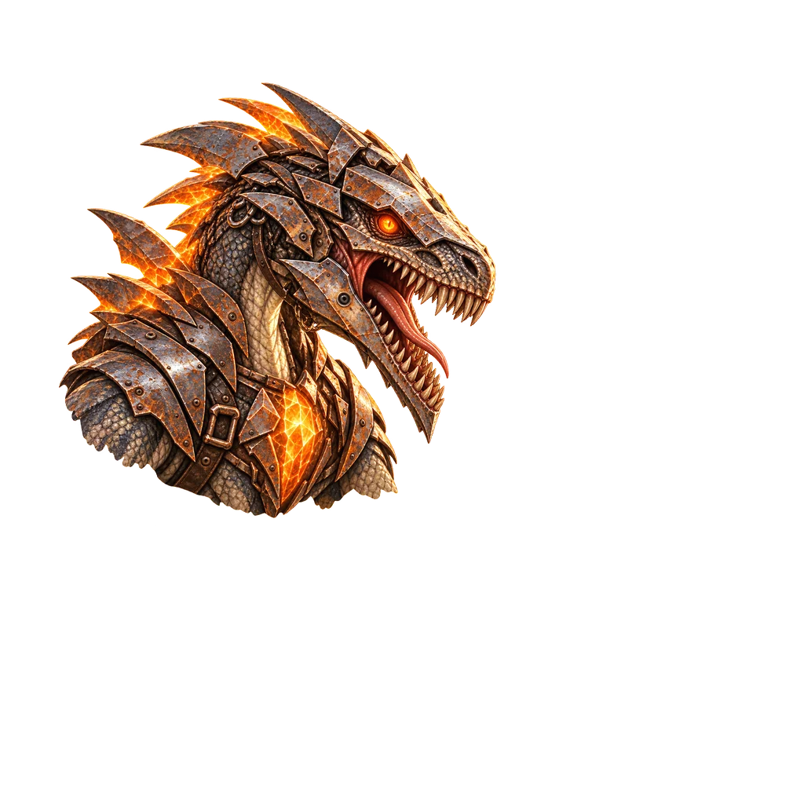

Guide-circle preview: 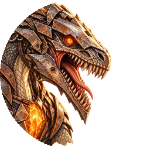

1024×1024; 157 KB. Selected attempt 3.

Guide QA: no visible construction lines, labels, dashed outlines or colored guide blocks.

- Portrait resized and registered to place the face inside the guide circle; original creature design preserved.
- Guide registration: scale 0.6, offset (45, 68); facial center mapped to (512,400).

<details><summary>References and generation prompt</summary>

References, in order:

1. `public/assets/fiends/fiend_scrap_raptor/base.webp`
2. `art/guides/portrait.png`

```text
ART STYLE: Lush, luminous digital painting in the spirit of a premium early-2000s Japanese RPG remastered in HD. Semi-realistic, anime-influenced characters with expressive faces and stylish asymmetrical adventure outfits: layered belts, buckles, straps, zippers, one-sleeved jackets, flowing scarves. Sun-drenched tropical environments painted in rich detail: saturated turquoise seas, white sand, emerald jungle, and ancient sandstone ruins carved with softly glowing glyphs. Golden-hour sunlight, with bioluminescent blue-green motes of light drifting through the air. Cinematic, epic and adventurous, with a mischievous sense of humor: witty, characterful expressions and small comedic details hidden in the scene. Mature and cool, never babyish or chibi.

This is an isolated game sprite: render ONLY the subject on a fully transparent background (PNG with alpha). No scenery, no ground, no cast shadow, no frame. Lit from the upper left with a soft rim light, crisp readable silhouette, full body with nothing cropped and clear empty space around it.

A head-and-shoulders portrait of this scrap-metal raptor, jaws half open, glowing orange chest crystal just visible, menacing glare. Match the attached creature reference exactly. Head and shoulders, three-quarters toward the RIGHT; eyes and mouth centered around (512,400) inside the guide circle. No circles, guide marks or typography.

The attached guide image is a construction drawing: use it only for layout (where the floor, horizon, characters or cells are). Do not reproduce any of its lines, colors, shapes, labels or text.

FINAL PORTRAIT LAYOUT: Make the creature a COMPACT HEAD-AND-SHOULDERS BUST, only 600px tall, from y=100 to y=700 on the 1024 square. Center the bust horizontally at x=512. Do not enlarge it to fill the canvas. Its eyes sit around x=420..600, y=320; its entire mouth sits around x=500, y=480. Both eyes and mouth must be inside the guide's central circle. Slight three-quarter turn toward RIGHT, about 10 degrees, NOT a side profile. No legs, full body, long tendrils, tail or shoulders dominating the picture. Everything around the compact bust is alpha transparent. NEVER draw a circle, dashed line, rectangle, text, label or guide colors.

OUTPUT: 1024x1024. Genuine transparent alpha background.

Rules: completely original designs; never imitate an existing franchise, character, creature, logo or emblem. No text, letters, numbers, logos, watermarks, signatures, borders or user interface, unless the prompt asks for glowing magic runes. Fierce and intense is great; no blood, gore or wounds.
```

</details>

## fiend_volt_jelly / portrait — draft

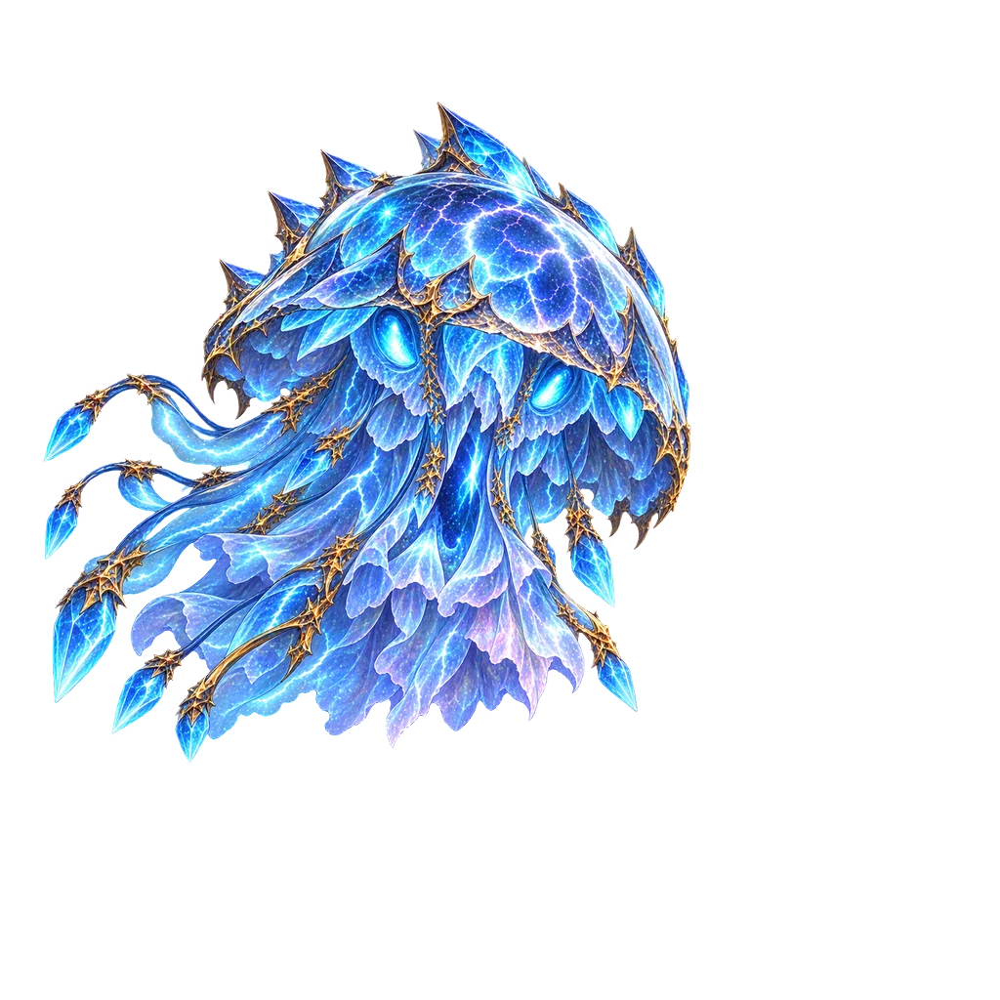

Guide-circle preview: 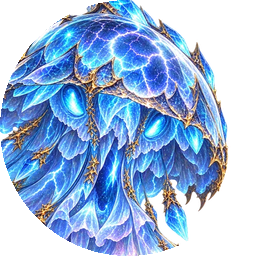

1024×1024; 230 KB. Selected attempt 3.

Guide QA: no visible construction lines, labels, dashed outlines or colored guide blocks.

- Portrait resized and registered to place the face inside the guide circle; original creature design preserved.
- Guide registration: scale 0.7, offset (10, 77); facial center mapped to (512,400).

<details><summary>References and generation prompt</summary>

References, in order:

1. `public/assets/fiends/fiend_volt_jelly/base.webp`
2. `art/guides/portrait.png`

```text
ART STYLE: Lush, luminous digital painting in the spirit of a premium early-2000s Japanese RPG remastered in HD. Semi-realistic, anime-influenced characters with expressive faces and stylish asymmetrical adventure outfits: layered belts, buckles, straps, zippers, one-sleeved jackets, flowing scarves. Sun-drenched tropical environments painted in rich detail: saturated turquoise seas, white sand, emerald jungle, and ancient sandstone ruins carved with softly glowing glyphs. Golden-hour sunlight, with bioluminescent blue-green motes of light drifting through the air. Cinematic, epic and adventurous, with a mischievous sense of humor: witty, characterful expressions and small comedic details hidden in the scene. Mature and cool, never babyish or chibi.

This is an isolated game sprite: render ONLY the subject on a fully transparent background (PNG with alpha). No scenery, no ground, no cast shadow, no frame. Lit from the upper left with a soft rim light, crisp readable silhouette, full body with nothing cropped and clear empty space around it.

A close portrait of this crystal jellyfish's bell and upper tendrils, lightning crackling inside, its glowing eye-spots large and clear. Match the attached creature reference exactly. Head and shoulders, three-quarters toward the RIGHT; eyes and mouth centered around (512,400) inside the guide circle. No circles, guide marks or typography.

The attached guide image is a construction drawing: use it only for layout (where the floor, horizon, characters or cells are). Do not reproduce any of its lines, colors, shapes, labels or text.

FINAL PORTRAIT LAYOUT: Make the creature a COMPACT HEAD-AND-SHOULDERS BUST, only 600px tall, from y=100 to y=700 on the 1024 square. Center the bust horizontally at x=512. Do not enlarge it to fill the canvas. Its eyes sit around x=420..600, y=320; its entire mouth sits around x=500, y=480. Both eyes and mouth must be inside the guide's central circle. Slight three-quarter turn toward RIGHT, about 10 degrees, NOT a side profile. No legs, full body, long tendrils, tail or shoulders dominating the picture. Everything around the compact bust is alpha transparent. NEVER draw a circle, dashed line, rectangle, text, label or guide colors.

OUTPUT: 1024x1024. Genuine transparent alpha background.

Rules: completely original designs; never imitate an existing franchise, character, creature, logo or emblem. No text, letters, numbers, logos, watermarks, signatures, borders or user interface, unless the prompt asks for glowing magic runes. Fierce and intense is great; no blood, gore or wounds.
```

</details>

## fiend_magnet_beetle / portrait — draft

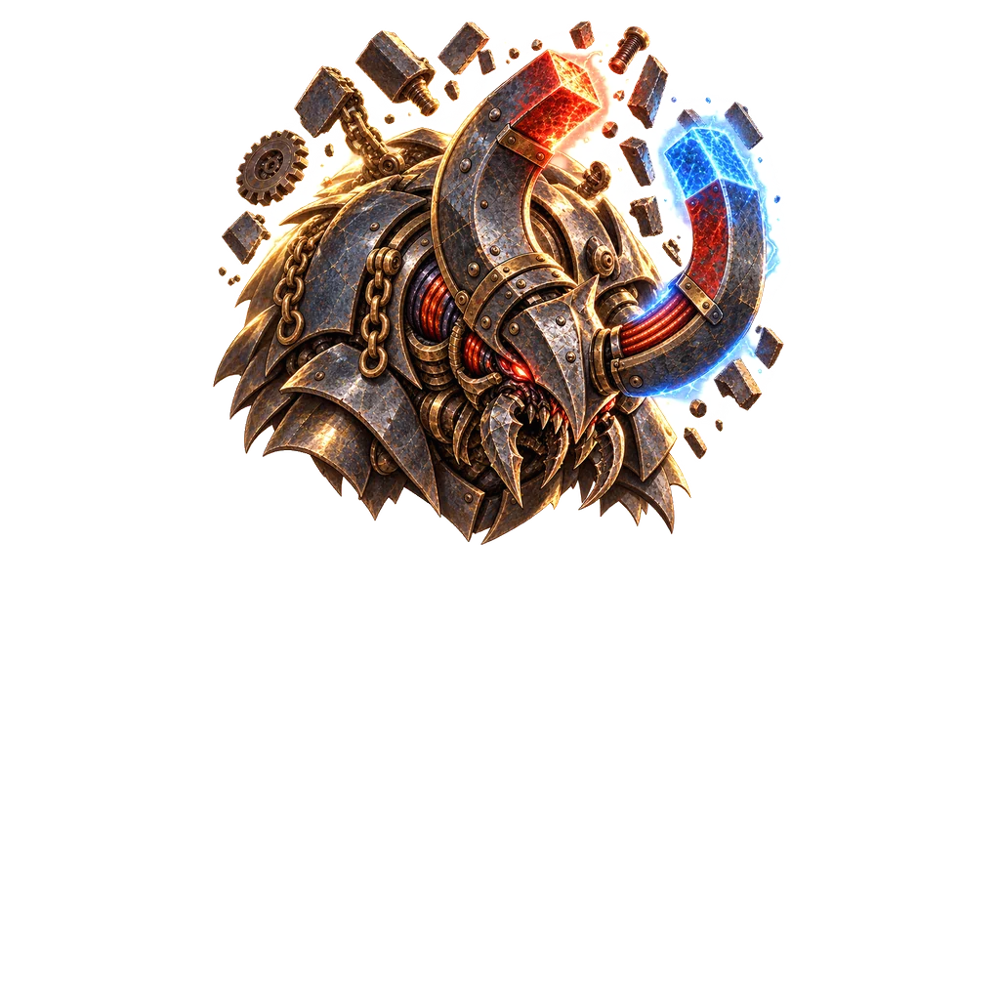

Guide-circle preview: 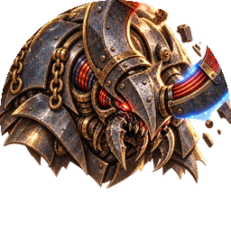

1024×1024; 191 KB. Selected attempt 3.

Guide QA: no visible construction lines, labels, dashed outlines or colored guide blocks.

- Portrait resized and registered to place the face inside the guide circle; original creature design preserved.
- Guide registration: scale 0.65, offset (179, -53); facial center mapped to (512,400).

<details><summary>References and generation prompt</summary>

References, in order:

1. `public/assets/fiends/fiend_magnet_beetle/base.webp`
2. `art/guides/portrait.png`

```text
ART STYLE: Lush, luminous digital painting in the spirit of a premium early-2000s Japanese RPG remastered in HD. Semi-realistic, anime-influenced characters with expressive faces and stylish asymmetrical adventure outfits: layered belts, buckles, straps, zippers, one-sleeved jackets, flowing scarves. Sun-drenched tropical environments painted in rich detail: saturated turquoise seas, white sand, emerald jungle, and ancient sandstone ruins carved with softly glowing glyphs. Golden-hour sunlight, with bioluminescent blue-green motes of light drifting through the air. Cinematic, epic and adventurous, with a mischievous sense of humor: witty, characterful expressions and small comedic details hidden in the scene. Mature and cool, never babyish or chibi.

This is an isolated game sprite: render ONLY the subject on a fully transparent background (PNG with alpha). No scenery, no ground, no cast shadow, no frame. Lit from the upper left with a soft rim light, crisp readable silhouette, full body with nothing cropped and clear empty space around it.

A head-on, three-quarter portrait of this armored beetle's head and horseshoe-magnet horns, red and blue tips glowing, little bits of scrap floating near it. Match the attached creature reference exactly. Head and shoulders, three-quarters toward the RIGHT; eyes and mouth centered around (512,400) inside the guide circle. No circles, guide marks or typography.

The attached guide image is a construction drawing: use it only for layout (where the floor, horizon, characters or cells are). Do not reproduce any of its lines, colors, shapes, labels or text.

FINAL PORTRAIT LAYOUT: Make the creature a COMPACT HEAD-AND-SHOULDERS BUST, only 600px tall, from y=100 to y=700 on the 1024 square. Center the bust horizontally at x=512. Do not enlarge it to fill the canvas. Its eyes sit around x=420..600, y=320; its entire mouth sits around x=500, y=480. Both eyes and mouth must be inside the guide's central circle. Slight three-quarter turn toward RIGHT, about 10 degrees, NOT a side profile. No legs, full body, long tendrils, tail or shoulders dominating the picture. Everything around the compact bust is alpha transparent. NEVER draw a circle, dashed line, rectangle, text, label or guide colors.

OUTPUT: 1024x1024. Genuine transparent alpha background.

Rules: completely original designs; never imitate an existing franchise, character, creature, logo or emblem. No text, letters, numbers, logos, watermarks, signatures, borders or user interface, unless the prompt asks for glowing magic runes. Fierce and intense is great; no blood, gore or wounds.
```

</details>

## fiend_ink_slime / portrait — draft

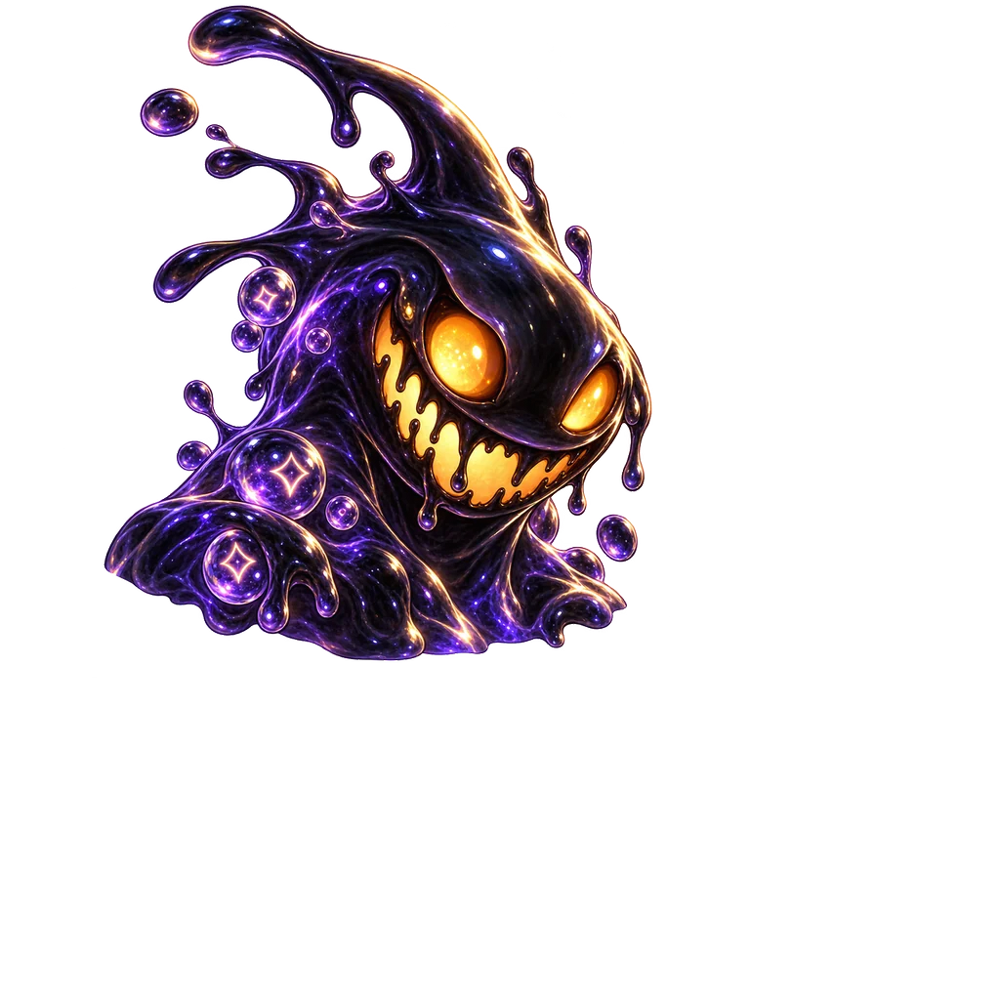

Guide-circle preview: 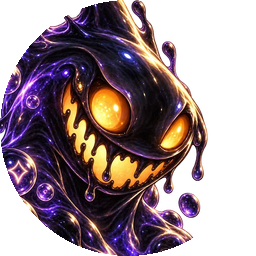

1024×1024; 156 KB. Selected attempt 3.

Guide QA: no visible construction lines, labels, dashed outlines or colored guide blocks.

- Portrait resized and registered to place the face inside the guide circle; original creature design preserved.
- Guide registration: scale 0.7, offset (17, -23); facial center mapped to (512,400).

<details><summary>References and generation prompt</summary>

References, in order:

1. `public/assets/fiends/fiend_ink_slime/base.webp`
2. `art/guides/portrait.png`

```text
ART STYLE: Lush, luminous digital painting in the spirit of a premium early-2000s Japanese RPG remastered in HD. Semi-realistic, anime-influenced characters with expressive faces and stylish asymmetrical adventure outfits: layered belts, buckles, straps, zippers, one-sleeved jackets, flowing scarves. Sun-drenched tropical environments painted in rich detail: saturated turquoise seas, white sand, emerald jungle, and ancient sandstone ruins carved with softly glowing glyphs. Golden-hour sunlight, with bioluminescent blue-green motes of light drifting through the air. Cinematic, epic and adventurous, with a mischievous sense of humor: witty, characterful expressions and small comedic details hidden in the scene. Mature and cool, never babyish or chibi.

This is an isolated game sprite: render ONLY the subject on a fully transparent background (PNG with alpha). No scenery, no ground, no cast shadow, no frame. Lit from the upper left with a soft rim light, crisp readable silhouette, full body with nothing cropped and clear empty space around it.

A portrait of this ink slime's face: big glowing amber eyes and a wide, mischievous drippy grin, glyph bubbles inside. Match the attached creature reference exactly. Head and shoulders, three-quarters toward the RIGHT; eyes and mouth centered around (512,400) inside the guide circle. No circles, guide marks or typography.

The attached guide image is a construction drawing: use it only for layout (where the floor, horizon, characters or cells are). Do not reproduce any of its lines, colors, shapes, labels or text.

FINAL PORTRAIT LAYOUT: Make the creature a COMPACT HEAD-AND-SHOULDERS BUST, only 600px tall, from y=100 to y=700 on the 1024 square. Center the bust horizontally at x=512. Do not enlarge it to fill the canvas. Its eyes sit around x=420..600, y=320; its entire mouth sits around x=500, y=480. Both eyes and mouth must be inside the guide's central circle. Slight three-quarter turn toward RIGHT, about 10 degrees, NOT a side profile. No legs, full body, long tendrils, tail or shoulders dominating the picture. Everything around the compact bust is alpha transparent. NEVER draw a circle, dashed line, rectangle, text, label or guide colors.

OUTPUT: 1024x1024. Genuine transparent alpha background.

Rules: completely original designs; never imitate an existing franchise, character, creature, logo or emblem. No text, letters, numbers, logos, watermarks, signatures, borders or user interface, unless the prompt asks for glowing magic runes. Fierce and intense is great; no blood, gore or wounds.
```

</details>

## fiend_dominion_drone / portrait — draft

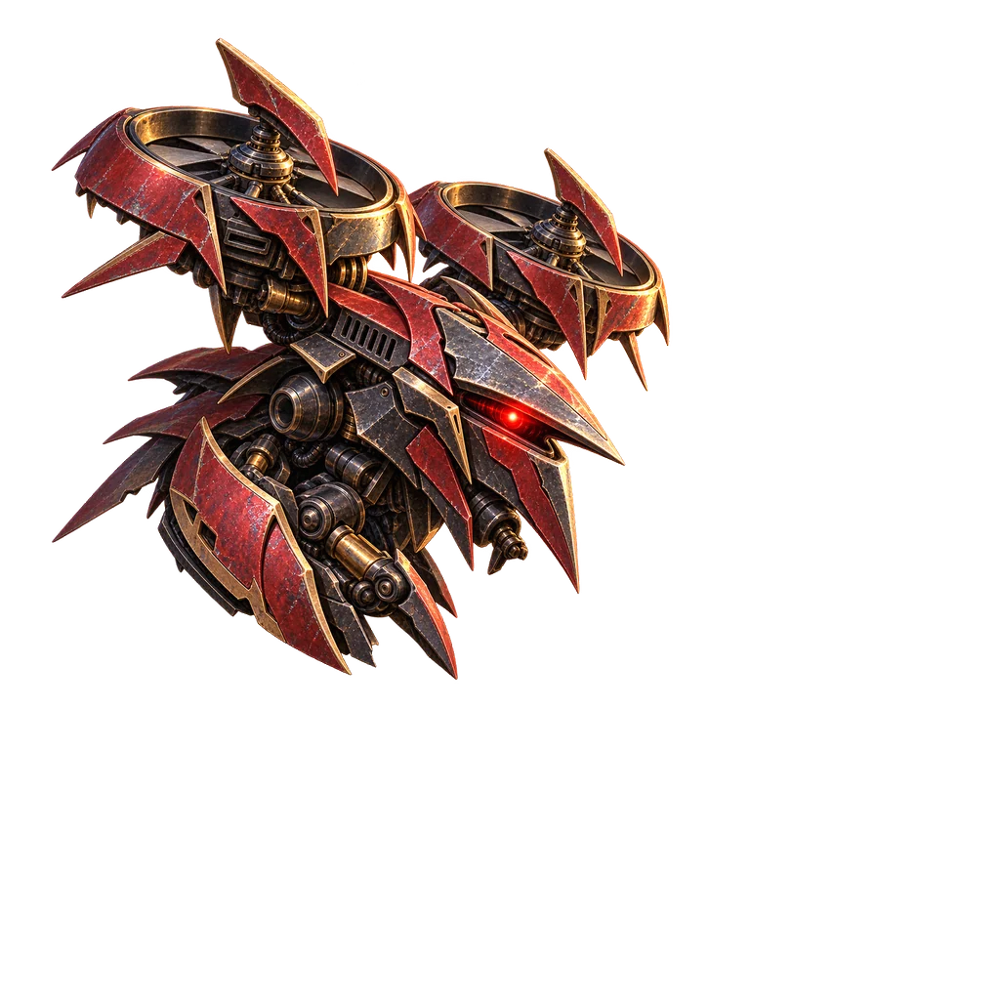

Guide-circle preview: 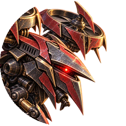

1024×1024; 166 KB. Selected attempt 3.

Guide QA: no visible construction lines, labels, dashed outlines or colored guide blocks.

- FLAG: After three attempts, more machinery remains visible than the requested close front portrait; review crop.
- Portrait resized and registered to place the face inside the guide circle; original creature design preserved.
- Guide registration: scale 0.65, offset (32, 34); facial center mapped to (512,400).

<details><summary>References and generation prompt</summary>

References, in order:

1. `public/assets/fiends/fiend_dominion_drone/base.webp`
2. `art/guides/portrait.png`

```text
ART STYLE: Lush, luminous digital painting in the spirit of a premium early-2000s Japanese RPG remastered in HD. Semi-realistic, anime-influenced characters with expressive faces and stylish asymmetrical adventure outfits: layered belts, buckles, straps, zippers, one-sleeved jackets, flowing scarves. Sun-drenched tropical environments painted in rich detail: saturated turquoise seas, white sand, emerald jungle, and ancient sandstone ruins carved with softly glowing glyphs. Golden-hour sunlight, with bioluminescent blue-green motes of light drifting through the air. Cinematic, epic and adventurous, with a mischievous sense of humor: witty, characterful expressions and small comedic details hidden in the scene. Mature and cool, never babyish or chibi.

This is an isolated game sprite: render ONLY the subject on a fully transparent background (PNG with alpha). No scenery, no ground, no cast shadow, no frame. Lit from the upper left with a soft rim light, crisp readable silhouette, full body with nothing cropped and clear empty space around it.

A close three-quarter portrait of this war drone's front: the narrow visor with its single red scanning eye, armored plates, a rotor edge. Match the attached creature reference exactly. Head and shoulders, three-quarters toward the RIGHT; eyes and mouth centered around (512,400) inside the guide circle. No circles, guide marks or typography.

The attached guide image is a construction drawing: use it only for layout (where the floor, horizon, characters or cells are). Do not reproduce any of its lines, colors, shapes, labels or text.

FINAL PORTRAIT LAYOUT: Make the creature a COMPACT HEAD-AND-SHOULDERS BUST, only 600px tall, from y=100 to y=700 on the 1024 square. Center the bust horizontally at x=512. Do not enlarge it to fill the canvas. Its eyes sit around x=420..600, y=320; its entire mouth sits around x=500, y=480. Both eyes and mouth must be inside the guide's central circle. Slight three-quarter turn toward RIGHT, about 10 degrees, NOT a side profile. No legs, full body, long tendrils, tail or shoulders dominating the picture. Everything around the compact bust is alpha transparent. NEVER draw a circle, dashed line, rectangle, text, label or guide colors.

OUTPUT: 1024x1024. Genuine transparent alpha background.

Rules: completely original designs; never imitate an existing franchise, character, creature, logo or emblem. No text, letters, numbers, logos, watermarks, signatures, borders or user interface, unless the prompt asks for glowing magic runes. Fierce and intense is great; no blood, gore or wounds.
```

</details>

## boss_geode_titan / portrait — draft

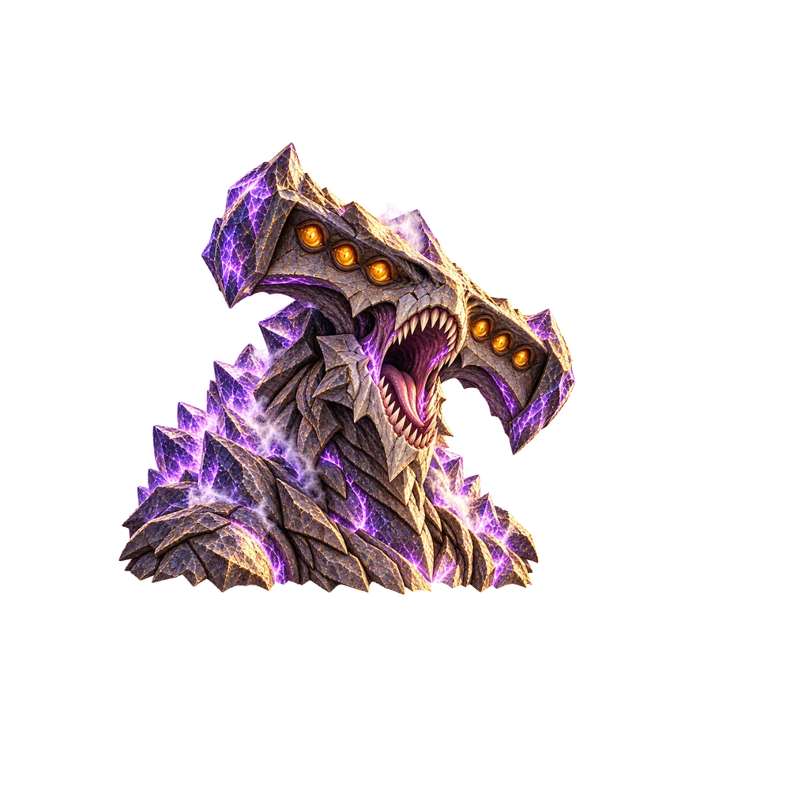

Guide-circle preview: 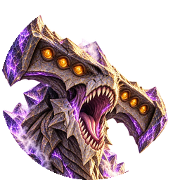

1024×1024; 158 KB. Selected attempt 3.

Guide QA: no visible construction lines, labels, dashed outlines or colored guide blocks.

- Portrait resized and registered to place the face inside the guide circle; original creature design preserved.
- Guide registration: scale 0.6, offset (131, 154); facial center mapped to (512,400).

<details><summary>References and generation prompt</summary>

References, in order:

1. `public/assets/bosses/boss_geode_titan/base.webp`
2. `art/guides/portrait.png`

```text
ART STYLE: Lush, luminous digital painting in the spirit of a premium early-2000s Japanese RPG remastered in HD. Semi-realistic, anime-influenced characters with expressive faces and stylish asymmetrical adventure outfits: layered belts, buckles, straps, zippers, one-sleeved jackets, flowing scarves. Sun-drenched tropical environments painted in rich detail: saturated turquoise seas, white sand, emerald jungle, and ancient sandstone ruins carved with softly glowing glyphs. Golden-hour sunlight, with bioluminescent blue-green motes of light drifting through the air. Cinematic, epic and adventurous, with a mischievous sense of humor: witty, characterful expressions and small comedic details hidden in the scene. Mature and cool, never babyish or chibi.

This is an isolated game sprite: render ONLY the subject on a fully transparent background (PNG with alpha). No scenery, no ground, no cast shadow, no frame. Lit from the upper left with a soft rim light, crisp readable silhouette, full body with nothing cropped and clear empty space around it.

A portrait of this colossal geode titan's hammerhead skull: six glowing amber eyes, steam venting from cracked violet crystal plates, roaring. Match the attached creature reference exactly. Head and shoulders, three-quarters toward the RIGHT; eyes and mouth centered around (512,400) inside the guide circle. No circles, guide marks or typography.

The attached guide image is a construction drawing: use it only for layout (where the floor, horizon, characters or cells are). Do not reproduce any of its lines, colors, shapes, labels or text.

FINAL PORTRAIT LAYOUT: Make the creature a COMPACT HEAD-AND-SHOULDERS BUST, only 600px tall, from y=100 to y=700 on the 1024 square. Center the bust horizontally at x=512. Do not enlarge it to fill the canvas. Its eyes sit around x=420..600, y=320; its entire mouth sits around x=500, y=480. Both eyes and mouth must be inside the guide's central circle. Slight three-quarter turn toward RIGHT, about 10 degrees, NOT a side profile. No legs, full body, long tendrils, tail or shoulders dominating the picture. Everything around the compact bust is alpha transparent. NEVER draw a circle, dashed line, rectangle, text, label or guide colors.

OUTPUT: 1024x1024. Genuine transparent alpha background.

Rules: completely original designs; never imitate an existing franchise, character, creature, logo or emblem. No text, letters, numbers, logos, watermarks, signatures, borders or user interface, unless the prompt asks for glowing magic runes. Fierce and intense is great; no blood, gore or wounds.
```

</details>

## bg_jungle_ruins / fg — draft

| Foreground alone | Over its battle background |
|---|---|
| 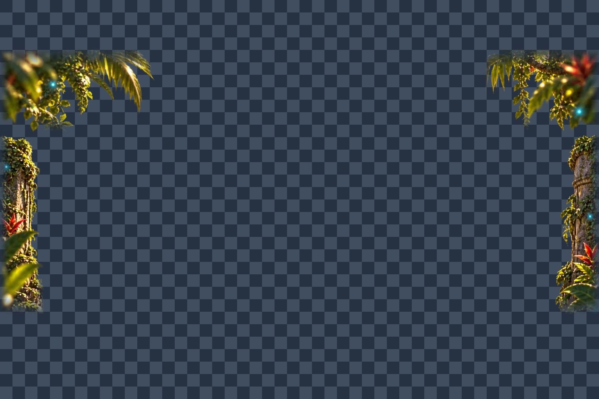 | 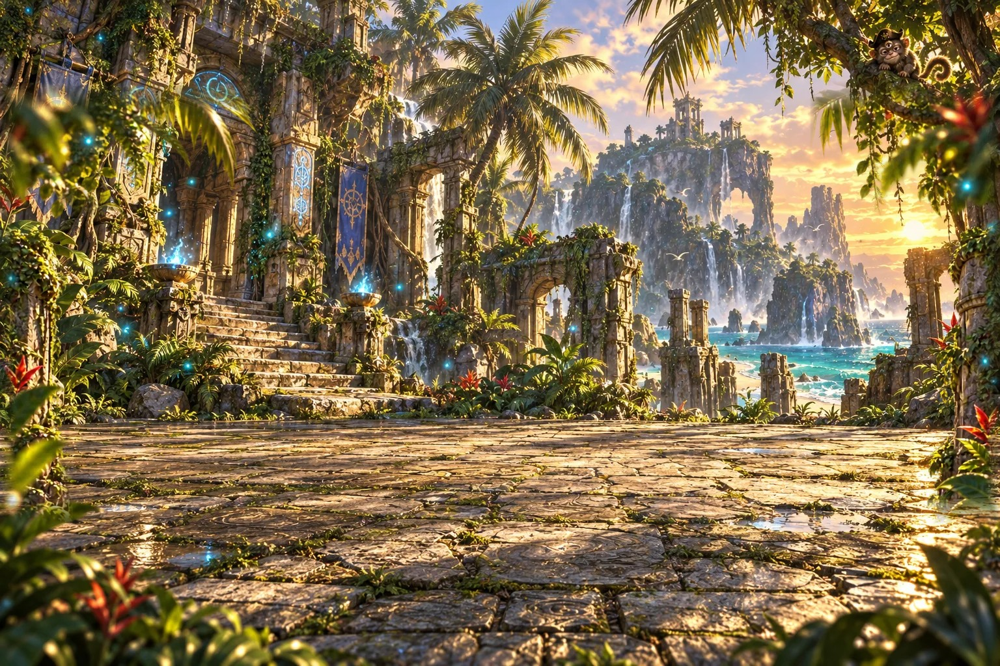 |

[Transparent WebP](../../public/assets/backgrounds/battle/bg_jungle_ruins_fg.webp)

1536×1024; 117 KB. Selected attempt 3.

Guide QA: no visible construction lines, labels, dashed outlines or colored guide blocks.

- FLAG: After three attempts, source extends outside guide regions. Export uses a feathered guide mask; review prop silhouettes and fading in the composite.
- No guide lines, blocks or labels reproduced.
- 60447 pixels outside guide-safe foreground regions masked to transparent; fixed canvas and fighter clearance preserved.

<details><summary>References and generation prompt</summary>

References, in order:

1. `public/assets/backgrounds/battle/bg_jungle_ruins.webp`
2. `art/guides/battle_foreground.png`

```text
ART STYLE: Lush, luminous digital painting in the spirit of a premium early-2000s Japanese RPG remastered in HD. Semi-realistic, anime-influenced characters with expressive faces and stylish asymmetrical adventure outfits: layered belts, buckles, straps, zippers, one-sleeved jackets, flowing scarves. Sun-drenched tropical environments painted in rich detail: saturated turquoise seas, white sand, emerald jungle, and ancient sandstone ruins carved with softly glowing glyphs. Golden-hour sunlight, with bioluminescent blue-green motes of light drifting through the air. Cinematic, epic and adventurous, with a mischievous sense of humor: witty, characterful expressions and small comedic details hidden in the scene. Mature and cool, never babyish or chibi.

Render this foreground parallax layer on a fully transparent background (PNG with alpha). Preserve the full canvas; everything outside the designated edge regions stays transparent.

A foreground layer for the attached jungle-ruins battle background, as if very close to the camera: giant fern fronds and palm leaves hanging down into the top-left and top-right corners, and the mossy edge of a broken sandstone pillar along the far left and far right sides. Lit by the same golden afternoon sun, softly out of focus like a shallow depth of field. Paint only inside the green areas of the attached guide. Everything else, including the whole middle where the fighters stand, is fully transparent.

The attached guide image is a construction drawing: use it only for layout (where the floor, horizon, characters or cells are). Do not reproduce any of its lines, colors, shapes, labels or text.

OUTPUT: 1536x1024. Genuine transparent alpha background.

Rules: completely original designs; never imitate an existing franchise, character, creature, logo or emblem. No text, letters, numbers, logos, watermarks, signatures, borders or user interface, unless the prompt asks for glowing magic runes. Fierce and intense is great; no blood, gore or wounds.
FINAL RETRY: sparse isolated objects, NOT a frame. Read the SECOND reference's green regions literally. Full transparent 1536x1024 canvas. A small upper-left corner decoration ONLY within x=0..360,y=140..300; a small upper-right decoration ONLY within x=1280..1536,y=140..300. Two extremely slender vertical side slivers ONLY within x=0..90,y=340..760 and x=1450..1536,y=340..760. Objects naturally taper before these limits. Leave blank transparent gaps between corner decorations and side slivers. Absolutely NO top border, bottom border, black/colored background, haze filling canvas, broad columns, copied guide marks or rectangular cutoff. These are disconnected close-camera props matching the FIRST reference's lighting.
```

</details>

## bg_crystal_canyon / fg — draft

| Foreground alone | Over its battle background |
|---|---|
| 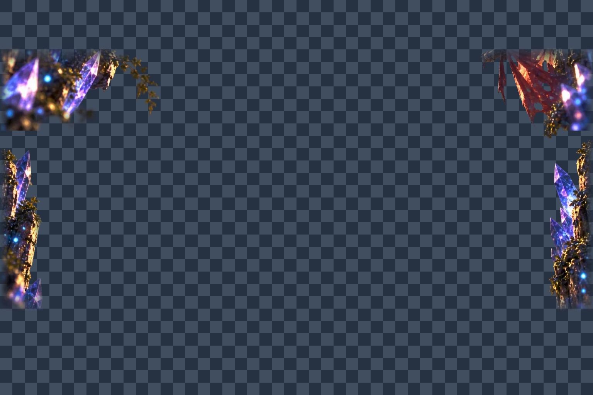 | 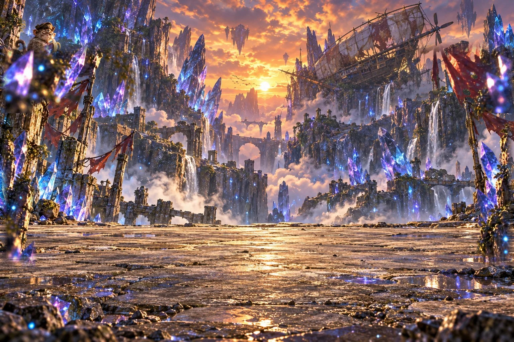 |

[Transparent WebP](../../public/assets/backgrounds/battle/bg_crystal_canyon_fg.webp)

1536×1024; 98 KB. Selected attempt 3.

Guide QA: no visible construction lines, labels, dashed outlines or colored guide blocks.

- FLAG: After three attempts, source extends outside guide regions. Export uses a feathered guide mask; review prop silhouettes and fading in the composite.
- No guide lines, blocks or labels reproduced.
- 105989 pixels outside guide-safe foreground regions masked to transparent; fixed canvas and fighter clearance preserved.

<details><summary>References and generation prompt</summary>

References, in order:

1. `public/assets/backgrounds/battle/bg_crystal_canyon.webp`
2. `art/guides/battle_foreground.png`

```text
ART STYLE: Lush, luminous digital painting in the spirit of a premium early-2000s Japanese RPG remastered in HD. Semi-realistic, anime-influenced characters with expressive faces and stylish asymmetrical adventure outfits: layered belts, buckles, straps, zippers, one-sleeved jackets, flowing scarves. Sun-drenched tropical environments painted in rich detail: saturated turquoise seas, white sand, emerald jungle, and ancient sandstone ruins carved with softly glowing glyphs. Golden-hour sunlight, with bioluminescent blue-green motes of light drifting through the air. Cinematic, epic and adventurous, with a mischievous sense of humor: witty, characterful expressions and small comedic details hidden in the scene. Mature and cool, never babyish or chibi.

Render this foreground parallax layer on a fully transparent background (PNG with alpha). Preserve the full canvas; everything outside the designated edge regions stays transparent.

A foreground layer for the attached crystal-canyon battle background, as if very close to the camera: jagged violet-and-blue crystal clusters and dark rock edges in the top-left and top-right corners and along the far left and far right sides, and a torn red pennant hanging into the top-right corner. Same dusk lighting, softly out of focus. Paint only inside the green areas of the attached guide. Everything else is fully transparent.

The attached guide image is a construction drawing: use it only for layout (where the floor, horizon, characters or cells are). Do not reproduce any of its lines, colors, shapes, labels or text.

OUTPUT: 1536x1024. Genuine transparent alpha background.

Rules: completely original designs; never imitate an existing franchise, character, creature, logo or emblem. No text, letters, numbers, logos, watermarks, signatures, borders or user interface, unless the prompt asks for glowing magic runes. Fierce and intense is great; no blood, gore or wounds.
FINAL RETRY: sparse isolated objects, NOT a frame. Read the SECOND reference's green regions literally. Full transparent 1536x1024 canvas. A small upper-left corner decoration ONLY within x=0..360,y=140..300; a small upper-right decoration ONLY within x=1280..1536,y=140..300. Two extremely slender vertical side slivers ONLY within x=0..90,y=340..760 and x=1450..1536,y=340..760. Objects naturally taper before these limits. Leave blank transparent gaps between corner decorations and side slivers. Absolutely NO top border, bottom border, black/colored background, haze filling canvas, broad columns, copied guide marks or rectangular cutoff. These are disconnected close-camera props matching the FIRST reference's lighting.
```

</details>

## bg_shipwreck_cove / base — draft

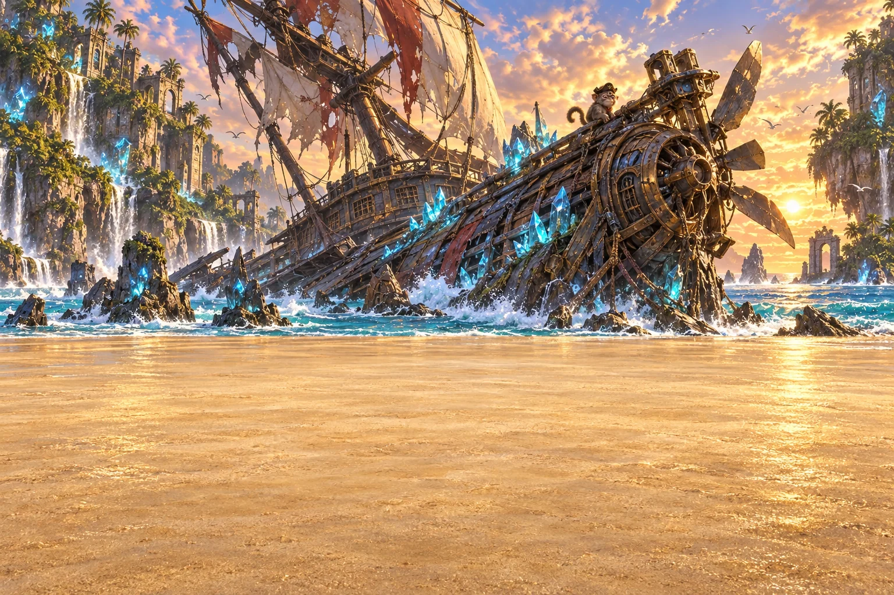

1536×1024; 484 KB. Selected attempt 2.

Guide QA: no visible construction lines, labels, dashed outlines or colored guide blocks.

- FLAG: After three attempts, the painted floor boundary is approximately y=580 rather than guide y=614. Attempt 2 is the closest. Check the arena composition before approval.
- Attempt 2 retained because its floor boundary is closer to the stage guide than attempts 1 and 3. Its matching foreground uses this finished WebP as reference.

<details><summary>References and generation prompt</summary>

References, in order:

1. `public/assets/anchors/key_art.webp`
2. `art/guides/battle_stage.png`

```text
CRITICAL GUIDE GEOMETRY at 1536x1024: The sea HORIZON is exactly y=471. The BACK EDGE of the level sandy battle floor is exactly y=614 (60% of canvas height). The wreck and breaking surf are BEHIND that boundary, occupying y<614. From y=614 through the bottom y=1024, show only flat, open, evenly lit packed sand across the WHOLE width, no plants, planks, rocks, rope, posts, waves or foreground props. Keep the wreck large and close behind the floor. This is a clean battle arena, not a sweeping panoramic beach. Never render the guide's colored lines, fighter shapes, perspective grid, or annotations.

ART STYLE: Lush, luminous digital painting in the spirit of a premium early-2000s Japanese RPG remastered in HD. Semi-realistic, anime-influenced characters with expressive faces and stylish asymmetrical adventure outfits: layered belts, buckles, straps, zippers, one-sleeved jackets, flowing scarves. Sun-drenched tropical environments painted in rich detail: saturated turquoise seas, white sand, emerald jungle, and ancient sandstone ruins carved with softly glowing glyphs. Golden-hour sunlight, with bioluminescent blue-green motes of light drifting through the air. Cinematic, epic and adventurous, with a mischievous sense of humor: witty, characterful expressions and small comedic details hidden in the scene. Mature and cool, never babyish or chibi.

This is a background painting for a 2D game: no characters or creatures unless the prompt asks for them, no user interface. Rich depth, clear foreground, midground and background.

A battle background: a wide, flat beach of packed golden sand at sunset, with the huge broken hull of a wrecked sky-pirate airship lying on its side behind the arena, glowing teal crystals growing out of its timbers, turquoise waves rolling in beyond it, and palm-covered cliffs at both sides. The sand floor is open, flat and evenly lit exactly where the guide marks the fighters, and the back edge of the floor meets the wreck and the surf on the guide's orange line. Hidden somewhere small: a three-eyed monkey in a tiny captain's hat sitting on the wreck.

The attached guide image is a construction drawing: use it only for layout (where the floor, horizon, characters or cells are). Do not reproduce any of its lines, colors, shapes, labels or text.

OUTPUT: 1536x1024. Opaque painting.

Rules: completely original designs; never imitate an existing franchise, character, creature, logo or emblem. No text, letters, numbers, logos, watermarks, signatures, borders or user interface, unless the prompt asks for glowing magic runes. Fierce and intense is great; no blood, gore or wounds.
```

</details>

## bg_shipwreck_cove / fg — draft

| Foreground alone | Over its battle background |
|---|---|
| 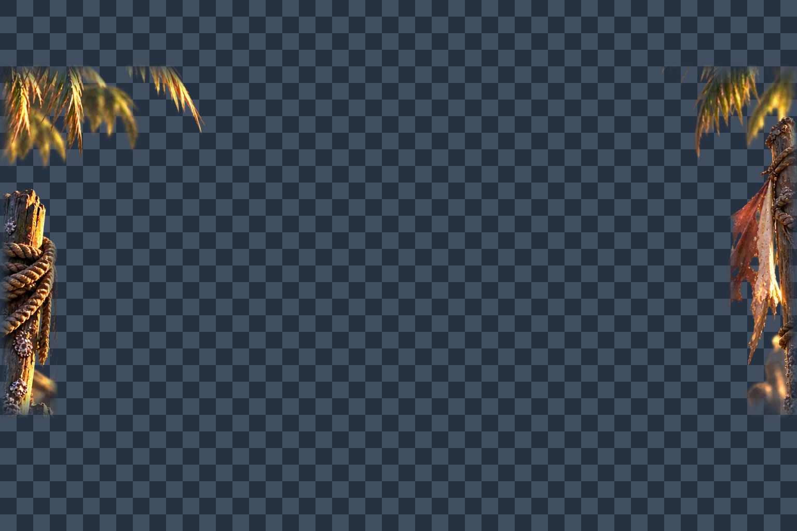 | 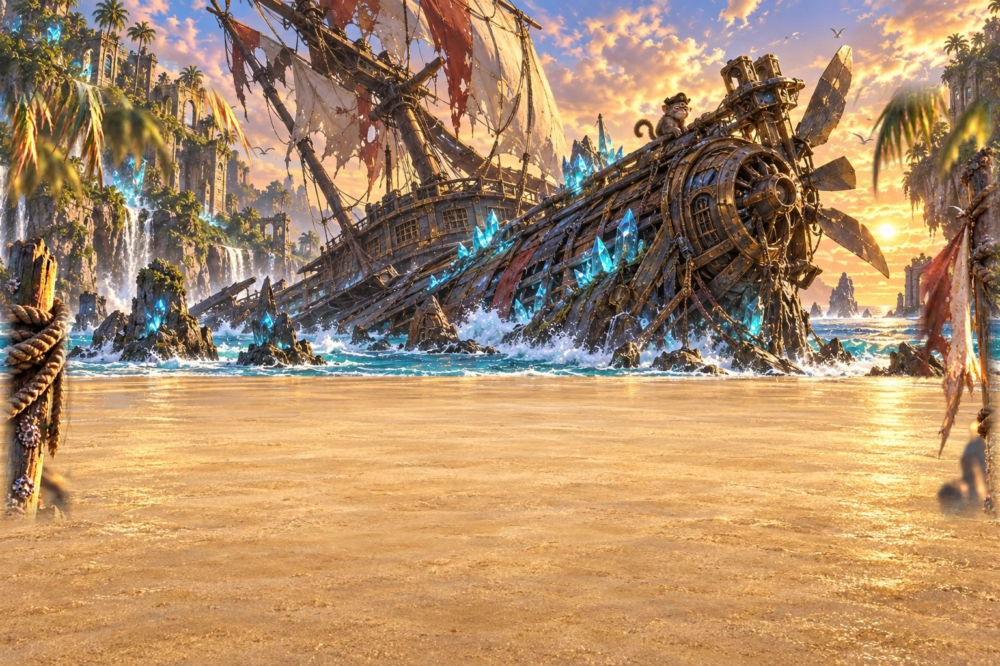 |

[Transparent WebP](../../public/assets/backgrounds/battle/bg_shipwreck_cove_fg.webp)

1536×1024; 111 KB. Selected attempt 3.

Guide QA: no visible construction lines, labels, dashed outlines or colored guide blocks.

- FLAG: After three attempts, source extends outside guide regions. Export uses a feathered guide mask; review prop silhouettes and fading in the composite.
- No guide lines, blocks or labels reproduced.
- 135212 pixels outside guide-safe foreground regions masked to transparent; fixed canvas and fighter clearance preserved.

<details><summary>References and generation prompt</summary>

References, in order:

1. `public/assets/backgrounds/battle/bg_shipwreck_cove.webp`
2. `art/guides/battle_foreground.png`

```text
ART STYLE: Lush, luminous digital painting in the spirit of a premium early-2000s Japanese RPG remastered in HD. Semi-realistic, anime-influenced characters with expressive faces and stylish asymmetrical adventure outfits: layered belts, buckles, straps, zippers, one-sleeved jackets, flowing scarves. Sun-drenched tropical environments painted in rich detail: saturated turquoise seas, white sand, emerald jungle, and ancient sandstone ruins carved with softly glowing glyphs. Golden-hour sunlight, with bioluminescent blue-green motes of light drifting through the air. Cinematic, epic and adventurous, with a mischievous sense of humor: witty, characterful expressions and small comedic details hidden in the scene. Mature and cool, never babyish or chibi.

Render this foreground parallax layer on a fully transparent background (PNG with alpha). Preserve the full canvas; everything outside the designated edge regions stays transparent.

A foreground layer for the attached shipwreck-cove battle background, as if very close to the camera: drooping palm fronds in the top corners, a coil of old rope and a barnacled plank along the far left side, and a tilted wooden post with a frayed flag on the far right side. Same sunset light, softly out of focus. Paint only inside the green areas of the attached guide. Everything else is fully transparent.

The attached guide image is a construction drawing: use it only for layout (where the floor, horizon, characters or cells are). Do not reproduce any of its lines, colors, shapes, labels or text.

OUTPUT: 1536x1024. Genuine transparent alpha background.

Rules: completely original designs; never imitate an existing franchise, character, creature, logo or emblem. No text, letters, numbers, logos, watermarks, signatures, borders or user interface, unless the prompt asks for glowing magic runes. Fierce and intense is great; no blood, gore or wounds.
FINAL RETRY: sparse isolated objects, NOT a frame. Read the SECOND reference's green regions literally. Full transparent 1536x1024 canvas. A small upper-left corner decoration ONLY within x=0..360,y=140..300; a small upper-right decoration ONLY within x=1280..1536,y=140..300. Two extremely slender vertical side slivers ONLY within x=0..90,y=340..760 and x=1450..1536,y=340..760. Objects naturally taper before these limits. Leave blank transparent gaps between corner decorations and side slivers. Absolutely NO top border, bottom border, black/colored background, haze filling canvas, broad columns, copied guide marks or rectangular cutoff. These are disconnected close-camera props matching the FIRST reference's lighting.
```

</details>

## titan_starter / roar — draft

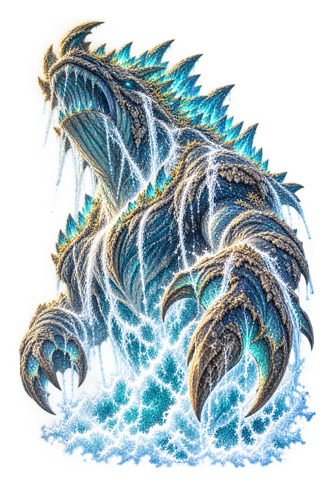

703×1024; 358 KB. Selected attempt 1.


<details><summary>References and generation prompt</summary>

References, in order:

1. `public/assets/titans/titan_starter/base.webp`

```text
ART STYLE: Lush, luminous digital painting in the spirit of a premium early-2000s Japanese RPG remastered in HD. Semi-realistic, anime-influenced characters with expressive faces and stylish asymmetrical adventure outfits: layered belts, buckles, straps, zippers, one-sleeved jackets, flowing scarves. Sun-drenched tropical environments painted in rich detail: saturated turquoise seas, white sand, emerald jungle, and ancient sandstone ruins carved with softly glowing glyphs. Golden-hour sunlight, with bioluminescent blue-green motes of light drifting through the air. Cinematic, epic and adventurous, with a mischievous sense of humor: witty, characterful expressions and small comedic details hidden in the scene. Mature and cool, never babyish or chibi.

This is an isolated game sprite: render ONLY the subject on a fully transparent background (PNG with alpha). No scenery, no ground, no cast shadow, no frame. Lit from the upper left with a soft rim light, crisp readable silhouette, full body with nothing cropped and clear empty space around it.

The same colossal sea titan as the attached reference, rearing up and roaring toward the upper left, jaws wide open, every crystal reef on its back blazing teal-white, seawater streaming off its shoulders and arms. Seen from below so it feels enormous. The lower body fades into churning white water at the bottom edge.

OUTPUT: 1024x1536. Genuine transparent alpha background.

Rules: completely original designs; never imitate an existing franchise, character, creature, logo or emblem. No text, letters, numbers, logos, watermarks, signatures, borders or user interface, unless the prompt asks for glowing magic runes. Fierce and intense is great; no blood, gore or wounds.
```

</details>

## titan_starter / attack — draft

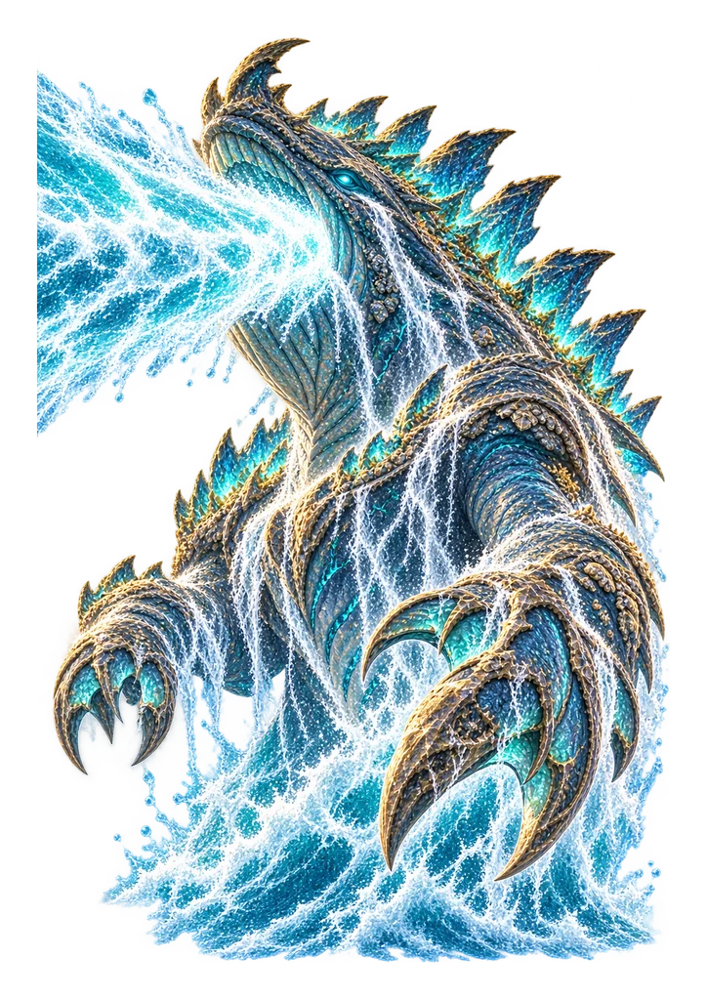

724×1024; 374 KB. Selected attempt 1.

- Torrent deliberately exits the left edge, as the wave requests.

<details><summary>References and generation prompt</summary>

References, in order:

1. `public/assets/titans/titan_starter/base.webp`

```text
ART STYLE: Lush, luminous digital painting in the spirit of a premium early-2000s Japanese RPG remastered in HD. Semi-realistic, anime-influenced characters with expressive faces and stylish asymmetrical adventure outfits: layered belts, buckles, straps, zippers, one-sleeved jackets, flowing scarves. Sun-drenched tropical environments painted in rich detail: saturated turquoise seas, white sand, emerald jungle, and ancient sandstone ruins carved with softly glowing glyphs. Golden-hour sunlight, with bioluminescent blue-green motes of light drifting through the air. Cinematic, epic and adventurous, with a mischievous sense of humor: witty, characterful expressions and small comedic details hidden in the scene. Mature and cool, never babyish or chibi.

This is an isolated game sprite: render ONLY the subject on a fully transparent background (PNG with alpha). No scenery, no ground, no cast shadow, no frame. Lit from the upper left with a soft rim light, crisp readable silhouette, full body with nothing cropped and clear empty space around it.

The same colossal sea titan as the attached reference, facing LEFT, unleashing a massive torrent of glowing teal-and-white water from its open jaws. The torrent blasts out toward the left and leaves the frame on the left edge. Crystals blazing, spray everywhere, the lower body fading into churning water at the bottom edge.

OUTPUT: 1024x1536. Genuine transparent alpha background.

Rules: completely original designs; never imitate an existing franchise, character, creature, logo or emblem. No text, letters, numbers, logos, watermarks, signatures, borders or user interface, unless the prompt asks for glowing magic runes. Fierce and intense is great; no blood, gore or wounds.
```

</details>

## fx_summon_circle / sheet — draft

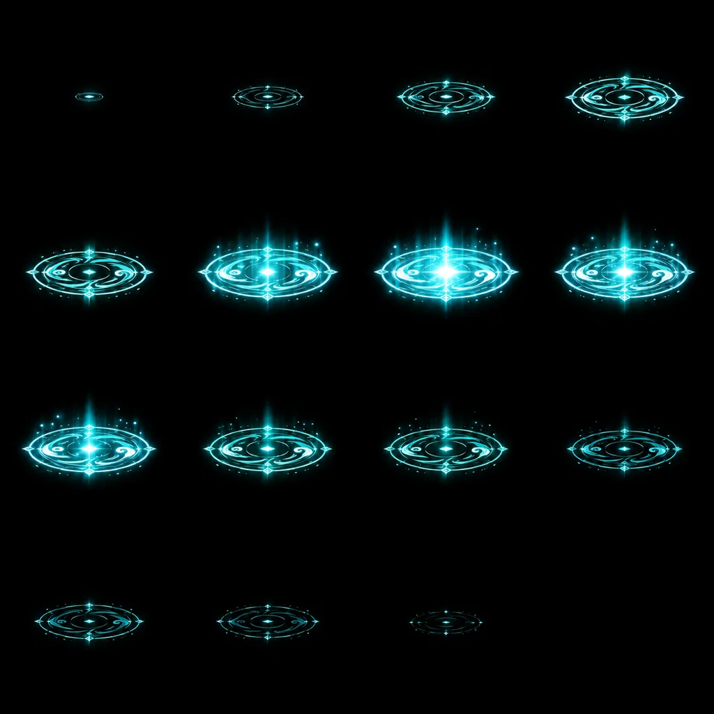

Animation preview (24 fps): 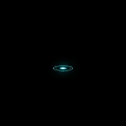

1024×1024; 60 KB. Selected attempt 3.


<details><summary>References and generation prompt</summary>

References, in order:

1. `public/assets/anchors/key_art.webp`
2. `public/assets/anchors/cast_lineup.webp`

```text
ART STYLE: Lush, luminous digital painting in the spirit of a premium early-2000s Japanese RPG remastered in HD. Semi-realistic, anime-influenced characters with expressive faces and stylish asymmetrical adventure outfits: layered belts, buckles, straps, zippers, one-sleeved jackets, flowing scarves. Sun-drenched tropical environments painted in rich detail: saturated turquoise seas, white sand, emerald jungle, and ancient sandstone ruins carved with softly glowing glyphs. Golden-hour sunlight, with bioluminescent blue-green motes of light drifting through the air. Cinematic, epic and adventurous, with a mischievous sense of humor: witty, characterful expressions and small comedic details hidden in the scene. Mature and cool, never babyish or chibi.

This is a visual-effects sprite sheet: only the glowing effect itself, on a pure black (#000000) background, so it can be blended additively. No characters, no scenery.

A glowing teal summoning circle of interlocking rings and wave-shaped runes, seen from a low angle as a flat ellipse. It draws itself, spins, flares bright white, then fades

A 16-frame animation sprite sheet of the effect described above, in a grid of 4 columns and 4 rows of equal square cells on a pure black (#000000) background, with no grid lines, labels or text. Frames read left to right, top row to bottom row. The effect starts small in frame 1, peaks around frames 6 to 9, and fades completely to black by frame 16. Each frame is centered in its cell with a margin and never crosses into a neighboring cell.

FINAL MARGIN CORRECTION: Draw sixteen miniature effects. Even the PEAK frame fits in ONLY the central 120x120 px of its 256px cell. Leave 68px PURE BLACK on all sides. Absolutely no rays, particles, foam or glow outside that central square. Do not stretch the effect to fill its cell. Final frame completely black.

OUTPUT: 1024x1024. Opaque pure black background.

Rules: completely original designs; never imitate an existing franchise, character, creature, logo or emblem. No text, letters, numbers, logos, watermarks, signatures, borders or user interface, unless the prompt asks for glowing magic runes. Fierce and intense is great; no blood, gore or wounds.
```

</details>

## fx_tidal / sheet — draft

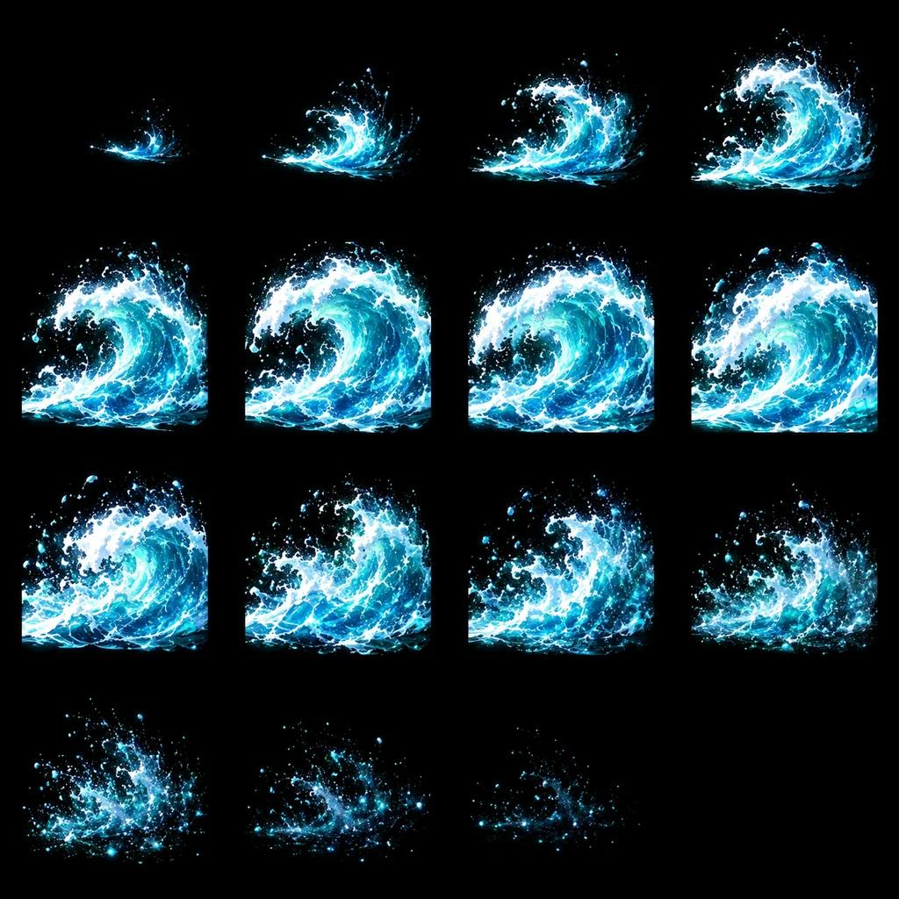

Animation preview (24 fps): 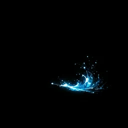

1024×1024; 197 KB. Selected attempt 1.


<details><summary>References and generation prompt</summary>

References, in order:

1. `public/assets/anchors/key_art.webp`
2. `public/assets/anchors/cast_lineup.webp`

```text
ART STYLE: Lush, luminous digital painting in the spirit of a premium early-2000s Japanese RPG remastered in HD. Semi-realistic, anime-influenced characters with expressive faces and stylish asymmetrical adventure outfits: layered belts, buckles, straps, zippers, one-sleeved jackets, flowing scarves. Sun-drenched tropical environments painted in rich detail: saturated turquoise seas, white sand, emerald jungle, and ancient sandstone ruins carved with softly glowing glyphs. Golden-hour sunlight, with bioluminescent blue-green motes of light drifting through the air. Cinematic, epic and adventurous, with a mischievous sense of humor: witty, characterful expressions and small comedic details hidden in the scene. Mature and cool, never babyish or chibi.

This is a visual-effects sprite sheet: only the glowing effect itself, on a pure black (#000000) background, so it can be blended additively. No characters, no scenery.

A massive surge of glowing teal-and-white water rushing from right to left across the frame, with a curling, foaming crest and thick spray

A 16-frame animation sprite sheet of the effect described above, in a grid of 4 columns and 4 rows of equal square cells on a pure black (#000000) background, with no grid lines, labels or text. Frames read left to right, top row to bottom row. The effect starts small in frame 1, peaks around frames 6 to 9, and fades completely to black by frame 16. Each frame is centered in its cell with a margin and never crosses into a neighboring cell.

OUTPUT: 1024x1024. Opaque pure black background.

Rules: completely original designs; never imitate an existing franchise, character, creature, logo or emblem. No text, letters, numbers, logos, watermarks, signatures, borders or user interface, unless the prompt asks for glowing magic runes. Fierce and intense is great; no blood, gore or wounds.
```

</details>

## fx_splash / sheet — draft

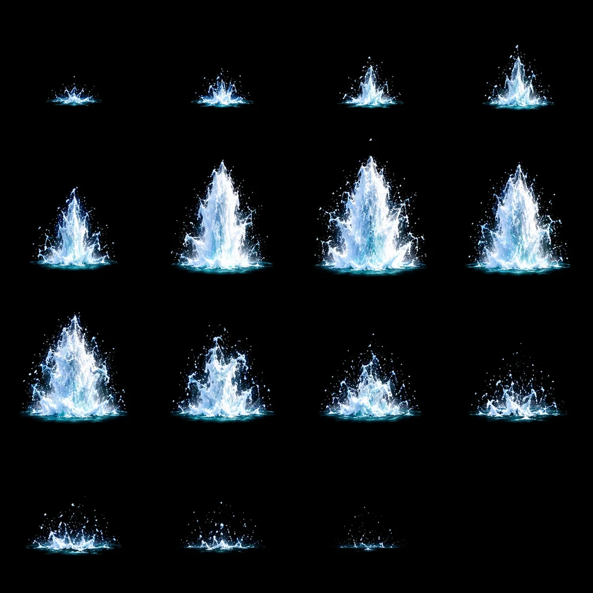

Animation preview (24 fps): 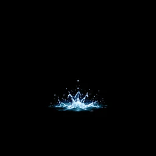

1024×1024; 85 KB. Selected attempt 3.

- FLAG: frame 2: source touches cell edge
- FLAG: frame 6: source touches cell edge

<details><summary>References and generation prompt</summary>

References, in order:

1. `public/assets/anchors/key_art.webp`
2. `public/assets/anchors/cast_lineup.webp`

```text
ART STYLE: Lush, luminous digital painting in the spirit of a premium early-2000s Japanese RPG remastered in HD. Semi-realistic, anime-influenced characters with expressive faces and stylish asymmetrical adventure outfits: layered belts, buckles, straps, zippers, one-sleeved jackets, flowing scarves. Sun-drenched tropical environments painted in rich detail: saturated turquoise seas, white sand, emerald jungle, and ancient sandstone ruins carved with softly glowing glyphs. Golden-hour sunlight, with bioluminescent blue-green motes of light drifting through the air. Cinematic, epic and adventurous, with a mischievous sense of humor: witty, characterful expressions and small comedic details hidden in the scene. Mature and cool, never babyish or chibi.

This is a visual-effects sprite sheet: only the glowing effect itself, on a pure black (#000000) background, so it can be blended additively. No characters, no scenery.

A huge column of white water and spray bursting straight up from the bottom of the frame, then collapsing back down

A 16-frame animation sprite sheet of the effect described above, in a grid of 4 columns and 4 rows of equal square cells on a pure black (#000000) background, with no grid lines, labels or text. Frames read left to right, top row to bottom row. The effect starts small in frame 1, peaks around frames 6 to 9, and fades completely to black by frame 16. Each frame is centered in its cell with a margin and never crosses into a neighboring cell.

FINAL MARGIN CORRECTION: Draw sixteen miniature effects. Even the PEAK frame fits in ONLY the central 120x120 px of its 256px cell. Leave 68px PURE BLACK on all sides. Absolutely no rays, particles, foam or glow outside that central square. Do not stretch the effect to fill its cell. Final frame completely black.

OUTPUT: 1024x1024. Opaque pure black background.

Rules: completely original designs; never imitate an existing franchise, character, creature, logo or emblem. No text, letters, numbers, logos, watermarks, signatures, borders or user interface, unless the prompt asks for glowing magic runes. Fierce and intense is great; no blood, gore or wounds.
```

</details>

## fx_roar / sheet — draft

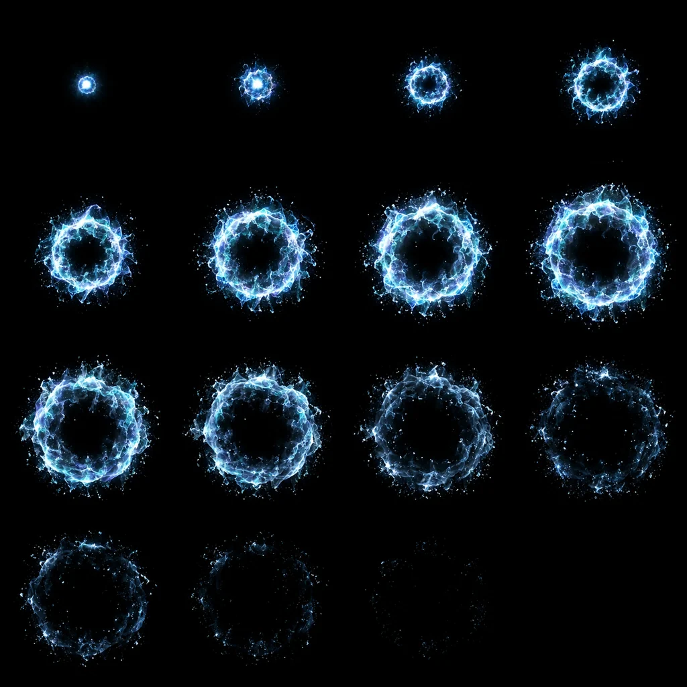

Animation preview (24 fps): 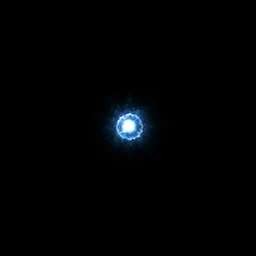

1024×1024; 119 KB. Selected attempt 3.

- FLAG: frame 3: source touches cell edge
- FLAG: frame 6: source touches cell edge
- FLAG: frame 7: source touches cell edge
- FLAG: frame 9: source touches cell edge

<details><summary>References and generation prompt</summary>

References, in order:

1. `public/assets/anchors/key_art.webp`
2. `public/assets/anchors/cast_lineup.webp`

```text
ART STYLE: Lush, luminous digital painting in the spirit of a premium early-2000s Japanese RPG remastered in HD. Semi-realistic, anime-influenced characters with expressive faces and stylish asymmetrical adventure outfits: layered belts, buckles, straps, zippers, one-sleeved jackets, flowing scarves. Sun-drenched tropical environments painted in rich detail: saturated turquoise seas, white sand, emerald jungle, and ancient sandstone ruins carved with softly glowing glyphs. Golden-hour sunlight, with bioluminescent blue-green motes of light drifting through the air. Cinematic, epic and adventurous, with a mischievous sense of humor: witty, characterful expressions and small comedic details hidden in the scene. Mature and cool, never babyish or chibi.

This is a visual-effects sprite sheet: only the glowing effect itself, on a pure black (#000000) background, so it can be blended additively. No characters, no scenery.

A shockwave ring of rippling air and glittering spray expanding outward from the center

A 16-frame animation sprite sheet of the effect described above, in a grid of 4 columns and 4 rows of equal square cells on a pure black (#000000) background, with no grid lines, labels or text. Frames read left to right, top row to bottom row. The effect starts small in frame 1, peaks around frames 6 to 9, and fades completely to black by frame 16. Each frame is centered in its cell with a margin and never crosses into a neighboring cell.

FINAL MARGIN CORRECTION: Draw sixteen miniature effects. Even the PEAK frame fits in ONLY the central 120x120 px of its 256px cell. Leave 68px PURE BLACK on all sides. Absolutely no rays, particles, foam or glow outside that central square. Do not stretch the effect to fill its cell. Final frame completely black. The roar shockwave is an UPRIGHT CIRCULAR RING expanding toward the viewer, seen straight on, not a flat water pool or ellipse. Rippling AIR edged with fine glittering spray.

OUTPUT: 1024x1024. Opaque pure black background.

Rules: completely original designs; never imitate an existing franchise, character, creature, logo or emblem. No text, letters, numbers, logos, watermarks, signatures, borders or user interface, unless the prompt asks for glowing magic runes. Fierce and intense is great; no blood, gore or wounds.
```

</details>

## Wiring notes for Claude

New assets and fields are registered in public/assets/manifest.json. Claude can wire the command sheet, 96px window frame, cursor hotspot, logo, six creature portraits, foreground layers, shipwreck arena, Titan poses, and four summon effects. Art processing preserves full foreground canvases and keeps the fighter region transparent. The shipwreck floor-edge mismatch is flagged above; the required manifest floorEdge remains 0.6. The game's animations and layout still need runtime review after wiring.
