# Wave 03 art review

All 29 planned assets generated with built-in imagegen. Everything remains **draft** for parent-and-child review. No game code changed. Exact selected prompts and reference order appear below. Raw attempts are preserved under git-ignored art/raw/wave-03.

## Review notes

- **npc_jumble/portraits**: frame 4: source touches cell edge
- **ally_knight/walk**: After three attempts, walk phases and weapon/cloth continuity still pop. Review the 10 fps GIF before approval.; frame 0: source touches cell edge; frame 4: source touches cell edge; frame 5: source touches cell edge; frame 7: source touches cell edge; Standing frame scale exceeds ±8% after width fitting.
- **ally_gunner/walk**: After three attempts, walk phases and weapon/cloth continuity still pop. Review the 10 fps GIF before approval.; frame 0: source touches cell edge; frame 1: source touches cell edge; frame 2: source touches cell edge; frame 3: source touches cell edge; frame 4: source touches cell edge; frame 5: source touches cell edge; frame 6: source touches cell edge; frame 7: source touches cell edge
- **ally_spellwright/walk**: After three attempts, walk phases and weapon/cloth continuity still pop. Review the 10 fps GIF before approval.; frame 4: source touches cell edge
- **ally_titancaller/walk**: After three attempts, walk phases and weapon/cloth continuity still pop. Review the 10 fps GIF before approval.; frame 4: source touches cell edge; frame 5: source touches cell edge
- **ui_icons_explore/sheet**: frame 0: source touches cell edge; frame 1: source touches cell edge; frame 2: source touches cell edge; frame 3: source touches cell edge; frame 4: source touches cell edge; frame 5: source touches cell edge; frame 6: source touches cell edge; frame 7: source touches cell edge; frame 8: source touches cell edge; frame 9: source touches cell edge; frame 10: source touches cell edge; frame 11: source touches cell edge; frame 12: source touches cell edge; frame 13: source touches cell edge; frame 14: source touches cell edge; frame 15: source touches cell edge
- **story_albatross/base**: After three attempts, upper mast/flag enters the 16:9 top crop; balloon, hull and crystal remain visible.
- **story_galleon/base**: After three attempts, upper rigging and lower ghost-hull glow enter screen/narration crops; confrontation and Jumble remain visible.
- **story_crash/base**: After three attempts, some upper airship rigging and monkey body enter screen/narration crops. Review the screen preview.
- **story_ending/base**: Monkey cameo partly enters the top screen crop; its face remains visible.

Walk GIFs run at the manifest's 10 fps. Object composites use their location's background and the Knight for an illustrative scale comparison; final gameplay placement still needs runtime review. Story screen previews show the 16:9 crop and narration coverage. Checkboxes mean generated, not approved.

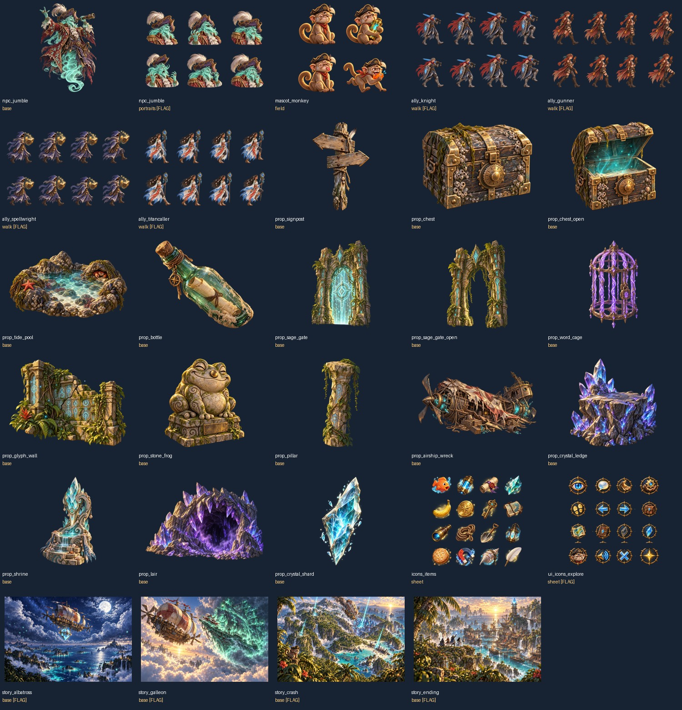

## npc_jumble / base — draft

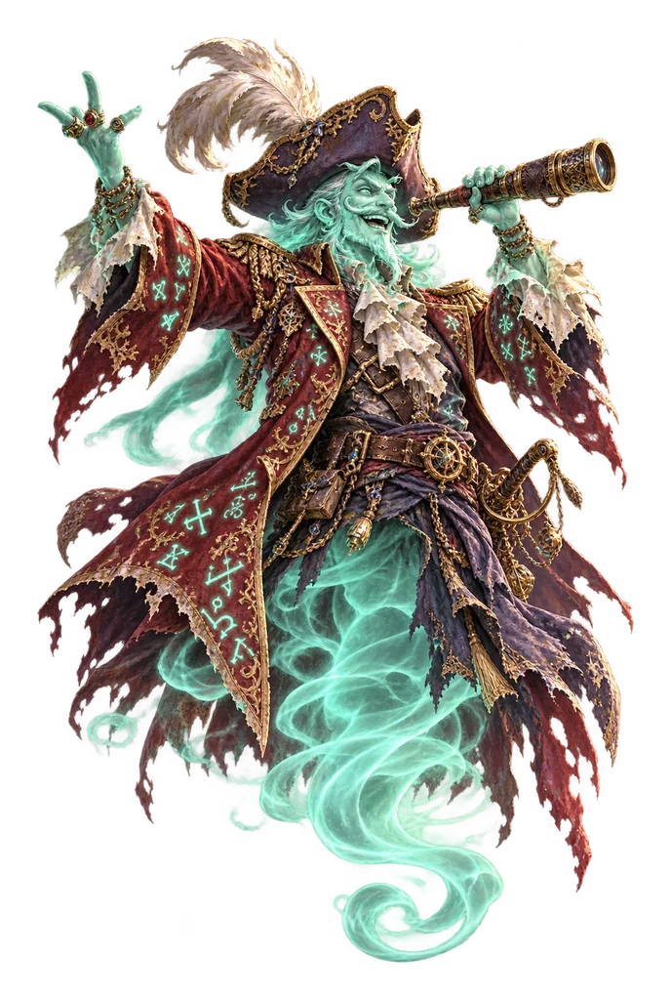

688×1024; 289 KB. Selected attempt 1.

No guide prescribed.

- Candidate 1 selected: fuller plume and silhouette with better clear margins; candidate 2 cropped its plume at the top.

<details><summary>References and generation prompt</summary>

1. `public/assets/anchors/key_art.webp`
2. `public/assets/anchors/cast_lineup.webp`

```text
ART STYLE: Lush, luminous digital painting in the spirit of a premium early-2000s Japanese RPG remastered in HD. Semi-realistic, anime-influenced characters with expressive faces and stylish asymmetrical adventure outfits: layered belts, buckles, straps, zippers, one-sleeved jackets, flowing scarves. Sun-drenched tropical environments painted in rich detail: saturated turquoise seas, white sand, emerald jungle, and ancient sandstone ruins carved with softly glowing glyphs. Golden-hour sunlight, with bioluminescent blue-green motes of light drifting through the air. Cinematic, epic and adventurous, with a mischievous sense of humor: witty, characterful expressions and small comedic details hidden in the scene. Mature and cool, never babyish or chibi.

This is an isolated game sprite: render ONLY the subject on a fully transparent background (PNG with alpha). No scenery, no ground, no cast shadow, no frame. Lit from the upper left with a soft rim light, crisp readable silhouette, full body with nothing cropped and clear empty space around it.

Captain Jumble, a ghost-pirate sorcerer, full body, striking a grand theatrical pose with one gloved hand flung up dramatically and a smug grin. His whole body is a translucent, softly glowing sea-green ghost, and his legs fade into a curl of mist instead of feet. He wears an enormous battered purple tricorn hat with a crooked, oversized white plume, a long tattered crimson-and-gold captain's coat embroidered all over with jumbled, glowing magical rune-glyphs that look like letters thrown in a blender, a ruffled collar, and far too many rings. He has a huge curled mustache, bushy eyebrows and a sharp pointed beard. He holds a rolled-up scroll that he uses as a spyglass. Vain, comedic and a little spooky, never scary. Lit from the upper left with a soft rim light.

OUTPUT: 1024x1536. Genuine transparent alpha background.

Rules: completely original designs; never imitate an existing franchise, character, creature, logo or emblem. No text, letters, numbers, logos, watermarks, signatures, borders or user interface, unless the prompt asks for glowing magic runes. Fierce and intense is great; no blood, gore or wounds.
```

</details>

## npc_jumble / portraits — draft

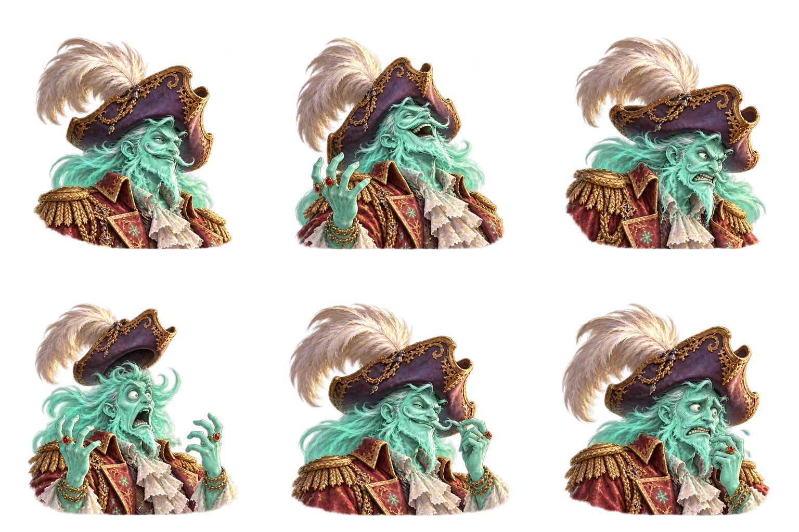

1536×1024; 507 KB. Selected attempt 2.

No visible guide lines, labels, dashed outlines or colored construction blocks.

- FLAG: frame 4: source touches cell edge
- Cells rebuilt separately with clear margins; shared 94% baseline for character sheets.

<details><summary>References and generation prompt</summary>

1. `public/assets/characters/npc_jumble/base.webp`
2. `art/guides/expression_sheet.png`

```text
ART STYLE: Lush, luminous digital painting in the spirit of a premium early-2000s Japanese RPG remastered in HD. Semi-realistic, anime-influenced characters with expressive faces and stylish asymmetrical adventure outfits: layered belts, buckles, straps, zippers, one-sleeved jackets, flowing scarves. Sun-drenched tropical environments painted in rich detail: saturated turquoise seas, white sand, emerald jungle, and ancient sandstone ruins carved with softly glowing glyphs. Golden-hour sunlight, with bioluminescent blue-green motes of light drifting through the air. Cinematic, epic and adventurous, with a mischievous sense of humor: witty, characterful expressions and small comedic details hidden in the scene. Mature and cool, never babyish or chibi.

This is an isolated game sprite: render ONLY the subject on a fully transparent background (PNG with alpha). No scenery, no ground, no cast shadow, no frame. Lit from the upper left with a soft rim light, crisp readable silhouette, full body with nothing cropped and clear empty space around it.

Captain Jumble from the attached reference: the same translucent sea-green ghost face, huge plumed purple tricorn hat, curled mustache and pointed beard. Big theatrical stage-villain acting: (2) a head-thrown-back villain laugh, (3) furious and puffed up, (4) jaw dropped with the hat jumping off his head, (5) twirling his mustache, (6) sweating and nervous.

An expression sheet for dialogue portraits: the SAME character's head and shoulders shown 6 times in a grid of 3 columns and 2 rows of equal square cells, on a fully transparent background, with no grid lines, labels or text. Identical framing and scale in every cell, facing three-quarters toward the right. Top row: (1) neutral, (2) laughing, (3) angry. Bottom row: (4) shocked, (5) smug, (6) worried. Big, readable, slightly comedic acting. Match the attached character reference exactly.

The attached guide image is a construction drawing: use it only for layout (where the floor, horizon, characters or cells are). Do not reproduce any of its lines, colors, shapes, labels or text.

OUTPUT: 1536x1024. Genuine transparent alpha background.

LAYOUT CORRECTION: Draw six portraits or four monkey poses exactly as requested, but SMALLER with generous gutters. Within every 512px cell keep ALL content including feathers, hat, tail and hands inside x=55..457 and y=55..455. Fully transparent margins, no lines or labels. The monkey's idle hands are EMPTY; only the holding pose has a power cell and only the run pose has the orange fish. The monkey faces right.

Rules: completely original designs; never imitate an existing franchise, character, creature, logo or emblem. No text, letters, numbers, logos, watermarks, signatures, borders or user interface, unless the prompt asks for glowing magic runes. Fierce and intense is great; no blood, gore or wounds.
```

</details>

## mascot_monkey / field — draft

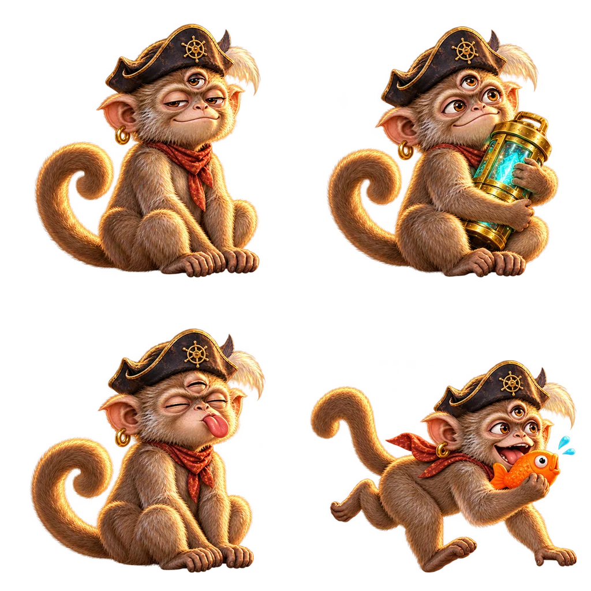

1024×1024; 285 KB. Selected attempt 2.

No visible guide lines, labels, dashed outlines or colored construction blocks.

- Cells rebuilt separately with clear margins; shared 94% baseline for character sheets.

<details><summary>References and generation prompt</summary>

1. `public/assets/characters/mascot_monkey/base.webp`
2. `art/guides/creature_sheet_2x2.png`

```text
ART STYLE: Lush, luminous digital painting in the spirit of a premium early-2000s Japanese RPG remastered in HD. Semi-realistic, anime-influenced characters with expressive faces and stylish asymmetrical adventure outfits: layered belts, buckles, straps, zippers, one-sleeved jackets, flowing scarves. Sun-drenched tropical environments painted in rich detail: saturated turquoise seas, white sand, emerald jungle, and ancient sandstone ruins carved with softly glowing glyphs. Golden-hour sunlight, with bioluminescent blue-green motes of light drifting through the air. Cinematic, epic and adventurous, with a mischievous sense of humor: witty, characterful expressions and small comedic details hidden in the scene. Mature and cool, never babyish or chibi.

This is an isolated game sprite: render ONLY the subject on a fully transparent background (PNG with alpha). No scenery, no ground, no cast shadow, no frame. Lit from the upper left with a soft rim light, crisp readable silhouette, full body with nothing cropped and clear empty space around it.

A sprite sheet for a 2D turn-based battle game: the SAME creature shown 4 times in a grid of 2 columns and 2 rows of equal square cells, on a fully transparent background, with no grid lines, labels or text. Full body at the same size and scale in every cell, standing on the same invisible baseline, facing RIGHT. The same three-eyed monkey in a tiny captain's hat as the attached reference, shown 4 times, facing RIGHT. Top row: (1) sitting and grinning mischievously, tail curled; (2) hugging a glowing brass power-cell canister to his chest like a treasure, eyes gleaming. Bottom row: (3) blowing a cheeky raspberry with his tongue out and all three eyes squeezed shut; (4) scampering away on all fours in delight, squeezing a bright orange rubber squeaky-toy fish. Match the attached creature reference exactly.

The attached guide image is a construction drawing: use it only for layout (where the floor, horizon, characters or cells are). Do not reproduce any of its lines, colors, shapes, labels or text.

OUTPUT: 1024x1024. Genuine transparent alpha background.

LAYOUT CORRECTION: Draw six portraits or four monkey poses exactly as requested, but SMALLER with generous gutters. Within every 512px cell keep ALL content including feathers, hat, tail and hands inside x=55..457 and y=55..455. Fully transparent margins, no lines or labels. The monkey's idle hands are EMPTY; only the holding pose has a power cell and only the run pose has the orange fish. The monkey faces right.

Rules: completely original designs; never imitate an existing franchise, character, creature, logo or emblem. No text, letters, numbers, logos, watermarks, signatures, borders or user interface, unless the prompt asks for glowing magic runes. Fierce and intense is great; no blood, gore or wounds.
```

</details>

## ally_knight / walk — draft

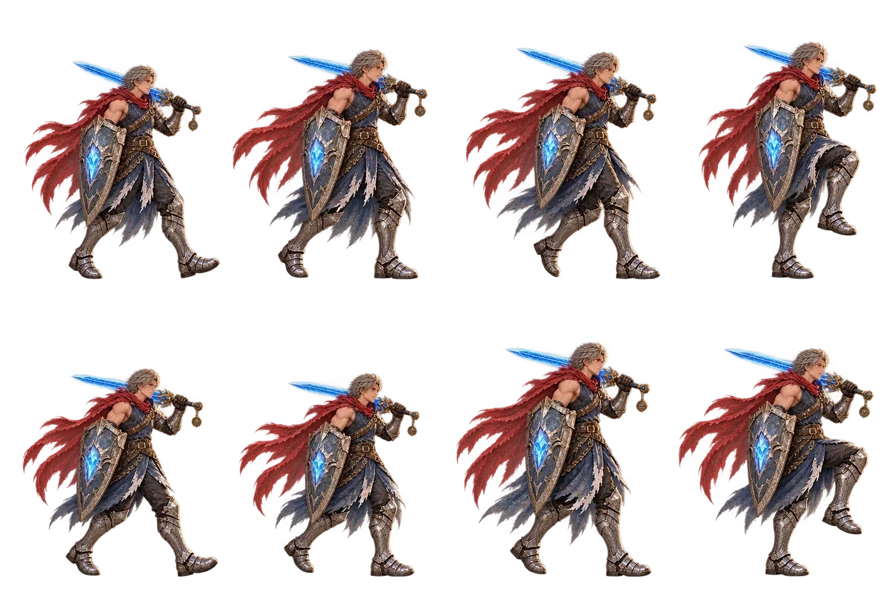

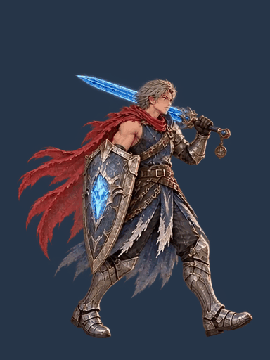

1536×1024; 453 KB. Selected attempt 3.

No visible guide lines, labels, dashed outlines or colored construction blocks.

- FLAG: After three attempts, walk phases and weapon/cloth continuity still pop. Review the 10 fps GIF before approval.
- FLAG: frame 0: source touches cell edge
- FLAG: frame 4: source touches cell edge
- FLAG: frame 5: source touches cell edge
- FLAG: frame 7: source touches cell edge
- FLAG: Standing frame scale exceeds ±8% after width fitting.
- Strongest motion/reference match selected after comparing all three attempts.
- Cells rebuilt separately with clear margins; shared 94% baseline for character sheets.
- Removed detached edge fragments: frame 5: erased 27 px

<details><summary>References and generation prompt</summary>

1. `public/assets/characters/ally_knight/base.webp`
2. `public/assets/characters/ally_knight/battle.webp`
3. `art/guides/walk_cycle.png`

```text
ART STYLE: Lush, luminous digital painting in the spirit of a premium early-2000s Japanese RPG remastered in HD. Semi-realistic, anime-influenced characters with expressive faces and stylish asymmetrical adventure outfits: layered belts, buckles, straps, zippers, one-sleeved jackets, flowing scarves. Sun-drenched tropical environments painted in rich detail: saturated turquoise seas, white sand, emerald jungle, and ancient sandstone ruins carved with softly glowing glyphs. Golden-hour sunlight, with bioluminescent blue-green motes of light drifting through the air. Cinematic, epic and adventurous, with a mischievous sense of humor: witty, characterful expressions and small comedic details hidden in the scene. Mature and cool, never babyish or chibi.

This is an isolated game sprite: render ONLY the subject on a fully transparent background (PNG with alpha). No scenery, no ground, no cast shadow, no frame. Lit from the upper left with a soft rim light, crisp readable silhouette, full body with nothing cropped and clear empty space around it.

A confident, upright march, greatsword resting on his right shoulder, shield on his left arm, crimson scarf trailing behind.

A side-view walk cycle sprite sheet: the SAME character in 8 frames in a grid of 4 columns and 2 rows of equal cells, on a fully transparent background, with no grid lines, labels or text. Full body, same size and scale in every frame, feet on the same invisible baseline, walking toward the RIGHT. The frames read left to right, top row then bottom row, as one smooth looping step cycle. Match the attached character reference exactly.

The attached guide image is a construction drawing: use it only for layout (where the floor, horizon, characters or cells are). Do not reproduce any of its lines, colors, shapes, labels or text.

OUTPUT: 1536x1024. Genuine transparent alpha background.

FINAL WALK RETRY: Make the whole figure miniature in every cell. Full canvas 1536x1024, four equal 384px columns, two equal 512px rows. Figure centers x=192,576,960,1344. All content occupies no more than 220px width and 350px height, including sword, scarf, books, glow and staff. Wide EMPTY transparent gutters. In sequence: left-foot contact, down, RIGHT leg passing beneath body, RIGHT knee lifted, RIGHT-foot contact, down, LEFT leg passing beneath body, LEFT knee lifted. The second row is the opposite leg, not a duplicate of the first. All face right, stable torso. Keep weapons at shoulders or hands as described; foreshorten long shoulder-held weapons so they fit. No labels or guide marks.

Rules: completely original designs; never imitate an existing franchise, character, creature, logo or emblem. No text, letters, numbers, logos, watermarks, signatures, borders or user interface, unless the prompt asks for glowing magic runes. Fierce and intense is great; no blood, gore or wounds.
```

</details>

## ally_gunner / walk — draft

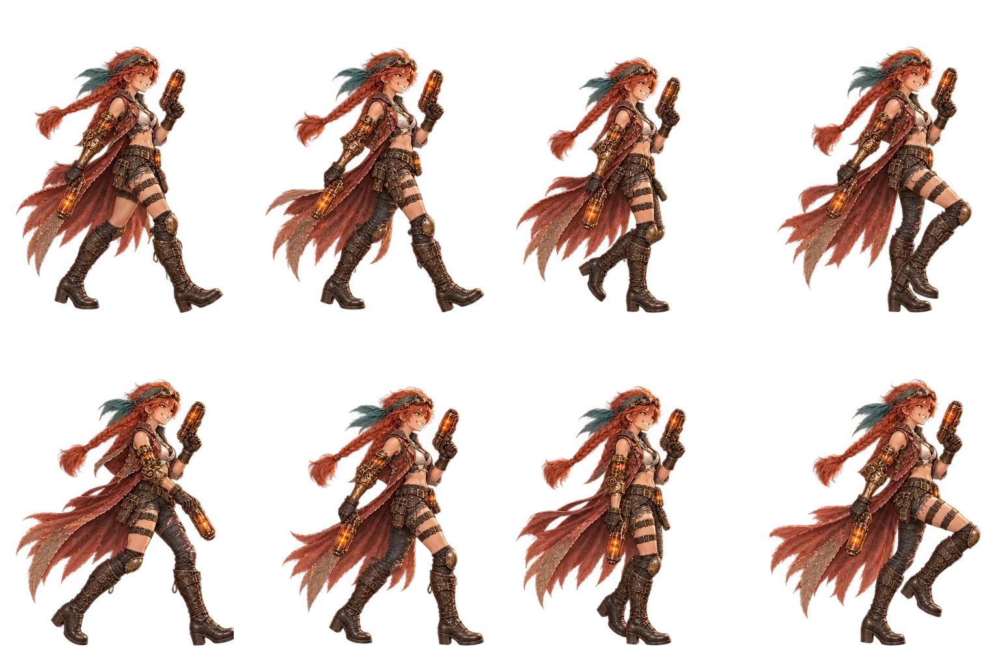

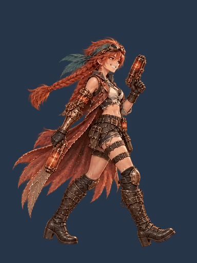

1536×1024; 431 KB. Selected attempt 2.

No visible guide lines, labels, dashed outlines or colored construction blocks.

- FLAG: After three attempts, walk phases and weapon/cloth continuity still pop. Review the 10 fps GIF before approval.
- FLAG: frame 0: source touches cell edge
- FLAG: frame 1: source touches cell edge
- FLAG: frame 2: source touches cell edge
- FLAG: frame 3: source touches cell edge
- FLAG: frame 4: source touches cell edge
- FLAG: frame 5: source touches cell edge
- FLAG: frame 6: source touches cell edge
- FLAG: frame 7: source touches cell edge
- Strongest motion/reference match selected after comparing all three attempts.
- Cells rebuilt separately with clear margins; shared 94% baseline for character sheets.
- Removed detached edge fragments: frame 0: erased 29 px; frame 2: erased 15 px; frame 5: erased 128 px; frame 6: erased 140 px

<details><summary>References and generation prompt</summary>

1. `public/assets/characters/ally_gunner/base.webp`
2. `public/assets/characters/ally_gunner/battle.webp`
3. `art/guides/walk_cycle.png`

```text
ART STYLE: Lush, luminous digital painting in the spirit of a premium early-2000s Japanese RPG remastered in HD. Semi-realistic, anime-influenced characters with expressive faces and stylish asymmetrical adventure outfits: layered belts, buckles, straps, zippers, one-sleeved jackets, flowing scarves. Sun-drenched tropical environments painted in rich detail: saturated turquoise seas, white sand, emerald jungle, and ancient sandstone ruins carved with softly glowing glyphs. Golden-hour sunlight, with bioluminescent blue-green motes of light drifting through the air. Cinematic, epic and adventurous, with a mischievous sense of humor: witty, characterful expressions and small comedic details hidden in the scene. Mature and cool, never babyish or chibi.

This is an isolated game sprite: render ONLY the subject on a fully transparent background (PNG with alpha). No scenery, no ground, no cast shadow, no frame. Lit from the upper left with a soft rim light, crisp readable silhouette, full body with nothing cropped and clear empty space around it.

A cocky, bouncy swagger, one blaster twirling in her brass hand, braid swinging.

A side-view walk cycle sprite sheet: the SAME character in 8 frames in a grid of 4 columns and 2 rows of equal cells, on a fully transparent background, with no grid lines, labels or text. Full body, same size and scale in every frame, feet on the same invisible baseline, walking toward the RIGHT. The frames read left to right, top row then bottom row, as one smooth looping step cycle. Match the attached character reference exactly.

The attached guide image is a construction drawing: use it only for layout (where the floor, horizon, characters or cells are). Do not reproduce any of its lines, colors, shapes, labels or text.

OUTPUT: 1536x1024. Genuine transparent alpha background.

ANIMATION CORRECTION: eight DISTINCT biomechanical phases, NOT eight copies of the same stride. Frame 1 left foot forward/right foot back; 2 left leg weight bearing and bent/down; 3 right knee passes directly UNDER torso, legs close; 4 right knee lifted forward/up; 5 RIGHT foot forward/LEFT back (opposite of 1); 6 right leg bearing/down; 7 LEFT knee passes directly under torso, legs close; 8 left knee up forward. Same right-facing profile in all eight. Keep torso stable, same head height. Fit EACH entire body, sword, scarf, spellbook and staff within central 300x410 of each 384x512 cell; leave 42px sides and 50px above. No parts crossing cell boundaries.

Rules: completely original designs; never imitate an existing franchise, character, creature, logo or emblem. No text, letters, numbers, logos, watermarks, signatures, borders or user interface, unless the prompt asks for glowing magic runes. Fierce and intense is great; no blood, gore or wounds.
```

</details>

## ally_spellwright / walk — draft

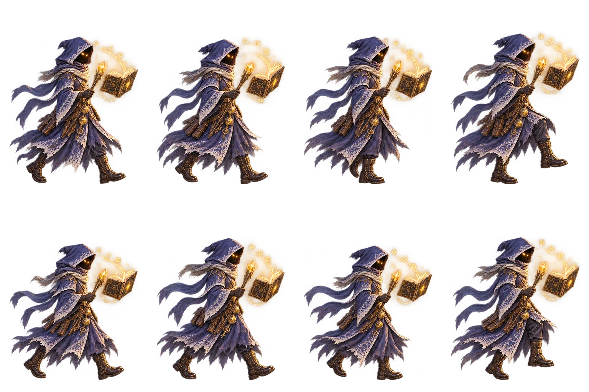

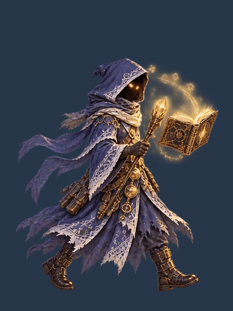

1536×1024; 534 KB. Selected attempt 2.

No visible guide lines, labels, dashed outlines or colored construction blocks.

- FLAG: After three attempts, walk phases and weapon/cloth continuity still pop. Review the 10 fps GIF before approval.
- FLAG: frame 4: source touches cell edge
- Strongest motion/reference match selected after comparing all three attempts.
- Cells rebuilt separately with clear margins; shared 94% baseline for character sheets.

<details><summary>References and generation prompt</summary>

1. `public/assets/characters/ally_spellwright/base.webp`
2. `public/assets/characters/ally_spellwright/battle.webp`
3. `art/guides/walk_cycle.png`

```text
ART STYLE: Lush, luminous digital painting in the spirit of a premium early-2000s Japanese RPG remastered in HD. Semi-realistic, anime-influenced characters with expressive faces and stylish asymmetrical adventure outfits: layered belts, buckles, straps, zippers, one-sleeved jackets, flowing scarves. Sun-drenched tropical environments painted in rich detail: saturated turquoise seas, white sand, emerald jungle, and ancient sandstone ruins carved with softly glowing glyphs. Golden-hour sunlight, with bioluminescent blue-green motes of light drifting through the air. Cinematic, epic and adventurous, with a mischievous sense of humor: witty, characterful expressions and small comedic details hidden in the scene. Mature and cool, never babyish or chibi.

This is an isolated game sprite: render ONLY the subject on a fully transparent background (PNG with alpha). No scenery, no ground, no cast shadow, no frame. Lit from the upper left with a soft rim light, crisp readable silhouette, full body with nothing cropped and clear empty space around it.

Small, quick shuffling steps under the long hooded robe, the spellbook floating along at shoulder height, rune-letters orbiting.

A side-view walk cycle sprite sheet: the SAME character in 8 frames in a grid of 4 columns and 2 rows of equal cells, on a fully transparent background, with no grid lines, labels or text. Full body, same size and scale in every frame, feet on the same invisible baseline, walking toward the RIGHT. The frames read left to right, top row then bottom row, as one smooth looping step cycle. Match the attached character reference exactly.

The attached guide image is a construction drawing: use it only for layout (where the floor, horizon, characters or cells are). Do not reproduce any of its lines, colors, shapes, labels or text.

OUTPUT: 1536x1024. Genuine transparent alpha background.

ANIMATION CORRECTION: eight DISTINCT biomechanical phases, NOT eight copies of the same stride. Frame 1 left foot forward/right foot back; 2 left leg weight bearing and bent/down; 3 right knee passes directly UNDER torso, legs close; 4 right knee lifted forward/up; 5 RIGHT foot forward/LEFT back (opposite of 1); 6 right leg bearing/down; 7 LEFT knee passes directly under torso, legs close; 8 left knee up forward. Same right-facing profile in all eight. Keep torso stable, same head height. Fit EACH entire body, sword, scarf, spellbook and staff within central 300x410 of each 384x512 cell; leave 42px sides and 50px above. No parts crossing cell boundaries.

Rules: completely original designs; never imitate an existing franchise, character, creature, logo or emblem. No text, letters, numbers, logos, watermarks, signatures, borders or user interface, unless the prompt asks for glowing magic runes. Fierce and intense is great; no blood, gore or wounds.
```

</details>

## ally_titancaller / walk — draft

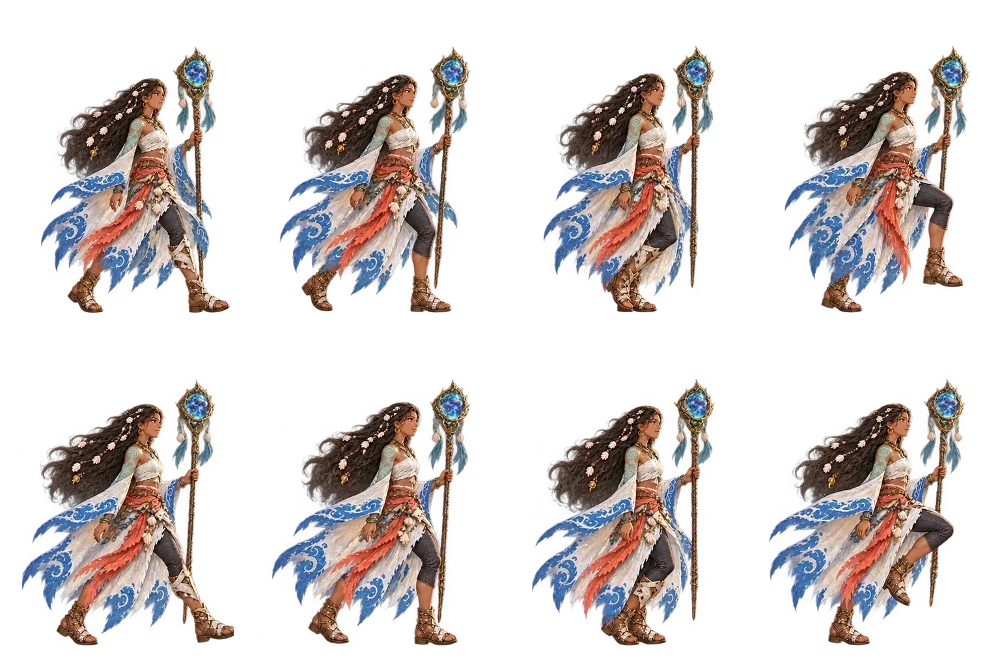

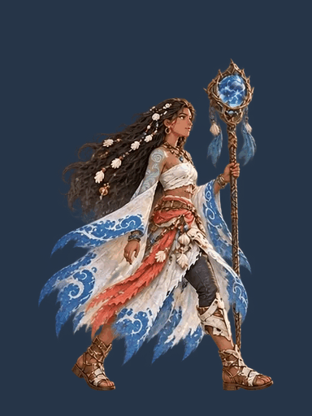

1536×1024; 495 KB. Selected attempt 2.

No visible guide lines, labels, dashed outlines or colored construction blocks.

- FLAG: After three attempts, walk phases and weapon/cloth continuity still pop. Review the 10 fps GIF before approval.
- FLAG: frame 4: source touches cell edge
- FLAG: frame 5: source touches cell edge
- Strongest motion/reference match selected after comparing all three attempts.
- Cells rebuilt separately with clear margins; shared 94% baseline for character sheets.
- Removed detached edge fragments: frame 5: erased 132 px

<details><summary>References and generation prompt</summary>

1. `public/assets/characters/ally_titancaller/base.webp`
2. `public/assets/characters/ally_titancaller/battle.webp`
3. `art/guides/walk_cycle.png`

```text
ART STYLE: Lush, luminous digital painting in the spirit of a premium early-2000s Japanese RPG remastered in HD. Semi-realistic, anime-influenced characters with expressive faces and stylish asymmetrical adventure outfits: layered belts, buckles, straps, zippers, one-sleeved jackets, flowing scarves. Sun-drenched tropical environments painted in rich detail: saturated turquoise seas, white sand, emerald jungle, and ancient sandstone ruins carved with softly glowing glyphs. Golden-hour sunlight, with bioluminescent blue-green motes of light drifting through the air. Cinematic, epic and adventurous, with a mischievous sense of humor: witty, characterful expressions and small comedic details hidden in the scene. Mature and cool, never babyish or chibi.

This is an isolated game sprite: render ONLY the subject on a fully transparent background (PNG with alpha). No scenery, no ground, no cast shadow, no frame. Lit from the upper left with a soft rim light, crisp readable silhouette, full body with nothing cropped and clear empty space around it.

A calm, graceful glide, staff planted with every other step, long wave-patterned sleeves flowing.

A side-view walk cycle sprite sheet: the SAME character in 8 frames in a grid of 4 columns and 2 rows of equal cells, on a fully transparent background, with no grid lines, labels or text. Full body, same size and scale in every frame, feet on the same invisible baseline, walking toward the RIGHT. The frames read left to right, top row then bottom row, as one smooth looping step cycle. Match the attached character reference exactly.

The attached guide image is a construction drawing: use it only for layout (where the floor, horizon, characters or cells are). Do not reproduce any of its lines, colors, shapes, labels or text.

OUTPUT: 1536x1024. Genuine transparent alpha background.

ANIMATION CORRECTION: eight DISTINCT biomechanical phases, NOT eight copies of the same stride. Frame 1 left foot forward/right foot back; 2 left leg weight bearing and bent/down; 3 right knee passes directly UNDER torso, legs close; 4 right knee lifted forward/up; 5 RIGHT foot forward/LEFT back (opposite of 1); 6 right leg bearing/down; 7 LEFT knee passes directly under torso, legs close; 8 left knee up forward. Same right-facing profile in all eight. Keep torso stable, same head height. Fit EACH entire body, sword, scarf, spellbook and staff within central 300x410 of each 384x512 cell; leave 42px sides and 50px above. No parts crossing cell boundaries.

Rules: completely original designs; never imitate an existing franchise, character, creature, logo or emblem. No text, letters, numbers, logos, watermarks, signatures, borders or user interface, unless the prompt asks for glowing magic runes. Fierce and intense is great; no blood, gore or wounds.
```

</details>

## prop_signpost / base — draft

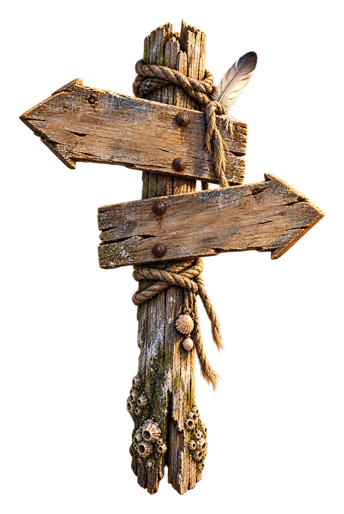

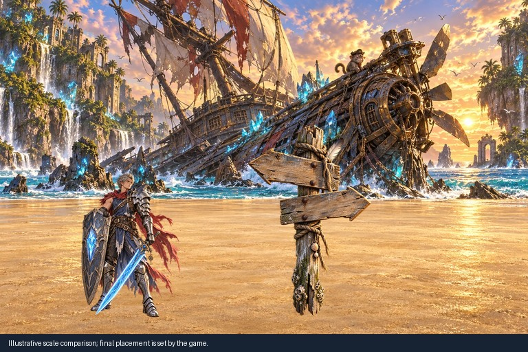

686×1024; 167 KB. Selected attempt 1.

No visible guide lines, labels, dashed outlines or colored construction blocks.


<details><summary>References and generation prompt</summary>

1. `public/assets/anchors/key_art.webp`
2. `public/assets/anchors/cast_lineup.webp`
3. `public/assets/backgrounds/battle/bg_shipwreck_cove.webp`
4. `art/guides/prop_view.png`

```text
ART STYLE: Lush, luminous digital painting in the spirit of a premium early-2000s Japanese RPG remastered in HD. Semi-realistic, anime-influenced characters with expressive faces and stylish asymmetrical adventure outfits: layered belts, buckles, straps, zippers, one-sleeved jackets, flowing scarves. Sun-drenched tropical environments painted in rich detail: saturated turquoise seas, white sand, emerald jungle, and ancient sandstone ruins carved with softly glowing glyphs. Golden-hour sunlight, with bioluminescent blue-green motes of light drifting through the air. Cinematic, epic and adventurous, with a mischievous sense of humor: witty, characterful expressions and small comedic details hidden in the scene. Mature and cool, never babyish or chibi.

This is an isolated game sprite: render ONLY the subject on a fully transparent background (PNG with alpha). No scenery, no ground, no cast shadow, no frame. Lit from the upper left with a soft rim light, crisp readable silhouette, full body with nothing cropped and clear empty space around it.

A weathered driftwood signpost with two blank wooden arrow-boards, one pointing left and one pointing right, a frayed rope wound around the post, barnacles at its foot and a seagull feather stuck in a crack. The boards are completely blank: the game writes on them.

Seen from a slightly raised three-quarter front view, as if from a person's standing eye height a few steps away. Lit like the attached background: same sun direction, color and warmth. Only the object, standing on nothing: no ground patch, no scenery, no cast shadow.

The attached guide image is a construction drawing: use it only for layout (where the floor, horizon, characters or cells are). Do not reproduce any of its lines, colors, shapes, labels or text.

OUTPUT: 1024x1536. Genuine transparent alpha background.

Rules: completely original designs; never imitate an existing franchise, character, creature, logo or emblem. No text, letters, numbers, logos, watermarks, signatures, borders or user interface, unless the prompt asks for glowing magic runes. Fierce and intense is great; no blood, gore or wounds.
```

</details>

## prop_chest / base — draft

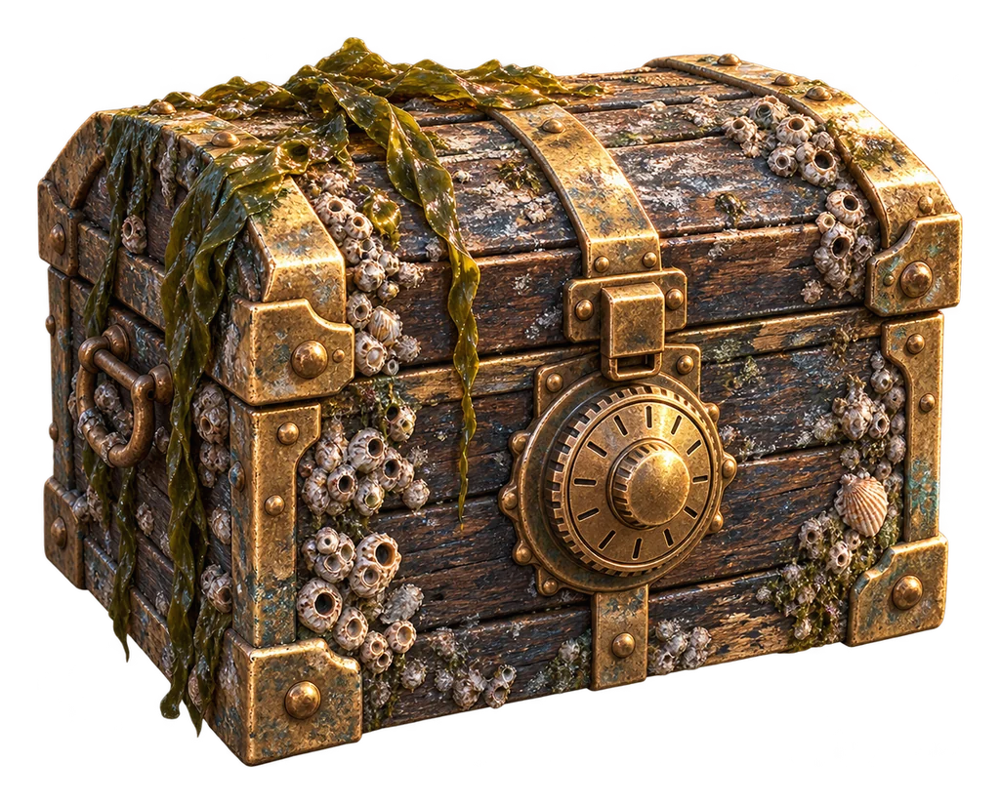

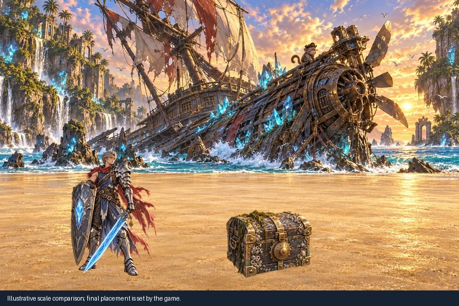

1024×824; 337 KB. Selected attempt 1.

No visible guide lines, labels, dashed outlines or colored construction blocks.


<details><summary>References and generation prompt</summary>

1. `public/assets/anchors/key_art.webp`
2. `public/assets/anchors/cast_lineup.webp`
3. `public/assets/backgrounds/battle/bg_shipwreck_cove.webp`
4. `art/guides/prop_view.png`

```text
ART STYLE: Lush, luminous digital painting in the spirit of a premium early-2000s Japanese RPG remastered in HD. Semi-realistic, anime-influenced characters with expressive faces and stylish asymmetrical adventure outfits: layered belts, buckles, straps, zippers, one-sleeved jackets, flowing scarves. Sun-drenched tropical environments painted in rich detail: saturated turquoise seas, white sand, emerald jungle, and ancient sandstone ruins carved with softly glowing glyphs. Golden-hour sunlight, with bioluminescent blue-green motes of light drifting through the air. Cinematic, epic and adventurous, with a mischievous sense of humor: witty, characterful expressions and small comedic details hidden in the scene. Mature and cool, never babyish or chibi.

This is an isolated game sprite: render ONLY the subject on a fully transparent background (PNG with alpha). No scenery, no ground, no cast shadow, no frame. Lit from the upper left with a soft rim light, crisp readable silhouette, full body with nothing cropped and clear empty space around it.

A barnacle-crusted wooden sea chest with brass corners, closed tight, with a big round brass combination dial on the front (notches only, no numbers) and a strand of seaweed draped over the lid.

Seen from a slightly raised three-quarter front view, as if from a person's standing eye height a few steps away. Lit like the attached background: same sun direction, color and warmth. Only the object, standing on nothing: no ground patch, no scenery, no cast shadow.

The attached guide image is a construction drawing: use it only for layout (where the floor, horizon, characters or cells are). Do not reproduce any of its lines, colors, shapes, labels or text.

OUTPUT: 1024x1024. Genuine transparent alpha background.

Rules: completely original designs; never imitate an existing franchise, character, creature, logo or emblem. No text, letters, numbers, logos, watermarks, signatures, borders or user interface, unless the prompt asks for glowing magic runes. Fierce and intense is great; no blood, gore or wounds.
```

</details>

## prop_chest_open / base — draft

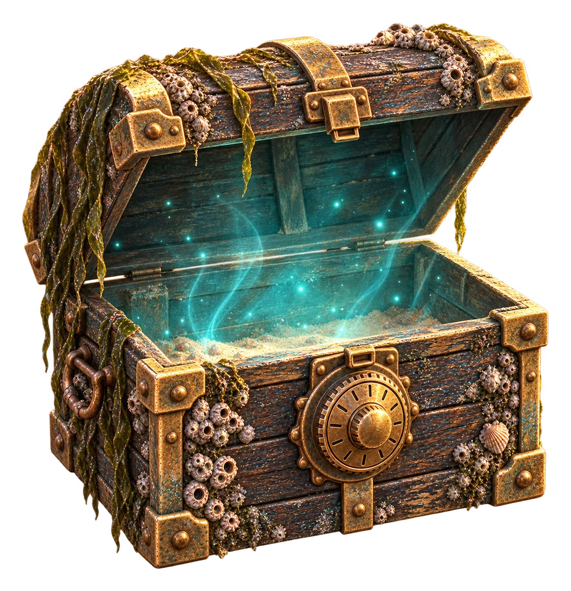

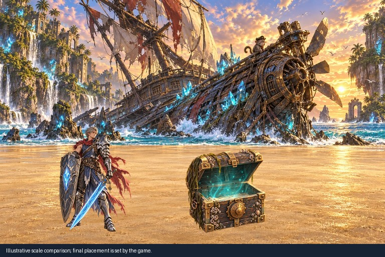

990×1024; 372 KB. Selected attempt 1.

No visible guide lines, labels, dashed outlines or colored construction blocks.


<details><summary>References and generation prompt</summary>

1. `public/assets/anchors/key_art.webp`
2. `public/assets/anchors/cast_lineup.webp`
3. `public/assets/backgrounds/battle/bg_shipwreck_cove.webp`
4. `public/assets/props/prop_chest.webp`
5. `art/guides/prop_view.png`

```text
ART STYLE: Lush, luminous digital painting in the spirit of a premium early-2000s Japanese RPG remastered in HD. Semi-realistic, anime-influenced characters with expressive faces and stylish asymmetrical adventure outfits: layered belts, buckles, straps, zippers, one-sleeved jackets, flowing scarves. Sun-drenched tropical environments painted in rich detail: saturated turquoise seas, white sand, emerald jungle, and ancient sandstone ruins carved with softly glowing glyphs. Golden-hour sunlight, with bioluminescent blue-green motes of light drifting through the air. Cinematic, epic and adventurous, with a mischievous sense of humor: witty, characterful expressions and small comedic details hidden in the scene. Mature and cool, never babyish or chibi.

This is an isolated game sprite: render ONLY the subject on a fully transparent background (PNG with alpha). No scenery, no ground, no cast shadow, no frame. Lit from the upper left with a soft rim light, crisp readable silhouette, full body with nothing cropped and clear empty space around it.

The same chest as `prop_chest` (pass it as a reference and match it exactly), lid thrown open, empty except a little sand and a soft teal glow rising from inside.

Seen from a slightly raised three-quarter front view, as if from a person's standing eye height a few steps away. Lit like the attached background: same sun direction, color and warmth. Only the object, standing on nothing: no ground patch, no scenery, no cast shadow.

The attached guide image is a construction drawing: use it only for layout (where the floor, horizon, characters or cells are). Do not reproduce any of its lines, colors, shapes, labels or text.

OUTPUT: 1024x1024. Genuine transparent alpha background.

Rules: completely original designs; never imitate an existing franchise, character, creature, logo or emblem. No text, letters, numbers, logos, watermarks, signatures, borders or user interface, unless the prompt asks for glowing magic runes. Fierce and intense is great; no blood, gore or wounds.
```

</details>

## prop_tide_pool / base — draft

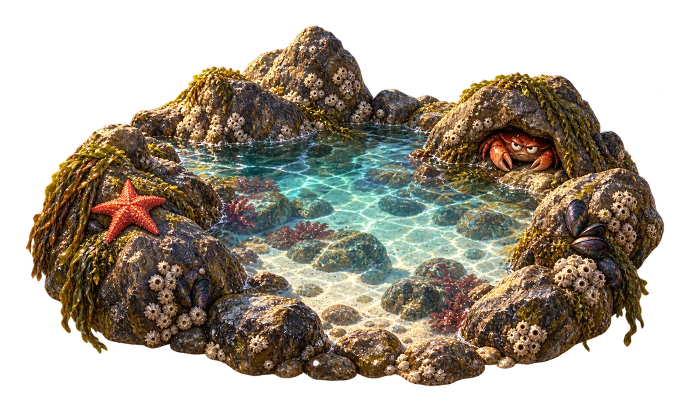

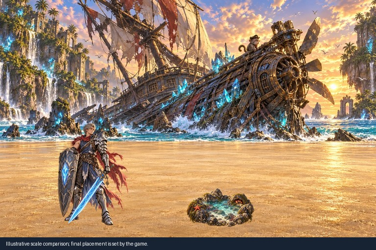

1024×613; 236 KB. Selected attempt 1.

No visible guide lines, labels, dashed outlines or colored construction blocks.


<details><summary>References and generation prompt</summary>

1. `public/assets/anchors/key_art.webp`
2. `public/assets/anchors/cast_lineup.webp`
3. `public/assets/backgrounds/battle/bg_shipwreck_cove.webp`
4. `art/guides/prop_view.png`

```text
ART STYLE: Lush, luminous digital painting in the spirit of a premium early-2000s Japanese RPG remastered in HD. Semi-realistic, anime-influenced characters with expressive faces and stylish asymmetrical adventure outfits: layered belts, buckles, straps, zippers, one-sleeved jackets, flowing scarves. Sun-drenched tropical environments painted in rich detail: saturated turquoise seas, white sand, emerald jungle, and ancient sandstone ruins carved with softly glowing glyphs. Golden-hour sunlight, with bioluminescent blue-green motes of light drifting through the air. Cinematic, epic and adventurous, with a mischievous sense of humor: witty, characterful expressions and small comedic details hidden in the scene. Mature and cool, never babyish or chibi.

This is an isolated game sprite: render ONLY the subject on a fully transparent background (PNG with alpha). No scenery, no ground, no cast shadow, no frame. Lit from the upper left with a soft rim light, crisp readable silhouette, full body with nothing cropped and clear empty space around it.

A small rocky tide pool lying flat on the ground: clear turquoise water in a ring of barnacled dark rocks, a red starfish, a small crab peeking out with a judgmental look. Wide and low, seen mostly from above at the guide's flat angle.

Seen from a slightly raised three-quarter front view, as if from a person's standing eye height a few steps away. Lit like the attached background: same sun direction, color and warmth. Only the object, standing on nothing: no ground patch, no scenery, no cast shadow.

The attached guide image is a construction drawing: use it only for layout (where the floor, horizon, characters or cells are). Do not reproduce any of its lines, colors, shapes, labels or text.

OUTPUT: 1536x1024. Genuine transparent alpha background.

Rules: completely original designs; never imitate an existing franchise, character, creature, logo or emblem. No text, letters, numbers, logos, watermarks, signatures, borders or user interface, unless the prompt asks for glowing magic runes. Fierce and intense is great; no blood, gore or wounds.
```

</details>

## prop_bottle / base — draft

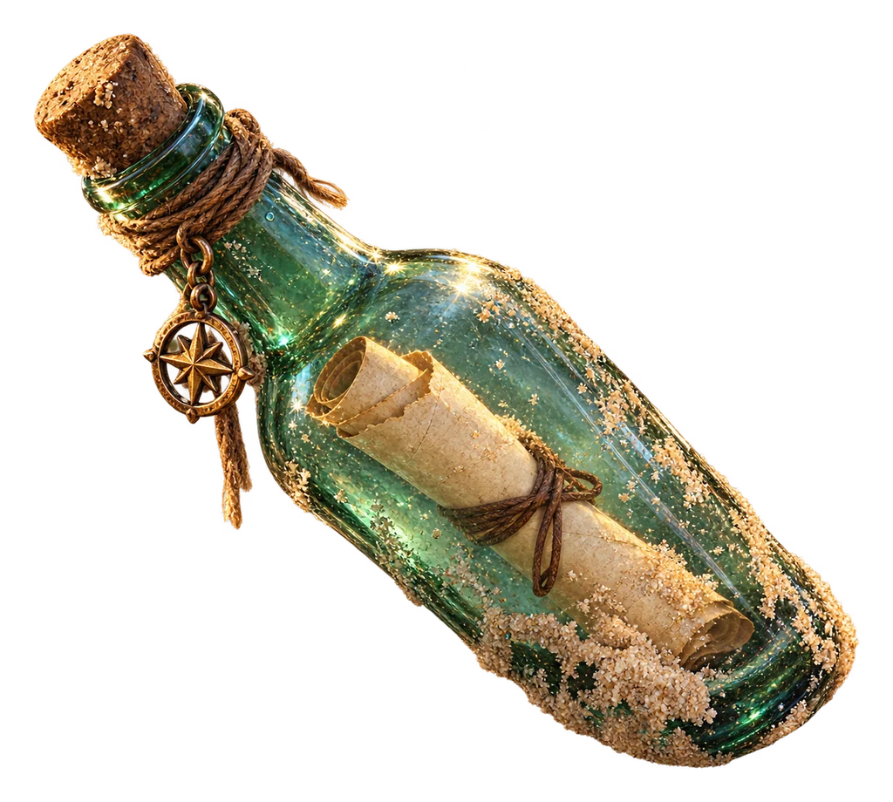

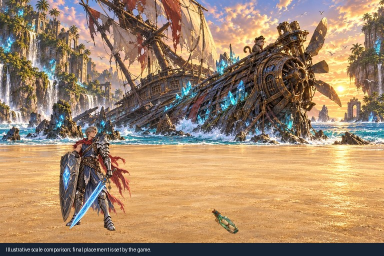

1024×920; 219 KB. Selected attempt 1.

No visible guide lines, labels, dashed outlines or colored construction blocks.


<details><summary>References and generation prompt</summary>

1. `public/assets/anchors/key_art.webp`
2. `public/assets/anchors/cast_lineup.webp`
3. `public/assets/backgrounds/battle/bg_shipwreck_cove.webp`
4. `art/guides/prop_view.png`

```text
ART STYLE: Lush, luminous digital painting in the spirit of a premium early-2000s Japanese RPG remastered in HD. Semi-realistic, anime-influenced characters with expressive faces and stylish asymmetrical adventure outfits: layered belts, buckles, straps, zippers, one-sleeved jackets, flowing scarves. Sun-drenched tropical environments painted in rich detail: saturated turquoise seas, white sand, emerald jungle, and ancient sandstone ruins carved with softly glowing glyphs. Golden-hour sunlight, with bioluminescent blue-green motes of light drifting through the air. Cinematic, epic and adventurous, with a mischievous sense of humor: witty, characterful expressions and small comedic details hidden in the scene. Mature and cool, never babyish or chibi.

This is an isolated game sprite: render ONLY the subject on a fully transparent background (PNG with alpha). No scenery, no ground, no cast shadow, no frame. Lit from the upper left with a soft rim light, crisp readable silhouette, full body with nothing cropped and clear empty space around it.

A green glass bottle lying on its side, half-buried in a little mound of sand, corked, with a rolled parchment note visible inside.

Seen from a slightly raised three-quarter front view, as if from a person's standing eye height a few steps away. Lit like the attached background: same sun direction, color and warmth. Only the object, standing on nothing: no ground patch, no scenery, no cast shadow.

The attached guide image is a construction drawing: use it only for layout (where the floor, horizon, characters or cells are). Do not reproduce any of its lines, colors, shapes, labels or text.

OUTPUT: 1024x1024. Genuine transparent alpha background.

Rules: completely original designs; never imitate an existing franchise, character, creature, logo or emblem. No text, letters, numbers, logos, watermarks, signatures, borders or user interface, unless the prompt asks for glowing magic runes. Fierce and intense is great; no blood, gore or wounds.
```

</details>

## prop_sage_gate / base — draft

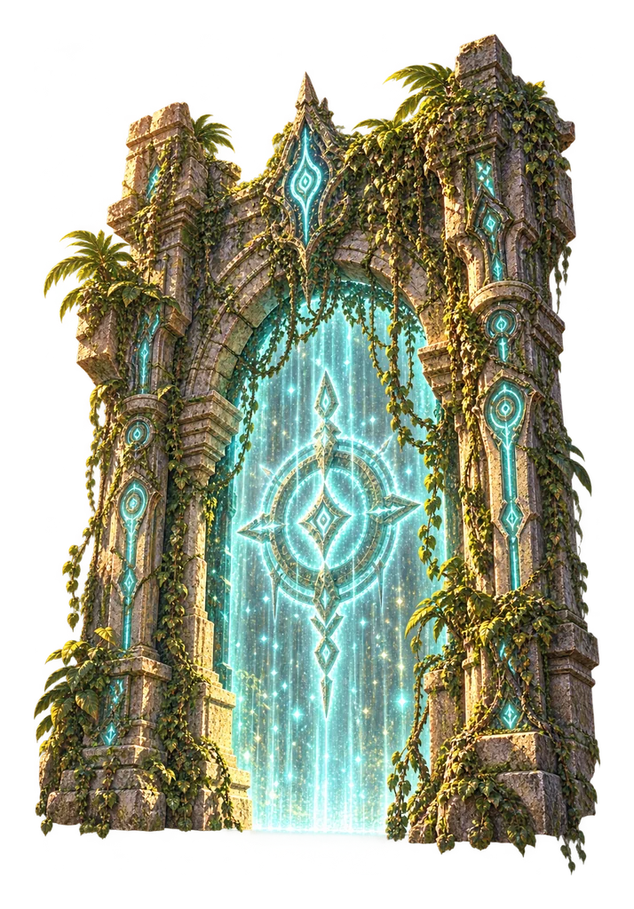

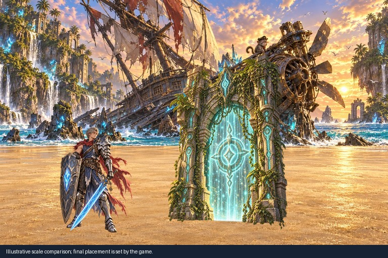

714×1024; 335 KB. Selected attempt 1.

No visible guide lines, labels, dashed outlines or colored construction blocks.


<details><summary>References and generation prompt</summary>

1. `public/assets/anchors/key_art.webp`
2. `public/assets/anchors/cast_lineup.webp`
3. `public/assets/backgrounds/battle/bg_shipwreck_cove.webp`
4. `art/guides/prop_view.png`

```text
ART STYLE: Lush, luminous digital painting in the spirit of a premium early-2000s Japanese RPG remastered in HD. Semi-realistic, anime-influenced characters with expressive faces and stylish asymmetrical adventure outfits: layered belts, buckles, straps, zippers, one-sleeved jackets, flowing scarves. Sun-drenched tropical environments painted in rich detail: saturated turquoise seas, white sand, emerald jungle, and ancient sandstone ruins carved with softly glowing glyphs. Golden-hour sunlight, with bioluminescent blue-green motes of light drifting through the air. Cinematic, epic and adventurous, with a mischievous sense of humor: witty, characterful expressions and small comedic details hidden in the scene. Mature and cool, never babyish or chibi.

This is an isolated game sprite: render ONLY the subject on a fully transparent background (PNG with alpha). No scenery, no ground, no cast shadow, no frame. Lit from the upper left with a soft rim light, crisp readable silhouette, full body with nothing cropped and clear empty space around it.

An ancient sandstone archway gate overgrown with vines, every stone carved with softly glowing teal Sage glyphs, the opening sealed by a shimmering curtain of teal light with a large glowing glyph-lock in its center.

Seen from a slightly raised three-quarter front view, as if from a person's standing eye height a few steps away. Lit like the attached background: same sun direction, color and warmth. Only the object, standing on nothing: no ground patch, no scenery, no cast shadow.

The attached guide image is a construction drawing: use it only for layout (where the floor, horizon, characters or cells are). Do not reproduce any of its lines, colors, shapes, labels or text.

OUTPUT: 1024x1536. Genuine transparent alpha background.

Rules: completely original designs; never imitate an existing franchise, character, creature, logo or emblem. No text, letters, numbers, logos, watermarks, signatures, borders or user interface, unless the prompt asks for glowing magic runes. Fierce and intense is great; no blood, gore or wounds.
```

</details>

## prop_sage_gate_open / base — draft

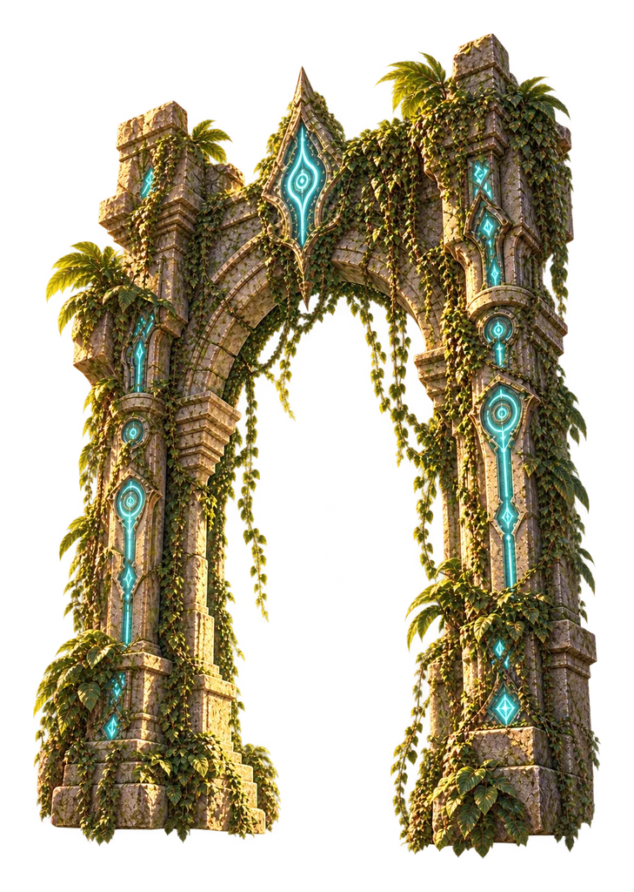

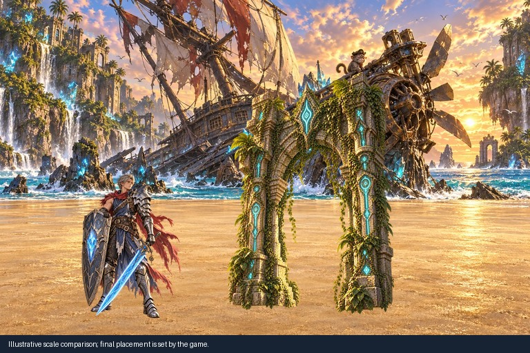

729×1024; 322 KB. Selected attempt 1.

No visible guide lines, labels, dashed outlines or colored construction blocks.


<details><summary>References and generation prompt</summary>

1. `public/assets/anchors/key_art.webp`
2. `public/assets/anchors/cast_lineup.webp`
3. `public/assets/backgrounds/battle/bg_shipwreck_cove.webp`
4. `public/assets/props/prop_sage_gate.webp`
5. `art/guides/prop_view.png`

```text
ART STYLE: Lush, luminous digital painting in the spirit of a premium early-2000s Japanese RPG remastered in HD. Semi-realistic, anime-influenced characters with expressive faces and stylish asymmetrical adventure outfits: layered belts, buckles, straps, zippers, one-sleeved jackets, flowing scarves. Sun-drenched tropical environments painted in rich detail: saturated turquoise seas, white sand, emerald jungle, and ancient sandstone ruins carved with softly glowing glyphs. Golden-hour sunlight, with bioluminescent blue-green motes of light drifting through the air. Cinematic, epic and adventurous, with a mischievous sense of humor: witty, characterful expressions and small comedic details hidden in the scene. Mature and cool, never babyish or chibi.

This is an isolated game sprite: render ONLY the subject on a fully transparent background (PNG with alpha). No scenery, no ground, no cast shadow, no frame. Lit from the upper left with a soft rim light, crisp readable silhouette, full body with nothing cropped and clear empty space around it.

The same archway as `prop_sage_gate` (pass it as a reference and match it exactly) with the curtain of light gone, the glyphs glowing calmly. Through the arch, only a hint of a sunlit path.

Seen from a slightly raised three-quarter front view, as if from a person's standing eye height a few steps away. Lit like the attached background: same sun direction, color and warmth. Only the object, standing on nothing: no ground patch, no scenery, no cast shadow.

The attached guide image is a construction drawing: use it only for layout (where the floor, horizon, characters or cells are). Do not reproduce any of its lines, colors, shapes, labels or text.

OUTPUT: 1024x1536. Genuine transparent alpha background.

Rules: completely original designs; never imitate an existing franchise, character, creature, logo or emblem. No text, letters, numbers, logos, watermarks, signatures, borders or user interface, unless the prompt asks for glowing magic runes. Fierce and intense is great; no blood, gore or wounds.
```

</details>

## prop_word_cage / base — draft

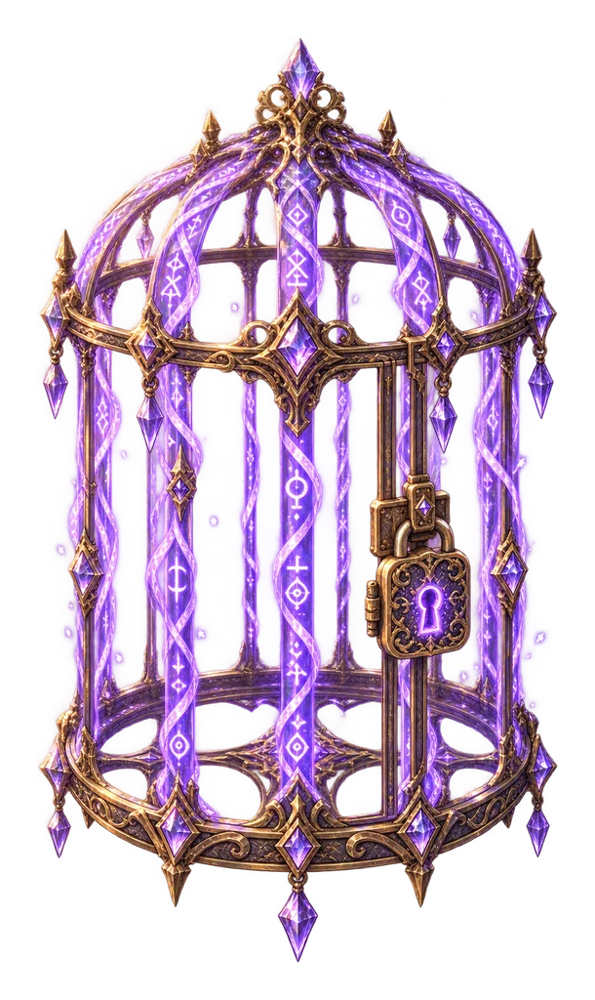

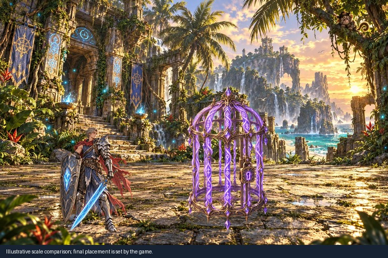

610×1024; 278 KB. Selected attempt 1.

No visible guide lines, labels, dashed outlines or colored construction blocks.


<details><summary>References and generation prompt</summary>

1. `public/assets/anchors/key_art.webp`
2. `public/assets/anchors/cast_lineup.webp`
3. `public/assets/backgrounds/battle/bg_jungle_ruins.webp`
4. `art/guides/prop_view.png`

```text
ART STYLE: Lush, luminous digital painting in the spirit of a premium early-2000s Japanese RPG remastered in HD. Semi-realistic, anime-influenced characters with expressive faces and stylish asymmetrical adventure outfits: layered belts, buckles, straps, zippers, one-sleeved jackets, flowing scarves. Sun-drenched tropical environments painted in rich detail: saturated turquoise seas, white sand, emerald jungle, and ancient sandstone ruins carved with softly glowing glyphs. Golden-hour sunlight, with bioluminescent blue-green motes of light drifting through the air. Cinematic, epic and adventurous, with a mischievous sense of humor: witty, characterful expressions and small comedic details hidden in the scene. Mature and cool, never babyish or chibi.

This is an isolated game sprite: render ONLY the subject on a fully transparent background (PNG with alpha). No scenery, no ground, no cast shadow, no frame. Lit from the upper left with a soft rim light, crisp readable silhouette, full body with nothing cropped and clear empty space around it.

A tall, round magical cage like an ornate birdcage, made of glowing violet energy bars. Each bar is a twisting ribbon of scrambled magical rune-glyphs, and a heavy rune-padlock hangs on the front. **The inside is completely empty, and the gaps between the bars are fully transparent**, because the game puts a character inside.

Seen from a slightly raised three-quarter front view, as if from a person's standing eye height a few steps away. Lit like the attached background: same sun direction, color and warmth. Only the object, standing on nothing: no ground patch, no scenery, no cast shadow.

The attached guide image is a construction drawing: use it only for layout (where the floor, horizon, characters or cells are). Do not reproduce any of its lines, colors, shapes, labels or text.

OUTPUT: 1024x1536. Genuine transparent alpha background.

Rules: completely original designs; never imitate an existing franchise, character, creature, logo or emblem. No text, letters, numbers, logos, watermarks, signatures, borders or user interface, unless the prompt asks for glowing magic runes. Fierce and intense is great; no blood, gore or wounds.
```

</details>

## prop_glyph_wall / base — draft

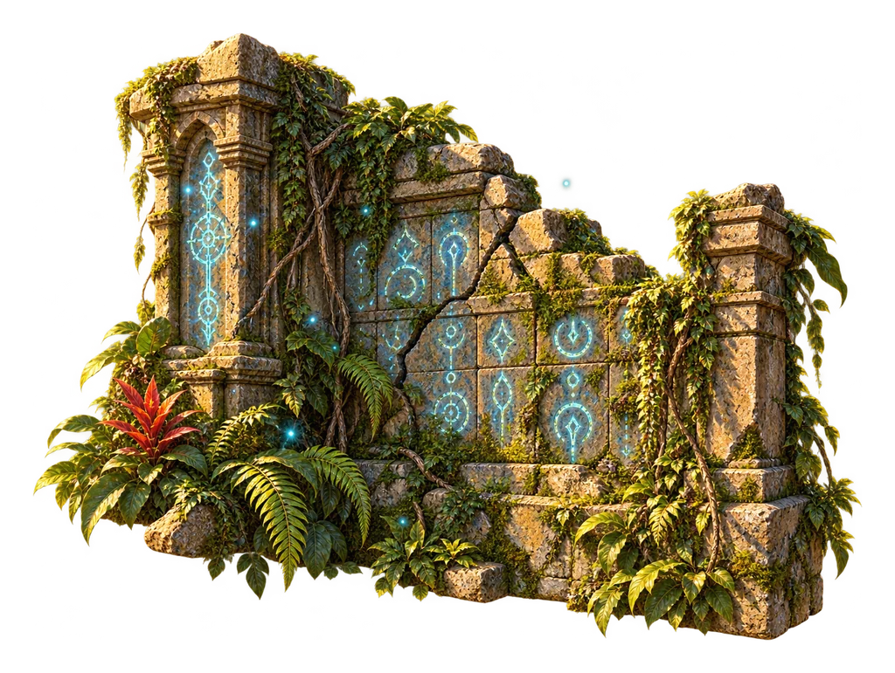

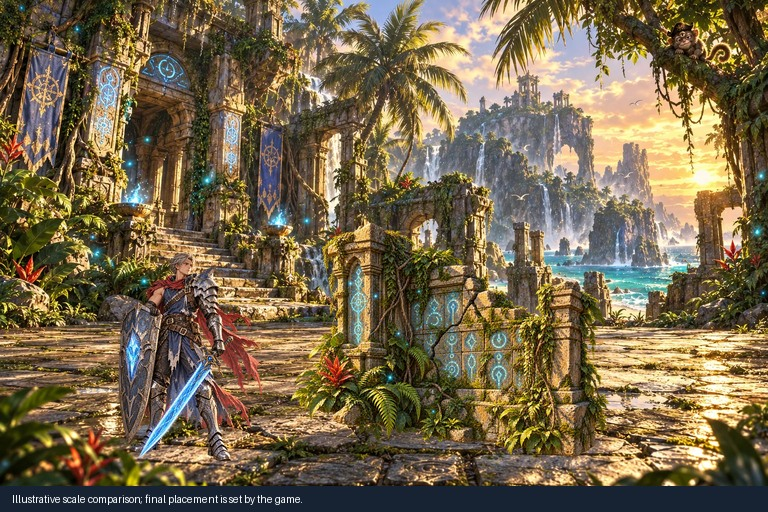

1024×771; 313 KB. Selected attempt 1.

No visible guide lines, labels, dashed outlines or colored construction blocks.


<details><summary>References and generation prompt</summary>

1. `public/assets/anchors/key_art.webp`
2. `public/assets/anchors/cast_lineup.webp`
3. `public/assets/backgrounds/battle/bg_jungle_ruins.webp`
4. `art/guides/prop_view.png`

```text
ART STYLE: Lush, luminous digital painting in the spirit of a premium early-2000s Japanese RPG remastered in HD. Semi-realistic, anime-influenced characters with expressive faces and stylish asymmetrical adventure outfits: layered belts, buckles, straps, zippers, one-sleeved jackets, flowing scarves. Sun-drenched tropical environments painted in rich detail: saturated turquoise seas, white sand, emerald jungle, and ancient sandstone ruins carved with softly glowing glyphs. Golden-hour sunlight, with bioluminescent blue-green motes of light drifting through the air. Cinematic, epic and adventurous, with a mischievous sense of humor: witty, characterful expressions and small comedic details hidden in the scene. Mature and cool, never babyish or chibi.

This is an isolated game sprite: render ONLY the subject on a fully transparent background (PNG with alpha). No scenery, no ground, no cast shadow, no frame. Lit from the upper left with a soft rim light, crisp readable silhouette, full body with nothing cropped and clear empty space around it.

A broken section of ancient temple wall in mossy sandstone, carved with rows of softly glowing teal Sage glyphs, with ferns and a red jungle flower at its base and a crack running through it.

Seen from a slightly raised three-quarter front view, as if from a person's standing eye height a few steps away. Lit like the attached background: same sun direction, color and warmth. Only the object, standing on nothing: no ground patch, no scenery, no cast shadow.

The attached guide image is a construction drawing: use it only for layout (where the floor, horizon, characters or cells are). Do not reproduce any of its lines, colors, shapes, labels or text.

OUTPUT: 1536x1024. Genuine transparent alpha background.

Rules: completely original designs; never imitate an existing franchise, character, creature, logo or emblem. No text, letters, numbers, logos, watermarks, signatures, borders or user interface, unless the prompt asks for glowing magic runes. Fierce and intense is great; no blood, gore or wounds.
```

</details>

## prop_stone_frog / base — draft

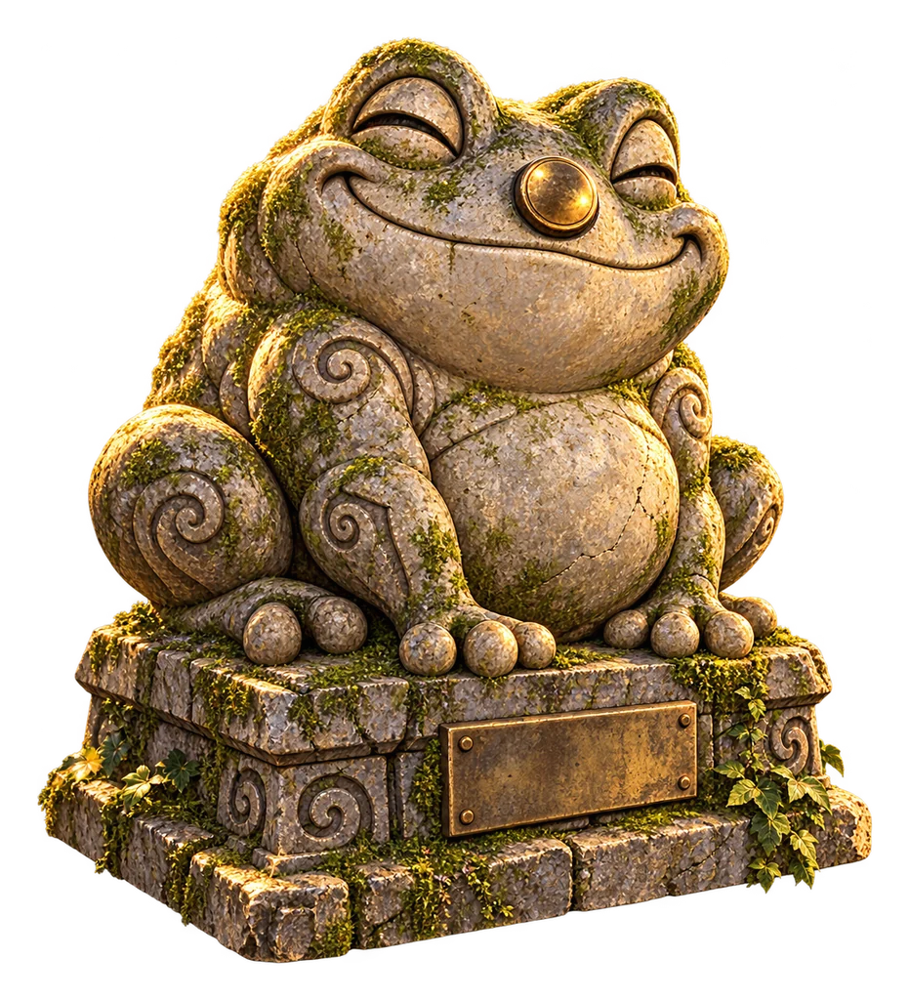

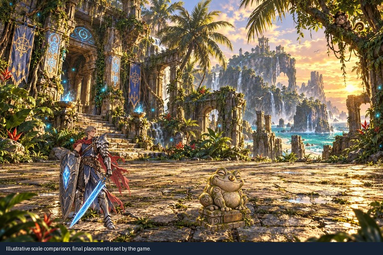

931×1024; 337 KB. Selected attempt 1.

No visible guide lines, labels, dashed outlines or colored construction blocks.


<details><summary>References and generation prompt</summary>

1. `public/assets/anchors/key_art.webp`
2. `public/assets/anchors/cast_lineup.webp`
3. `public/assets/backgrounds/battle/bg_jungle_ruins.webp`
4. `art/guides/prop_view.png`

```text
ART STYLE: Lush, luminous digital painting in the spirit of a premium early-2000s Japanese RPG remastered in HD. Semi-realistic, anime-influenced characters with expressive faces and stylish asymmetrical adventure outfits: layered belts, buckles, straps, zippers, one-sleeved jackets, flowing scarves. Sun-drenched tropical environments painted in rich detail: saturated turquoise seas, white sand, emerald jungle, and ancient sandstone ruins carved with softly glowing glyphs. Golden-hour sunlight, with bioluminescent blue-green motes of light drifting through the air. Cinematic, epic and adventurous, with a mischievous sense of humor: witty, characterful expressions and small comedic details hidden in the scene. Mature and cool, never babyish or chibi.

This is an isolated game sprite: render ONLY the subject on a fully transparent background (PNG with alpha). No scenery, no ground, no cast shadow, no frame. Lit from the upper left with a soft rim light, crisp readable silhouette, full body with nothing cropped and clear empty space around it.

A mossy stone statue of a fat, wide-grinning frog sitting on a little plinth, with one round, polished nose that is obviously a button and a small blank plaque at its feet. Funny and a little smug.

Seen from a slightly raised three-quarter front view, as if from a person's standing eye height a few steps away. Lit like the attached background: same sun direction, color and warmth. Only the object, standing on nothing: no ground patch, no scenery, no cast shadow.

The attached guide image is a construction drawing: use it only for layout (where the floor, horizon, characters or cells are). Do not reproduce any of its lines, colors, shapes, labels or text.

OUTPUT: 1024x1024. Genuine transparent alpha background.

Rules: completely original designs; never imitate an existing franchise, character, creature, logo or emblem. No text, letters, numbers, logos, watermarks, signatures, borders or user interface, unless the prompt asks for glowing magic runes. Fierce and intense is great; no blood, gore or wounds.
```

</details>

## prop_pillar / base — draft

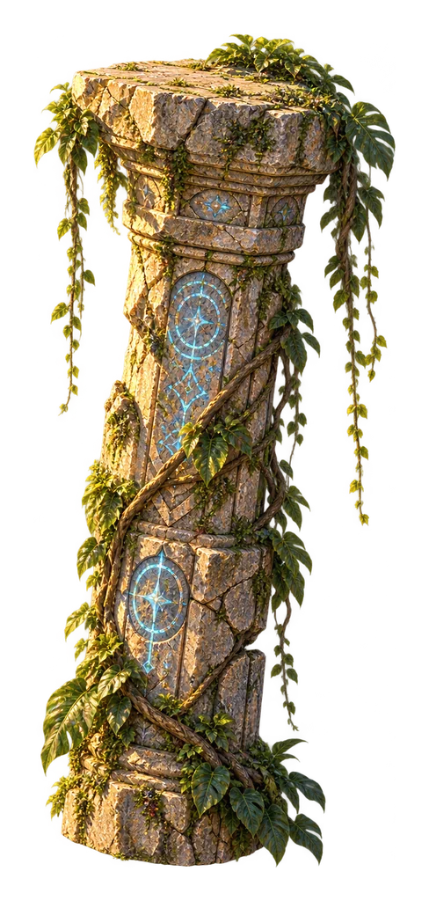

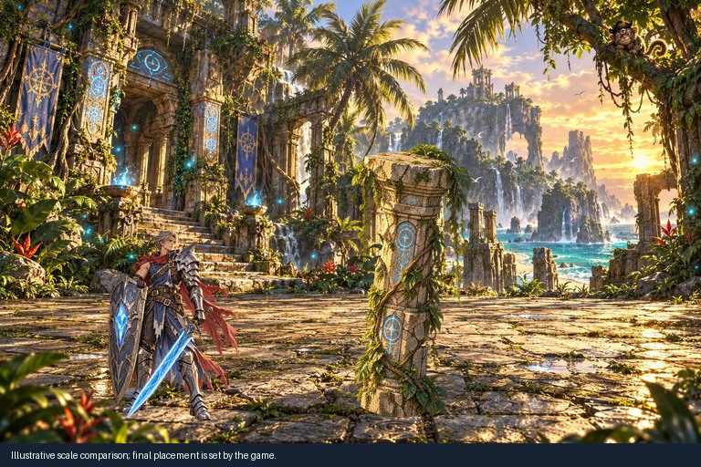

488×1024; 215 KB. Selected attempt 1.

No visible guide lines, labels, dashed outlines or colored construction blocks.


<details><summary>References and generation prompt</summary>

1. `public/assets/anchors/key_art.webp`
2. `public/assets/anchors/cast_lineup.webp`
3. `public/assets/backgrounds/battle/bg_jungle_ruins.webp`
4. `art/guides/prop_view.png`

```text
ART STYLE: Lush, luminous digital painting in the spirit of a premium early-2000s Japanese RPG remastered in HD. Semi-realistic, anime-influenced characters with expressive faces and stylish asymmetrical adventure outfits: layered belts, buckles, straps, zippers, one-sleeved jackets, flowing scarves. Sun-drenched tropical environments painted in rich detail: saturated turquoise seas, white sand, emerald jungle, and ancient sandstone ruins carved with softly glowing glyphs. Golden-hour sunlight, with bioluminescent blue-green motes of light drifting through the air. Cinematic, epic and adventurous, with a mischievous sense of humor: witty, characterful expressions and small comedic details hidden in the scene. Mature and cool, never babyish or chibi.

This is an isolated game sprite: render ONLY the subject on a fully transparent background (PNG with alpha). No scenery, no ground, no cast shadow, no frame. Lit from the upper left with a soft rim light, crisp readable silhouette, full body with nothing cropped and clear empty space around it.

A tall, cracked sandstone pillar leaning slightly, wrapped in vines, with carved glyph bands and a flat broken top big enough for a monkey to sit on.

Seen from a slightly raised three-quarter front view, as if from a person's standing eye height a few steps away. Lit like the attached background: same sun direction, color and warmth. Only the object, standing on nothing: no ground patch, no scenery, no cast shadow.

The attached guide image is a construction drawing: use it only for layout (where the floor, horizon, characters or cells are). Do not reproduce any of its lines, colors, shapes, labels or text.

OUTPUT: 1024x1536. Genuine transparent alpha background.

Rules: completely original designs; never imitate an existing franchise, character, creature, logo or emblem. No text, letters, numbers, logos, watermarks, signatures, borders or user interface, unless the prompt asks for glowing magic runes. Fierce and intense is great; no blood, gore or wounds.
```

</details>

## prop_airship_wreck / base — draft

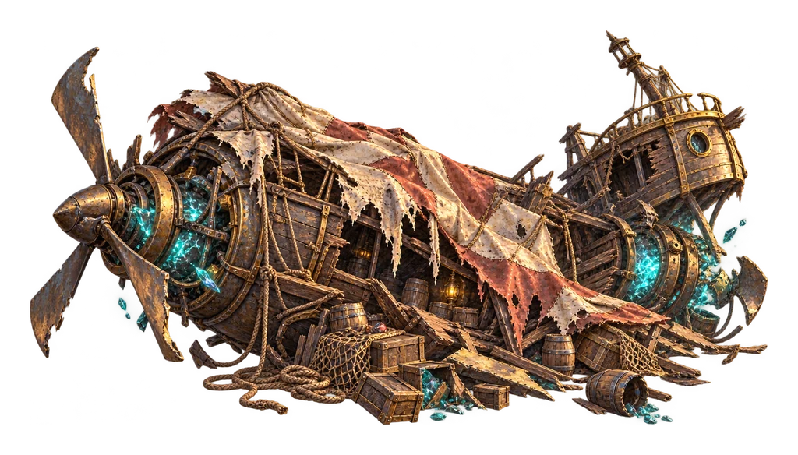

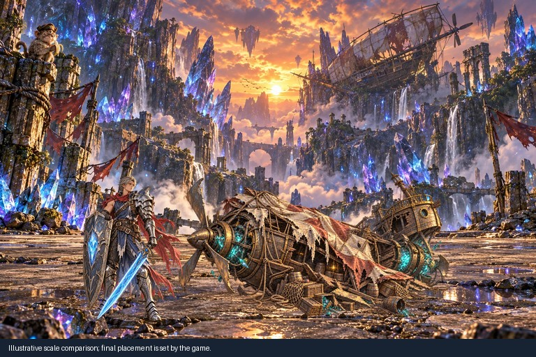

1024×584; 225 KB. Selected attempt 3.

No visible guide lines, labels, dashed outlines or colored construction blocks.


<details><summary>References and generation prompt</summary>

1. `public/assets/anchors/key_art.webp`
2. `public/assets/anchors/cast_lineup.webp`
3. `public/assets/backgrounds/battle/bg_crystal_canyon.webp`
4. `art/guides/prop_view.png`

```text
ART STYLE: Lush, luminous digital painting in the spirit of a premium early-2000s Japanese RPG remastered in HD. Semi-realistic, anime-influenced characters with expressive faces and stylish asymmetrical adventure outfits: layered belts, buckles, straps, zippers, one-sleeved jackets, flowing scarves. Sun-drenched tropical environments painted in rich detail: saturated turquoise seas, white sand, emerald jungle, and ancient sandstone ruins carved with softly glowing glyphs. Golden-hour sunlight, with bioluminescent blue-green motes of light drifting through the air. Cinematic, epic and adventurous, with a mischievous sense of humor: witty, characterful expressions and small comedic details hidden in the scene. Mature and cool, never babyish or chibi.

This is an isolated game sprite: render ONLY the subject on a fully transparent background (PNG with alpha). No scenery, no ground, no cast shadow, no frame. Lit from the upper left with a soft rim light, crisp readable silhouette, full body with nothing cropped and clear empty space around it.

The crashed sky-pirate airship *Brass Albatross*, broken on the ground: a split brass-and-wood hull lying on its side, a torn, patched balloon slumped over it, one bent propeller, spilled crates and rope, and its crystal engine still sputtering teal sparks. Sad but not tragic, like a beloved old car with a flat tire.

Seen from a slightly raised three-quarter front view, as if from a person's standing eye height a few steps away. Lit like the attached background: same sun direction, color and warmth. Only the object, standing on nothing: no ground patch, no scenery, no cast shadow.

The attached guide image is a construction drawing: use it only for layout (where the floor, horizon, characters or cells are). Do not reproduce any of its lines, colors, shapes, labels or text.

OUTPUT: 1536x1024. Genuine transparent alpha background.

FINAL RETRY: fully deflated balloon, only crumpled floppy PATCHWORK CLOTH draped flat over the shattered sideways hull. No gas-filled volume, no oval, dome, round canopy or sail mast. The collapsed balloon is like a wet folded bedsheet. Ship broken in two, leaning on one side, bent propeller, scattered crates and ropes, teal engine sparks. Entire object within generous margins.

Rules: completely original designs; never imitate an existing franchise, character, creature, logo or emblem. No text, letters, numbers, logos, watermarks, signatures, borders or user interface, unless the prompt asks for glowing magic runes. Fierce and intense is great; no blood, gore or wounds.
```

</details>

## prop_crystal_ledge / base — draft

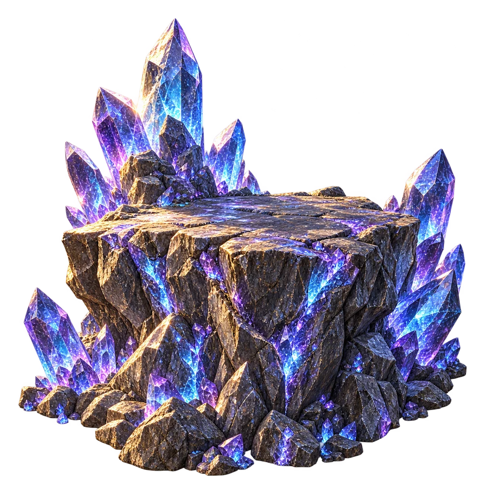

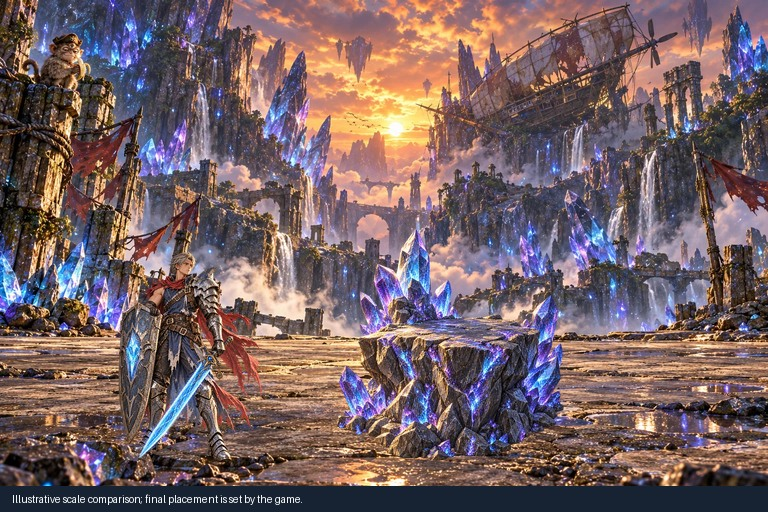

1007×1024; 348 KB. Selected attempt 2.

No visible guide lines, labels, dashed outlines or colored construction blocks.


<details><summary>References and generation prompt</summary>

1. `public/assets/anchors/key_art.webp`
2. `public/assets/anchors/cast_lineup.webp`
3. `public/assets/backgrounds/battle/bg_crystal_canyon.webp`
4. `art/guides/prop_view.png`

```text
ART STYLE: Lush, luminous digital painting in the spirit of a premium early-2000s Japanese RPG remastered in HD. Semi-realistic, anime-influenced characters with expressive faces and stylish asymmetrical adventure outfits: layered belts, buckles, straps, zippers, one-sleeved jackets, flowing scarves. Sun-drenched tropical environments painted in rich detail: saturated turquoise seas, white sand, emerald jungle, and ancient sandstone ruins carved with softly glowing glyphs. Golden-hour sunlight, with bioluminescent blue-green motes of light drifting through the air. Cinematic, epic and adventurous, with a mischievous sense of humor: witty, characterful expressions and small comedic details hidden in the scene. Mature and cool, never babyish or chibi.

This is an isolated game sprite: render ONLY the subject on a fully transparent background (PNG with alpha). No scenery, no ground, no cast shadow, no frame. Lit from the upper left with a soft rim light, crisp readable silhouette, full body with nothing cropped and clear empty space around it.

A cluster of large violet-and-blue crystals growing out of a rock, forming a flat-topped ledge about as tall as a person, with small crystals sprouting around its base.

Seen from a slightly raised three-quarter front view, as if from a person's standing eye height a few steps away. Lit like the attached background: same sun direction, color and warmth. Only the object, standing on nothing: no ground patch, no scenery, no cast shadow.

The attached guide image is a construction drawing: use it only for layout (where the floor, horizon, characters or cells are). Do not reproduce any of its lines, colors, shapes, labels or text.

OUTPUT: 1024x1024. Genuine transparent alpha background.

Keep the whole rock ledge and every tallest crystal tip comfortably within 8% transparent margins on all sides, including above the highest tip. Flat top wide enough to stand on, low camera angle as the guide says.

Rules: completely original designs; never imitate an existing franchise, character, creature, logo or emblem. No text, letters, numbers, logos, watermarks, signatures, borders or user interface, unless the prompt asks for glowing magic runes. Fierce and intense is great; no blood, gore or wounds.
```

</details>

## prop_shrine / base — draft

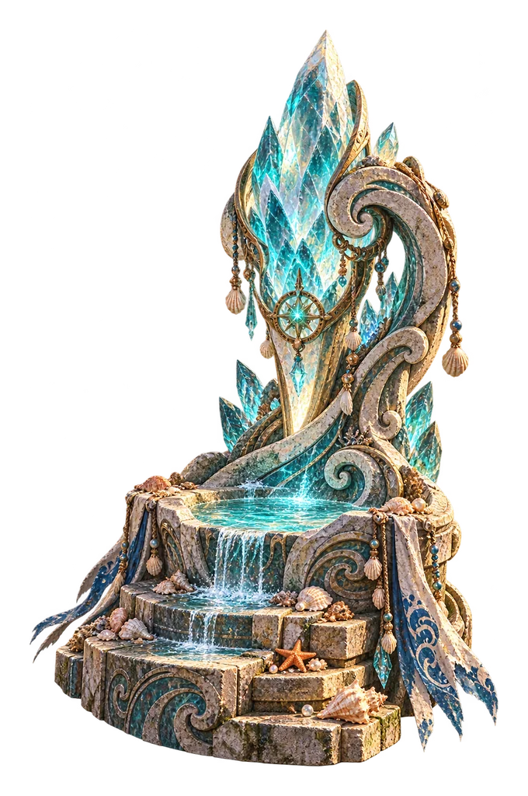

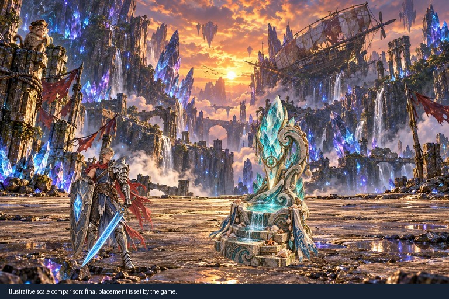

680×1024; 220 KB. Selected attempt 1.

No visible guide lines, labels, dashed outlines or colored construction blocks.


<details><summary>References and generation prompt</summary>

1. `public/assets/anchors/key_art.webp`
2. `public/assets/anchors/cast_lineup.webp`
3. `public/assets/backgrounds/battle/bg_crystal_canyon.webp`
4. `art/guides/prop_view.png`

```text
ART STYLE: Lush, luminous digital painting in the spirit of a premium early-2000s Japanese RPG remastered in HD. Semi-realistic, anime-influenced characters with expressive faces and stylish asymmetrical adventure outfits: layered belts, buckles, straps, zippers, one-sleeved jackets, flowing scarves. Sun-drenched tropical environments painted in rich detail: saturated turquoise seas, white sand, emerald jungle, and ancient sandstone ruins carved with softly glowing glyphs. Golden-hour sunlight, with bioluminescent blue-green motes of light drifting through the air. Cinematic, epic and adventurous, with a mischievous sense of humor: witty, characterful expressions and small comedic details hidden in the scene. Mature and cool, never babyish or chibi.

This is an isolated game sprite: render ONLY the subject on a fully transparent background (PNG with alpha). No scenery, no ground, no cast shadow, no frame. Lit from the upper left with a soft rim light, crisp readable silhouette, full body with nothing cropped and clear empty space around it.

A sacred sea shrine: a tall teal-white crystal growing from a carved stone pedestal shaped like a curling wave, with a shallow stone basin of softly glowing seawater in front and seashell offerings on its steps.

Seen from a slightly raised three-quarter front view, as if from a person's standing eye height a few steps away. Lit like the attached background: same sun direction, color and warmth. Only the object, standing on nothing: no ground patch, no scenery, no cast shadow.

The attached guide image is a construction drawing: use it only for layout (where the floor, horizon, characters or cells are). Do not reproduce any of its lines, colors, shapes, labels or text.

OUTPUT: 1024x1536. Genuine transparent alpha background.

Rules: completely original designs; never imitate an existing franchise, character, creature, logo or emblem. No text, letters, numbers, logos, watermarks, signatures, borders or user interface, unless the prompt asks for glowing magic runes. Fierce and intense is great; no blood, gore or wounds.
```

</details>

## prop_lair / base — draft

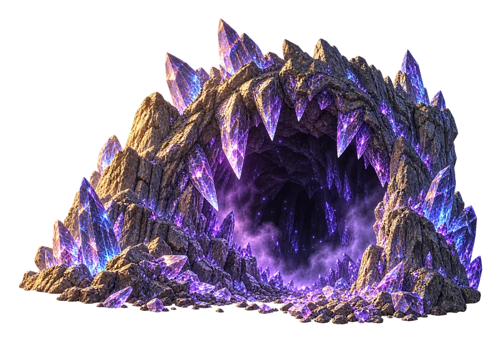

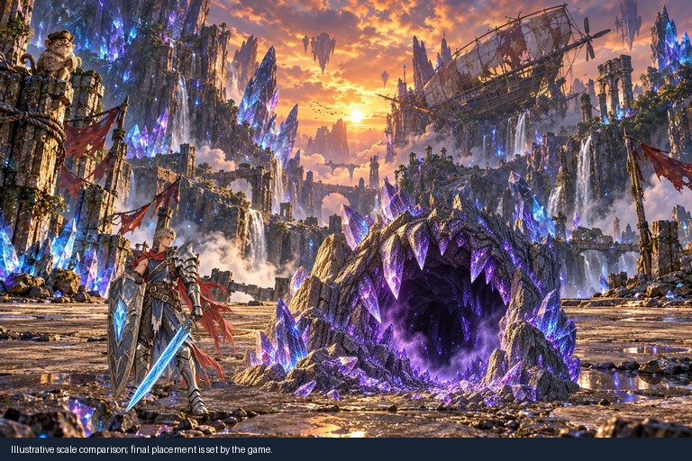

1024×702; 251 KB. Selected attempt 1.

No visible guide lines, labels, dashed outlines or colored construction blocks.


<details><summary>References and generation prompt</summary>

1. `public/assets/anchors/key_art.webp`
2. `public/assets/anchors/cast_lineup.webp`
3. `public/assets/backgrounds/battle/bg_crystal_canyon.webp`
4. `art/guides/prop_view.png`

```text
ART STYLE: Lush, luminous digital painting in the spirit of a premium early-2000s Japanese RPG remastered in HD. Semi-realistic, anime-influenced characters with expressive faces and stylish asymmetrical adventure outfits: layered belts, buckles, straps, zippers, one-sleeved jackets, flowing scarves. Sun-drenched tropical environments painted in rich detail: saturated turquoise seas, white sand, emerald jungle, and ancient sandstone ruins carved with softly glowing glyphs. Golden-hour sunlight, with bioluminescent blue-green motes of light drifting through the air. Cinematic, epic and adventurous, with a mischievous sense of humor: witty, characterful expressions and small comedic details hidden in the scene. Mature and cool, never babyish or chibi.

This is an isolated game sprite: render ONLY the subject on a fully transparent background (PNG with alpha). No scenery, no ground, no cast shadow, no frame. Lit from the upper left with a soft rim light, crisp readable silhouette, full body with nothing cropped and clear empty space around it.

The mouth of a huge cave in dark canyon rock, rimmed with jagged violet crystals like teeth, half-chewed crystal crumbs scattered at the entrance, and a deep violet glow and wisps of steam coming from the darkness inside. Ominous but kid-safe: no eyes, no bones.

Seen from a slightly raised three-quarter front view, as if from a person's standing eye height a few steps away. Lit like the attached background: same sun direction, color and warmth. Only the object, standing on nothing: no ground patch, no scenery, no cast shadow.

The attached guide image is a construction drawing: use it only for layout (where the floor, horizon, characters or cells are). Do not reproduce any of its lines, colors, shapes, labels or text.

OUTPUT: 1536x1024. Genuine transparent alpha background.

Rules: completely original designs; never imitate an existing franchise, character, creature, logo or emblem. No text, letters, numbers, logos, watermarks, signatures, borders or user interface, unless the prompt asks for glowing magic runes. Fierce and intense is great; no blood, gore or wounds.
```

</details>

## prop_crystal_shard / base — draft

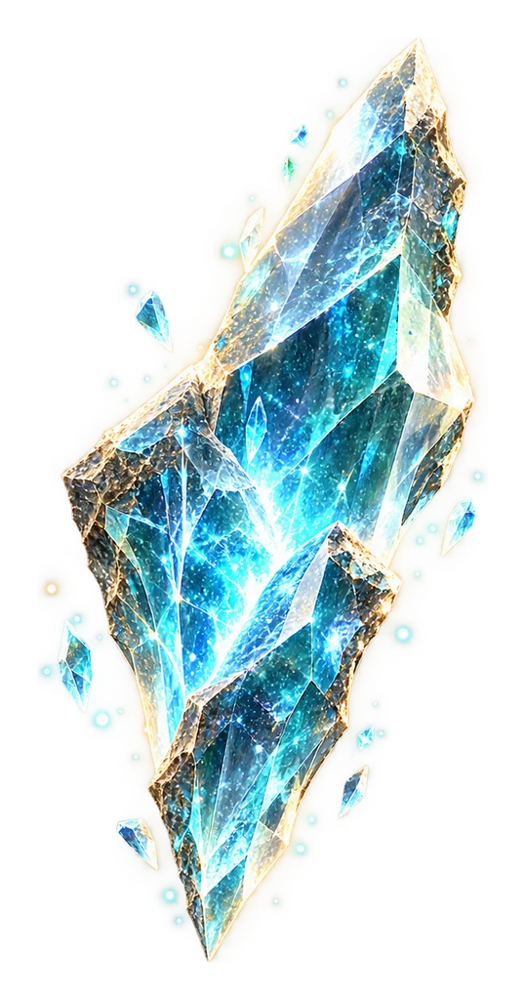

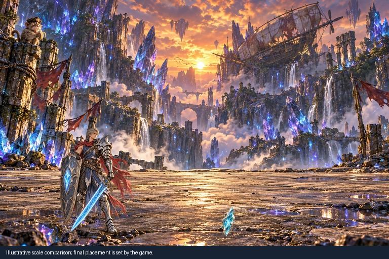

538×1024; 186 KB. Selected attempt 1.

No visible guide lines, labels, dashed outlines or colored construction blocks.


<details><summary>References and generation prompt</summary>

1. `public/assets/anchors/key_art.webp`
2. `public/assets/anchors/cast_lineup.webp`
3. `public/assets/backgrounds/battle/bg_crystal_canyon.webp`
4. `art/guides/prop_view.png`

```text
ART STYLE: Lush, luminous digital painting in the spirit of a premium early-2000s Japanese RPG remastered in HD. Semi-realistic, anime-influenced characters with expressive faces and stylish asymmetrical adventure outfits: layered belts, buckles, straps, zippers, one-sleeved jackets, flowing scarves. Sun-drenched tropical environments painted in rich detail: saturated turquoise seas, white sand, emerald jungle, and ancient sandstone ruins carved with softly glowing glyphs. Golden-hour sunlight, with bioluminescent blue-green motes of light drifting through the air. Cinematic, epic and adventurous, with a mischievous sense of humor: witty, characterful expressions and small comedic details hidden in the scene. Mature and cool, never babyish or chibi.

This is an isolated game sprite: render ONLY the subject on a fully transparent background (PNG with alpha). No scenery, no ground, no cast shadow, no frame. Lit from the upper left with a soft rim light, crisp readable silhouette, full body with nothing cropped and clear empty space around it.

One shard of a Lore Crystal: a jagged, faceted teal-white crystal fragment glowing from within, with tiny motes of light drifting off it. This is the quest item he collects four of.

Seen from a slightly raised three-quarter front view, as if from a person's standing eye height a few steps away. Lit like the attached background: same sun direction, color and warmth. Only the object, standing on nothing: no ground patch, no scenery, no cast shadow.

The attached guide image is a construction drawing: use it only for layout (where the floor, horizon, characters or cells are). Do not reproduce any of its lines, colors, shapes, labels or text.

OUTPUT: 1024x1024. Genuine transparent alpha background.

Rules: completely original designs; never imitate an existing franchise, character, creature, logo or emblem. No text, letters, numbers, logos, watermarks, signatures, borders or user interface, unless the prompt asks for glowing magic runes. Fierce and intense is great; no blood, gore or wounds.
```

</details>

## icons_items / sheet — draft

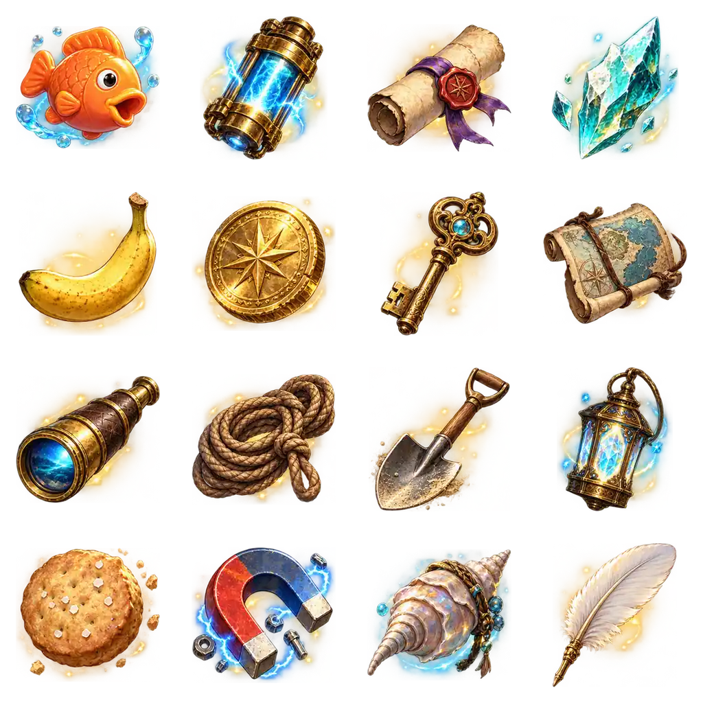

1024×1024; 293 KB. Selected attempt 1.

No visible guide lines, labels, dashed outlines or colored construction blocks.

- Cells rebuilt separately with clear margins; shared 94% baseline for character sheets.

<details><summary>References and generation prompt</summary>

1. `public/assets/anchors/key_art.webp`
2. `public/assets/anchors/cast_lineup.webp`
3. `art/guides/icon_sheet.png`

```text
ART STYLE: Lush, luminous digital painting in the spirit of a premium early-2000s Japanese RPG remastered in HD. Semi-realistic, anime-influenced characters with expressive faces and stylish asymmetrical adventure outfits: layered belts, buckles, straps, zippers, one-sleeved jackets, flowing scarves. Sun-drenched tropical environments painted in rich detail: saturated turquoise seas, white sand, emerald jungle, and ancient sandstone ruins carved with softly glowing glyphs. Golden-hour sunlight, with bioluminescent blue-green motes of light drifting through the air. Cinematic, epic and adventurous, with a mischievous sense of humor: witty, characterful expressions and small comedic details hidden in the scene. Mature and cool, never babyish or chibi.

This is an isolated game sprite: render ONLY the subject on a fully transparent background (PNG with alpha). No scenery, no ground, no cast shadow, no frame. Lit from the upper left with a soft rim light, crisp readable silhouette, full body with nothing cropped and clear empty space around it.

A sheet of 16 game icons in a grid of 4 columns and 4 rows of equal square cells, on a fully transparent background, with no grid lines, labels or text. Every icon is a painted inventory item on a soft circular glow, no rim, in the same size, style and lighting, with a bold silhouette that reads at small size. Icons in reading order, left to right, top to bottom: **fish**: a bright orange rubber squeaky-toy fish · **cell**: a glowing brass power-cell canister · **note**: a rolled parchment note tied with a purple ribbon and a wax seal · **shard**: a jagged teal-white Lore Crystal shard · **banana**: a ripe banana · **coin**: a gold doubloon · **key**: an ornate brass key · **chart**: a rolled sea chart · **spyglass**: a brass spyglass · **rope**: a coil of rope · **shovel**: a small shovel · **lantern**: a crystal lantern · **biscuit**: a round, salty sea biscuit · **magnet**: a red-and-blue horseshoe magnet · **shell**: a spiral seashell horn · **feather**: a long white quill feather.

The attached guide image is a construction drawing: use it only for layout (where the floor, horizon, characters or cells are). Do not reproduce any of its lines, colors, shapes, labels or text.

OUTPUT: 1024x1024. Genuine transparent alpha background.

Rules: completely original designs; never imitate an existing franchise, character, creature, logo or emblem. No text, letters, numbers, logos, watermarks, signatures, borders or user interface, unless the prompt asks for glowing magic runes. Fierce and intense is great; no blood, gore or wounds.
```

</details>

## ui_icons_explore / sheet — draft

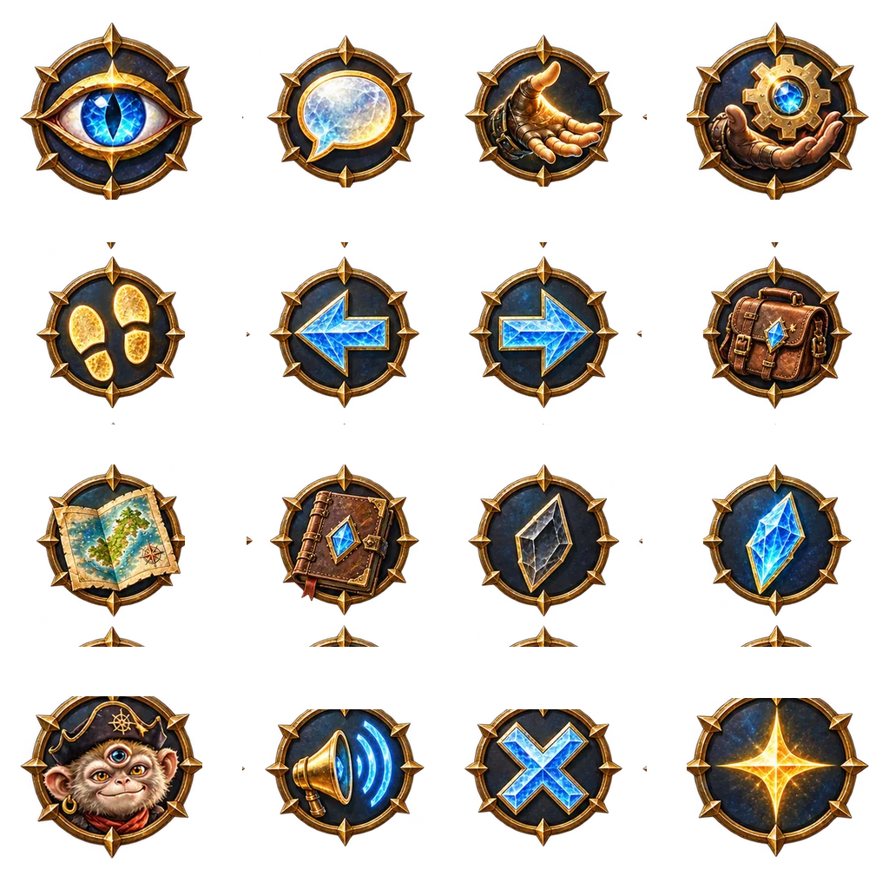

1024×1024; 284 KB. Selected attempt 3.

No visible guide lines, labels, dashed outlines or colored construction blocks.

- FLAG: frame 0: source touches cell edge
- FLAG: frame 1: source touches cell edge
- FLAG: frame 2: source touches cell edge
- FLAG: frame 3: source touches cell edge
- FLAG: frame 4: source touches cell edge
- FLAG: frame 5: source touches cell edge
- FLAG: frame 6: source touches cell edge
- FLAG: frame 7: source touches cell edge
- FLAG: frame 8: source touches cell edge
- FLAG: frame 9: source touches cell edge
- FLAG: frame 10: source touches cell edge
- FLAG: frame 11: source touches cell edge
- FLAG: frame 12: source touches cell edge
- FLAG: frame 13: source touches cell edge
- FLAG: frame 14: source touches cell edge
- FLAG: frame 15: source touches cell edge
- Cells rebuilt separately with clear margins; shared 94% baseline for character sheets.

<details><summary>References and generation prompt</summary>

1. `public/assets/anchors/key_art.webp`
2. `public/assets/anchors/cast_lineup.webp`
3. `public/assets/ui/ui_icons_commands.webp`
4. `art/guides/icon_sheet.png`

```text
ART STYLE: Lush, luminous digital painting in the spirit of a premium early-2000s Japanese RPG remastered in HD. Semi-realistic, anime-influenced characters with expressive faces and stylish asymmetrical adventure outfits: layered belts, buckles, straps, zippers, one-sleeved jackets, flowing scarves. Sun-drenched tropical environments painted in rich detail: saturated turquoise seas, white sand, emerald jungle, and ancient sandstone ruins carved with softly glowing glyphs. Golden-hour sunlight, with bioluminescent blue-green motes of light drifting through the air. Cinematic, epic and adventurous, with a mischievous sense of humor: witty, characterful expressions and small comedic details hidden in the scene. Mature and cool, never babyish or chibi.

This is an isolated game sprite: render ONLY the subject on a fully transparent background (PNG with alpha). No scenery, no ground, no cast shadow, no frame. Lit from the upper left with a soft rim light, crisp readable silhouette, full body with nothing cropped and clear empty space around it.

A sheet of 16 game icons in a grid of 4 columns and 4 rows of equal square cells, on a fully transparent background, with no grid lines, labels or text. Every icon is a glowing crystal emblem set in a dark metal rim, in the same size, style and lighting, with a bold silhouette that reads at small size. Icons in reading order, left to right, top to bottom: **look**: an eye · **talk**: a speech bubble · **take**: an open hand reaching · **use**: a hand holding a gear · **walk**: a pair of footprints · **left**: a bold arrow pointing left · **right**: a bold arrow pointing right · **bag**: a leather satchel · **map**: a folded island map · **journal**: a leather journal with a crystal clasp · **shard_empty**: the outline of a crystal shard, dim and empty · **shard_full**: a crystal shard glowing brightly · **monkey**: a cheeky three-eyed monkey face in a tiny hat · **sound**: a speaker with sound waves · **close**: a bold X · **sparkle**: a four-pointed twinkle of light.

The attached guide image is a construction drawing: use it only for layout (where the floor, horizon, characters or cells are). Do not reproduce any of its lines, colors, shapes, labels or text.

OUTPUT: 1024x1024. Genuine transparent alpha background.

FINAL GUTTER RETRY: sixteen miniature icon badges each at most 140x140 pixels in a 256x256 cell. No detached sparks, outer glows, gas or particles. Hard circular rim contains all artwork. Leave 58px fully transparent gutter on all four sides of every cell. All icon points stay inside circle. Correct list and order. No guide marks.

Rules: completely original designs; never imitate an existing franchise, character, creature, logo or emblem. No text, letters, numbers, logos, watermarks, signatures, borders or user interface, unless the prompt asks for glowing magic runes. Fierce and intense is great; no blood, gore or wounds.
```

</details>

## story_albatross / base — draft

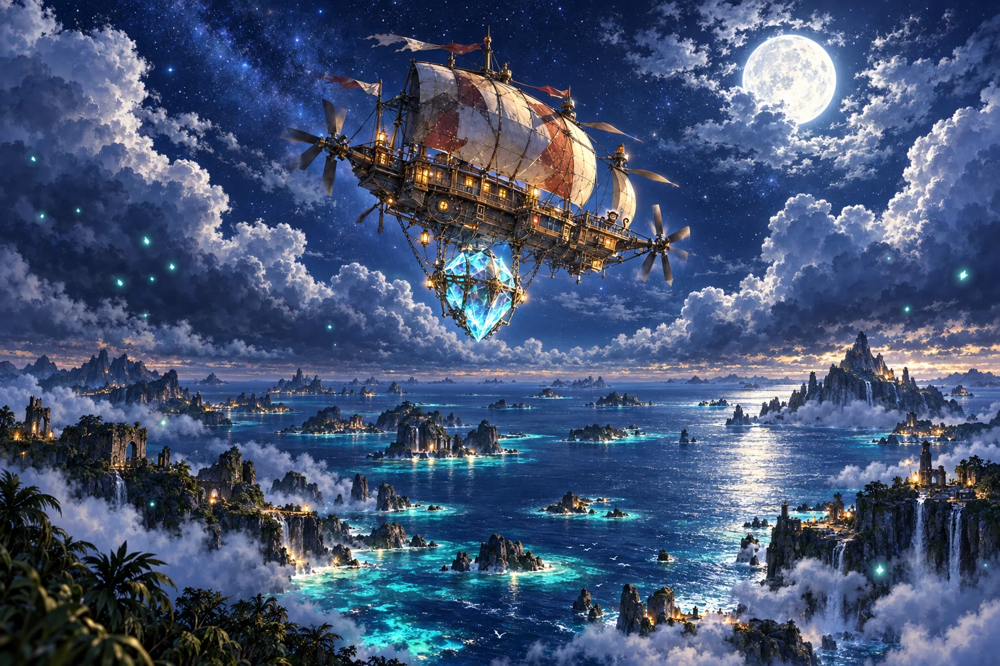

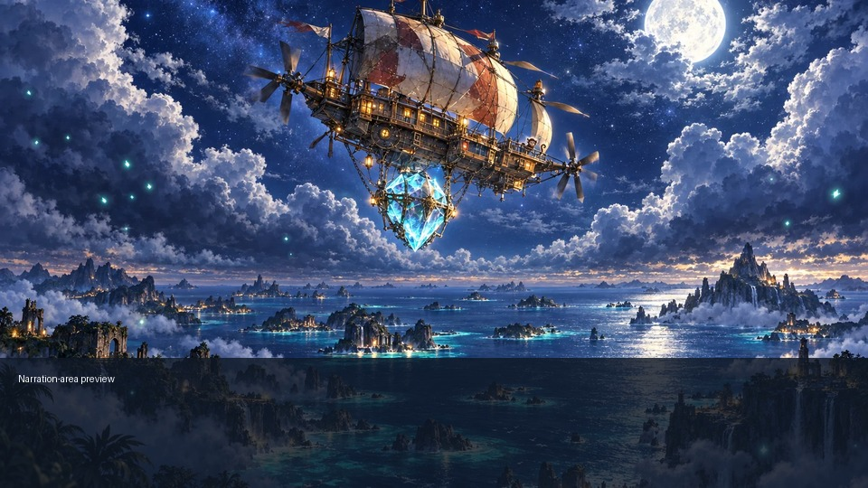

1536×1024; 388 KB. Selected attempt 3.

No visible guide lines, labels, dashed outlines or colored construction blocks.

- FLAG: After three attempts, upper mast/flag enters the 16:9 top crop; balloon, hull and crystal remain visible.

<details><summary>References and generation prompt</summary>

1. `public/assets/anchors/key_art.webp`
2. `public/assets/anchors/cast_lineup.webp`
3. `art/guides/story_card.png`

```text
ART STYLE: Lush, luminous digital painting in the spirit of a premium early-2000s Japanese RPG remastered in HD. Semi-realistic, anime-influenced characters with expressive faces and stylish asymmetrical adventure outfits: layered belts, buckles, straps, zippers, one-sleeved jackets, flowing scarves. Sun-drenched tropical environments painted in rich detail: saturated turquoise seas, white sand, emerald jungle, and ancient sandstone ruins carved with softly glowing glyphs. Golden-hour sunlight, with bioluminescent blue-green motes of light drifting through the air. Cinematic, epic and adventurous, with a mischievous sense of humor: witty, characterful expressions and small comedic details hidden in the scene. Mature and cool, never babyish or chibi.

This is a background painting for a 2D game: no characters or creatures unless the prompt asks for them, no user interface. Rich depth, clear foreground, midground and background.

Night flight over the Glimmering Sea: the sky-pirate airship *Brass Albatross*, a patched balloon over a brass-and-wood hull with spinning propellers, carries a huge glowing Lore Crystal in a cradle slung beneath it. Moonlit clouds, a sea full of small islands far below, glowing motes in the air.

The attached guide image is a construction drawing: use it only for layout (where the floor, horizon, characters or cells are). Do not reproduce any of its lines, colors, shapes, labels or text.

OUTPUT: 1536x1024. Opaque painting.

FINAL FRAMING: an extremely WIDE establishing view. Airship is distant, only 450 pixels wide and 380 pixels tall on a 1536x1024 canvas. Whole balloon, rigging, hull, propellers and suspended crystal together occupy only the central third, centered x=768,y=400; all between y=200..650. Wide sky above and sea below, no cropping of any part. Tiny monkey peeks from rail. Do not zoom in.

Rules: completely original designs; never imitate an existing franchise, character, creature, logo or emblem. No text, letters, numbers, logos, watermarks, signatures, borders or user interface, unless the prompt asks for glowing magic runes. Fierce and intense is great; no blood, gore or wounds.
```

</details>

## story_galleon / base — draft

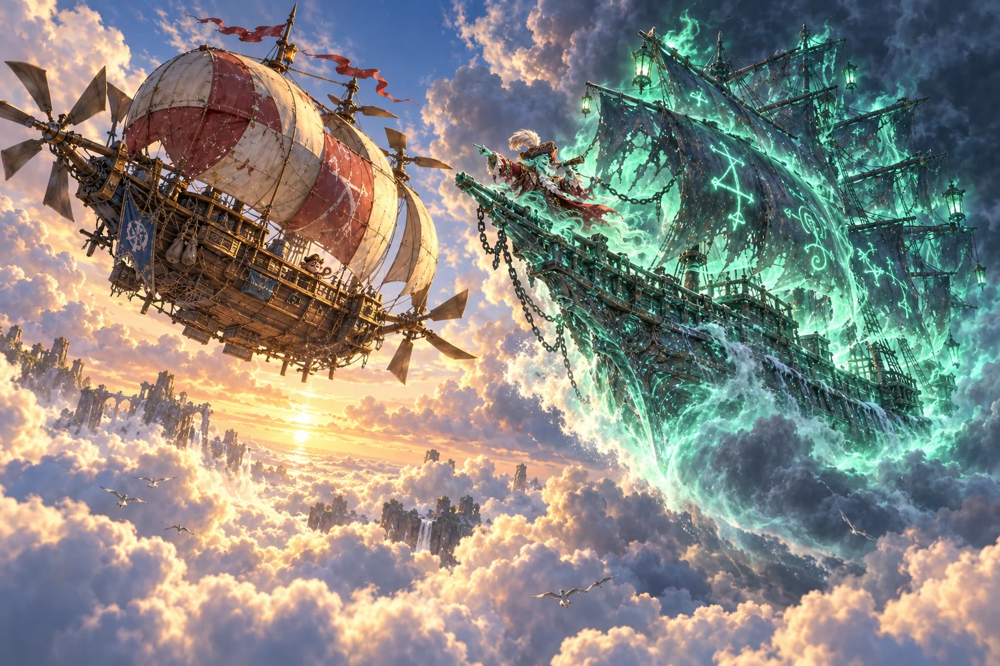

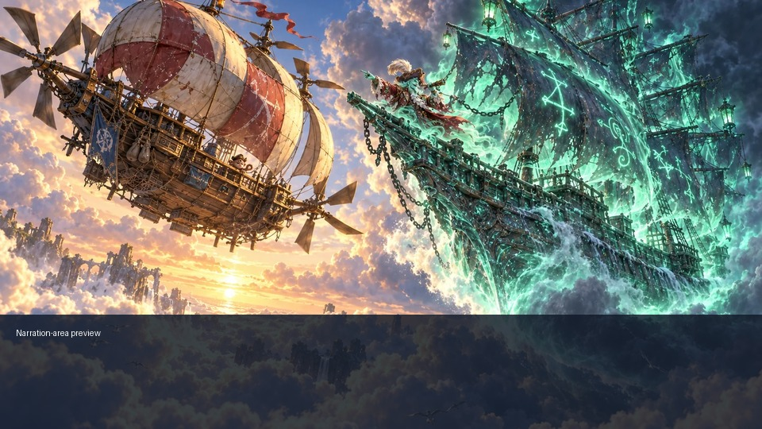

1536×1024; 348 KB. Selected attempt 3.

No visible guide lines, labels, dashed outlines or colored construction blocks.

- FLAG: After three attempts, upper rigging and lower ghost-hull glow enter screen/narration crops; confrontation and Jumble remain visible.

<details><summary>References and generation prompt</summary>

1. `public/assets/anchors/key_art.webp`
2. `public/assets/anchors/cast_lineup.webp`
3. `public/assets/characters/npc_jumble/base.webp`
4. `art/guides/story_card.png`

```text
ART STYLE: Lush, luminous digital painting in the spirit of a premium early-2000s Japanese RPG remastered in HD. Semi-realistic, anime-influenced characters with expressive faces and stylish asymmetrical adventure outfits: layered belts, buckles, straps, zippers, one-sleeved jackets, flowing scarves. Sun-drenched tropical environments painted in rich detail: saturated turquoise seas, white sand, emerald jungle, and ancient sandstone ruins carved with softly glowing glyphs. Golden-hour sunlight, with bioluminescent blue-green motes of light drifting through the air. Cinematic, epic and adventurous, with a mischievous sense of humor: witty, characterful expressions and small comedic details hidden in the scene. Mature and cool, never babyish or chibi.

This is a background painting for a 2D game: no characters or creatures unless the prompt asks for them, no user interface. Rich depth, clear foreground, midground and background.

A ghostly pirate galleon bursts out of a storm cloud: translucent sea-green hull, tattered glowing sails embroidered with jumbled rune-glyphs, lanterns burning green. On the prow stands Captain Jumble, a sea-green ghost pirate in a huge plumed purple tricorn hat, pointing dramatically. Match the attached `npc_jumble` reference. The galleon is about to ram the small airship in the foreground. Thrilling and theatrical, not scary.

The attached guide image is a construction drawing: use it only for layout (where the floor, horizon, characters or cells are). Do not reproduce any of its lines, colors, shapes, labels or text.

OUTPUT: 1536x1024. Opaque painting.

FINAL STORY GEOMETRY: wide establishing view, two distant ships. Ghost galleon on RIGHT, its pointed PROW aims LEFT toward the small balloon airship on LEFT; they are about to ram each other. Jumble a tiny theatrical ghost on prow, match attached base. Tiny monkey peeks from airship rail. NO hero closeups, no people in foreground. Whole ships in middle band y=160..660, large empty cloud margin above and below. No skull ornament, guide marks or text.

Rules: completely original designs; never imitate an existing franchise, character, creature, logo or emblem. No text, letters, numbers, logos, watermarks, signatures, borders or user interface, unless the prompt asks for glowing magic runes. Fierce and intense is great; no blood, gore or wounds.
```

</details>

## story_crash / base — draft

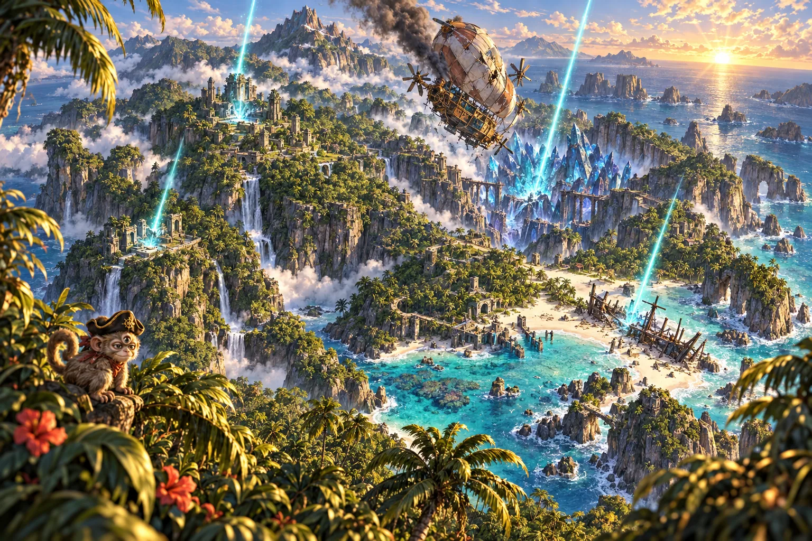

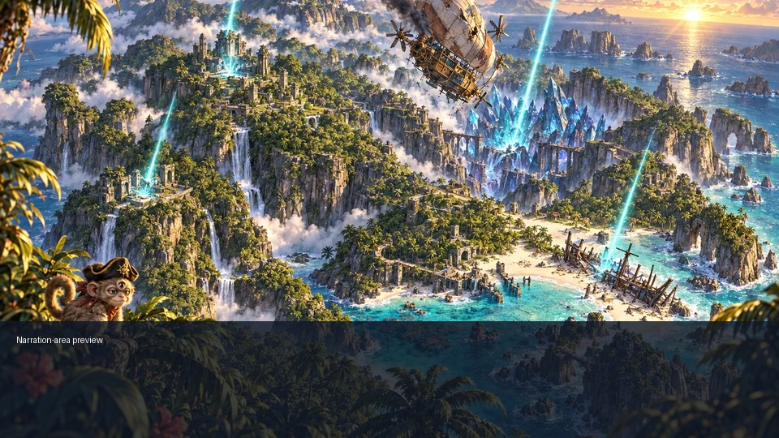

1536×1024; 448 KB. Selected attempt 2.

No visible guide lines, labels, dashed outlines or colored construction blocks.

- FLAG: After three attempts, some upper airship rigging and monkey body enter screen/narration crops. Review the screen preview.

<details><summary>References and generation prompt</summary>

1. `public/assets/anchors/key_art.webp`
2. `public/assets/anchors/cast_lineup.webp`
3. `art/guides/story_card.png`

```text
ART STYLE: Lush, luminous digital painting in the spirit of a premium early-2000s Japanese RPG remastered in HD. Semi-realistic, anime-influenced characters with expressive faces and stylish asymmetrical adventure outfits: layered belts, buckles, straps, zippers, one-sleeved jackets, flowing scarves. Sun-drenched tropical environments painted in rich detail: saturated turquoise seas, white sand, emerald jungle, and ancient sandstone ruins carved with softly glowing glyphs. Golden-hour sunlight, with bioluminescent blue-green motes of light drifting through the air. Cinematic, epic and adventurous, with a mischievous sense of humor: witty, characterful expressions and small comedic details hidden in the scene. Mature and cool, never babyish or chibi.

This is a background painting for a 2D game: no characters or creatures unless the prompt asks for them, no user interface. Rich depth, clear foreground, midground and background.

Dawn over Driftwood Isle, seen from high above: a green tropical island with a white-sand cove and an old shipwreck, a jungle temple, and a canyon full of giant crystals. A smoking airship spirals down toward the canyon, and four glowing teal trails of light streak down from the sky to four different places on the island.

The attached guide image is a construction drawing: use it only for layout (where the floor, horizon, characters or cells are). Do not reproduce any of its lines, colors, shapes, labels or text.

OUTPUT: 1536x1024. Opaque painting.

STORY CORRECTION: falling AIRSHIP must have a visibly patched partly DEFLATING BALLOON, brass wood hull and propellers, NOT a sailing ship. Four and only four teal shard trails descend to four distinct points. View the whole island from high above, beach cove, jungle temple and crystal canyon. Put airship and important island features between y=140..690. Tiny three-eyed monkey in a captain's hat hidden on a nearer palm above y=680. No subjects in narration strip.

Rules: completely original designs; never imitate an existing franchise, character, creature, logo or emblem. No text, letters, numbers, logos, watermarks, signatures, borders or user interface, unless the prompt asks for glowing magic runes. Fierce and intense is great; no blood, gore or wounds.
```

</details>

## story_ending / base — draft

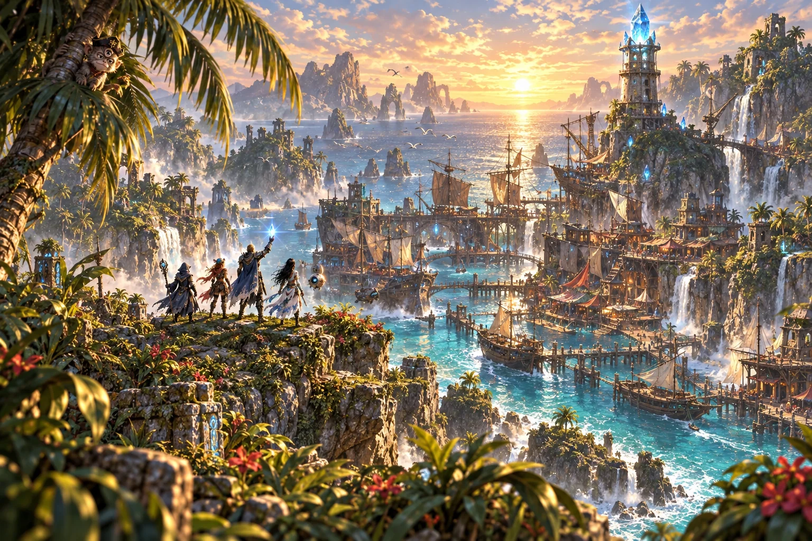

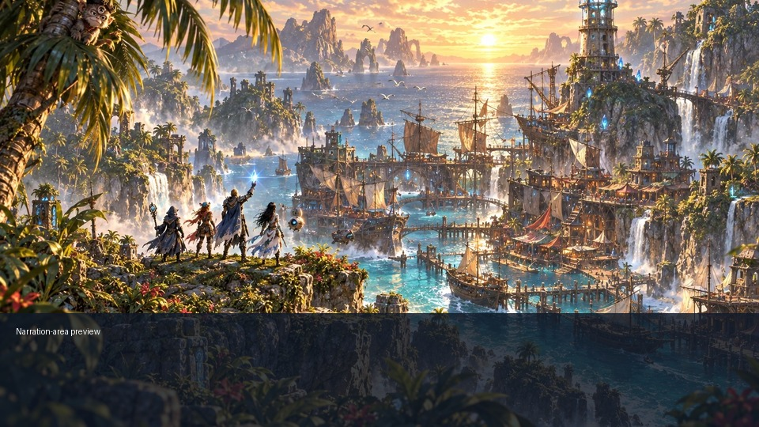

1536×1024; 465 KB. Selected attempt 3.

No visible guide lines, labels, dashed outlines or colored construction blocks.

- FLAG: Monkey cameo partly enters the top screen crop; its face remains visible.

<details><summary>References and generation prompt</summary>

1. `public/assets/anchors/key_art.webp`
2. `public/assets/anchors/cast_lineup.webp`
3. `art/guides/story_card.png`

```text
ART STYLE: Lush, luminous digital painting in the spirit of a premium early-2000s Japanese RPG remastered in HD. Semi-realistic, anime-influenced characters with expressive faces and stylish asymmetrical adventure outfits: layered belts, buckles, straps, zippers, one-sleeved jackets, flowing scarves. Sun-drenched tropical environments painted in rich detail: saturated turquoise seas, white sand, emerald jungle, and ancient sandstone ruins carved with softly glowing glyphs. Golden-hour sunlight, with bioluminescent blue-green motes of light drifting through the air. Cinematic, epic and adventurous, with a mischievous sense of humor: witty, characterful expressions and small comedic details hidden in the scene. Mature and cool, never babyish or chibi.

This is a background painting for a 2D game: no characters or creatures unless the prompt asks for them, no user interface. Rich depth, clear foreground, midground and background.

Sunrise on a cliff above Driftwood Harbor, a pirate port built from old shipwrecks, with a lighthouse topped by a glowing crystal. The four heroes and the floating droid, seen from behind and small in the frame, look out at the harbor. The knight holds up a mended, glowing Lore Crystal. Hidden in a palm tree: the three-eyed monkey in his tiny captain's hat. Warm, triumphant, full of promise.

The attached guide image is a construction drawing: use it only for layout (where the floor, horizon, characters or cells are). Do not reproduce any of its lines, colors, shapes, labels or text.

OUTPUT: 1536x1024. Opaque painting.

FINAL SCREEN FIT: wide panorama from a DISTANT viewpoint. Four heroes plus floating droid stand on a SMALL MIDGROUND cliff ledge, only 100 pixels tall, entirely between y=430 and y=600. They are tiny silhouettes matching the cast, seen from behind. Knight lifts mended crystal. Foreground below y=700 is only empty foliage/rocks/sea, no people. Monkey hiding in palm at y=200. Harbor and crystal lighthouse panoramic focus. No closer foreground party or bottom-edge characters.

Rules: completely original designs; never imitate an existing franchise, character, creature, logo or emblem. No text, letters, numbers, logos, watermarks, signatures, borders or user interface, unless the prompt asks for glowing magic runes. Fierce and intense is great; no blood, gore or wounds.
```

</details>

## Wiring notes

The manifest adds npc_jumble base/portraits, mascot_monkey.field, four hero walk sheets, 16 props, two icon sheets, and four story cards. All existing manifest entries are preserved. Claude handles game integration; no runtime animation or object placement acceptance is claimed here.
