# Wave 04: Painted places

All assets are **draft**, pending parent and child review. Built-in image generation; exact submitted prompts are included below. This gallery records export checks separately from visual acceptance. Guide overlays are 35% opacity.

## scene_cove — draft

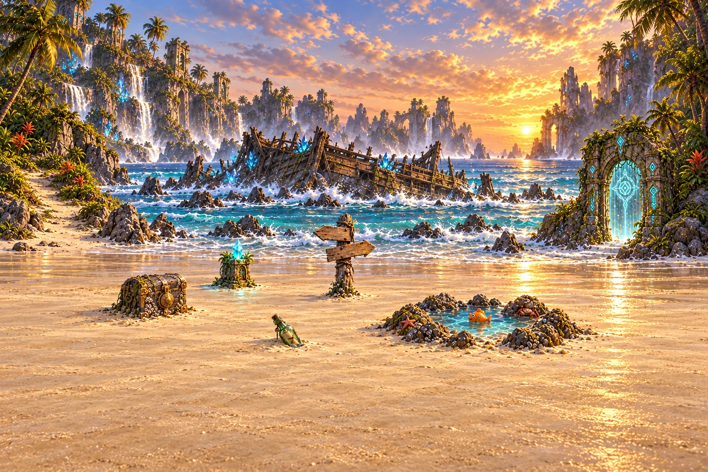

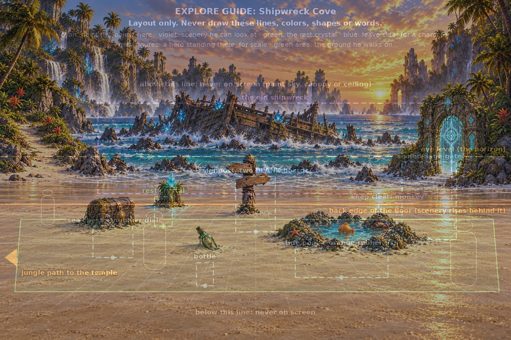

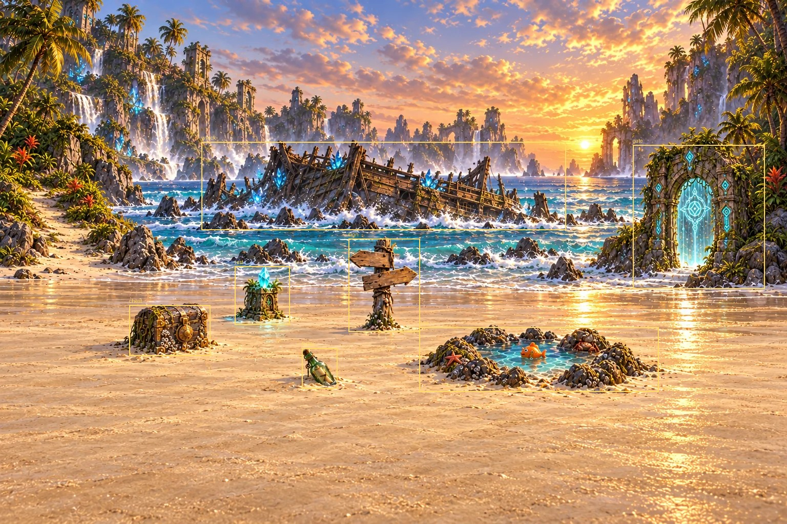

**Review flags:** Object sizes and positions remain outside the approximately 40px guide tolerance after three attempts; measured click boxes match the selected painting. wreck: largest box-edge deviation from guide is 253px (target about40px). sign: largest box-edge deviation from guide is 65px (target about40px). chest: largest box-edge deviation from guide is 85px (target about40px). pool: largest box-edge deviation from guide is 119px (target about40px). bottle: largest box-edge deviation from guide is 110px (target about40px). gate: largest box-edge deviation from guide is 205px (target about40px). rest: largest box-edge deviation from guide is 72px (target about40px).

<details><summary>Generation prompt and references</summary>

```text
ART STYLE: Lush, luminous digital painting in the spirit of a premium early-2000s Japanese RPG remastered in HD. Semi-realistic, anime-influenced characters with expressive faces and stylish asymmetrical adventure outfits: layered belts, buckles, straps, zippers, one-sleeved jackets, flowing scarves. Sun-drenched tropical environments painted in rich detail: saturated turquoise seas, white sand, emerald jungle, and ancient sandstone ruins carved with softly glowing glyphs. Golden-hour sunlight, with bioluminescent blue-green motes of light drifting through the air. Cinematic, epic and adventurous, with a mischievous sense of humor: witty, characterful expressions and small comedic details hidden in the scene. Mature and cool, never babyish or chibi.

This is a background painting for a 2D game: no characters or creatures unless the prompt asks for them, no user interface. Rich depth, clear foreground, midground and background.

Shipwreck Cove at golden hour: a wide white-sand beach on a tropical island, turquoise surf rolling in behind it. Along the shore in the background lies the huge, ancient hulk of a wooden shipwreck crusted with glowing blue crystals, the landmark of this place. Sea stacks and waterfall cliffs in the far distance. Painted into the scene where the guide marks them: on the left, a barnacle-crusted wooden sea chest with brass corners and a big round brass combination dial on its front, closed tight, half-sunk in the sand with a strand of seaweed over the lid; near the middle, a weathered driftwood signpost with two completely BLANK wooden arrow boards, one pointing left and one pointing right, a frayed rope wound around the post; in the sand toward the front, a green glass bottle lying half-buried with a rolled note inside; toward the front right, a small rocky tide pool lying flat in the sand, clear turquoise water ringed with barnacled rocks, with a bright orange rubber squeaky-toy fish bobbing in it and a small crab watching it suspiciously; at the right, an ancient vine-covered sandstone archway set into the cliff, every stone carved with softly glowing teal glyphs, its opening sealed by a shimmering curtain of teal light with a large glowing glyph-lock in its center; near the back on the left, the rest crystal. At the far left edge, a sandy path leads off into the jungle.

A wide exploration scene for a 2D adventure game, seen from standing eye height, like a beautifully painted point-and-click adventure background. The ground the party walks on fills the lower part of the picture, open and walkable. Every object listed stands exactly where the attached layout guide marks it, at the size the guide's figures show, with its base resting on the ground and a soft contact shadow, lit by the same light as everything around it, so it clearly belongs in this place. Tall objects stand at the back edge of the ground. No people or creatures. No text.


Exact object positions in a 1536x1024 painting; obey these boxes, never draw the boxes: {"wreck": [295, 311, 1357, 583], "sign": [708, 531, 828, 698], "chest": [279, 681, 400, 775], "pool": [888, 749, 1166, 836], "bottle": [591, 790, 642, 861], "gate": [1209, 488, 1372, 722], "rest": [464, 592, 518, 681]}
All keep-clear character spots stay empty. Foreground ground remains broad, flat and empty, with no large clutter. Do not paint a monkey cameo: the game adds the monkey as a sprite. The rest crystal is a waist-high, softly glowing teal crystal growing from a small carved stone base, with a little pool of teal light on the ground around it.

The attached guide image is a construction drawing: use it only for layout (where the floor, horizon, characters or cells are). Do not reproduce any of its lines, colors, shapes, labels or text.

Rules: completely original designs; never imitate an existing franchise, character, creature, logo or emblem. No text, letters, numbers, logos, watermarks, signatures, borders or user interface, unless the prompt asks for glowing magic runes. Fierce and intense is great; no blood, gore or wounds.

EDIT the first image, move and resize its existing objects to match the SECOND image guide. Do not preserve wrong positions. Gate must be a small arch only 163x234 px at x1209 y488, not a huge cliff doorway. Chest only 121x94 at x279 y681, sign only120x167 at x708 y531, bottle only51x71 at x591 y790, pool only278x87 at x888 y749, rest only54x89 at x464 y592. Move objects DOWN to prescribed y pixels. Ground starts y615. Shipwreck: ONLY low hull and broken SHORT stumps, all enclosed x295 y311 to1357 y583, no towering sails above the guide box. Open plain sand foreground. Exactly1536x1024. No guide marks.
```

References: `public/assets/anchors/key_art.webp`, `public/assets/anchors/cast_lineup.webp`, `public/assets/backgrounds/battle/bg_shipwreck_cove.webp`, `public/assets/props/prop_chest.webp`, `public/assets/props/prop_signpost.webp`, `public/assets/props/prop_tide_pool.webp`, `public/assets/props/prop_bottle.webp`, `public/assets/props/prop_sage_gate.webp`, `art/guides/explore_cove.png`

</details>

## scene_temple — draft


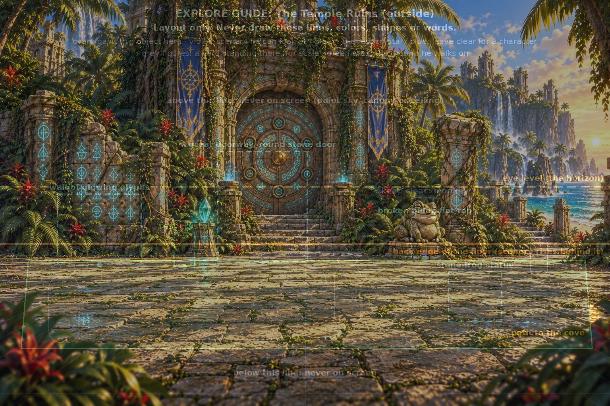

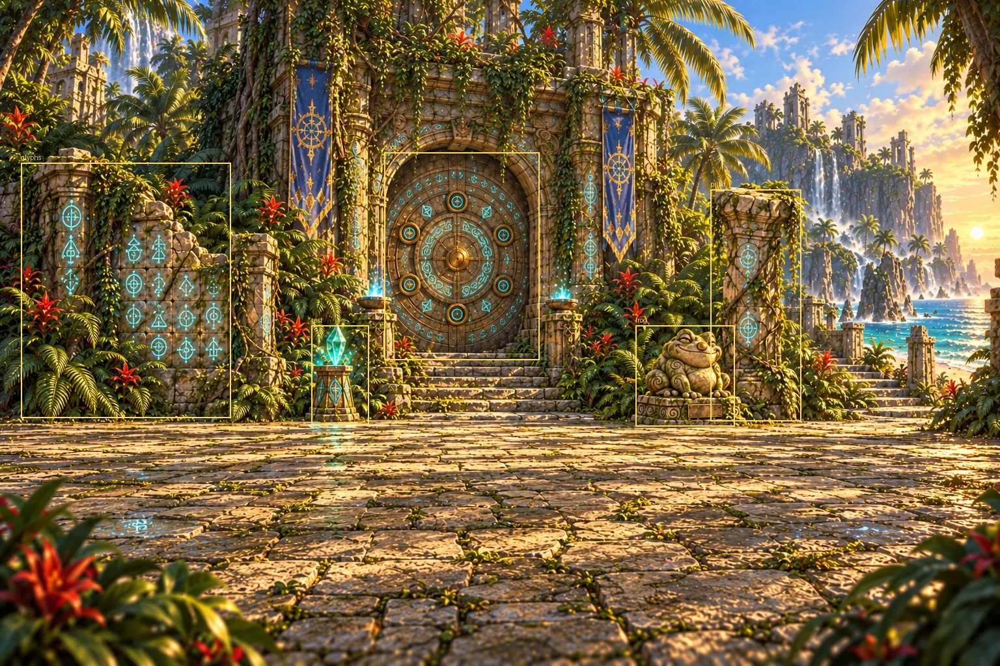

**Review flags:** Door, wall, pillar and frog remain above or outside the guide boxes after three attempts. Foreground corner leaves remain; court floor otherwise open. door: largest box-edge deviation from guide is 148px (target about40px). glyphs: largest box-edge deviation from guide is 240px (target about40px). frog: largest box-edge deviation from guide is 186px (target about40px). pillar: largest box-edge deviation from guide is 258px (target about40px). rest: largest box-edge deviation from guide is 88px (target about40px).

<details><summary>Generation prompt and references</summary>

```text
ART STYLE: Lush, luminous digital painting in the spirit of a premium early-2000s Japanese RPG remastered in HD. Semi-realistic, anime-influenced characters with expressive faces and stylish asymmetrical adventure outfits: layered belts, buckles, straps, zippers, one-sleeved jackets, flowing scarves. Sun-drenched tropical environments painted in rich detail: saturated turquoise seas, white sand, emerald jungle, and ancient sandstone ruins carved with softly glowing glyphs. Golden-hour sunlight, with bioluminescent blue-green motes of light drifting through the air. Cinematic, epic and adventurous, with a mischievous sense of humor: witty, characterful expressions and small comedic details hidden in the scene. Mature and cool, never babyish or chibi.

This is a background painting for a 2D game: no characters or creatures unless the prompt asks for them, no user interface. Rich depth, clear foreground, midground and background.

The courtyard of a Sage temple swallowed by jungle, in warm afternoon light: cracked, mossy flagstones; giant ferns, red jungle flowers and hanging vines; the sea glimpsed through ruins at the right. Across the back stands the temple's grand carved sandstone facade, and in its middle-left is a great doorway sealed by a huge round stone door carved with rings of softly glowing teal glyphs and a ring of number dials. Painted into the scene where the guide marks them: on the left, a broken wall section covered in rows of glowing glyphs, ferns at its base and a crack running through it; at the right, a tall, cracked sandstone pillar wrapped in vines, with a flat broken top big enough for a monkey to sit on; in front of it, a mossy stone statue of a fat, wide-grinning, slightly smug frog on a little plinth, its round nose polished like a button; at the back on the left, the rest crystal. At the far right edge, a path leads back toward the beach.

A wide exploration scene for a 2D adventure game, seen from standing eye height, like a beautifully painted point-and-click adventure background. The ground the party walks on fills the lower part of the picture, open and walkable. Every object listed stands exactly where the attached layout guide marks it, at the size the guide's figures show, with its base resting on the ground and a soft contact shadow, lit by the same light as everything around it, so it clearly belongs in this place. Tall objects stand at the back edge of the ground. No people or creatures. No text.


Exact object positions in a 1536x1024 painting; obey these boxes, never draw the boxes: {"door": [548, 382, 774, 661], "glyphs": [144, 490, 356, 668], "frog": [1129, 686, 1264, 811], "pillar": [1037, 549, 1103, 650], "rest": [439, 588, 490, 673]}
All keep-clear character spots stay empty. Foreground ground remains broad, flat and empty, with no large clutter. Do not paint a monkey cameo: the game adds the monkey as a sprite. The rest crystal is a waist-high, softly glowing teal crystal growing from a small carved stone base, with a little pool of teal light on the ground around it.

The attached guide image is a construction drawing: use it only for layout (where the floor, horizon, characters or cells are). Do not reproduce any of its lines, colors, shapes, labels or text.

Rules: completely original designs; never imitate an existing franchise, character, creature, logo or emblem. No text, letters, numbers, logos, watermarks, signatures, borders or user interface, unless the prompt asks for glowing magic runes. Fierce and intense is great; no blood, gore or wounds.

LAYOUT TRANSFORMATION: first image is the layout guide; replace every area of it with a finished painting. Use the second image only as style and object-design reference, not for framing. Keep objects precisely inside the guide rectangles. Door small and distant, frog much farther RIGHT and LOWER than style reference. No guide labels, colored shapes, grid or people: completely erase the construction marks as you paint. Ground occupies bottom 40%. Blue/green guide regions become warm sandstone and natural courtyard, never guide colors. Exactly 1536x1024.
```

References: `public/assets/anchors/key_art.webp`, `public/assets/anchors/cast_lineup.webp`, `public/assets/backgrounds/battle/bg_jungle_ruins.webp`, `public/assets/props/prop_glyph_wall.webp`, `public/assets/props/prop_stone_frog.webp`, `public/assets/props/prop_pillar.webp`, `art/guides/explore_temple.png`

</details>

## scene_temple_hall — draft


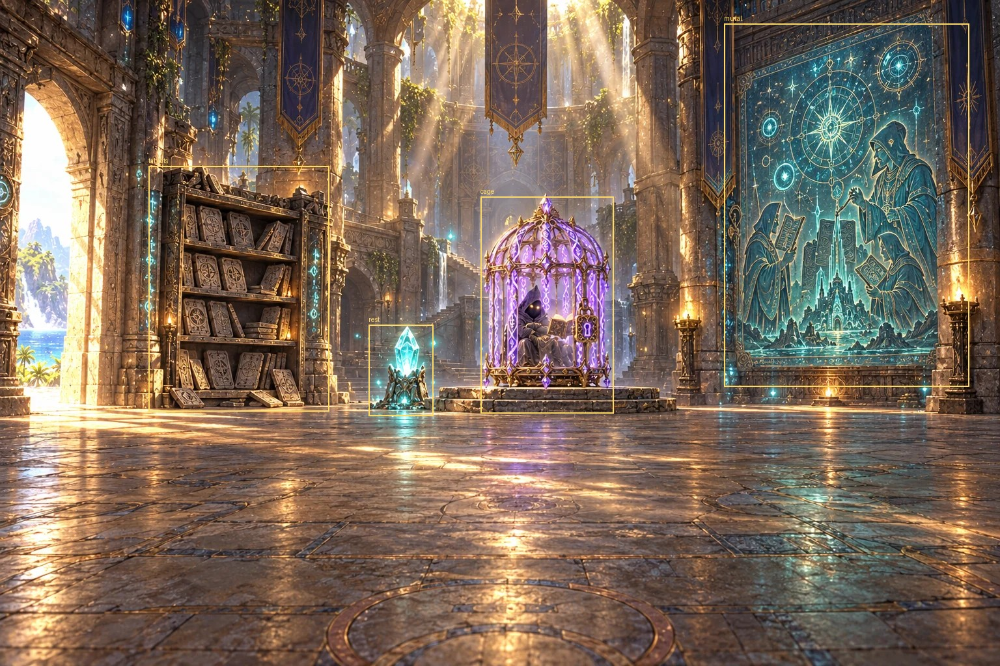

**Review flags:** Cage and mural remain larger and higher than guide boxes after three attempts; shelf also exceeds guide bounds. Scholar sits inside cage as requested. cage: largest box-edge deviation from guide is 222px (target about40px). tablets: largest box-edge deviation from guide is 271px (target about40px). mural: largest box-edge deviation from guide is 471px (target about40px). rest: largest box-edge deviation from guide is 101px (target about40px).

<details><summary>Generation prompt and references</summary>

```text
ART STYLE: Lush, luminous digital painting in the spirit of a premium early-2000s Japanese RPG remastered in HD. Semi-realistic, anime-influenced characters with expressive faces and stylish asymmetrical adventure outfits: layered belts, buckles, straps, zippers, one-sleeved jackets, flowing scarves. Sun-drenched tropical environments painted in rich detail: saturated turquoise seas, white sand, emerald jungle, and ancient sandstone ruins carved with softly glowing glyphs. Golden-hour sunlight, with bioluminescent blue-green motes of light drifting through the air. Cinematic, epic and adventurous, with a mischievous sense of humor: witty, characterful expressions and small comedic details hidden in the scene. Mature and cool, never babyish or chibi.

This is a background painting for a 2D game: no characters or creatures unless the prompt asks for them, no user interface. Rich depth, clear foreground, midground and background.

Inside the Sage temple: a vast, dim hall of carved sandstone pillars, with shafts of golden light falling from cracks in the high ceiling and dust and glyph-motes drifting in the beams. The walls are covered in softly glowing teal glyphs. Painted into the scene where the guide marks them: on the left, tall shelves of carved stone tablets, an ancient library, a few tablets toppled on the floor; on the right, a huge glowing wall mural of glyphs and wise robed scholars; in the middle, on a low round stone dais, a tall ornate magical cage like a giant birdcage made of glowing violet energy bars, each bar a twisting ribbon of scrambled rune-glyphs, with a heavy rune-padlock. Inside the cage sits the tiny hooded scholar from the attached ally_spellwright reference, arms crossed and very annoyed: small, in a deep-indigo hooded robe, his face hidden in shadow except two glowing golden eyes, his spellbook floating beside him. Near the back on the left, the rest crystal. At the far left edge, the doorway back outside, bright with daylight.

A wide exploration scene for a 2D adventure game, seen from standing eye height, like a beautifully painted point-and-click adventure background. The ground the party walks on fills the lower part of the picture, open and walkable. Every object listed stands exactly where the attached layout guide marks it, at the size the guide's figures show, with its base resting on the ground and a soft contact shadow, lit by the same light as everything around it, so it clearly belongs in this place. Tall objects stand at the back edge of the ground. No people or creatures. No text.


Exact object positions in a 1536x1024 painting; obey these boxes, never draw the boxes: {"cage": [809, 524, 942, 695], "tablets": [219, 526, 407, 679], "mural": [1177, 507, 1359, 672], "rest": [552, 600, 609, 695]}
All keep-clear character spots stay empty. Foreground ground remains broad, flat and empty, with no large clutter. Do not paint a monkey cameo: the game adds the monkey as a sprite. The rest crystal is a waist-high, softly glowing teal crystal growing from a small carved stone base, with a little pool of teal light on the ground around it. The only painted character is the explicitly requested tiny scholar INSIDE the cage; all other character spots are empty.

The attached guide image is a construction drawing: use it only for layout (where the floor, horizon, characters or cells are). Do not reproduce any of its lines, colors, shapes, labels or text.

Rules: completely original designs; never imitate an existing franchise, character, creature, logo or emblem. No text, letters, numbers, logos, watermarks, signatures, borders or user interface, unless the prompt asks for glowing magic runes. Fierce and intense is great; no blood, gore or wounds.

Final layout correction: original SMALL geometric positions are critical. Render guide into painting with a very distant, wide camera. NO GIANT CAGE: its complete structure measures only133 pixels wide and171 high in1536x1024. It stands at x809–942,y524–695. A small shelf219–407,y526–679. Small wall mural1177–1359,y507–672. Small rest crystal552–609,y600–695. Plain flat empty floor from y615 down. Ceiling architecture above. No foreground framing objects or steps into walkable floor. Paint landscape exactly1536x1024.
```

References: `public/assets/anchors/key_art.webp`, `public/assets/anchors/cast_lineup.webp`, `public/assets/props/prop_word_cage.webp`, `public/assets/characters/ally_spellwright/base.webp`, `art/guides/explore_temple_hall.png`

</details>

## scene_canyon — draft

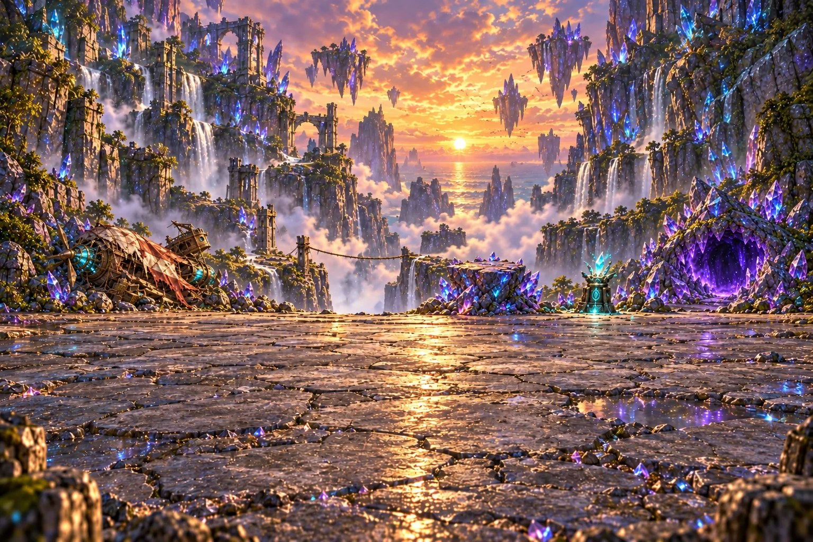

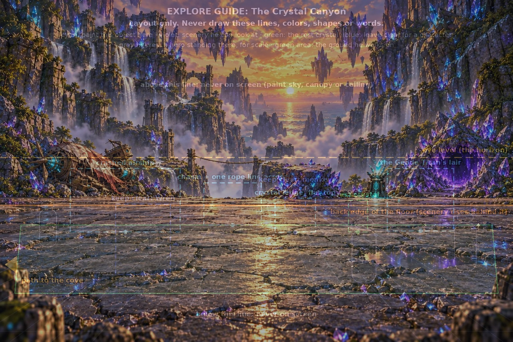


**Review flags:** Objects remain higher and larger than guide boxes after three attempts; lair reaches right canvas edge. Rope crosses a larger chasm than guide. Foreground floor has small rocks and puddles. airship: largest box-edge deviation from guide is 113px (target about40px). chasm: largest box-edge deviation from guide is 102px (target about40px). ledge: largest box-edge deviation from guide is 111px (target about40px). lair: largest box-edge deviation from guide is 176px (target about40px). rest: largest box-edge deviation from guide is 134px (target about40px).

<details><summary>Generation prompt and references</summary>

```text
ART STYLE: Lush, luminous digital painting in the spirit of a premium early-2000s Japanese RPG remastered in HD. Semi-realistic, anime-influenced characters with expressive faces and stylish asymmetrical adventure outfits: layered belts, buckles, straps, zippers, one-sleeved jackets, flowing scarves. Sun-drenched tropical environments painted in rich detail: saturated turquoise seas, white sand, emerald jungle, and ancient sandstone ruins carved with softly glowing glyphs. Golden-hour sunlight, with bioluminescent blue-green motes of light drifting through the air. Cinematic, epic and adventurous, with a mischievous sense of humor: witty, characterful expressions and small comedic details hidden in the scene. Mature and cool, never babyish or chibi.

This is a background painting for a 2D game: no characters or creatures unless the prompt asks for them, no user interface. Rich depth, clear foreground, midground and background.

The floor of the Crystal Canyon at dusk: cracked, glittering grey stone between towering cliffs studded with giant violet and blue crystals; waterfalls, ruined stone bridges and mist in the distance. Painted into the scene where the guide marks them: on the left, the crashed sky-pirate airship from the attached reference, lying broken on its side, its patched balloon slumped over it, its crystal engine sputtering teal sparks; at the back, between the airship and the middle, a narrow cliff path that ends at the edge of a deep, misty chasm: a crooked old wooden post stands at the near edge with a single frayed rope line tied to it, stretched taut across the chasm to the far side, where the path carries on and winds down out of sight toward a glimpse of turquoise sea; in the middle, a cluster of large violet-and-blue crystals growing out of a rock to form a flat-topped ledge about as tall as a person; at the right, the mouth of a huge cave in a crystal mound, rimmed with jagged violet crystals like teeth, half-chewed crystal crumbs at its entrance and a deep violet glow inside (ominous but kid-safe: no eyes, no bones); between the ledge and the cave, the rest crystal. At the far left edge, the way back toward the beach.

A wide exploration scene for a 2D adventure game, seen from standing eye height, like a beautifully painted point-and-click adventure background. The ground the party walks on fills the lower part of the picture, open and walkable. Every object listed stands exactly where the attached layout guide marks it, at the size the guide's figures show, with its base resting on the ground and a soft contact shadow, lit by the same light as everything around it, so it clearly belongs in this place. Tall objects stand at the back edge of the ground. No people or creatures. No text.


Exact object positions in a 1536x1024 painting; obey these boxes, never draw the boxes: {"airship": [211, 505, 540, 695], "chasm": [611, 547, 782, 673], "ledge": [824, 594, 944, 695], "lair": [1159, 504, 1359, 691], "rest": [1043, 600, 1100, 695]}
All keep-clear character spots stay empty. Foreground ground remains broad, flat and empty, with no large clutter. Do not paint a monkey cameo: the game adds the monkey as a sprite. The rest crystal is a waist-high, softly glowing teal crystal growing from a small carved stone base, with a little pool of teal light on the ground around it.

The attached guide image is a construction drawing: use it only for layout (where the floor, horizon, characters or cells are). Do not reproduce any of its lines, colors, shapes, labels or text.

Rules: completely original designs; never imitate an existing franchise, character, creature, logo or emblem. No text, letters, numbers, logos, watermarks, signatures, borders or user interface, unless the prompt asks for glowing magic runes. Fierce and intense is great; no blood, gore or wounds.
```

References: `public/assets/anchors/key_art.webp`, `public/assets/anchors/cast_lineup.webp`, `public/assets/backgrounds/battle/bg_crystal_canyon.webp`, `public/assets/props/prop_airship_wreck.webp`, `public/assets/props/prop_crystal_ledge.webp`, `public/assets/props/prop_lair.webp`, `art/guides/explore_canyon.png`

</details>

## scene_grotto — draft


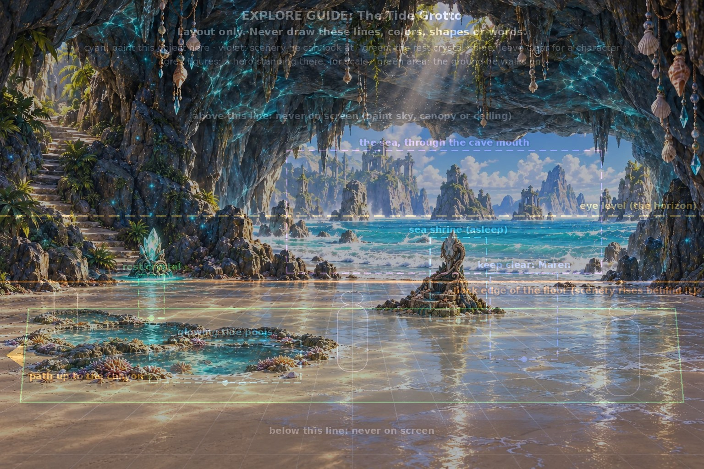

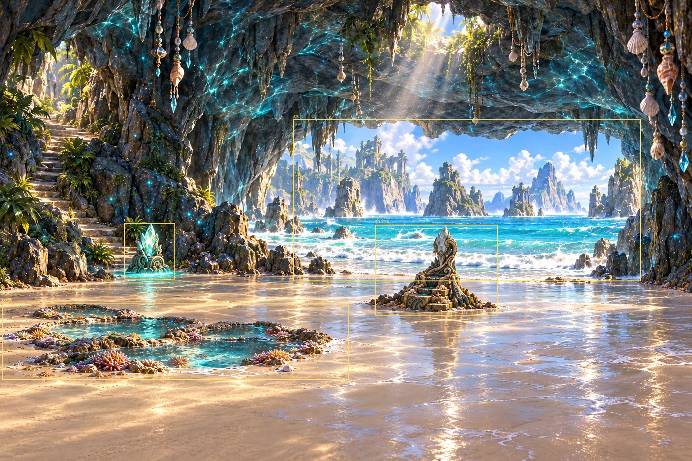

**Review flags:** Shrine base and tide pools remain wider than guide boxes after three attempts; rest crystal is above guide. Foreground corner clutter removed; Maren spot clear. sea: largest box-edge deviation from guide is 109px (target about40px). shrine: largest box-edge deviation from guide is 106px (target about40px). pools: largest box-edge deviation from guide is 322px (target about40px). rest: largest box-edge deviation from guide is 104px (target about40px).

<details><summary>Generation prompt and references</summary>

```text
ART STYLE: Lush, luminous digital painting in the spirit of a premium early-2000s Japanese RPG remastered in HD. Semi-realistic, anime-influenced characters with expressive faces and stylish asymmetrical adventure outfits: layered belts, buckles, straps, zippers, one-sleeved jackets, flowing scarves. Sun-drenched tropical environments painted in rich detail: saturated turquoise seas, white sand, emerald jungle, and ancient sandstone ruins carved with softly glowing glyphs. Golden-hour sunlight, with bioluminescent blue-green motes of light drifting through the air. Cinematic, epic and adventurous, with a mischievous sense of humor: witty, characterful expressions and small comedic details hidden in the scene. Mature and cool, never babyish or chibi.

This is a background painting for a 2D game: no characters or creatures unless the prompt asks for them, no user interface. Rich depth, clear foreground, midground and background.

A sea cave glowing turquoise, below the cliffs: a floor of pale wet sand and smooth stone; the cave's wide mouth at the back opens onto the bright sea, with gentle waves washing in; a shaft of sunlight falls through a hole in the cave roof; rippling turquoise reflections dance across the rock walls; strings of shells hang from the rock. Painted into the scene where the guide marks them: toward the front left, a group of shallow tide pools lying flat in the sand, glowing with coral and anemones; at the center-right, a sacred sea shrine: a tall teal-white crystal growing from a carved stone pedestal shaped like a curling wave, with a shallow stone basin of seawater in front of it and seashell offerings on its steps. The shrine is asleep: its crystal is dim and dull, the basin dark. At the back on the left, the rest crystal. At the far left edge, a path climbs back up toward the canyon.

A wide exploration scene for a 2D adventure game, seen from standing eye height, like a beautifully painted point-and-click adventure background. The ground the party walks on fills the lower part of the picture, open and walkable. Every object listed stands exactly where the attached layout guide marks it, at the size the guide's figures show, with its base resting on the ground and a soft contact shadow, lit by the same light as everything around it, so it clearly belongs in this place. Tall objects stand at the back edge of the ground. No people or creatures. No text.


Exact object positions in a 1536x1024 painting; obey these boxes, never draw the boxes: {"sea": [625, 329, 1313, 597], "shrine": [939, 519, 1062, 700], "pools": [326, 743, 656, 836], "rest": [302, 600, 359, 695]}
All keep-clear character spots stay empty. Foreground ground remains broad, flat and empty, with no large clutter. Do not paint a monkey cameo: the game adds the monkey as a sprite. The rest crystal is a waist-high, softly glowing teal crystal growing from a small carved stone base, with a little pool of teal light on the ground around it.

The attached guide image is a construction drawing: use it only for layout (where the floor, horizon, characters or cells are). Do not reproduce any of its lines, colors, shapes, labels or text.

Rules: completely original designs; never imitate an existing franchise, character, creature, logo or emblem. No text, letters, numbers, logos, watermarks, signatures, borders or user interface, unless the prompt asks for glowing magic runes. Fierce and intense is great; no blood, gore or wounds.
```

References: `public/assets/anchors/key_art.webp`, `public/assets/anchors/cast_lineup.webp`, `public/assets/props/prop_shrine.webp`, `art/guides/explore_grotto.png`

</details>

## scene_cove__chest_open — draft

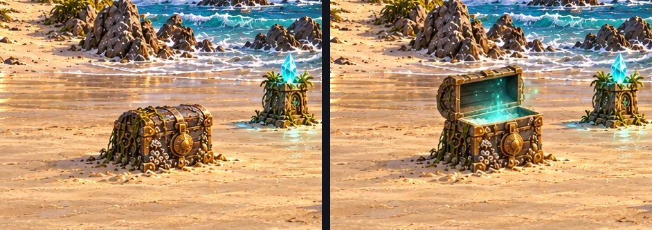

Patch: `scenes/explore/scene_cove__chest_open.webp`, at (158, 502), 345 × 213 px.

**Review flags:** No visible guide marks; selected image passes the listed visual checks.

<details><summary>Generation prompt and references</summary>

```text
ART STYLE: Lush, luminous digital painting in the spirit of a premium early-2000s Japanese RPG remastered in HD. Semi-realistic, anime-influenced characters with expressive faces and stylish asymmetrical adventure outfits: layered belts, buckles, straps, zippers, one-sleeved jackets, flowing scarves. Sun-drenched tropical environments painted in rich detail: saturated turquoise seas, white sand, emerald jungle, and ancient sandstone ruins carved with softly glowing glyphs. Golden-hour sunlight, with bioluminescent blue-green motes of light drifting through the air. Cinematic, epic and adventurous, with a mischievous sense of humor: witty, characterful expressions and small comedic details hidden in the scene. Mature and cool, never babyish or chibi.

This is a background painting for a 2D game: no characters or creatures unless the prompt asks for them, no user interface. Rich depth, clear foreground, midground and background.

Edit the attached finished scene. Change only this one object: The chest's lid is thrown open; it's empty except a little sand, and a soft teal glow rises from inside. Keep every other pixel of the picture exactly the same: same framing, light, colors and details. Do not move or resize the object. Keep the edit tightly confined to the object and its immediate shadow. OUTPUT1536x1024 opaque.

Rules: completely original designs; never imitate an existing franchise, character, creature, logo or emblem. No text, letters, numbers, logos, watermarks, signatures, borders or user interface, unless the prompt asks for glowing magic runes. Fierce and intense is great; no blood, gore or wounds.
```

References: `public/assets/scenes/explore/scene_cove.webp`

</details>

## scene_cove__bottle_gone — draft

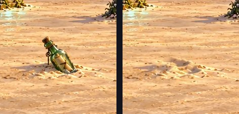

Patch: `scenes/explore/scene_cove__bottle_gone.webp`, at (566, 668), 110 × 106 px.

**Review flags:** No visible guide marks; selected image passes the listed visual checks.

<details><summary>Generation prompt and references</summary>

```text
ART STYLE: Lush, luminous digital painting in the spirit of a premium early-2000s Japanese RPG remastered in HD. Semi-realistic, anime-influenced characters with expressive faces and stylish asymmetrical adventure outfits: layered belts, buckles, straps, zippers, one-sleeved jackets, flowing scarves. Sun-drenched tropical environments painted in rich detail: saturated turquoise seas, white sand, emerald jungle, and ancient sandstone ruins carved with softly glowing glyphs. Golden-hour sunlight, with bioluminescent blue-green motes of light drifting through the air. Cinematic, epic and adventurous, with a mischievous sense of humor: witty, characterful expressions and small comedic details hidden in the scene. Mature and cool, never babyish or chibi.

This is a background painting for a 2D game: no characters or creatures unless the prompt asks for them, no user interface. Rich depth, clear foreground, midground and background.

Edit the attached finished scene. Change only this one object: The bottle is gone, leaving a small dent in the sand. Keep every other pixel of the picture exactly the same: same framing, light, colors and details. Do not move or resize the object. Keep the edit tightly confined to the object and its immediate shadow. OUTPUT1536x1024 opaque.

Rules: completely original designs; never imitate an existing franchise, character, creature, logo or emblem. No text, letters, numbers, logos, watermarks, signatures, borders or user interface, unless the prompt asks for glowing magic runes. Fierce and intense is great; no blood, gore or wounds.
```

References: `public/assets/scenes/explore/scene_cove.webp`

</details>

## scene_cove__fish_gone — draft

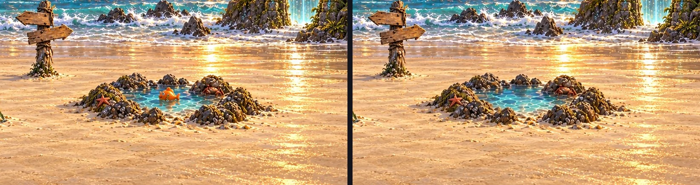

Patch: `scenes/explore/scene_cove__fish_gone.webp`, at (703, 523), 697 × 317 px.

**Review flags:** No visible guide marks; selected image passes the listed visual checks.

<details><summary>Generation prompt and references</summary>

```text
ART STYLE: Lush, luminous digital painting in the spirit of a premium early-2000s Japanese RPG remastered in HD. Semi-realistic, anime-influenced characters with expressive faces and stylish asymmetrical adventure outfits: layered belts, buckles, straps, zippers, one-sleeved jackets, flowing scarves. Sun-drenched tropical environments painted in rich detail: saturated turquoise seas, white sand, emerald jungle, and ancient sandstone ruins carved with softly glowing glyphs. Golden-hour sunlight, with bioluminescent blue-green motes of light drifting through the air. Cinematic, epic and adventurous, with a mischievous sense of humor: witty, characterful expressions and small comedic details hidden in the scene. Mature and cool, never babyish or chibi.

This is a background painting for a 2D game: no characters or creatures unless the prompt asks for them, no user interface. Rich depth, clear foreground, midground and background.

Edit the attached finished scene. Change only this one object: The orange rubber fish is gone from the tide pool; the crab is still there, looking relieved. Keep every other pixel of the picture exactly the same: same framing, light, colors and details. Do not move or resize the object. Keep the edit tightly confined to the object and its immediate shadow. OUTPUT1536x1024 opaque.

Rules: completely original designs; never imitate an existing franchise, character, creature, logo or emblem. No text, letters, numbers, logos, watermarks, signatures, borders or user interface, unless the prompt asks for glowing magic runes. Fierce and intense is great; no blood, gore or wounds.
```

References: `public/assets/scenes/explore/scene_cove.webp`

</details>

## scene_cove__gate_open — draft

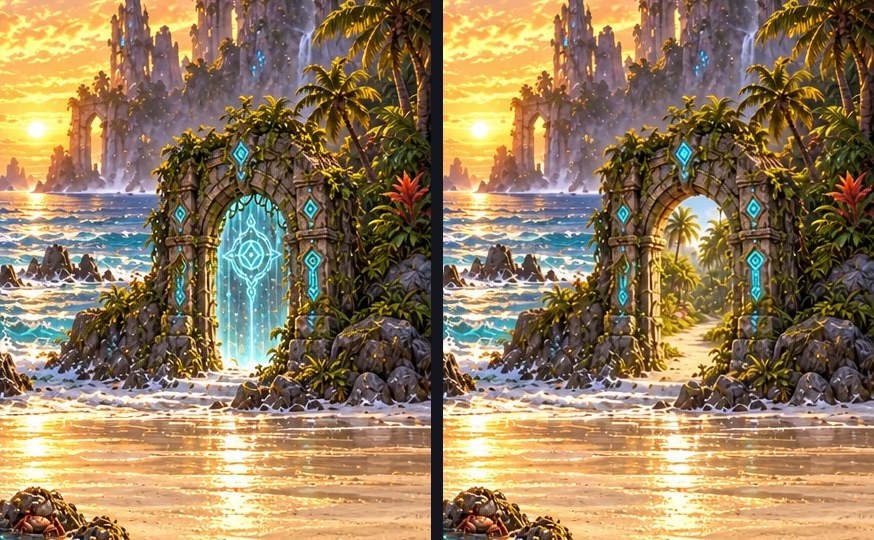

Patch: `scenes/explore/scene_cove__gate_open.webp`, at (1165, 213), 370 × 420 px.

**Review flags:** No visible guide marks; selected image passes the listed visual checks.

<details><summary>Generation prompt and references</summary>

```text
ART STYLE: Lush, luminous digital painting in the spirit of a premium early-2000s Japanese RPG remastered in HD. Semi-realistic, anime-influenced characters with expressive faces and stylish asymmetrical adventure outfits: layered belts, buckles, straps, zippers, one-sleeved jackets, flowing scarves. Sun-drenched tropical environments painted in rich detail: saturated turquoise seas, white sand, emerald jungle, and ancient sandstone ruins carved with softly glowing glyphs. Golden-hour sunlight, with bioluminescent blue-green motes of light drifting through the air. Cinematic, epic and adventurous, with a mischievous sense of humor: witty, characterful expressions and small comedic details hidden in the scene. Mature and cool, never babyish or chibi.

This is a background painting for a 2D game: no characters or creatures unless the prompt asks for them, no user interface. Rich depth, clear foreground, midground and background.

Edit the attached finished scene. Change only this one object: The curtain of light and the glyph-lock are gone; the glyphs glow calmly, and through the arch a sunlit path leads on. Keep every other pixel of the picture exactly the same: same framing, light, colors and details. Do not move or resize the object. Keep the edit tightly confined to the object and its immediate shadow. OUTPUT1536x1024 opaque.

Rules: completely original designs; never imitate an existing franchise, character, creature, logo or emblem. No text, letters, numbers, logos, watermarks, signatures, borders or user interface, unless the prompt asks for glowing magic runes. Fierce and intense is great; no blood, gore or wounds.
```

References: `public/assets/scenes/explore/scene_cove.webp`

</details>

## scene_temple__door_open — draft

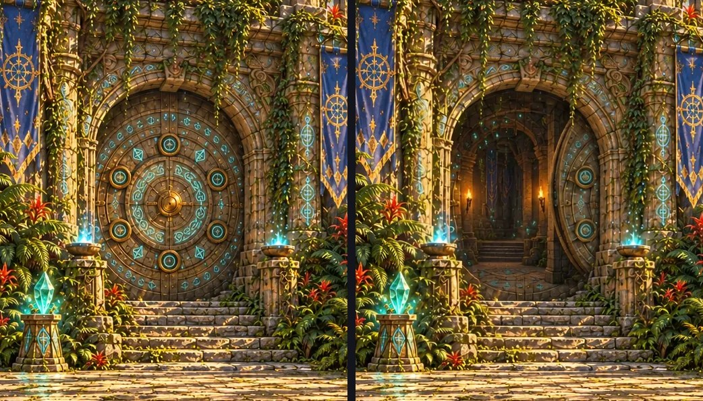

Patch: `scenes/explore/scene_temple__door_open.webp`, at (511, 155), 395 × 476 px.

**Review flags:** No visible guide marks; selected image passes the listed visual checks.

<details><summary>Generation prompt and references</summary>

```text
ART STYLE: Lush, luminous digital painting in the spirit of a premium early-2000s Japanese RPG remastered in HD. Semi-realistic, anime-influenced characters with expressive faces and stylish asymmetrical adventure outfits: layered belts, buckles, straps, zippers, one-sleeved jackets, flowing scarves. Sun-drenched tropical environments painted in rich detail: saturated turquoise seas, white sand, emerald jungle, and ancient sandstone ruins carved with softly glowing glyphs. Golden-hour sunlight, with bioluminescent blue-green motes of light drifting through the air. Cinematic, epic and adventurous, with a mischievous sense of humor: witty, characterful expressions and small comedic details hidden in the scene. Mature and cool, never babyish or chibi.

This is a background painting for a 2D game: no characters or creatures unless the prompt asks for them, no user interface. Rich depth, clear foreground, midground and background.

Edit the attached finished scene. Change only this one object: The round stone door has rolled aside into the wall. The doorway is open onto a dim hall with warm torchlight and drifting glyph-motes inside. Keep every other pixel of the picture exactly the same: same framing, light, colors and details. Do not move or resize the object. Keep the edit tightly confined to the object and its immediate shadow. OUTPUT1536x1024 opaque.

Rules: completely original designs; never imitate an existing franchise, character, creature, logo or emblem. No text, letters, numbers, logos, watermarks, signatures, borders or user interface, unless the prompt asks for glowing magic runes. Fierce and intense is great; no blood, gore or wounds.
```

References: `public/assets/scenes/explore/scene_temple.webp`

</details>

## scene_temple_hall__cage_open — draft

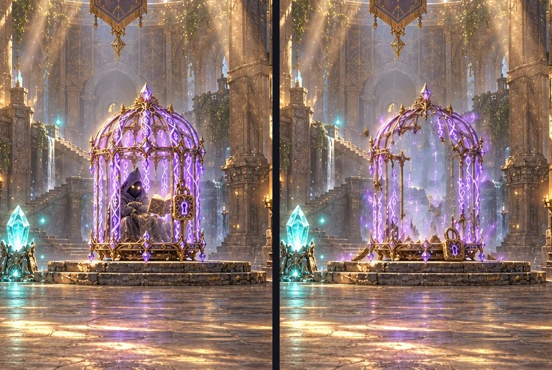

Patch: `scenes/explore/scene_temple_hall__cage_open.webp`, at (655, 219), 334 × 498 px.

**Review flags:** No visible guide marks; selected image passes the listed visual checks.

<details><summary>Generation prompt and references</summary>

```text
ART STYLE: Lush, luminous digital painting in the spirit of a premium early-2000s Japanese RPG remastered in HD. Semi-realistic, anime-influenced characters with expressive faces and stylish asymmetrical adventure outfits: layered belts, buckles, straps, zippers, one-sleeved jackets, flowing scarves. Sun-drenched tropical environments painted in rich detail: saturated turquoise seas, white sand, emerald jungle, and ancient sandstone ruins carved with softly glowing glyphs. Golden-hour sunlight, with bioluminescent blue-green motes of light drifting through the air. Cinematic, epic and adventurous, with a mischievous sense of humor: witty, characterful expressions and small comedic details hidden in the scene. Mature and cool, never babyish or chibi.

This is a background painting for a 2D game: no characters or creatures unless the prompt asks for them, no user interface. Rich depth, clear foreground, midground and background.

Edit the attached finished scene. Change only this one object: The cage has burst open: its bars are broken and dissolving into drifting violet glyph-motes, the padlock lies on the dais, and the cage is empty (the scholar is gone; the game shows him walking with the party). Keep every other pixel of the picture exactly the same: same framing, light, colors and details. Do not move or resize the object. Keep the edit tightly confined to the object and its immediate shadow. OUTPUT1536x1024 opaque.

Rules: completely original designs; never imitate an existing franchise, character, creature, logo or emblem. No text, letters, numbers, logos, watermarks, signatures, borders or user interface, unless the prompt asks for glowing magic runes. Fierce and intense is great; no blood, gore or wounds.
```

References: `public/assets/scenes/explore/scene_temple_hall.webp`

</details>

## scene_grotto__shrine_awake — draft

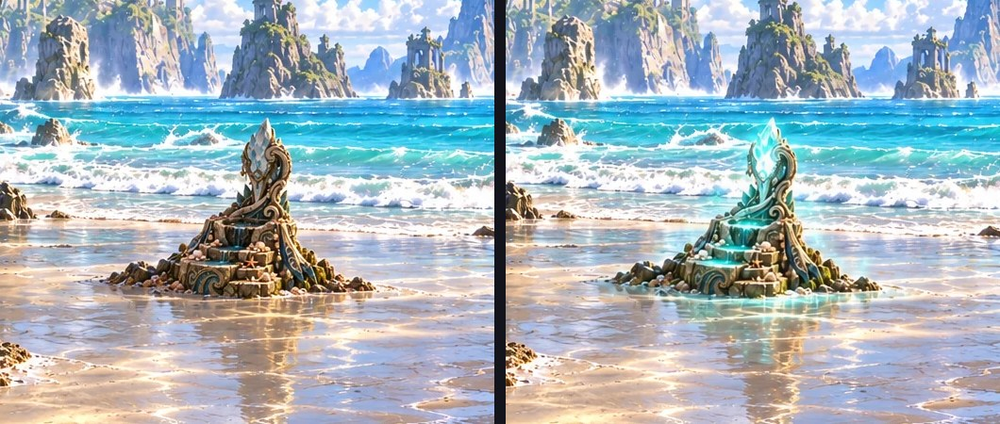

Patch: `scenes/explore/scene_grotto__shrine_awake.webp`, at (766, 436), 404 × 330 px.

**Review flags:** No visible guide marks; selected image passes the listed visual checks.

<details><summary>Generation prompt and references</summary>

```text
ART STYLE: Lush, luminous digital painting in the spirit of a premium early-2000s Japanese RPG remastered in HD. Semi-realistic, anime-influenced characters with expressive faces and stylish asymmetrical adventure outfits: layered belts, buckles, straps, zippers, one-sleeved jackets, flowing scarves. Sun-drenched tropical environments painted in rich detail: saturated turquoise seas, white sand, emerald jungle, and ancient sandstone ruins carved with softly glowing glyphs. Golden-hour sunlight, with bioluminescent blue-green motes of light drifting through the air. Cinematic, epic and adventurous, with a mischievous sense of humor: witty, characterful expressions and small comedic details hidden in the scene. Mature and cool, never babyish or chibi.

This is a background painting for a 2D game: no characters or creatures unless the prompt asks for them, no user interface. Rich depth, clear foreground, midground and background.

Edit the attached finished scene. Change only this one object: The shrine has woken: its crystal blazes with teal-white light, the basin glows, and swirls of light-motes ripple across the cave walls around it. Keep every other pixel of the picture exactly the same: same framing, light, colors and details. Do not move or resize the object. Keep the edit tightly confined to the object and its immediate shadow. OUTPUT1536x1024 opaque.

Rules: completely original designs; never imitate an existing franchise, character, creature, logo or emblem. No text, letters, numbers, logos, watermarks, signatures, borders or user interface, unless the prompt asks for glowing magic runes. Fierce and intense is great; no blood, gore or wounds.

CRITICAL: edit the SMALL DARK SHRINE ON THE RIGHT at x833–1104,y499–700. This is the ornate curling-wave pedestal with basin and dull crystal at center-right. Brighten THAT crystal to blazing teal-white and THAT basin; modest motes immediately around it. The bright rest crystal on the LEFT atx275–388,y496–620 must remain EXACTLY UNCHANGED. No new light or motes anywhere on left cave wall. Keep all architecture, sea, pools and sand identical.
```

References: `public/assets/scenes/explore/scene_grotto.webp`

</details>

