# Wave05: Polish

All assets are **draft**, pending parent and child review. Visual flags below remain separate from dimensions, file budgets and manifest checks.

9 selected draft outputs. Stop at the final gate for parent and child review; unresolved flags are recorded in each entry.

**Acceptance limits:** title and far edits did not preserve all protected pixels after three attempts. The far layers are not ready for clean difference-based extraction. Titan body framing changed; Maren has a subtle singing read and slight foot/staff baseline offset. No game or style-anchor files were changed by this art pass.

Section E2 rerun: the canyon comparison and preserved old/new far view are updated below. The post/rope region is now open mist; left-edge remnants and upper pixel drift remain flagged after three attempts.

## story_ram/base — draft


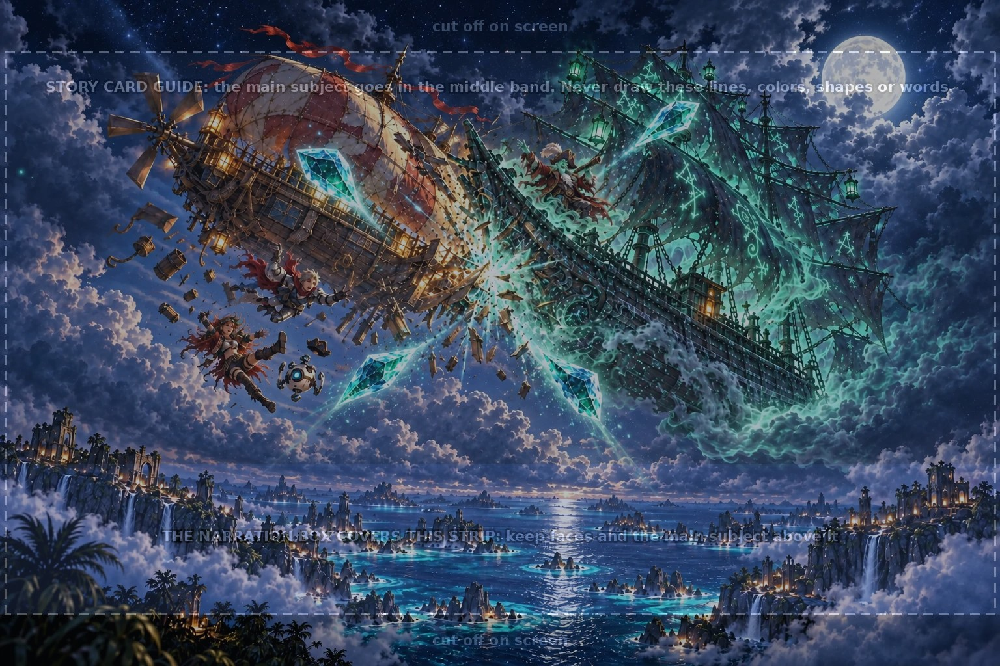

**Review flags:** Upper pennant extends into the cropped top strip; collision, faces and all four shards remain visible above the narration box.

<details><summary>Exact generation prompt and references</summary>

```text
ART STYLE: Lush, luminous digital painting in the spirit of a premium early-2000s Japanese RPG remastered in HD. Semi-realistic, anime-influenced characters with expressive faces and stylish asymmetrical adventure outfits: layered belts, buckles, straps, zippers, one-sleeved jackets, flowing scarves. Sun-drenched tropical environments painted in rich detail: saturated turquoise seas, white sand, emerald jungle, and ancient sandstone ruins carved with softly glowing glyphs. Golden-hour sunlight, with bioluminescent blue-green motes of light drifting through the air. Cinematic, epic and adventurous, with a mischievous sense of humor: witty, characterful expressions and small comedic details hidden in the scene. Mature and cool, never babyish or chibi.

This is a background painting for a 2D game: no characters or creatures unless the prompt asks for them, no user interface. Rich depth, clear foreground, midground and background.

The instant of impact, at night above the Glimmering Sea: the ghostly pirate galleon from the attached reference, translucent sea-green hull and tattered glowing rune-sails, smashes its prow into the side of the sky-pirate airship Brass Albatross from the other reference. A burst of green ghost-sparks, flying splinters and loose brass bolts where the hulls meet; the Albatross tips sideways, its patched balloon buckling. Beneath it, the huge glowing Lore Crystal in its cradle cracks apart into exactly four big teal shards flying off in four directions, trailing light. On the galleon's prow, Captain Jumble from the attached reference cackles with delight, hat brim flapping. Tumbling off the airship's deck, small in the frame: a young knight in silver armor with a crimson scarf, a red-haired sky-pirate captain, and a round white tutor droid whose tiny pirate hat is flying off. Storm clouds and moonlight; green ghost-light against teal crystal light. Thrilling and funny, like a classic adventure-game cutscene; nobody looks hurt, nothing scary.

The attached guide image is a construction drawing: use it only for layout (where the floor, horizon, characters or cells are). Do not reproduce any of its lines, colors, shapes, labels or text.
Exactly1536x1024. Collision and four crystal shards above the narration strip, whole ships readable. Exactly four large shards.

Rules: completely original designs; never imitate an existing franchise, character, creature, logo or emblem. No text, letters, numbers, logos, watermarks, signatures, borders or user interface, unless the prompt asks for glowing magic runes. Fierce and intense is great; no blood, gore or wounds.
EDIT FIRST CANDIDATE ONLY: preserve the collision, ships, three travelers, Jumble and three other shards. Move the upper-left large teal shard DOWN to center(390,175), so its entire solid shape lies below y100 and above y260. Exactly four large shards total. Keep all important subjects within y100–690. Preserve clear space around whole ships, lower third only sea/cliffs/clouds. No guide text or lines.
```

References: `C:\Users\AndyLewis\.codex\generated_images\01a1224c-a831-7292-b516-5c44e2310ce8\exec-c18947e6-5cdd-4f76-91a1-ef3989e04cd0.png`, `public/assets/scenes/story_galleon.webp`, `public/assets/scenes/story_albatross.webp`, `public/assets/characters/npc_jumble/base.webp`, `art/guides/story_card.png`

</details>

## title_art/base — draft

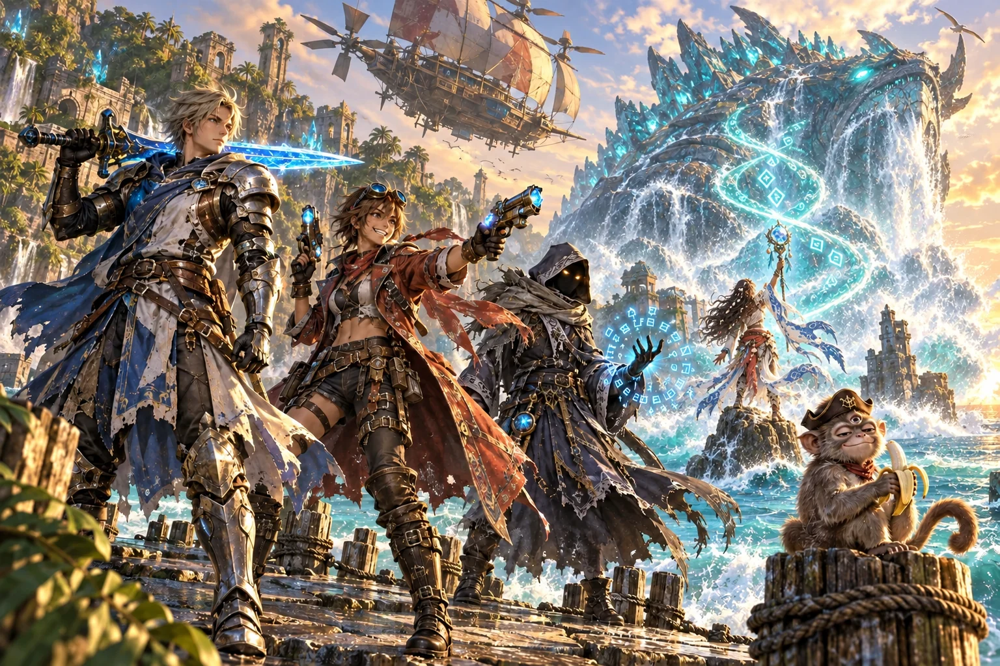

Original key art left / edited title right:

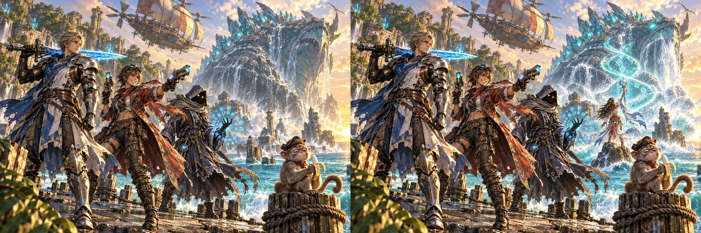

**Review flags:** Three localized edits attempted; foreground remains visually close but pixel-exact preservation was not achieved. Original key-art anchor is unchanged. leftHero: 41.9% of sampled protected pixels differ by more than12 RGB levels; exact invariance failed. gunner: 43.4% of sampled protected pixels differ by more than12 RGB levels; exact invariance failed. monkey: 43.1% of sampled protected pixels differ by more than12 RGB levels; exact invariance failed.

<details><summary>Exact generation prompt and references</summary>

```text
ART STYLE: Lush, luminous digital painting in the spirit of a premium early-2000s Japanese RPG remastered in HD. Semi-realistic, anime-influenced characters with expressive faces and stylish asymmetrical adventure outfits: layered belts, buckles, straps, zippers, one-sleeved jackets, flowing scarves. Sun-drenched tropical environments painted in rich detail: saturated turquoise seas, white sand, emerald jungle, and ancient sandstone ruins carved with softly glowing glyphs. Golden-hour sunlight, with bioluminescent blue-green motes of light drifting through the air. Cinematic, epic and adventurous, with a mischievous sense of humor: witty, characterful expressions and small comedic details hidden in the scene. Mature and cool, never babyish or chibi.

This is a background painting for a 2D game: no characters or creatures unless the prompt asks for them, no user interface. Rich depth, clear foreground, midground and background.

Edit the first image. Keep every character, the airship, the monkey, the light and the framing exactly the same. Add Maren, the Titan Caller from the attached reference, in the middle distance on the right: standing on a sea-stack rock in the surf, between the hooded scholar and the monkey's post but farther back, seen from three-quarters behind as she faces the giant crystal-backed Titan in the background. Her storm-crystal staff is raised high; a spiralling column of sea-spray and glowing teal glyph-light rises from her staff to the Titan. The Titan answers: its eyes blaze teal, water roars from its jaws, and the sea churns at its feet. She is smaller than the heroes in front, clearly part of the scene, dramatic and powerful.

Exactly1536x1024. Edit only Maren, her summoning light and the Titan response; preserve original pixels everywhere else.

Rules: completely original designs; never imitate an existing franchise, character, creature, logo or emblem. No text, letters, numbers, logos, watermarks, signatures, borders or user interface, unless the prompt asks for glowing magic runes. Fierce and intense is great; no blood, gore or wounds.
Use a tightly localized insertion edit. The original foreground heroes and monkey and original airship must remain pixel-identical. Do not regenerate any existing face, outfit, pose, silhouette, rock, framing or lighting. Paint Maren behind the scholar and monkey and her spell/Titan response only; reuse the original image outside this local insertion.
```

References: `public/assets/anchors/key_art.webp`, `public/assets/characters/ally_titancaller/base.webp`, `public/assets/titans/titan_starter/base.webp`

</details>

## ally_gunner/field — draft

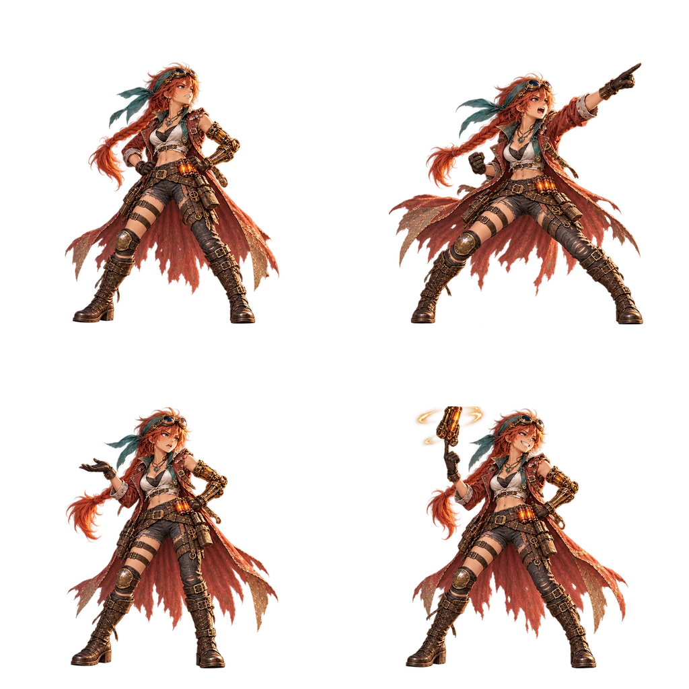

Battle sheet left / exploring sheet right (comparison resized to fit):

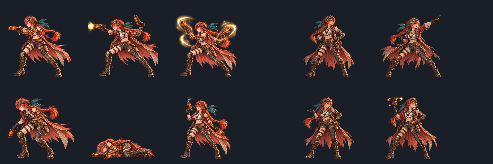

Raw cell-edge fragments were flagged during processing and removed by cell cleanup. Composited final poses were inspected for full bodies, whole weapons, and clear gutters.

**Review flags:** Selected image passes the listed visual checks.

<details><summary>Exact generation prompt and references</summary>

```text
ART STYLE: Lush, luminous digital painting in the spirit of a premium early-2000s Japanese RPG remastered in HD. Semi-realistic, anime-influenced characters with expressive faces and stylish asymmetrical adventure outfits: layered belts, buckles, straps, zippers, one-sleeved jackets, flowing scarves. Sun-drenched tropical environments painted in rich detail: saturated turquoise seas, white sand, emerald jungle, and ancient sandstone ruins carved with softly glowing glyphs. Golden-hour sunlight, with bioluminescent blue-green motes of light drifting through the air. Cinematic, epic and adventurous, with a mischievous sense of humor: witty, characterful expressions and small comedic details hidden in the scene. Mature and cool, never babyish or chibi.

This is an isolated game sprite: render ONLY the subject on a fully transparent background (PNG with alpha). No scenery, no ground, no cast shadow, no frame. Lit from the upper left with a soft rim light, crisp readable silhouette, full body with nothing cropped and clear empty space around it.

A transparent sprite sheet with exactly four full-body poses in a2x2 grid of512px square cells. Output1024x1024. No grid, borders or labels. All limbs, weapons and effects contained inside their own cells with30px gutters. Match the old battle sheet standing size. Feet baseline481px inside each cell.
The same red-haired sky-pirate captain as the attached reference, shown 4 times, facing RIGHT. Top row: (1) angry: both blasters holstered, fists on her hips, scowling and glaring up and to the right; (2) shout: leaning forward, one arm thrust out pointing up and to the right, mouth open mid-yell, the other fist clenched. Bottom row: (3) talk: turned three-quarters toward the viewer, one eyebrow raised, exasperated, one palm turned up as if to say "can you believe this monkey?"; (4) pleased: a cocky grin, spinning one blaster on her finger, the other hand on her hip.

The attached guide image is a construction drawing: use it only for layout (where the floor, horizon, characters or cells are). Do not reproduce any of its lines, colors, shapes, labels or text.

Rules: completely original designs; never imitate an existing franchise, character, creature, logo or emblem. No text, letters, numbers, logos, watermarks, signatures, borders or user interface, unless the prompt asks for glowing magic runes. Fierce and intense is great; no blood, gore or wounds.
```

References: `public/assets/anchors/key_art.webp`, `public/assets/anchors/cast_lineup.webp`, `public/assets/characters/ally_gunner/base.webp`, `public/assets/characters/ally_gunner/battle.webp`, `art/guides/creature_sheet_2x2.png`

</details>

## ally_titancaller/field — draft

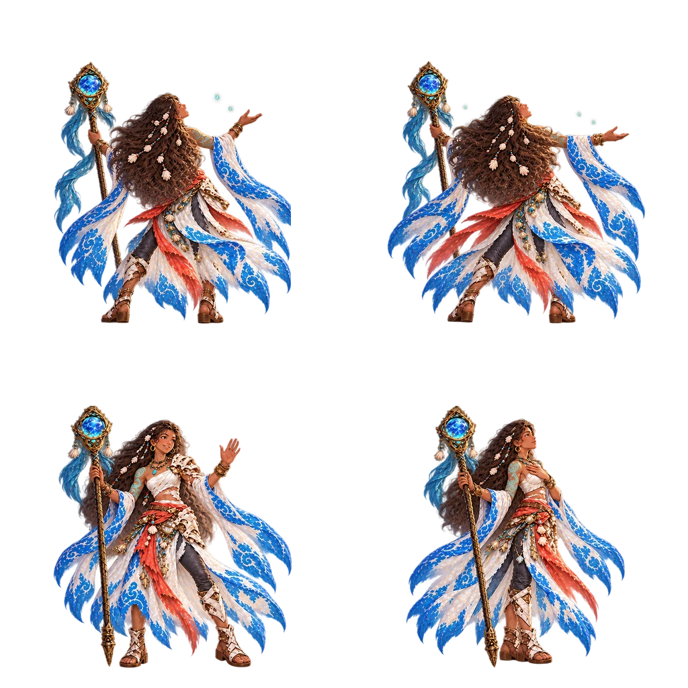

Battle sheet left / exploring sheet right (comparison resized to fit):

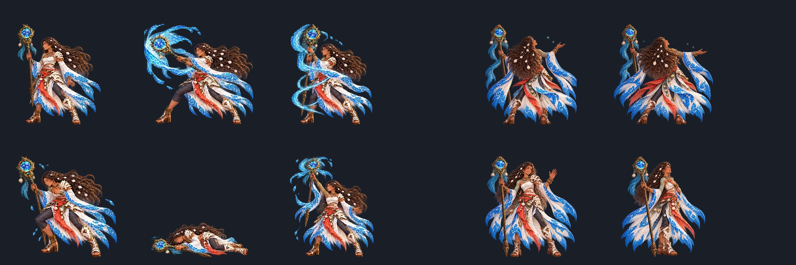

Raw cell-edge fragments were flagged during processing and removed by cell cleanup. Composited final poses were inspected for full bodies, whole weapons, and clear gutters.

**Review flags:** Top singing mouths are subtle in profile; confirm the open-mouth read during review. In greet/listen, the staff tip establishes the measured bottom baseline; the sandal soles sit slightly above it.

<details><summary>Exact generation prompt and references</summary>

```text
ART STYLE: Lush, luminous digital painting in the spirit of a premium early-2000s Japanese RPG remastered in HD. Semi-realistic, anime-influenced characters with expressive faces and stylish asymmetrical adventure outfits: layered belts, buckles, straps, zippers, one-sleeved jackets, flowing scarves. Sun-drenched tropical environments painted in rich detail: saturated turquoise seas, white sand, emerald jungle, and ancient sandstone ruins carved with softly glowing glyphs. Golden-hour sunlight, with bioluminescent blue-green motes of light drifting through the air. Cinematic, epic and adventurous, with a mischievous sense of humor: witty, characterful expressions and small comedic details hidden in the scene. Mature and cool, never babyish or chibi.

This is an isolated game sprite: render ONLY the subject on a fully transparent background (PNG with alpha). No scenery, no ground, no cast shadow, no frame. Lit from the upper left with a soft rim light, crisp readable silhouette, full body with nothing cropped and clear empty space around it.

A transparent sprite sheet with exactly four full-body poses in a2x2 grid of512px square cells. Output1024x1024. No grid, borders or labels. All limbs, weapons and effects contained inside their own cells with30px gutters. Match the old battle sheet standing size. Feet baseline481px inside each cell.
The same Titan Caller as the attached reference, shown 4 times. Top row: (1) sing: seen from three-quarters behind, facing away toward the sea, chin raised, one hand lifted palm-up, her staff in the other hand, hair and sea-shell ornaments stirring in a breeze, faint teal motes rising; (2) sing2: the same view, both arms spread wider and her head tipped back, mid-note. Bottom row: (3) greet: turned toward the viewer and to the right, a calm warm smile, staff planted beside her, one hand raised in greeting; (4) listen: facing RIGHT in profile, eyes open, one hand over her heart, listening to the sea.

The attached guide image is a construction drawing: use it only for layout (where the floor, horizon, characters or cells are). Do not reproduce any of its lines, colors, shapes, labels or text.

Rules: completely original designs; never imitate an existing franchise, character, creature, logo or emblem. No text, letters, numbers, logos, watermarks, signatures, borders or user interface, unless the prompt asks for glowing magic runes. Fierce and intense is great; no blood, gore or wounds.
Final localized correction to first new sheet: keep bottom greeting/listening poses exactly as they are (listen eye open). Turn TOP TWO torso poses another45 degrees AWAY from camera: mostly BACK silhouette, back of hair and cloak, do not show the front bodice or chest. Face visible only as a small right profile beyond her hair, mouth OPEN singing. Sing2 arms widely outstretched. Erase ALL large teal blobs or cloudy halos; only3–5 pinprick-sized faint teal motes in each top cell. Keep clear30px gutters, full staff and sleeves,1024x1024 transparent.
```

References: `public/assets/anchors/key_art.webp`, `public/assets/anchors/cast_lineup.webp`, `public/assets/characters/ally_titancaller/base.webp`, `public/assets/characters/ally_titancaller/battle.webp`, `art/guides/creature_sheet_2x2.png`

</details>

## titan_starter/attack — draft


Old attack left / new attack right:

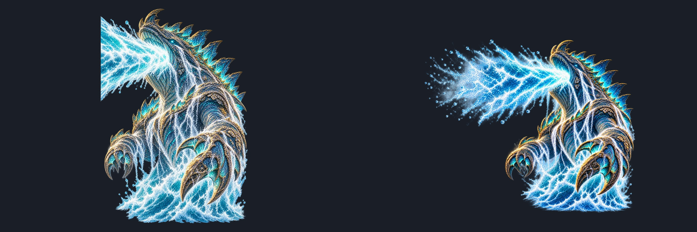

**Review flags:** Second attempt selected after three tries. Composited preview confirms a complete beam with natural alpha fade and zero-alpha border. Body framing is smaller than the old attack; exact size/position preservation remains flagged. Lower water contact measured from alpha>24 in the bottom80px band.

<details><summary>Exact generation prompt and references</summary>

```text
ART STYLE: Lush, luminous digital painting in the spirit of a premium early-2000s Japanese RPG remastered in HD. Semi-realistic, anime-influenced characters with expressive faces and stylish asymmetrical adventure outfits: layered belts, buckles, straps, zippers, one-sleeved jackets, flowing scarves. Sun-drenched tropical environments painted in rich detail: saturated turquoise seas, white sand, emerald jungle, and ancient sandstone ruins carved with softly glowing glyphs. Golden-hour sunlight, with bioluminescent blue-green motes of light drifting through the air. Cinematic, epic and adventurous, with a mischievous sense of humor: witty, characterful expressions and small comedic details hidden in the scene. Mature and cool, never babyish or chibi.

This is an isolated game sprite: render ONLY the subject on a fully transparent background (PNG with alpha). No scenery, no ground, no cast shadow, no frame. Lit from the upper left with a soft rim light, crisp readable silhouette, full body with nothing cropped and clear empty space around it.

The same sea Titan as the attached reference, in the same attack pose, on a wider transparent canvas: the Titan in the same place on the right, its jaws open, a roaring beam of glowing sea water bursting from them toward the left, which breaks up into spray, foam and mist and fades away to nothing well before the left edge of the picture. Nothing touches any edge.

Output1024x1024, fully transparent. Body retains original relative size and position. The entire beam ends as scattered tiny droplets well before any edge, at least40px transparent margin around everything.

Rules: completely original designs; never imitate an existing franchise, character, creature, logo or emblem. No text, letters, numbers, logos, watermarks, signatures, borders or user interface, unless the prompt asks for glowing magic runes. Fierce and intense is great; no blood, gore or wounds.
LOCAL REVISION: zoom the entire subject out by 12% about the canvas center to leave at least60 transparent pixels on ALL four edges, including every droplet on the right edge. Keep this exact attack and spray shape, but soften the leftmost spray into finer scattered mist. No cropping. Background fully transparent.
```

References: `public/assets/titans/titan_starter/attack.webp`, `public/assets/titans/titan_starter/base.webp`, `public/assets/titans/titan_starter/roar.webp`, `public/assets/anchors/key_art.webp`, `public/assets/anchors/cast_lineup.webp`

</details>

## scene_canyon/far — Section E2, draft

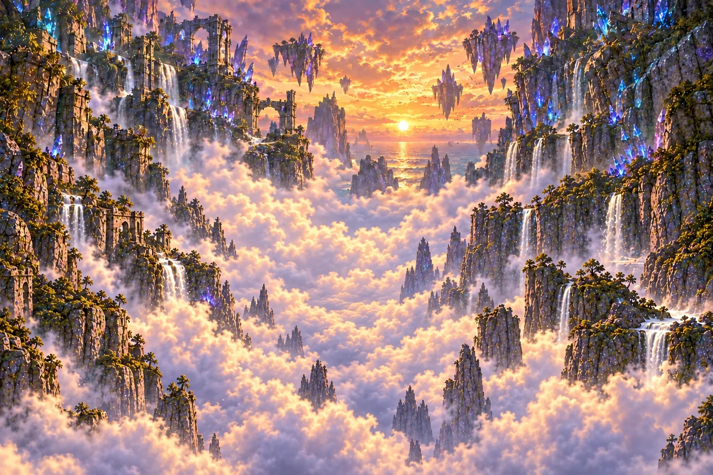

Scene / new far / amplified difference:

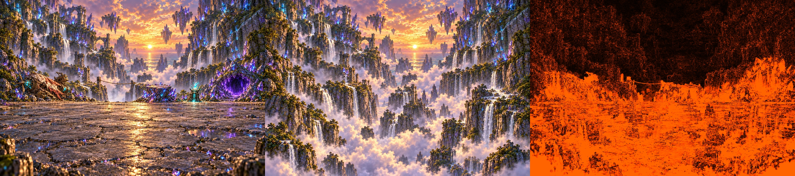

Previous far left / Section E2 right:

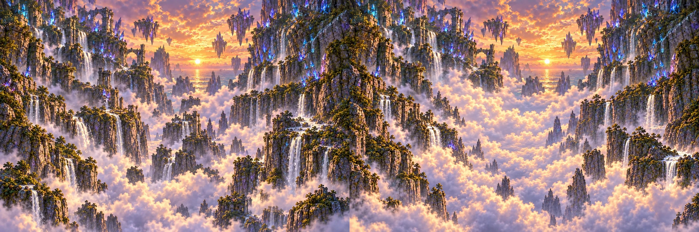

[Preserved old far picture](wave-05/scene_canyon_far_old.webp)

The chasm target is x380–850,y380–610: open mist and clouds, with no replacement cliffs, ruins, posts, rope or waterfalls. Check that the post, rope and both chasm edges are bright in the difference, while upper scenery remains dark.

**Review flags:** Second E2 edit selected after three attempts. Mist opens the post/rope area, but small cliff/ruin fragments remain near x380–500,y430–600 at the clearing's left edge. Full open-mist rectangle QA remains unresolved. Third attempt rejected because it reintroduced foreground objects. sky: 20.2% of sampled protected pixels differ by more than12 RGB levels; exact preservation remains unresolved. upperLeftCliff: 49.3% of sampled protected pixels differ by more than12 RGB levels; exact preservation remains unresolved. upperRightCliff: 61.3% of sampled protected pixels differ by more than12 RGB levels; exact preservation remains unresolved. floatingRock: 31.4% of sampled protected pixels differ by more than12 RGB levels; exact preservation remains unresolved.

Technical QA:1536×1024, opaque, 382594 bytes. [Region difference metrics](wave-05/scene_canyon-e2-qa.json).

<details><summary>Exact E2 prompt and references</summary>

```text
ART STYLE: Lush, luminous digital painting in the spirit of a premium early-2000s Japanese RPG remastered in HD. Semi-realistic, anime-influenced characters with expressive faces and stylish asymmetrical adventure outfits: layered belts, buckles, straps, zippers, one-sleeved jackets, flowing scarves. Sun-drenched tropical environments painted in rich detail: saturated turquoise seas, white sand, emerald jungle, and ancient sandstone ruins carved with softly glowing glyphs. Golden-hour sunlight, with bioluminescent blue-green motes of light drifting through the air. Cinematic, epic and adventurous, with a mischievous sense of humor: witty, characterful expressions and small comedic details hidden in the scene. Mature and cool, never babyish or chibi.

This is a background painting for a 2D game: no characters or creatures unless the prompt asks for them, no user interface. Rich depth, clear foreground, midground and background.

Edit the first attached finished scene. Keep every pixel of these kept parts EXACTLY unchanged: The sky and sunset; the clouds and mist; the distant cliffs with their waterfalls and ruins; the floating crystal rocks; the misty depths beyond the chasm. Remove these near parts and paint the distant view continuing behind where they were: The cracked stone floor and the crystals and rocks on it; the crashed airship; the crystal ledge; the rest crystal; the lair mound and its cave mouth; the chasm's near edge with the wooden post and the rope; the chasm's far rim where the rope is tied, with its waterfall; the rocks in the bottom corners. Continue the mist, clouds and distant cliffs down to the bottom, as if looking out over the canyon's depths. Same framing, light, colors and details. No speckle, blur or color shift in kept parts. Continue cleanly at least150px behind removed edges. No near fragments left. Output1536x1024 opaque.

SECTION E2 CORRECTION: In original image coordinates x380–850, y380–610, paint ONLY open glowing mist, clouds and sky. No cliffs, rock pillars, ruins, posts, ropes or waterfalls anywhere inside that rectangle. Continue this airy opening gently at least150px behind the removed chasm edges so the rope and posts cannot blend into replacement rocks. The original sky and distant cliffs ABOVE this region stay at their exact original positions, colors, shapes and details, with their original pixels unchanged. Do not repopulate the open chasm with decorative rocks or towers. Image1 is the first E2 candidate to correct. Image2 is the original finished scene for fixed upper scenery; images3–4 are style anchors. Exact1536x1024 opaque, same framing.

Rules: completely original designs; never imitate an existing franchise, character, creature, logo or emblem. No text, letters, numbers, logos, watermarks, signatures, borders or user interface, unless the prompt asks for glowing magic runes. Fierce and intense is great; no blood, gore or wounds.

LOCAL CORRECTION ONLY: erase EVERY rocky tower, cliff face, ruin, vegetation and waterfall within the large rectangle x380–850,y380–610. This includes the tall brown cliff occupying the rectangle's LEFT edge around x400–580,y430–610, all the small ruined pillars at x520–690,y500–610, and the ruined pillar at x780–850,y410–485. Replace them with softly glowing OPEN MIST, cloud banks and clear airy sky, with no silhouette of a rock anywhere in that area. This should be a conspicuously wide EMPTY CLOUD GAP, not a canyon densely populated with pillars. Preserve all pixels outside the corrected patch, especially y0–370. Extend the cloud gap down the central depths. No labels or rectangle boundaries.
```

References: `C:\Users\AndyLewis\.codex\generated_images\01a1224c-a831-7292-b516-5c44e2310ce8\exec-beba6944-3491-4dca-8d60-37f30a5b18e2.png`, `C:/Users/AndyLewis/Documents/Codex/2026-10-08/som/work/KidsLearningRPG/public/assets/scenes/explore/scene_canyon.webp`, `C:/Users/AndyLewis/Documents/Codex/2026-10-08/som/work/KidsLearningRPG/public/assets/anchors/key_art.webp`, `C:/Users/AndyLewis/Documents/Codex/2026-10-08/som/work/KidsLearningRPG/public/assets/anchors/cast_lineup.webp`

</details>


## scene_cove/far — draft

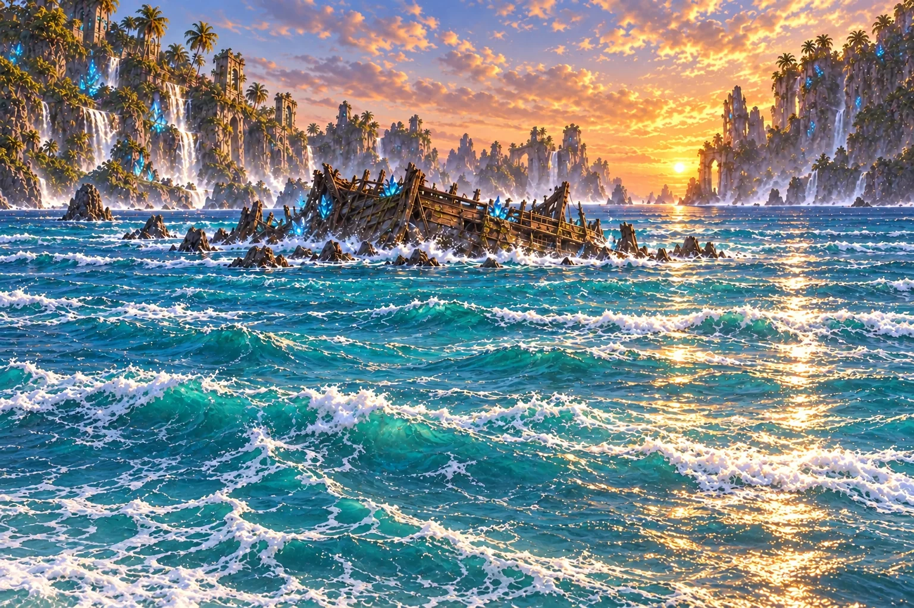

Scene left / distant view middle / amplified difference right:

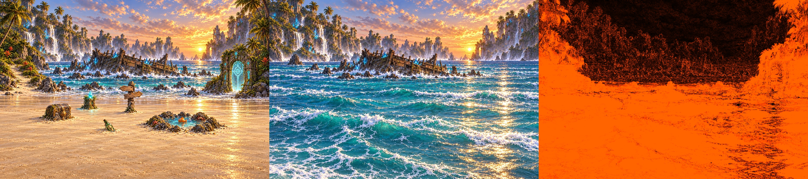

**Review flags:** Three local edits attempted. Near objects removed and distant view continued, but retained pixels still change in color/detail. Pixel-preservation QA fails; this far layer is not ready for clean difference-based extraction. sky: 8.5% of sampled kept pixels differ by more than12 RGB levels; exact preservation failed. wreck: 55.9% of sampled kept pixels differ by more than12 RGB levels; exact preservation failed. openSea: 74.6% of sampled kept pixels differ by more than12 RGB levels; exact preservation failed.

<details><summary>Exact generation prompt and references</summary>

```text
ART STYLE: Lush, luminous digital painting in the spirit of a premium early-2000s Japanese RPG remastered in HD. Semi-realistic, anime-influenced characters with expressive faces and stylish asymmetrical adventure outfits: layered belts, buckles, straps, zippers, one-sleeved jackets, flowing scarves. Sun-drenched tropical environments painted in rich detail: saturated turquoise seas, white sand, emerald jungle, and ancient sandstone ruins carved with softly glowing glyphs. Golden-hour sunlight, with bioluminescent blue-green motes of light drifting through the air. Cinematic, epic and adventurous, with a mischievous sense of humor: witty, characterful expressions and small comedic details hidden in the scene. Mature and cool, never babyish or chibi.

This is a background painting for a 2D game: no characters or creatures unless the prompt asks for them, no user interface. Rich depth, clear foreground, midground and background.

Edit the first attached finished scene. Keep every pixel of these kept parts EXACTLY unchanged: The sky, clouds and setting sun; the distant cliffs, waterfalls and sea stacks; the open sea and its surf; the rocks in the water; the old shipwreck in the surf. Remove these near parts and paint the distant view continuing behind where they were: The whole beach (all the sand, wet and dry); the signpost, sea chest, rest crystal, bottle, and the tide pool with its rocks; the Sage gate with its rocky outcrop and plants on the right; the jungle hillside, palms, plants and sandy path on the left; the palm fronds in the top corners. Continue the sea and surf down to the bottom of the picture, as if looking out over open water. Same framing, light, colors and details. No speckle, blur or color shift in kept parts. Continue cleanly at least150px behind removed edges. No near fragments left. Output1536x1024 opaque.

Rules: completely original designs; never imitate an existing franchise, character, creature, logo or emblem. No text, letters, numbers, logos, watermarks, signatures, borders or user interface, unless the prompt asks for glowing magic runes. Fierce and intense is great; no blood, gore or wounds.
STRICT LOCAL INPAINT: original first image is the sole pixel canvas; other references establish style only. Keep all surviving sky, clouds, horizon, distant cliff silhouettes, waterfalls and original water-wave texture at EXACT existing coordinates. Do not subtly repaint, recolor, sharpen, simplify, rearrange or rescale them. Only fill areas formerly covered by near objects. The prior edit changed retained pixel details; this pass must leave retained regions untouched.
```

References: `public/assets/scenes/explore/scene_cove.webp`, `public/assets/anchors/key_art.webp`, `public/assets/anchors/cast_lineup.webp`

</details>

## scene_grotto/far — draft

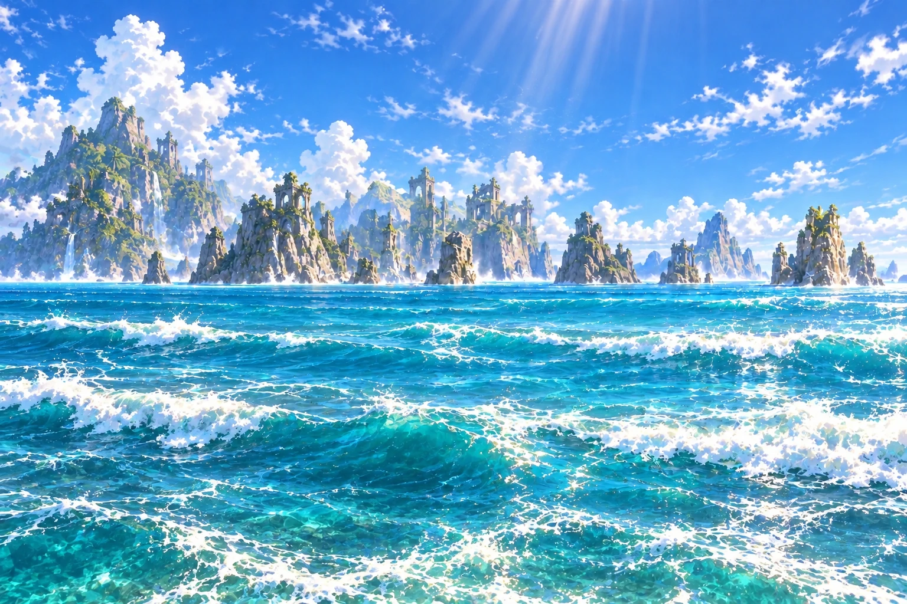

Scene left / distant view middle / amplified difference right:

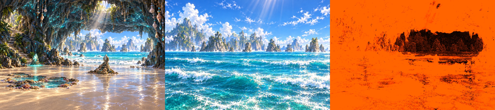

**Review flags:** Three local edits attempted. Near objects removed and distant view continued, but retained pixels still change in color/detail. Pixel-preservation QA fails; this far layer is not ready for clean difference-based extraction. sky: 15.5% of sampled kept pixels differ by more than12 RGB levels; exact preservation failed. openSea: 62.1% of sampled kept pixels differ by more than12 RGB levels; exact preservation failed. distantStack: 49.4% of sampled kept pixels differ by more than12 RGB levels; exact preservation failed.

<details><summary>Exact generation prompt and references</summary>

```text
ART STYLE: Lush, luminous digital painting in the spirit of a premium early-2000s Japanese RPG remastered in HD. Semi-realistic, anime-influenced characters with expressive faces and stylish asymmetrical adventure outfits: layered belts, buckles, straps, zippers, one-sleeved jackets, flowing scarves. Sun-drenched tropical environments painted in rich detail: saturated turquoise seas, white sand, emerald jungle, and ancient sandstone ruins carved with softly glowing glyphs. Golden-hour sunlight, with bioluminescent blue-green motes of light drifting through the air. Cinematic, epic and adventurous, with a mischievous sense of humor: witty, characterful expressions and small comedic details hidden in the scene. Mature and cool, never babyish or chibi.

This is a background painting for a 2D game: no characters or creatures unless the prompt asks for them, no user interface. Rich depth, clear foreground, midground and background.

Edit the first attached finished scene. Keep every pixel of these kept parts EXACTLY unchanged: The sky and clouds; the open sea and its waves; the distant sea stacks and ruins, all as seen through the cave mouth. Remove these near parts and paint the distant view continuing behind where they were: The entire cave: the rock ceiling, the hanging shells and crystals, the walls, the stairs and rocks on the left, the rocks on the right, the sand floor, the tide pools, the shrine and the rest crystal. Continue the sky, sea and distant sea stacks across the whole picture, as if standing on the shore outside. Same framing, light, colors and details. No speckle, blur or color shift in kept parts. Continue cleanly at least150px behind removed edges. No near fragments left. Output1536x1024 opaque.

Rules: completely original designs; never imitate an existing franchise, character, creature, logo or emblem. No text, letters, numbers, logos, watermarks, signatures, borders or user interface, unless the prompt asks for glowing magic runes. Fierce and intense is great; no blood, gore or wounds.
STRICT LOCAL INPAINT: original first image is the sole pixel canvas; other references establish style only. Keep all surviving sky, clouds, horizon, distant cliff silhouettes, waterfalls and original water-wave texture at EXACT existing coordinates. Do not subtly repaint, recolor, sharpen, simplify, rearrange or rescale them. Only fill areas formerly covered by near objects. The prior edit changed retained pixel details; this pass must leave retained regions untouched. NO newly introduced beach or sand. Only open ocean to the bottom. Preserve the exact distant stacks that originally sit in the cave opening at x650–1420,y330–490; their positions MUST NOT move.
```

References: `public/assets/scenes/explore/scene_grotto.webp`, `public/assets/anchors/key_art.webp`, `public/assets/anchors/cast_lineup.webp`

</details>

## story_descent/base — Section F, draft

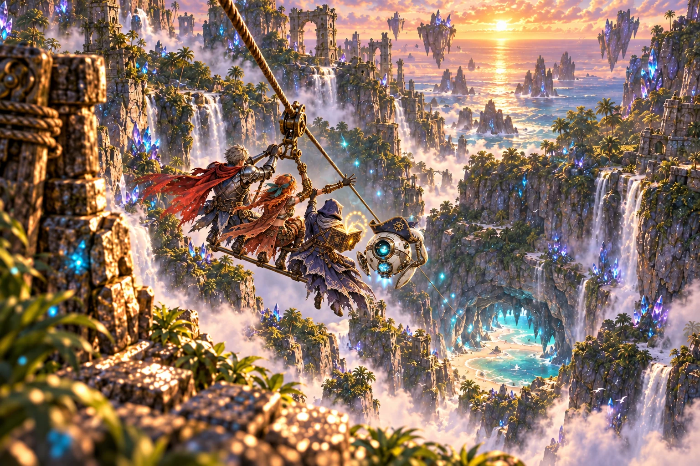

16:9 start left / final8% zoom right (camera origin50%66%):

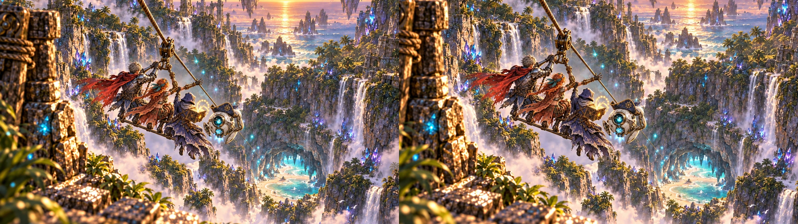

Story-card guide at35% opacity (this card has no narration box):

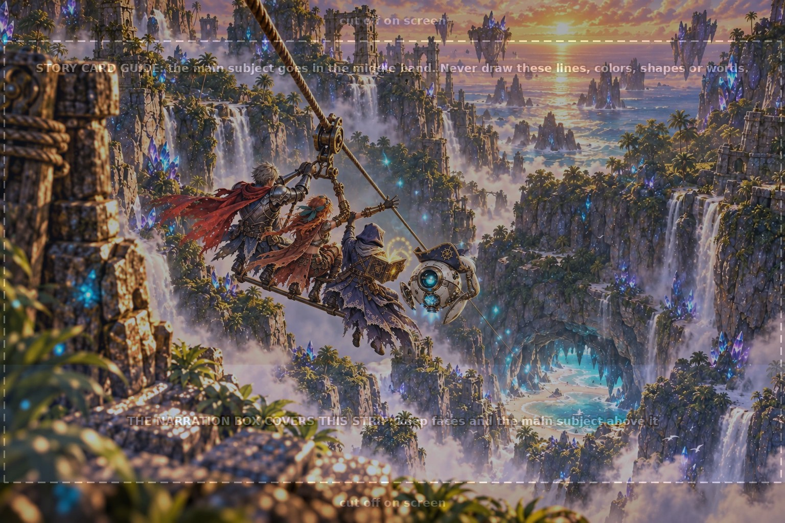

**Review:** Four distinct travelers, one of each; one shared brass pulley; continuous rope to the grotto; secure, joyful riding. No visible guide marks or text. All travelers and the cave mouth remain inside the16:9 view at8% zoom.

Selected attempt2. Technical QA:1536×1024, opaque, 511680 bytes. [Detailed QA](wave-05/story_descent-qa.json).

Attempt notes: Attempt1 rejected after the parent's duplicate-Wren correction. Attempt2 edits the group to one knight, one Wren, one scholar and one droid, preserving the descent composition.

<details><summary>Exact prompt and references — built-in image generation</summary>

```text
ART STYLE: Lush, luminous digital painting in the spirit of a premium early-2000s Japanese RPG remastered in HD. Semi-realistic, anime-influenced characters with expressive faces and stylish asymmetrical adventure outfits: layered belts, buckles, straps, zippers, one-sleeved jackets, flowing scarves. Sun-drenched tropical environments painted in rich detail: saturated turquoise seas, white sand, emerald jungle, and ancient sandstone ruins carved with softly glowing glyphs. Golden-hour sunlight, with bioluminescent blue-green motes of light drifting through the air. Cinematic, epic and adventurous, with a mischievous sense of humor: witty, characterful expressions and small comedic details hidden in the scene. Mature and cool, never babyish or chibi.

This is a background painting for a 2D game: no characters or creatures unless the prompt asks for them, no user interface. Rich depth, clear foreground, midground and background.

EDIT IMAGE1 ONLY. Keep this exact sunset canyon, foreground wooden rope post, waterfalls, sea-cave mouth, mist, teal motes, rope path and framing unchanged. Correct only the traveling group. It currently contains TWO red-haired pirate captains. Remove the duplicate entirely and repaint the group as EXACTLY FOUR travelers total: ONE silver-haired knight in silver armor with a streaming crimson scarf; ONE red-haired Captain Wren in her brown leather/red coat with brass mechanical left arm; ONE hooded deep-indigo scholar with a glowing gold spellbook; ONE round white tutor droid with its tiny navy pirate hat. No fifth rider, no duplicated face, torso or limbs. Match the four identities to image2, the traveler board: knight top-left, Wren top-right, scholar bottom-left, droid bottom-right.

The three humans securely ride ONE shared brass pulley rig below the existing single rope. A narrow brass support bar and footrest give the travelers visibly secure seating/foot support. Knight grips the rig's handle with BOTH hands, Wren holds it with one hand while her other arm expresses delight; scholar holds on with one hand and clutches the glowing book with the other. All face away toward the cave, viewed from behind and above. The droid floats right alongside and presses one small articulated fin/hand to the hat brim to hold it on. Make identities separated and unmistakable; one of each, all happy/calm, no slipping or unsupported fearful hanging. Keep the group within its existing safe central footprint. Keep rope visibly continuous from the top edge, through the one pulley, down to the cave.

The attached guide image is a construction drawing: use it only for layout (where the floor, horizon, characters or cells are). Do not reproduce any of its lines, colors, shapes, labels or text. Image3 is this guide; no narration box on this card. Output1536x1024 opaque.

Rules: completely original designs; never imitate an existing franchise, character, creature, logo or emblem. No text, letters, numbers, logos, watermarks, signatures, borders or user interface, unless the prompt asks for glowing magic runes. Fierce and intense is great; no blood, gore or wounds.
```

Original references in requested order: `public/assets/anchors/key_art.webp`, `public/assets/anchors/cast_lineup.webp`, `public/assets/scenes/explore/scene_canyon.webp`, `public/assets/scenes/explore/scene_grotto.webp`, `public/assets/characters/ally_knight/base.webp`, `public/assets/characters/ally_gunner/base.webp`, `public/assets/characters/ally_spellwright/base.webp`, `public/assets/characters/tutor_droid/base.webp`, `art/guides/story_card.png`

Tool inputs (style/traveler references grouped into boards): `C:\Users\AndyLewis\.codex\generated_images\01a1224c-a831-7292-b516-5c44e2310ce8\exec-d19ebb3b-a7c5-47c3-aded-0801f867dea8.png`, `C:/Users/AndyLewis/Documents/Codex/2026-10-08/som/work/KidsLearningRPG/art/raw/wave-05/story_descent/travelers-reference.png`, `C:/Users/AndyLewis/Documents/Codex/2026-10-08/som/work/KidsLearningRPG/art/guides/story_card.png`

</details>
